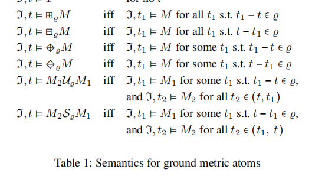
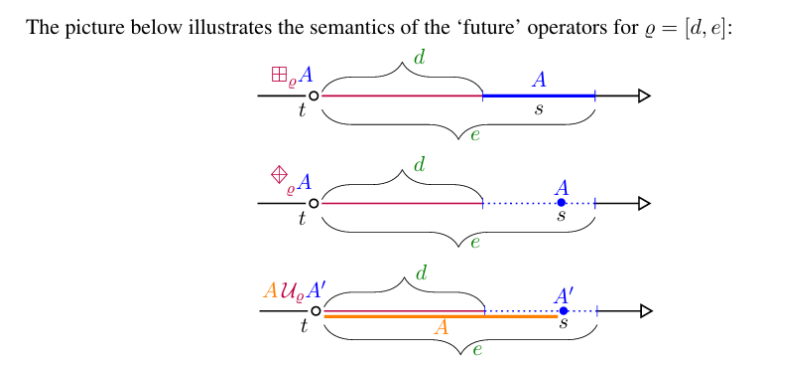
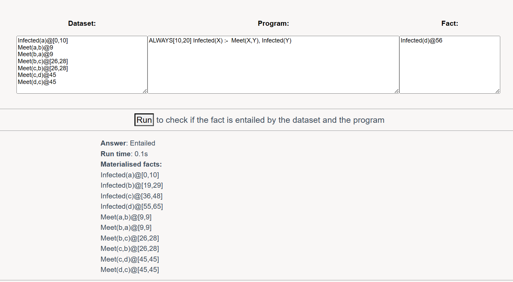
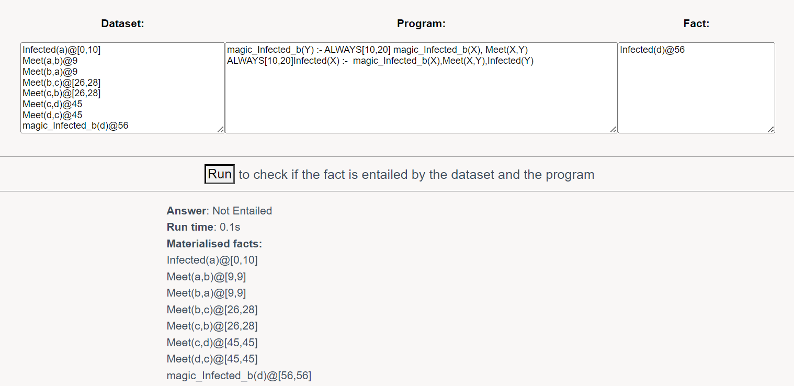
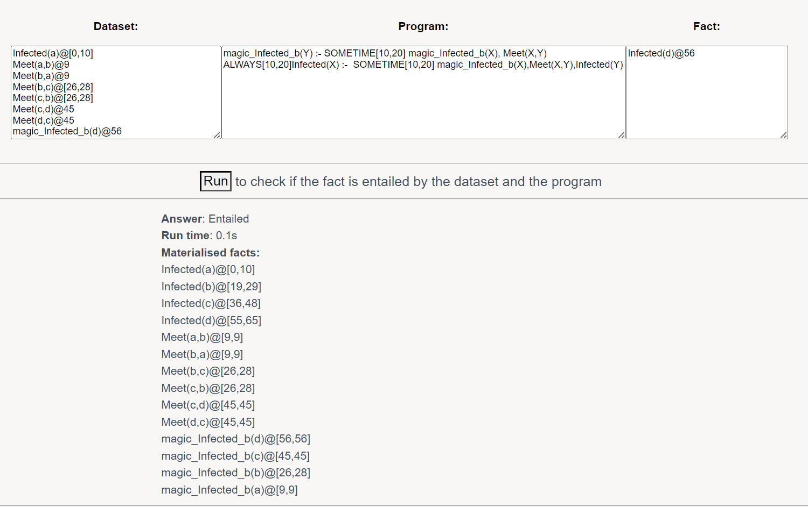
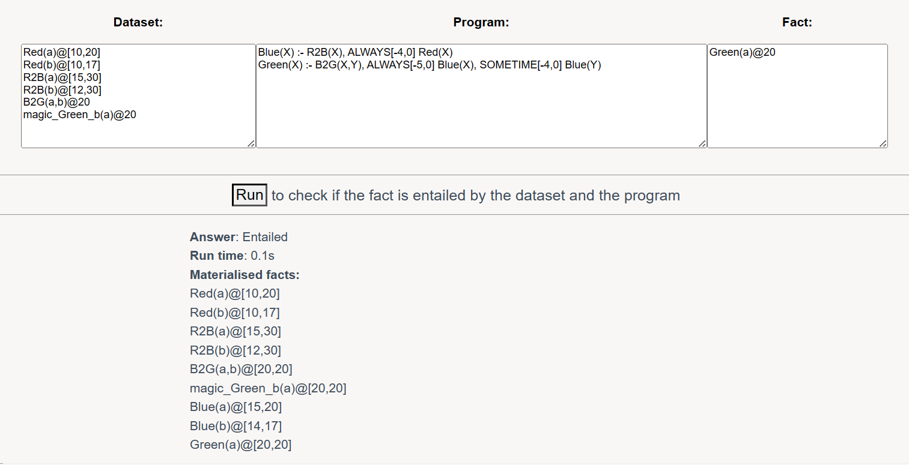
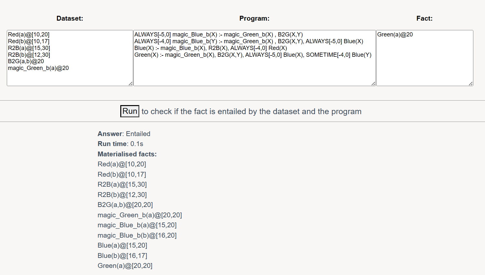

## 前言

大一即将结束时，受身边做PRP（本科生研究计划）的朋友的影响，我也开始打算找导师尝试科研。迷茫之际，我咨询了我的班主任老师，他是做知识图谱和知识推理的。班主任表示其实不报PRP或者大创也可以体验科研，直接来就行了。我欣然答应，然后老师开始让我啃一些教材和资料。

到大二上学期，我们还是申请了大创项目。这一整个学期其实就忙活了报名大创这一件事。寒假时候我做了一些探索，有了一些初步的思路。大二下学期我们迅速做好了讨论、编程、证明等，暑期完成论文写作和实验。到后期我因为同时还忙其他事情，就参与较少了，这也是我比较惭愧的一点。

这篇论文我是共同一作第三，其他一作是研究生学长和大创组长。经过一些坎坷，最后论文只投了一次就被AAAI接收了！我记得最高兴的时候是看到一位审稿人的评价：

> The paper presents a clear, incremental, but still nontrivial problem, works through the solution, and implements it in a SOTA solver. This is impressive, and the paper is well executed.

被肯定的感觉真是太棒了！一周之前，我还得知这篇论文被选入了oral presentation（占总数的五分之一）！

回到正题，这篇博客就是希望对这份成果进行一个通俗易懂的梳理（毕竟写出来的论文还是太专业严谨且晦涩难懂了）。论文链接奉上：[arxiv.org/pdf/2412.07259v2](https://arxiv.org/pdf/2412.07259v2)


## 背景

流数据广泛存在于金融交易、网络异常检测、设备预警、智能制造等领域。基于流数据的符号推理为上述领域的众多应用提供了有力支撑。

DatalogMTL是一种新兴的支持流数据推理的逻辑编程语言，它结合了Datalog和时态逻辑，相较于命令式编程，使用DatalogMTL规则语言能够更好地固化专家知识，降低沟通和开发成本。

然而，DatalogMTL计算复杂度较高，推理过程较为耗时。DatalogMTL现有的自底而上的推理方法可能会产生大量与特定查询无关的事实，导致派生事实集过大，难以存储于内存中。

如果能做到自顶而下推理（也就是目标驱动的推理），可以剪枝掉对特定查询无关的推导，减少需要存储和处理的事实数量，大大提高效率。

Magic Sets方法是Datalog推理中的经典方法，通过重写program和数据集、侧面信息传递，以自底向上的推理方式模拟自顶向下推理。然而，Magic Sets在DatalogMTL推理上的应用尚未被探索，需要针对DatalogMTL中的MTL operator如何影响侧向信息传递进行考察，并为每种类型的MTL operator设计相应的转换，还需要克服DatalogMTL推理结果无限大、推理可能不终止等Datalog推理中不存在的难点问题。


## 回顾

### Datalog program

这是一个program：

```
path(x,y) :- edge(x,y).
path(x,y) :- edge(x,z),path(z,y).
no_use(x) :- A(x)
```

这一条一条的就叫rule（规则）。规则里`:-`左边的部分叫head，右边的部分叫body。`path(x,y)`，`edge(x,z)`，`path(z,y)`这些组成部分叫atom，`x,y,z`这些叫做term，`edge, path`这些叫做predicate（谓语）。

已知成立的fact（事实）有：

```
edge(1,3), edge(3,5), edge(4,2)...
A(1), A(2), A(3), A(4), A(5), A(6), A(7)...
```

这里fact也可以看作是没有body的rule也就是

```
edge(1,3) :- 
edge(3,5) :-
...
```

如果predicate p出现在rule r的head里，那么我们说r定义了p。如果所有定义p的rule都是fact，那么我们说p是一个EDB predicate，否则它是IDB predicate。

这个program的语义应该理解起来不难，就是说如果x到y之间有一条边，那么可以推出x到y之间有一条路径。如果x到y之间有一条边，y到z之间有一条边，那么可以推出x到z之间有一条路径。至于第三条rule，其实并没有太大意义。

这里可以顺便解释一下为什么自底而上的推理方法可能产生大量与特定查询无关的事实。假如现在我想查询：`path(1,5)`。

明显，我只想知道`path(1,5)`是否成立，其实只需要`edge(1,3), edge(3,5)`这两条事实就可以了。但是如果自底而上推理，就会生成大量的`no_use(1), no_use(2)...`结果，对查询毫无帮助，既耗时又占内存。


### Datalog推理中的Magic Sets方法

还是回到program，传统的Magic Sets方法按照以下步骤，对program进行改写：

1. **adornment**

这里有f和b两种adornment，分别代表free和bound。如果还记得离散数学的话应该不陌生。因为path(1,5)中x和y都是constant而非variable，因此从`path_bb(x,y)`开始（Stack={`path_bb`}），生成规则：

```
path_bb(x,y) :- edge(x,y).
path_bb(x,y) :- edge(x,z),path_bb(z,y).
no_use(x) :- A(x).
```

我把这些规则叫做adornment program。

这里adornment自有其逻辑：一个term被带上adornment b，当且仅当：

- 这个term是一个constant
- 这个term是一个variable，但这个term在之前的EDB predicate里出现过，或者在head里出现过，并且在head里它带上了adornment b。
- 否则就应该被带上adornment f

`edge`是EDB predicate，因此不必带上adornment。`path(z,y)`的`z`之所以是bound是因为在前面`edge(x,z)`里出现过，`path(z,y)`的`y`之所以是bound是因为在head里它就是bound。

adornment可以看作做了以下事情：对于T中的predicate，初始有一个Stack和集合History。这里（Stack={`path_bb`}，History={}）首先从Stack中弹出一个predicate，加入到History中。然后对这个predicate进行一遍adornment，假如这遍adornment中生成了新的（不属于History的）adorned predicate，那么将新的adorned predicate加入到Stack中。重复以上过程直至某次adornment之后Stack为空。

2. **generation**

generation针对的对象是查询本身，以及adornment program中，那些body里含有adorned atom（也就是含有IDB predicate）的规则。也就是针对：

```
path(1,5).
path_bb(x,y) :- edge(x,z),path_bb(z,y).
```

生成规则：

```
magic_path_bb(1,5).
magic_path_bb(z,y) :- magic_path_bb(x,y),edge(x,z).
```

对于不是查询的规则r而言，generation可以看作做了以下事情：对于body中的每一个atom $b_i$ with IDB predicate：

- 创建一个新规则$r^{'}$。
- $head(r^{'}) = head(r), body(r^{'}) = \{b_j | b_j \in body(r), j < i\}$（也就是说body里$b_i$之后的全都可以丢掉了。
- 把head atom（`path_bb(x,y)`）从head挪到body的最前面。在挪的时候给它带上前缀`magic_`，让它成为新的atom。
- 把atom $b_i$（`path_bb(z,y)`）从body挪到head里。同样给它带上前缀`magic_`。

注意如果r里有不止一个atom with IDB predicate，那将产生不止一条rule！

3. **modification**

modification针对的对象是adornment program中，那些head里含有adorned atom的规则，也就是针对：

```
path_bb(x,y) :- edge(x,y).
path_bb(x,y) :- edge(x,z),path_bb(z,y).
```

生成规则：

```
path(x,y) :- magic_path_bb(x,y),edge(x,y).
path(x,y) :- magic_path_bb(x,y),edge(x,z),path(z,y).
```

modification可以看作做了以下事情：

- 在body中新增atom（`magic_path_bb(x,y)`）。可以看作先新增了一个atom，然后把它从head挪到body，并带上前缀`magic_`。
- 将除了新增atom之外的所有atom的adornment摘除（`path_bb(x,y)`变回`path(x,y)`）。

变换后的program（2+3）：

```
magic_path_bb(1,5).
magic_path_bb(z,y) :- magic_path_bb(x,y),edge(x,z).
path(x,y) :- magic_path_bb(x,y),edge(x,y).
path(x,y) :- magic_path_bb(x,y),edge(x,z),path(z,y).
```

这就是我们想要得到的，改写之后的program。

用改写之后的program进行推理有什么区别呢？我们会发现`magic_path_bb(x,y)`就像一个过滤器，把不合适的事实给筛选掉了。更不用说`no_use(x) :- A(x)`这一条，压根就不会出现在改写后的program里。


### DatalogMTL语法





DatalogMTL与Datalog的区别在于引入了MTL operator。metric atom就是在普通atom的基础上引入了MTL operator。

图中的方形代表ALWAYS，菱形代表SOMETIME，U代表UNTIL，S代表SINCE。

举一个ALWAYS的例子：

```
ALWAYS[10,20] Infected(X) :- Meet(X,Y), Infected(Y)
```

语义：一种潜伏期为10天，发病期为10天的病毒。X与处在发病期的Y接触后10-20天内处于发病期。

剩下的就不多举例了，可以对照图理解一下。

DatalogMTL下的fact也有所不同，例如`Meet(a,b)@9`代表a和b在9这一时刻接触，`Meet(a,b)@[26,28]`代表a和b在[26,28]这一时间段内都有接触。

如果要在DatalogMTL中应用Magic Sets方法，就需要应对MTL operator的影响。


## 思路

### metric atom从head进入body

沿用前面病毒的例子：



以上是在DatalogMTL推理引擎Meteor中运行的截图。Meteor采用自底而上的推理方法，会先推理出所有能推理出的fact（参见图中下方的Materialised facts），然后验证查询的fact是否包含在Materialised facts之中。

按照Datalog的Magic Sets方法，变换后program如下：



推理出错了，这是为什么？很明显，是magic“过滤器”中的ALWAYS[10,20]的限制根本达不到，实际上没有成段的magic_Infected_b(x)！

这时候就需要一些灵感了，把ALWAYS改成SOMETIME，你会发现限制放松了，能够推出正确的结果了，并且在除去带`magic_`前缀的fact之后，Materialised facts和之前的一模一样！

（注：实际上有些时候Materialised facts不会和之前的一模一样，但一定是之前的Materialised facts的子集，并不影响查询的正确性）

就相当于带着ALWAYS的metric atom，在从head进入body时，应该把ALWAYS改成SOMETIME才对。这里不用担心放松对时间的限制之后会把false判为true（仔细想想，modification出来的规则能保证这一点），反而应该担心的是“过滤器”过分限制，导致把true判断为false！


### metric atom从body进入head

ALWAYS, SOMETIME和SINCE, UNTIL都可以出现body中，但只有ALWAYS能出现在head中。这时候又该怎么办呢？

构造一个例子，可以理解为是颜色变换，条件满足时会从red变为blue再变为green。



如果不做处理的话，也是不对的。

如果SOMETIME转换成ALWAYS，带着ALWAYS就没问题了。



这也是一种对时间限制的放松，因为我推出了尽可能多的结果。

总结一下，目前对传统Magic Sets方法的改进：

| metric atom所带的operator | Generation，atom从head进入body时 | Generation，atom从body进入head时 | Modification，atom从head进入body时 |
| :-----------------------: | :------------------------------: | :------------------------------: | :--------------------------------: |
|          ALWAYS           |           变为SOMETIME           |          保留ALWAYS不变          |            变为SOMETIME            |
|         SOMETIME          |                /                 |            变为ALWAYS            |                 /                  |

其他情况都和之前的方法保持一致！


### SINCE & UNTIL

是不是还忘了啥？我们只讨论了ALWAYS和SOMETIME，还有语义更复杂的SINCE和UNTIL呢？前面说到SINCE, UNTIL只可以出现body中。这里我直接给出结论：当带有SINCE/UNTIL operator的metric atom从body进入head时，应该分裂为两条规则！
$$
M_{1} S_{\rho} M_{2} \rightarrow BoxMinus_{\rho} M_{2} + BoxMinus_{[0, e]} M_{1}
$$

$$
M_{1} U_{\rho} M_{2} \rightarrow BoxPlus_{\rho} M_{2}+ BoxPlus_{[0, e]} M_{1}
$$

（这里的BoxMinus和BoxPlus，参照前面DatalogMTL语法的图片，其实都是ALWAYS，但是对应的在时间轴上的方向不同）

举个例子：

```
Immune(X) :- NoSymptoms(X) UNTIL[-28,-21] Vaccinated(X)
```

这里NoSymptoms和Vaccinated均为IDB predicate，UNTIL[-28,-21]其实就是 SINCE[21,28]。

在generation过程中，生成：

```
ALWAYS[-28,0] magic_NoSymptoms_b(X) :- magic_Immune_b(X)
ALWAYS[-28,-21] magic_Vaccinated_b(X) :- magic_Immune_b(X)
```

注意，这里分裂只对IDB predicate起作用。也就是说，假如NoSymptoms为EDB predicate，那么结果应该只有：

```
ALWAYS[-28,-21] magic_Vaccinated_b(X) :- magic_Immune_b(X)
```


### 总结

看似非常难的问题，实际上被非常tricky的方式解决了，实在是很优雅啊！然而，这个方法看似简单，但实际上要严谨地证明它的普遍的正确性也是很不容易的！详细的证明就不在此赘述了（好吧其实我对证明也不是特别熟悉），感兴趣的朋友可以去读读论文啊~

