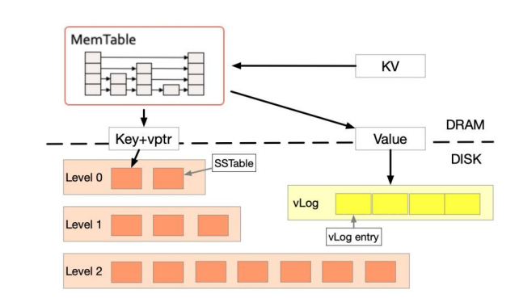
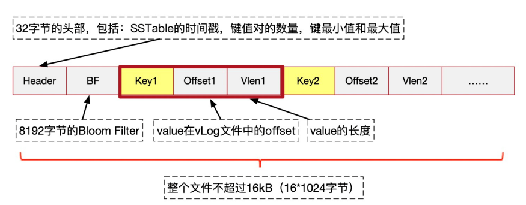
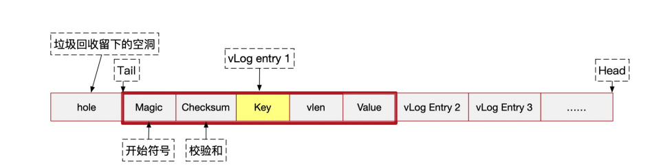
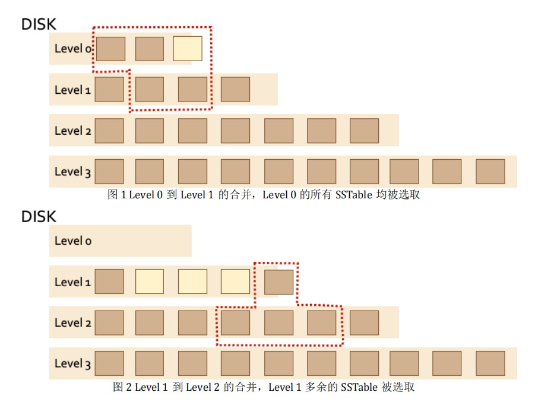
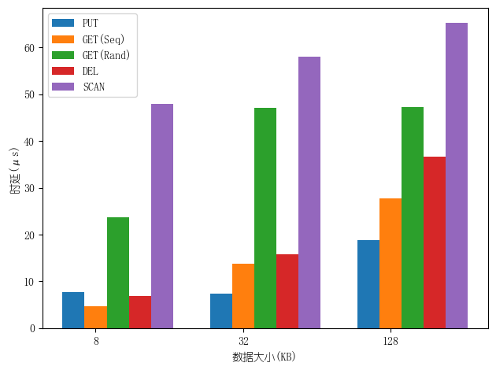
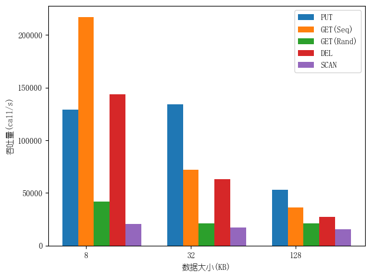
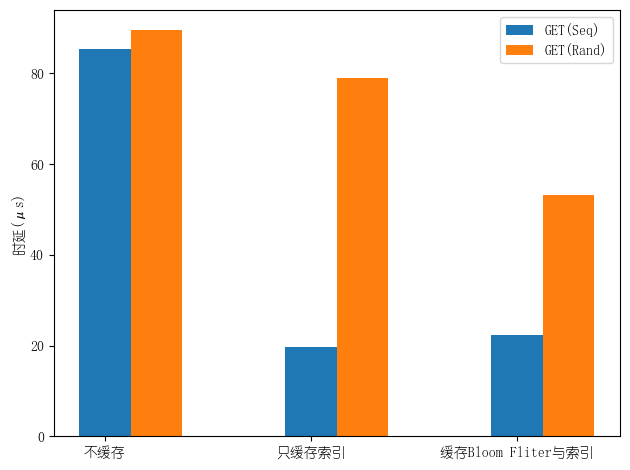
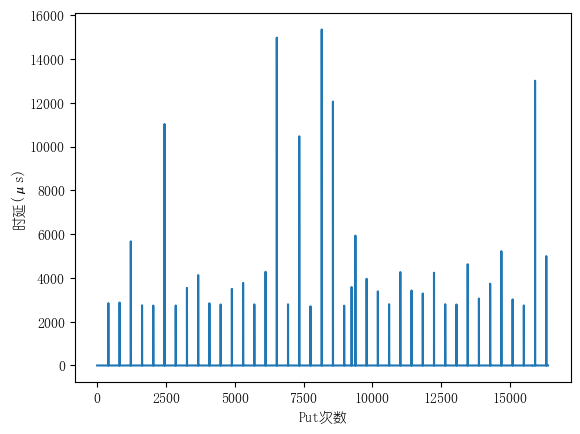
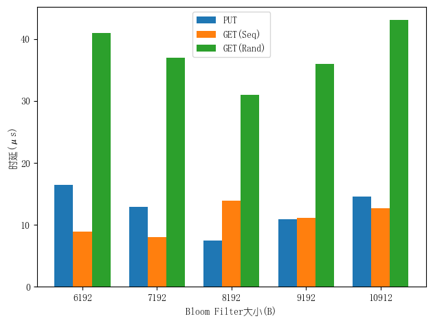

## 系统介绍

LSM Tree (Log-structured Merge Tree) 是一种可以高性能执行大量写和顺序查找操作的数据结构。它于 1996 年，在 Patrick O'Neil 等人的一篇论文中被提出。现在，这种数据结构已经广泛应用于数据存储中。Google 的 LevelDB 和Facebook 的 RocksDB 都以 LSM Tree 为核心数据结构。

如果将key和value一起写入SSTable，在合并过程中SSTable里的key和value都被重写一遍，开销巨大，这就是LSM Tree 长期被人诟病的写放大（Write Amplification）问题。2016 年，Lanyue Lu等人发表的论文 Wisckey 针对写放大问题提出了相应优化：键值分离。在过去几年中，工业界中也陆续涌现出键值分离的 LSM Tree 存储引擎，例如 TerarkDB、Titan 等。

本项目基于 LSM Tree 以及键值分离技术开发一个键值存储系统。该键值存储系统支持下列基本操作，并支持持久化、垃圾回收等存储系统特性（其中 Key 是 64 位无符号整数，Value 为字符串）。

- PUT(Key, Value)：设置键 Key 的值为 Value。
- GET(Key)：读取键 Key 的值。
- DEL(Key)：删除键 Key 及其值。
- SCAN(Key1, Key2)：读取键 Key 在[Key1, Key2]区间内的键值对。

 完整实现已上传代码仓库：[wdl339/LSMKV](https://github.com/wdl339/LSMKV)


## 基本结构

LSM Tree 键值存储系统分为内存存储和硬盘存储两部分，采用不同的存储方式。硬盘存储中的键值被分离存储，因此硬盘存储又分为 SSTable 和 vLog 两部分。



### 内存存储

内存存储结构被称为 MemTable，通过跳表保存键值对。

相关文件：`skiplist.cc`，`skiplist.h`。数据结构：`Node`，`SkipList`。


### 硬盘存储 —— SSTable

硬盘存储包括存储键的 SSTable 和值的 vLog。

Key 采用分层的方式进行存储，每一层中包括多个文件，每个文件被称为 SSTable（Sorted Strings Table），用于有序地存储多个 Key，以及其对应的 Value 在 vLog 中的位置与长度。一个 SSTable 的大小不超过16 kB，但尽量接近。如图所示，每个 SSTable 文件的结构分为三个部分。



1. Header 用于存放元数据，按顺序分别为该 SSTable 的时间戳（无符号64 位整型），SSTable 中键值对的数量（无符号 64 位整型），键最小值和最大值（无符号 64 位整型），共占用 32 B。

2) Bloom Filter 用来快速判断 SSTable 中是否存在某一个键值，Bloom Filter 的大小为 8 kB，hash 函数使用Murmur3，将 hash 得到的 128-bit 结果分为四个无符号 32 位整型使用。超出 Bloom Filter 长度的结果取余。 

3. <Key, Offset, Vlen>元组，用来存储有序的索引数据，包含所有的Key、Key 对应的 Value 在 vLog 文件中的偏移量 offset (无符号 64 位整数）以及值的长度（无符号 32 位整数）。

当我们要在某个 SSTable 中查找 Key 对应的键值对时，考虑到 SSTable 索引中的键是有顺序的，通过二分查找在对数时间内完成 Key 的查找，并通过 offset 快速从 vLog 文件的相应位置读取出键值对。

硬盘存储每一层的文件数量上限不同，层级越高，上限越高。每一层的文件数量上限是预设的，本项目中 Level n 层的文件数量为。除了 Level 0 之外，每一层都需要确保任意两个不同文件的键值区间不相交。

SSTable 以“.sst”作为拓展名，所有文件存放在数据目录中，Level n 层的文件在数据目录中的“level-n” 目录下。

SSTable 文件一旦生成，是不可变的。因此在进行修改或者删除操作时，只能在系统中新增一条相同键的记录，表示对应的修改和删除操作。因此一个 Key 在系统中可能对应多条记录，为区分它们的先后，为每个条目增加一个时间戳，又考虑到每个 SSTable 中的数据是同时被写成文件的，因此其实只需在 SSTable 的 Header 中记录当前SSTable 生成的时间戳即可。

为了简化设计，在本项目中，使用SSTable 的生成序号表示时间戳：在键值存储系统被初始化/reset 之后，第一个生成的 SSTable 的时间戳为 1，第二个生成的为 2，以此类推。键值存储系统在启动时，如果没有进行初始化操作，会找到此前所生成的最后一个时间戳，才能用于下一个 SSTable 的生成。 

到后面我们会发现，不同的SSTable可能具有相同的时间戳，这时候需要加上tag用于区分。SSTable的文件名就是用 "timestamp_tag.sst" 的形式。知道一个SSTable对应的level、 timestamp、tag，就能快速定位SSTable文件的位置。系统需要保存每个timestamp对应的最大tag，用于给文件取名。

```
std::map<uint64_t, uint64_t> maxTag;
```

SSTable 是保存在磁盘中的，而磁盘的读写速度比内存要慢几个数量级。因此在查找时，去磁盘读取 SSTable 的 Bloom Filter 和索引（有哪些key）是很耗时的操作。为了避免多次磁盘的读取操作，需要将 SSTable 缓存在内存中：

1. 系统会缓存每个SSTable的Info：

   ```
   std::map<uint64_t, std::map<std::pair<uint64_t, uint64_t>, Info>> ssInfo; 
   // level, {timestamp, tag}, Info
   
   struct Info{
       Header header;
       BloomFilter bloomFilter;
       std::vector<uint64_t> indexes;
   };
   ```

   其中indexes就是索引，包含所有的key。

2. 其次，系统还会缓存一个完整的SSTable。因为查询可能具有局部性，在同一个SSTable上做连续的查询

   ```
   struct LTT{
       uint64_t level;
       uint64_t timestamp;
       uint64_t tag;
       ...
   };
   
   SSTable ssCache;
   LTT* ltt;
   ```

   ltt就是这个ssCache的基本信息。

   （其实可以缓存一组SSTable而不只是一个的，但是有点复杂了）

综上我们确定下SSTable的结构：

```
class SSTable{
public:
    Info info;
    std::vector<DataBlock> data;
    ...
};
```

其构造函数：

```
SSTable::SSTable(const std::string &path) {
    std::ifstream in(path, std::ios::binary);
    in.read((char*)&(info.header), sizeof(Header));
    in.read((char*)&(info.bloomFilter), sizeof(BloomFilter));
    while (!in.eof()) {
        DataBlock tmp;
        in.read((char*)&(tmp.key), sizeof(uint64_t));
        in.read((char*)&(tmp.offset), sizeof(uint64_t));
        in.read((char*)&(tmp.vlen), sizeof(uint32_t));
        data.push_back(tmp);
        info.indexes.push_back(tmp.key);
    }
}
```

相关文件：`sstable.cc`，`sstable.h`，`bloomFilter.h`。数据结构：`Header`，`BloomFilter`，`DataBlock`，`Info`，`SSTable`。


### 硬盘存储—— vLog



vLog 用于存储键值对的值，其中 head 为新数据 append 时的起始位置，tail 为空洞之后第一个有效数据的起始位置，文件由连续的 vLog entry 组成，每个 entry 包括五个字段：

1. Magic (1 Byte)：作为每个 entry 的开始符号，用0xff表示。由于系统没有持久化 vLog 文件 head 和 tail 的位置，Magic 被用来查找vLog 数据开始的位置

2. Checksum (2 Byte)：通过对由 key, vlen, value 拼接而成的二进制序列计算 crc16 得到（ crc16 函数在 utils.h 中）。Magic 和 checksum 二者在读取数据时共同用于检查数据是否被完整写入，这有利于在系统初始化时确定 tail 的位置（详见reset 操作）。

   ```
   std::vector<unsigned char> data = std::vector<unsigned char>(sizeof(key) + sizeof(vlen) + vlen);
           memcpy(data.data(), &key, sizeof(key));
           memcpy(data.data() + sizeof(key), &vlen, sizeof(vlen));
           memcpy(data.data() + sizeof(key) + sizeof(vlen), value.c_str(), vlen);
           checkSum = utils::crc16(data);
   ```

3. Key (8 Byte)：键，为了方便垃圾回收，vLog 同时保存了 Key。

4. vlen (4 Byte)：值的长度。

5. Value：值。

由于对键值存在修改或删除操作，因此每间隔一段时间系统就需要对vLog 文件进行垃圾回收。简单来说会扫描 vLog 尾部 (tail) 一段 vLog entry，检查其是否过期（被修改或删除），将没有过期的 entry 重新插入到 LSM Tree 中，并使用文件系统的 fallocate 系统调用将这块回收的区域打洞。

相关文件：`vlog.cc`，`vlog.h`。数据结构：`Entry`，`VLog`。


## 合并操作

当内存中 MemTable 数据达到阈值（即转换成 SSTable 后大小超过16kB）时，要将 MemTable 中的数据写入硬盘。在写入时，首先将MemTable 中的数据转换成 SSTable 的形式，随后将其直接写入到硬盘的Level 0 层中，生成 SSTable 之后 MemTable 清空。若 Level 0 层中的文件数量超过限制，则开始进行合并操作。对于 Level 0 层的合并操作来说，需要将所有的 Level 0 层中的 SSTable 与 Level 1 层中的部分 SSTable 进行合并，随后将产生的新 SSTable 文件写入到 Level 1 层中。具体方法如下：

1. 先统计 Level 0 层中所有 SSTable 所覆盖的键的区间。然后在 Level 1层中找到与此区间有交集的所有 SSTable 文件。

2. 将上述所有涉及到的 SSTable 进行合并，结果记录在all结构中：

   ```
   std::map<uint64_t, std::pair<uint64_t, DataBlock>> all; // key, {timestamp, DataBlock}
   ```

3. 将结果每 16 kB 分成一个新的 SSTable 文件（最后一个 SSTable 可以不足 16 kB），写入到 Level 1 中。

4. 若产生的文件数超出 Level 1 层限定的数目，则从 Level 1 的 SSTable中，优先选择时间戳最小的若干个文件（时间戳相等选择键最小的文件），使得文件数满足层数要求，以同样的方法继续向下一层合并（若没有下一层，则新建一层）。

**一些注意事项：** 

1. 从 Level 1 层往下的合并开始，仅需将超出的文件往下一层进行合并即可，无需合并该层所有文件。
2. 在合并时，如果遇到相同键 K 的多条记录，通过比较时间戳来决定键 K 的最新值，时间戳大的记录被保留。
3. 完成一次合并操作之后，删除原来的 SSTable 文件，并更新涉及到的 SSTable 在内存中的缓存信息。
4. 涉及到来自多个 SSTable 的数据的合并时，生成的 SSTable 时间戳为原 SSTable 中最大的时间戳，因此生成的多个 SSTable 时间戳是可以相同的。




## 基本操作

### PUT(Key, Value)

对于 PUT 操作，首先尝试在 MemTable 中进行插入。由于MemTable 使用跳表维护，因此如果其中存在 Key 的记录，则在 MemTable 中进行覆盖（即替换）而非插入。

如果在插入或覆盖之后，MemTable 的大小恰好达到限制，则将 MemTable 中的数据转换成vLog entry 写入 vLog 中，并依次得到每个 entry 在 vLog 文件中的offset。

```
for (auto &kv : all)
        {
            if (kv.second == DFLAG)
                continue;

            Entry entry(kv.first, kv.second);
            uint64_t size = sizeof(uint8_t) + sizeof(uint16_t) + sizeof(uint64_t) + sizeof(uint32_t) + entry.vlen;
            write(fd, &entry.magic, sizeof(uint8_t));
            write(fd, &entry.checkSum, sizeof(uint16_t));
            write(fd, &entry.key, sizeof(uint64_t));
            write(fd, &entry.vlen, sizeof(uint32_t));
            write(fd, entry.value.c_str(), entry.vlen);
            offsets[kv.first] = head;
            head += size;
        }
```

接着，依据得到的 offset 生成相应的 SSTable 保存在 Level 0 层中。若 Level 0 层的文件数量超出限制，则开始进行合并操作。


### GET(Key)

对于 GET 操作，首先从 MemTable 中进行查找，当查找到键 K所对应的记录之后结束。

若 MemTable 中不存在键 Key，则先从内存里逐层查看缓存的每一个 SSTable，先用 Bloom Filter 中判断 Key 是否在当前 SSTable 中，如果可能存在则用二分查找在索引中找到对应的<key, offset, vlen>元组。

```
std::string KVStore::readData (uint64_t level, uint64_t time_stamp, uint64_t tag, uint64_t pos) {
	/* cache */
	if (ltt != nullptr && ltt->level == level && ltt->timestamp == time_stamp && ltt->tag == tag){
		return ssCache.data[pos].vlen == 0 ? DFLAG : vLog->get(ssCache.data[pos].offset, ssCache.data[pos].vlen);
	} else {
		if (ltt != nullptr){
			delete ltt;
		}
		std::string file = filePath(level, time_stamp, tag);
		ssCache = SSTable(file);
		ltt = new LTT(level, time_stamp, tag);
	}
	
    std::string file = filePath(level, time_stamp, tag);
    std::fstream f;
    f.open(file, std::ios::in | std::ios::binary);

    uint64_t offsetPos = pos * sizeData + sizeHeader + sizeFliter + sizeof(uint64_t);
	f.seekg(offsetPos, std::ios::beg);

    uint64_t offset;
    f.read(reinterpret_cast<char*>(&offset), sizeof(offset));
    uint32_t vlen;
    f.read(reinterpret_cast<char*>(&vlen), sizeof(vlen));

	if (vlen == 0){
		return DFLAG;
	}

    return vLog->get(offset, vlen);
}

```

之后即可从 vLog 中根据 offset 及 vlen 取出 value。

```
lseek(fd, offset, SEEK_SET);
    
uint8_t magic;
read(fd, &magic, sizeof(magic));
...

std::string value = std::string(len, 0);
read(fd, &value[0], len);
```

如果找遍了所有的层都没有这个 Key 值，则说明该 Key 不存在。


### DEL(Key)

由于不能修改 SSTable 中的内容，需要一种特殊的方式处理键值对的删除操作。首先查找键 Key，如果未找到则不需要进行删除操作，返回 false；若搜索到记录，则在MemTable 中插入一条特殊的“删除标记”，其键为 Key ，值为特殊字串“\~DELETED\~”（默认不会出现以此为值的正常记录），表示键 Key 被删除了，并返回 true。当读操作读到了一个“删除标记”时，说明该 Key 已被删除。

在使用 MemTable 生成 SSTable 以及 vLog 时，只需在 SSTable 中将该 Key 对应的 vlen 设为 0 而不需要写 vLog ，在 GET 操作时，即可通过 vlen 是否为 0 来判断是否为删除操作。在执行合并操作时，根据时间戳将相同键的多个记录进行合并，通常不需要对 vlen 为 0 的记录作特殊处理。唯一一个例外，是在最后一层中合并时，所有 vlen 为 0 的记录会被丢弃。 

 

### SCAN(K1, K2) 

SCAN 操作需要返回一个 std::list<K, V>，其中按递增顺序存放了所有键在 K1 和 K2 （左右均包含）的键值对。扫描 MemTable 和所有 SSTable 中的数据即可。先遍历找到有哪些在范围内的key，以及它们最新数据的位置（LTTP定位：level, timestamp, tag, pos），然后一一到vLog中获取值。


### KVStore(dir, vlog)

这是KVStore的构造函数，接受的参数是数据目录的路径和vlog路径。

键值存储系统在启动时，需检查现有的数据目录中各层 SSTable 文件，并在内存中构建相应的缓存（ssInfo和maxTag）。

同时还需要读取到上次系统运行所记录的 vLog 文件，恢复 tail 和 head 的正确值，具体来说：

1. head 的值就是当前文件的大小。

   ```
   head = lseek(fd, 0, SEEK_END);
   ```

2. tail 则需要利用`seek_data_block`函数，得到文件开头起第一个数据（即 vLog 尾部第一个非空洞的字节）的偏移量。这个偏移量一般会比实际数据所处的偏移量小，需要继续往后读取直到找到vLog entry 的开始符号（Magic）。

3. 定位到文件空洞后的第一个 Magic之后，接着进行 crc 校验，如果校验通过则该 Magic 的位置即为 tail 的值，否则寻找下一个 Magic 并进行校验，直到校验通过，则对应的 Magic 位置即为 tail 的正确值。


### RESET()

将所有层的 SSTable 文件（以及表示层的目录）、vLog 文件删除，清除内存中 MemTable 和缓存等数据，将 tail 和 head 的值置 0，使键值存储系统恢复到空的状态。同时，系统在正常关闭时（可以实现在析构函数里面），应将 MemTable 中的所有数据写入 SSTable 和 vLog（类似于 MemTable 满了时的操作）。


## 垃圾回收

在没有使用键值分离优化时，垃圾回收在合并 SSTable 时即可自动完成，然而当引入了键值分离之后，value 被单独存在 vLog 中，在合并操作时不会删除，因此需要额外的垃圾回收机制回收过期的（被删除或修改）的vLog entry。

GC 函数的主要包含以下参数：

1. chunk_size ：本轮 GC 扫描的 vLog 大小（严格不小于，例如chunk_size = 1024 Byte，而 vLog 头部的 10 个 entry 加起来大小为 1023 Byte，则需要再多扫描一个entry）。 

GC 的流程包括以下几步：

1. 逐个扫描 vLog 尾部 GCSize 大小内的 vLog entry，使用该 vLog entry 的 Key 在 LSM Tree 中查找最新的记录，比较其 offset 是否指向该vLog entry。

2. 如果是，表明该 vLog entry 仍然记录的是最新数据，则将该 vLog entry 重新插入到 MemTable 中。
3. 如果不是，表明该 vLog entry 记录的是过期的数据，不做处理。
4. 扫描完成后，不论此时 MemTable 是否可以容纳更多的数据（即继续插入新数据后仍然可以使得转化成的 SSTable 的大小满足要求），只要 MemTable 中含有数据，就需要主动将 MemTable 写入 SStable 和 vLog（类似于 MemTable 满了时的操作）。扫描到的未过期的数据会在这一步重新 append 到 vLog 头部。 
5. 使用 de_alloc_file() 帮助函数对扫描过的 vLog 文件区域打洞。

> fallocate 函数可以用于释放文件中的部分空间。被释放的空间称为“空洞”区域。空洞不会实际占用磁盘空间，在被读取时会返回全零（注意读取文件的时候，读取的是字节，因此读到的全是 0x00）。在成功调用fallocate 之后，虽然文件的实际大小发生了改变，但通过 tellg() 等方式得到的文件大小不会发生改变。

```
void KVStore::gc(uint64_t chunk_size)
{
	std::map<uint64_t, std::pair<std::string, uint64_t>> kVOff;
	uint64_t holeOff = 0;
	uint64_t len = 0;
	vLog->gc(kVOff, chunk_size, holeOff, len);
	for (auto it = kVOff.begin(); it != kVOff.end(); it++){
		uint64_t key = it->first;
		std::string value = it->second.first;
		uint64_t offset = it->second.second;
		uint64_t offInSS = getOffInSS(key);
		std::string valueInMem = memtable->get(key);
		if (offInSS == offset && valueInMem == ""){
			put(key, value);
		}
	}
	pushMem2ss();
	utils::de_alloc_file(VLOG_PATH, holeOff, len);
}
```


## 测试和瓶颈分析

### 正确性测试 

正确性测试包括以下测试：

1）基本测试将涵盖基本的功能测试，其数据规模不大。

2）复杂测试将按照一定规则产生大量测试请求。其将测试磁盘数据结构，以及各个功能在面对大规模数据时的正确性。

3）持久性测试将对磁盘中保存的数据进行验证。测试脚本将造成测试程序意外终止，此后重新访问键值存储，检查其保存的键值对数据的正确性。

提供的基本测试和复杂测试在文件（correctness.cc）中，持久性测试的代码在文件（persistence.cc）中，使用方法请见Makeflie。


### 性能测试 

#### 常规分析

测试 PUT、GET、和 DEL 三种操作的吞吐量（每秒执行操作个数）和平均时延（每一个操作完成需要的时间）。

先预测：

1. 由于磁盘读写、缓存设计、SSTable层数等影响因素过多，且Delete效率同时受Get和Put的影响（相当于先查找，找到才插入删除标记），操作延迟的大小排序应该并不固定，会随数据大小而变。
2. 可以预计的是，Scan的操作延迟最大（相当于多次Get）。
3. 由于乱序的Get的缓存命中率更低，它的操作延迟会大于顺序的Get。
4. Put、Get和Delete的时延都会随数据的增大而变长。因为数据增大意味着最终SSTable的层数加深。对Put而言，触发Compaction时的平均耗时变长；对Get而言，找到深层数据的耗时变长；Delete时延受Get和Put影响也变长。

分别测试8KB、32KB、128KB数据大小下的Put、Get、Delete、Scan 操作的延迟与吞吐量。“数据大小”指全部value的大小总和，每个value的长度恒定为4字符，通过增加key-value对的总数来增大数据。Get分顺序(Seq)和乱序(Rand)两种情况。测试结果如下。





测试结果符合预期：操作延迟的大小排序不固定。数据较小时，延迟从大到小为Scan > Get(Rand) > Put > Delete > Get(Seq)，数据较大时，排序变为Scan > Get(Rand) > Delete > Get(Seq) > Put。吞吐量则相反。Put、Get和Delete的时延都随数据增大而变长。此外，数据较大时乱序Get的时延趋于稳定，可能是因为层数增长变慢，cache miss的概率也稳定下来。

#### 索引缓存与 Bloom Filter 的效果

对比以下三种设计中，GET 操作的平均时延：

1. 内存中不缓存 SSTable 的任何信息，从磁盘中访问 SSTable 的索引，在找到 offset 之后读取数据。
2. 内存中只缓存了 SSTable 的索引信息（ <Key，offset，vlen> 元组），通过二分查找从 SSTable 的索引中找到 offset，并在磁盘中读取对应的值。
3. 内存中缓存 SSTable 的 Bloom Filter 和索引，先通过 Bloom Filter 判断一个键值是否可能在一个 SSTable 中，如果存在再利用二分查找，否则直接查看下一个 SSTable 的索引。

（这个测试非常生草的地方在于我的缓存设计和这三种都不一样，因此需要改动更多次......）

结果预测：不同缓存设计下的Get时延与命中率有关。有缓存与无缓存相比能极大减少对磁盘的读，时延会更低。命中率较低时，缓存Bloom Fliter将减少无效的二分查找的次数，降低时延；命中率较高时，多余的Bloom Fliter判断反而会增加时延。

分别测试不缓存SSTable信息、只缓存索引信息、缓存Bloom Fliter和索引这三种设计中Get的平均时延。仍分顺序（命中率较高）和乱序（命中率较低）两种情况。测试结果如图。



测试结果与预期一致。命中率较高时，操作延迟从大到小为不缓存 > 缓存Bloom Fliter+索引 > 缓存索引。命中率较低时，排序为不缓存 > 缓存索引 > 缓存Bloom Fliter+索引。


#### Compaction 的影响

不断插入数据的情况下，统计插入操作的时延的变化情况。

结果预测：Put的时延在把MemTable写入磁盘时会明显上升，在触发Compaction时会上升更多。Compaction操作时需要处理的层数越多，该Put的时延越长。

在不断插入数据的情况下，统计每次Put的时延，观察变化情况。每次Put的value大小为4B，共执行16384次Put。按照LSM树设计，每执行408次Put会生成1个SSTable，每生成3个SSTable会导致Level 0层满，触发Compaction。测试结果如图。



测试结果与预期大部分一致，通常情况下，有Compaction的Put时延 > 无Compaction的生成SSTable的Put时延  $\gg$ 普通Put时延。Compaction使Put的时延上升明显。

与预期不一致在于：少数无Compaction的Put时延也很高; Compaction需要处理的层数越多，Put时延不一定越长。我猜测可能是因为生成SSTable的同时会写vLog文件，在我的LSM Tree实现里，写vLog的耗时对Put时延也有较大影响。


#### Bloom Filter 大小的影响

Bloom Filter 过大会使得一个 SSTable 中索引数据较少，进而导致 SSTable 合并操作频繁；Bloom Filter 过小又会导致其 false positive 的几率过大，辅助查找的效果不好。尝试不同大小的 Bloom Filter 并保持 SSTable 大小不变，比较系统 Get、Put 操作性能的差异并思考原因。

结果预测：

1. Put时延随Bloom Filter增大而上升。
2. 随Bloom Filter增大，乱序Get的时延先降低后上升。
3. 由于命中率较高时Bloom Filter的辅助效果差，顺序Get的时延随Bloom Filter增大而上升。

分别测试在Bloom Filter大小为6192B、7192B、8KB、9192B、10192B之下，Put、顺序Get和乱序Get的平均时延。数据大小为32KB。测试结果如图。



测试结果与预期大部分一致：Put时延随Bloom Filter增大而上升。随Bloom Filter增大，乱序Get的时延先降低后上升。与预期不一致在于：顺序Get的时延只在一小段范围内波动，并非单调上升。可能是因为命中率较高，即使SSTable数量增加，也是在cache miss的情况下才有影响，影响并不明显。


## 优化方向

目前键值系统中 MemTable 持久化为 SSTable 及 vLog 是同步完成的，这会大大增加某一个 Put/Del 操作的时延。为了屏蔽这段时延，可以维护两个 MemTable，当一个 MemTable 写满后，令其在后台并行地进行持久化，而由另一个 MemTable 响应用户请求。


## 参考资料

1. 大作业文档材料
2. https://www.skyzh.dev/blog/2021-08-07-lsm-kv-separation-overview/