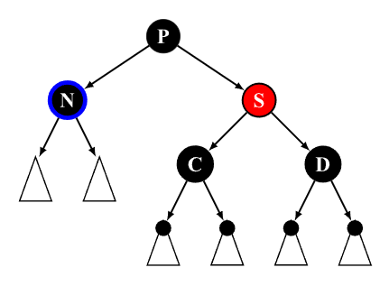
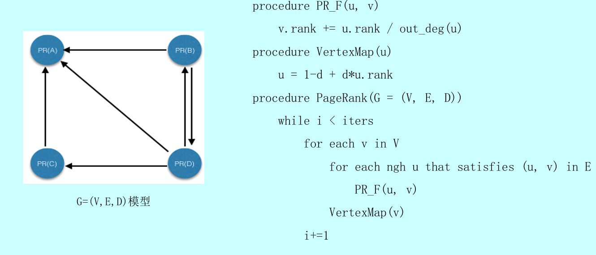
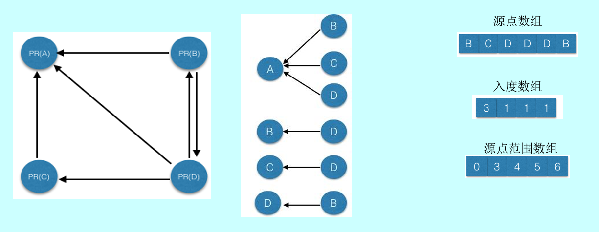

<!-- aliases = ["migrate-from-jekyl"] -->
<!-- image = "pawel-czerwinski-8uZPynIu-rQ-unsplash.jpg" -->

## 写在最前

本文最初写于大二下学期期末周。由于本课程的理论部分的教学质量一言难尽，平日里全班几乎无一位同学认真听讲，于是到了期末周，大部分同学都只好面向考试突击复习。我在复习的时候就是用markdown记的笔记，为了行善积德（划掉）帮助同学们，本文也同步连载于校园论坛上，大概经历了两周时间，本文档完工。

此时已是期末周过后，小学期过半。我搭建完博客网站之后，正想着放个什么内容来试验一下，于是就把这篇笔记搬运了过来。搬运的过程并不算顺利，网站内容的语法和我平时写的markdown还是有区别，特别是公式和图片，因此本文可能有些地方图片格式不太好，不过大体上还是不影响观看的。

希望这篇博客能帮助到更多的同学！

## Introduction

**为什么C++比python快？**

Python：

- 解释型语言，在运行之前需要额外经过解释器的解释过程（托管语言，需要runtime）
- 动态类型语言，类型检查在运行时进行
- 自动垃圾回收

C++：

- 编译型语言，编译后运行，直接转换成二进制机器码
- 静态类型语言，编译器在编译时进行类型检查
- 手动内存管理


**除了编程语言外，影响程序运行快慢还可能有哪些因素？**(from GPT)

1. 算法的效率。
2. 编译器和编译器优化选项。
3. 计算机硬件的性能。例如处理器速度、内存容量和速度、存储设备速度。
4. 操作系统的效率。
5. 系统负载。同时运行的其他程序和进程数量会影响可用资源。
6. 输入数据的规模。
7. 网络速度（对于依赖网络通信的程序）


**加快程序运行的方法**

- 编译器优化
- 循环展开
- 减少function call
- 内存友好
- 多线程与多进程


## Skiplist

### 结构


### 基本操作

**查找**


**插入**


**删除**


### 复杂度分析（不做要求）


用C(k)表示向上攀爬k个层级所需要走过的平均查找路径长度:
$$ C(0)=0 $$
$$ C(k)=(1-p)×(上图中情况b的查找长度) + p×(上图中情况c的查找长度) $$
$$ C(k)=(1-p)(C(k)+1) + p(C(k-1)+1) $$
$$ C(k)=1/p+C(k-1) $$
$$ C(k)=k/p $$


意思是，我们每爬升1个层级，需要在查找路径上走 $\frac{1}{p}$ 步


当skiplist中有n个节点的时候

- 第1层链表固定有n个节点；
- 第2层链表平均有np个节点；
- 第L层链表平均有 $np^{L-1}$ 个节点；

当前容量为n时，理论上的起始搜索层数记为L(n)（不需要从maxLevel开始搜，虽然没太大影响）。我们希望这一层的节点数$np^{L-1} = \frac{1}{p}$，那么$L(n) = \log_{\frac{1}{p}}{n}$。

跳表的查找长度上界为 $\frac{L(n) - 1}{p}$ ，也就是说**期望时间复杂度为O(log n)**，对其求导得 $ p = \frac{1}{e}$ 时cost最少


一个节点，层数恰好等于L的概率为$p^L(1-p)$

每个节点所包含的平均指针数目（平均层数）


p为常数，跳表的**期望空间复杂度为O(n)**

在最坏的情况下，每一层有序链表等于初始有序链表，**最坏时间复杂度为O(n)，最坏空间复杂度为O(nlog n)**


### 作业及其他问题

**为什么要固定生长因子？**

（这里写的下标是从上往下长的，最高层是1）

举个例子，如果L1有6个结点，L2有12个结点，那么L1查不到之后，在L2平均只需要再走$\frac{L_2}{L_1} = 2$步即可

平均查找路径长度: $L_1 + \frac{L_2}{L_1} + \frac{L_3}{L_2} + ... + \frac{L_n}{L_{n - 1}} $ ，求和，均值不等式，取等条件为每层比例相等，且等于L1

现在$L_1 = \frac{1}{p}$，要最底层$L_L = (\frac{1}{p})^ L = n$，也可以推出$L(n) = \log_{\frac{1}{p}}{n}$


**跳表的好处**

- 查找单个key，skiplist和平衡树的时间复杂度都为O(log n)
- 在做范围查找的时候，平衡树比skiplist操作要复杂。在平衡树上，我们找到指定范围的小值之后，还需要以中序遍历的顺序继续寻找其它不超过大值的节点。而在skiplist上进行范围查找就非常简单，只需要在找到小值之后，对第1层链表进行若干步的遍历即可。
- 平衡树的插入和删除操作可能引发子树的调整，逻辑复杂，而skiplist的插入和删除只需要修改相邻节点的指针，操作简单又快速。
- 从内存占用上来说，skiplist比平衡树更灵活一些。一般来说，平衡树每个节点包含2个指针，取p=1/4，那么跳表平均每个节点包含1.33个指针，比平衡树更有优势


**求查找长度**：head也要计算在内


## Sets

### 基于template的sort

如果第一个值小于第二个值，比较函数cmp返回负值。相等返回0。


例如：


### set的实现

哈希表：O(1) performance

平衡二叉树：O(log n) performance。C++ Map类使用此实现

我们的Set基于C++ Map类实现


**集合判等**


**集合相加**


### 字符集

经常出现集合类型Set\<char>。可以利用单个比特位（bit）表示字符的包含或排除关系，其中1表示该元素在字符集中，0表示不在字符集中。创建一个比特数组，即特征向量（characteristic vector），可以将特征向量的比特位压缩为机器内部的少量字（words），然后以大块方式对比特位进行位操作，例如取交集：


## Bloom Fliter

### 结构


### 最小化误报率

False Positive:  误报率：假阳性
False Negative：漏报率：假阴性（不存在假阴性）

哈希函数数量k，bloom fliter大小为m，n个元素插入之后，一个特定bit仍为0的概率是$ p = (1 - \frac{1}{m}) ^{kn} = e^{-\frac{kn}{m}}$ ，为1的概率 $1 - p$，一个查询的假阳性概率为$f = (1 - p) ^ k = e ^ {k \ln{(1-p)}}$。最小化$g = k \ln{(1-p)} = -\frac{m}{n} \ln{p} \ln{(1-p)}$。得到p = 0.5，$k = \frac{m}{n} \ln{2} $ 能最小化报错率 


### 作业

**误差来源？**

- 数据量大小（100个元素存在一定偶然性）
- hash函数的选择与使用（可用方法：seed+1，$H_i(x) = H_1(x + i)$；得到的值有128位，用前64位作为下一个哈希函数的种子；不应该用有所关联的哈希函数）


**以下方式选择哈希函数会导致什么结果？**


实际上相当于只进行了一次哈希，但h1和h2没有相关性，因此可以看做一次哈希得出了两个有效的哈希值


## Splay Tree

### 结构

一种平衡二叉查找树，它通过 Splay 伸展操作，不断将某个节点旋转到根节点，使得整棵树仍然满足二叉查找树的性质，能够在均摊 $O(\log N)$ 时间内完成插入，查找和删除操作，并且保持平衡而不至于退化为链


### 自下而上伸展

旋转的本质是将某个节点上移一个位置


Splay 操作规定：每访问一个节点x后都要强制将其旋转到根节点（刚被访问过的数据，极有可能很快地再次被访问）。Splay步骤不能破坏二叉查找树的性质（左小右大）

双层伸展，Splay 步骤有三种：

1. **zig**: 在p是根节点时操作


2. **zig-zig**: 在 p 不是根节点且 x 和 p 都是右侧子节点或都是左侧子节点时操作

   

3. **zig-zag**: 在 p 不是根节点且 x 和 p 一个是右侧子节点一个是左侧子节点时操作


逐层伸展最坏情况下为O(n)，最坏可能持续发生。双层调整相比于逐层调整，深层节点访问之后，对应路径的长度随即折半，最坏情况不致持续发生。虽然单次操作不能保证对数时间内完成，但操作次数多了后平均每次操作的时间复杂度是对数复杂度。因此，双层伸展 splay 操作的均摊复杂度为 $O(\log n)$ 


基于 splay 的插入，查询，删除等操作的时间复杂度也为均摊 $O(\log n)$ （一次耗时操作后，后续的操作会省时）

查询：无论是否查找成功，都将查找终止处的结点伸展到树根

插入：先找到插入位置，插入后将其伸展

删除（不做要求）：将查找终止处的结点伸展到树根。要删时，删后留下左右子树TL TR，TR的最小节点伸展到根，与TL相连


### 作业

1. 插入序列为 [2, 18, 14, 16, 8, 15, 5, 9]  
2. 插入序列为 [5, 13, 6, 14, 3, 15, 4, 16]

**它们最后产生的树的形态有什么区别？从插入序列来看，原因是什么？**

第1个树形态比较均衡，因为其插入序列比较随机，每次调整次数也较平衡。

第2个树形态很不均衡，因为插入序列构造时有意把大数小数交替，每次调整很浅，深层的树得不到调整，被逐渐向下旋转，加深树深。


## 红黑树

### 五个性质

1. 结点是红色或者黑色
2. 根结点是黑色
3. 所有叶子都是黑色 (叶子结点是NIL结点)
4. 每个红色结点的两个子结点都是黑色，或者说从每个叶子到根的所有路径上不能有两个连续的红色结点 
5. 从任一结点到其每个叶子的所有路径都包含相同数目的黑色结点（黑高度相同）


### 插入

规定插入的结点为红色，原因：插入红色结点不改变性质5，影响更小

插入结点的父结点为红色，双红修正：

**父结点的兄弟结点为黑色**

LL型

- 将父节点染黑: 防止连续两个红色结点，但导致左侧路径上黑色结点增多失衡
- 祖父染红: 左侧路径上黑色结点数恢复，但右侧路径上黑色结点数减少失衡
- 右旋: 右侧路径黑色结点数增加，平衡恢复

LR型

- 对结点进行一次左旋之后得到LL型
- 之后的每一步与上述同理
- RR、RL同理


**父结点的兄弟结点为红色**


- 将 P，U 节点染黑，将 G 节点染红（可以保证每条路径上黑色节点个数不发生改变）
- 递归维护 G 节点（因为不确定 G 的父节点的状态，递归维护可以确保性质 3 成立）


时间复杂度O(log n)，至多做O(log n)次重染色，O(1)次旋转


### 删除（不做要求）

设要删除的结点为x（图中是N），将要取代x的孩子结点为r（图中没画）

BST知识复习：r是什么？x是叶结点时，r为黑色NULL结点。x只有一个儿子时，r是他的儿子。x有两个儿子时，选择一个“替身”取代被删结点，再将替身删去。替身是被删结点的左子树的最大结点或右子树的最小结点（总之中序遍历紧挨着的）

分情况删除：

一. x,r其一为红：

1. x为红：删x无影响
2. r为红：r变为黑色，再删x：防止删除x之后出现双红，确保此处黑深度不变

二. x,r均为黑（双黑），设x的父结点为p，兄弟结点为s：

1. s为黑，至少有一个红孩子t：

   - **记录p原来的颜色，将p染黑**：增加p处的黑深度，便于后续删除使黑深度减少，但导致失衡

   - **将s染为p原来的颜色**：使s一侧的黑深度恢复原状

   - **将t染黑**：避免t与s形成双红，但t一侧黑深度增加

   - **若双黑结点在右，则s右旋，若双黑结点在左，则s左旋**：s取代原来的p，现在仅有p-x-r一侧的黑深度偏大，其他侧黑深度恢复正常

   - **删除x，r替代**：p-x-r一侧的黑深度恢复正常


   1. s为黑，且两个孩子均是黑，p为红：
      - **s转红，p转黑**：使p-s一侧的黑深度不变，p-x-r一侧黑深度增加
      - **删除x，r替代**：p-x-r一侧的黑深度恢复正常
    
   2. s为黑，且两个孩子均是黑，p为黑：

      - **s转红**：使p-s一侧的黑深度减少
      - **删除x，r替代**：使p-x-r一侧的黑深度也减少，红黑树性质在局部上得到恢复


   1. s为红（p和两个孩子均是黑）：
   
      - **若双黑结点在右，则s右旋，若双黑结点在左，则s左旋**：s取代原来的p，现在s-p-x-r一侧的黑深度偏大，另一侧黑深度偏小
      - **s转黑，p转红**：现在仅有s-p-x-r一侧的黑深度偏大，另一侧恢复正常
      - 现在r有了新的黑兄弟，**再经过一轮调整（情况1或2）**即可





时间复杂度O(log n)，至多做O(log n)次重染色，O(1)次旋转


### 作业

**红黑树的本质是一个2-3-4树（4阶B树），谈谈理解**


**红黑树顺序插入和乱序插入有何影响？**

- 首先，BST的顺序和乱序插入就有差距
- 其次，平衡恢复也会导致插入操作性能有差异
- 试验结果表明，乱序插入比顺序插入相比，失衡恢复次数更少，需要的染色次数和旋转次数更少， 效果更好
- 从数据结构角度看，顺序插入导致插入集中在边缘值附近，则那边的树会偏深，染色、旋转等失衡事件会发生地更集中、频繁；而随机插入则会把插入值分摊到各处，让失衡事件发生得更分散

**红黑树与平衡二叉树对比**

1. AVL的结构相较于红黑树更为平衡，因此红黑树的查询性能逊色于AVL树
2. 红黑树用非严格的平衡来换取增删节点时候旋转次数的降低，而AVL是严格平衡树，在增加或者删除节点的时候，根据不同情况，会进行大量的平衡度计算，旋转的次数也比红黑树要多。红黑树在插入和删除上优于AVL树


## KD Tree

### 结构


### 范围查询

从树根开始


### 作业

**如何消除多点共垂直，共水平的退化？**

1. 改变维度切换顺序：在传统的 KD-Tree 算法中，每次选择切分维度都是按照轮换方式选择，比如在二维空间中，第一次按照 x 轴切分，第二次按照 y 轴切分，以此类推。可以每次选方差较大的维度划分，记录所选维度即可
2. 数据点扰动：对于具有相同坐标的数据点，可以对它们进行微小的扰动，使它们的坐标稍有差异，不至于全部落在同一侧

**KD-Tree相对于四分树、八分树在什么情况下有优势？**

在空间维度高时，2^N分树会有明显的浪费。在点较稀疏（分布不均匀）时，由于划分更灵活，KD-Tree需要的子树更少

**查找最近点**：超纲，不考


## 众数和中位数

### 众数：减而治之

设P为向量A中长度为2m的前缀，若元素x在P中恰好出现m次，则A有众数，**仅当**后缀A − P拥有众数m，且m就是A的众数

（仔细想，不管A的众数是不是x，减除P之后，都不会让众数与其他元素在数量上的差距缩小）

候选众数选取算法：


变量maj始终为当前前缀中出现次数不少于一半的元素，c记录的是该元素与其他元素的数目之差。c归零，意味着当前的前缀P是可以剪除的，减除之后问题缩小到A - P

选出候选者maj之后，还要再遍历一遍验证其充分性，是否确实是众数

除以上方法之外，众数若存在，亦必为中位数，只要能够找出中位数，也算是找到了候选众数


### 归并向量的中位数

任给有序向量$S_1$和$S_2$，长度$n_1$和$n_2$，如何快速找出$S = S_1 \cup S_2$的中位数？

暴力算法：先归并得到S，直接取中间——未能充分利用有序性

先考虑$n_1 = n_2$：


$m_1  < m_2$ 意味着在S中各有n / 2个元素不大于它们和不小于它们（图中$S_1$左半和$S_2$右半），减除这两部分之后的原来中位数还是中位数


### 基于堆的k-selection（不重要）

 k-selection：在一组元素中，由小到大找到次序为k者

基于堆有三种方法：


当k = 0，前两种算法均只需要O(n)时间

然而当k = n / 2时，以上算法的复杂度都退化到O(nlog n)，还是不行


### 基于快速划分（QuickSelect)

回忆快速排序：选取最左边的元素为pivot，进行一趟快速划分之后，将pivot填入low与high重合的位置，此时pivot处在i位置。

假如 i > k，将右侧G剪除，在左侧L做  k-selection

假如 i = k，运气不错，直接返回

假如 i < k，将左侧L剪除，在右侧G做 (k - i)-selection


好的情况下算法复杂度为O(n)，但是坏的情况下为 $O(n^2)$（像快速排序一样）


### 基于BFPRT算法（LinearSelect)

后半段和QuickSelect思路其实挺类似的，主要是前半段，通过高效地将元素分解，分别计算中位数，并递归地计算这些中位数的中位数，使问题的规模得以以几何级数的速度递减


复杂度O(n)


### 作业

**比较 Quick Select 与 Linear Select 的性能差异**

结果：在顺序数据上，linear select的90%分位运行时间普遍优于quick select。但在乱序数据上，quick select性能普遍更优。

分析：Linear Select内存在递归调用，正常情况下性能较差。但在最坏情况（顺序）下， Quick Select运行时间会达到$O(n^2)$，而Linear Select运行时间仍为$O(n)$，此时Linear Select性能更优。

**探究 Q 值对 Linear Select 性能的影响** （这部分助教没给答案）


结果：有一说一，这里我测得不好，助教的Q从5到11取，我测的Q取的值是5 20 50 100。助教也说了Q不要取太大，所以这里测的结果挺怪的，就不放上来了。下面的分析也仅供娱乐

分析：当Q取值较小时，中位数序列medians的size较大，意味着每次递归调用`linearSelect`时，问题规模减小的速度较慢，可能导致算法效率低。当Q取值较大时，中位数序列medians的size较小，问题规模减小的速度较快，但是又意味着划分的子序列的数量较少（n/Q个）、size都较大，每次需要对较大的子序列进行排序，也可能导致效率较低。因此，性能最优的Q值取值应当适中


## 拓扑排序

### 深度优先搜索


### 拓扑排序-原理

全序的性质：

- 反对称性：对于所有( x, y ∈ A )，如果( xRy )且( yRx )，则( x = y )
- 传递性：对于所有( x, y, z ∈ A )，如果( xRy )且( yRz )，则( xRz )
- 完全性（或称为连通性）：对于所有( x, y є A )，要么( xRy )，要么(  yRx )（即集合中的任意两个元素都是可比较的）

偏序的性质：

-  自反性：对于所有( x ∈ A )，有( xRx )
-  反对称性，传递性

全序T是偏序P的线性扩展，只要x ≤ y在P中成立则x ≤ y在 T 中也成立

找到偏序的线性扩展的算法叫做拓扑排序

DAG：Directed Acyclic Graph，有向无环图

任给有向图G（不一定是DAG），尝试将所有顶点排成一个线性序列，使其次序须与原图相容 （每一顶点都不会通过边指向前驱顶点）

每个DAG对应于一个偏序集；拓扑排序对应于一个全序集 

所谓的拓扑排序，即构造一个与指定偏序集相容的全序集

可以拓扑排序的有向图必定无环。任何DAG都存在至少一种拓扑排序


### 拓扑排序-零入度算法

任何DAG中必有至少一个零入度的顶点，原因：任一有限偏序集中必有极值元素

之前就学过了，不多评价


### 拓扑排序-零出度算法

任何DAG中必有至少一个零出度的顶点，原因：任一有限偏序集中必有极小元素

发现：DFS过程中各顶点被标记为visited的次序，恰好按逆序给出了原图的一个拓扑排序


## 最短路径算法

### 优先级搜索

不同的遍历算法，取决于顶点的选取策略

为每个顶点v维护一个优先级数——priority(v)， 每个顶点都有初始优先级数，并可能随算法的推进而调整

优先级数越大/小，优先级越低/高，特别地，priority(v) == INT_MAX，意味着v的优先级最低

算法框架：


每次都引入当前优先级最高的顶点s，然后更新其邻接顶点的优先级数

前一内循环的累计执行时间：若采用邻接矩阵，为$O(n^2)$；若采用邻接表，为O(n+e) 后一循环中，优先级更新的次数呈算术级数变化{ n, n - 1, ..., 2, 1 }，累计为$O(n^2) $。两项合计，为$O(n^2)$


### 最小支撑树

完全图 $K_n$有$n^{n-2}$棵支撑树


### Dijkstra算法

原理：


任一最短路径的前缀，也是一条最短路径


最短路径树（Shortest Path Tree）：所有最短路径的并，既连通亦无环


Dijkstra算法通俗解释：

1. 声明一个数组dis来保存源点到各个顶点的最短距离和一个保存已经找到了最短路径的顶点的集合：T
2. 初始时，原点 s 的路径权重被赋为 0 （dis[s] = 0）。若对于顶点 s 存在能直接到达的边（s,m），则把dis[m]设为w（s, m）,同时把所有其他（s不能直接到达的）顶点的路径长度设为无穷大。初始时，集合T只有顶点s
3. 从dis数组选择最小值，则该值就是源点s到该值对应的顶点的最短路径，并且把该点加入到T中，OK，此时完成一个顶点
4. 然后，我们需要看看新加入的顶点是否可以到达其他顶点，并且看看通过该顶点到达其他点的路径长度是否比源点直接到达短，如果是，那么就替换这些顶点在dis中的值。
5. 然后，又从dis中找出最小值，重复上述动作3-4，直到T中包含了图的所有顶点


Dijkstra算法也能纳入之前优先级搜索的算法框架，只需要定义它的prioUpdater


为什么边的权值不能为负？：Dijkstra算法在计算最短路径时，不会因为负边的出现而更新已经计算过(收录过)的顶点的路径长度，可能有某些顶点最终计算出的路径长度不是最短的长度


## KMP算法

### 铺垫


需要解决的问题：模式串P在文本串T是否出现过，如果出现过，返回最早出现的位置

蛮力策略，最坏情况下O(m * n)


### KMP算法


这样一来，P可快速右移，避免重复比对

构造查询表next[0,m)，一旦在P[j]处失配，只需将j替换为next[j]，继续与T[i]比对

```
int match( char * P, char * T ) {
     int * next = buildNext(P);
     int n = (int) strlen(T), i = 0;
     int m = (int) strlen(P), j = 0;
     while ( j < m && i < n )
         if ( 0 > j || T[i] == P[j] ) {
             i ++;  j ++;
         } else
         	j = next[j];
     delete [] next;
     return i - j;
}
```

手算next表的方法：


举个作业的例子：写出字符串ABCDAABCDABCG的next表

| 0    | 1    | 2    | 3    | 4    | 5    | 6    | 7    | 8    | 9    | 10   | 11   | 12   |
| ---- | ---- | ---- | ---- | ---- | ---- | ---- | ---- | ---- | ---- | ---- | ---- | ---- |
| A    | B    | C    | D    | A    | A    | B    | C    | D    | A    | B    | C    | G    |

P[10] = B，next[10]是多少？

P开头是A，因此应该重点看P[10]前面的A

除了开头之外，P[10]前面有3个A，距离他分别为1,5,6

t = 1， P[0,1)= P[9,10) = A

t = 5， P[0,5)= P[5,10) = ABCDA

t = 6， P[0,6)=ABCDAA，P[4,10) = AABCDA，不相等

此外，t = 0，P[0,0)= P[10,10) = 空，也是相等的

N(P, j) = {0,1,5}

next[10] = 5


编程算next表：


时间复杂度O(m + n)


## 并行编程

### C++多线程库

thread库介绍

```
thread() noexcept;	// 1. 默认构造器
template <class Fn, class... Args>
explicit thread (Fn&& fn, Args&&... args);	// 2. 初始化构造器
thread (thread&& x) noexcept;	// 3. move构造器

thread::id thread::get_id()const noexcept; 

void thread::detach();	
/* 通常线程在调用初始化构造器之后未调用detach()方法时，状态是joinable的，这样的线程在生命周期结束后，需要创建这个线程
的线程调用join()方法进行线程状态的回收。而detach()可以使一个线程的状态变成not joinable，它在结束后不需要其他线程进行回收*/
void thread::join();
// join方法会等到需要回收的线程生命周期结束之后才会返回，否则会一直阻塞。不回收就会导致内存泄漏
bool thread::joinable() const noexcept;
```

循环创建线程的例子：

```
void slaveRenderFilm(int id) {...}
void renderFilm() {
     vector<thread> threads;
     for (int i = 0; i < M; i++)
     	threads.emplace_back(slaveRenderFilm, i); // 传入线程序号
     for (int i = 0; i < M; i++)
     	threads[i].join();
}
```


### 互斥锁

```
#include <iostream>
#include <thread>
using namespace std;

int countNum = 0;

void counter() {
 	for(int i = 0; i < 100000; i++)	countNum++;
}

int main() { //多线程计数
	thread t1(counter), t2(counter);
	t1.join();	t2.join();
 	cout << "count: " << countNum << endl;
 	return 0;
}
```

共享变量存在数据竞争的原因：对于共享变量操作的“非原子性”，当一个线程还没有完成对数据的操作，另一个线程拿到旧值进行了重复操作，导致结果与预期不符

三种类型的变量是共享的：全局变量、静态变量以及共享指针。线程函数内的局部非静态变量是私有的

锁是一种能够有效解决数据竞争、保证线程同步的机制

```
...include <mutex>
int countNum = 0; // 全局变量
mutex mtx;           

void counter() {
     mtx.lock();
     for(int i = 0; i < 100000; i++)
     countNum++;
     mtx.unlock();
}...
```

加锁对于程序的性能也有一定影响，因为它变相地把并发程序的一部分变成了串行。换言之，锁保护区域的大小会影响程序的性能，我们将锁保护区域的大小称为锁的粒度

```
void counter() {	// 细粒度互斥锁
     for(int i = 0; i < 100000; i++) {
         mtx.lock();
         countNum++;
         mtx.unlock();
     }
}
```

加锁对性能的影响：以下程序在总工作情况一定的情况下，使用多线程并不会加快程序的执行性能，反而有一个大幅度的性能下降（不如单线程）。原因是相比于加法操作，互斥锁的加锁操作更加耗时，随着线程数上升，相比单线程多了锁与锁之间的冲突，造成了程序性能的极度下降

```
void sum_mutex(int id) { //多线程计算0+1+2+⋯+(𝑁−1)的线程函数
     long start = id * nelems_per_thread;
     long end = start + nelems_per_thread;
     
     for(long i = start; i < end; i++) {
         mtx.lock();
         gsum += i;
         mtx.unlock();
     }
}

...
for(int i = 0; i < nthreads; i++)
 	threads.emplace_back(sum_mutex, i);
...
```

每一个线程并不需要每一次都用gsum这个全局变量，而是可以各自加完自己所负责的区域之后，进行汇总，得到答案

```
long psum[MAXTHREADS]  = { 0 };
void sum_local(int id) { // lock-free优化
     long sum = 0;
     long start = id * nelems_per_thread;
     long end = start + nelems_per_thread;
     
     for(long i = start; i < end; i++)
     	 sum += i;
     psum[id] = sum;
}
```

使用X个线程并不能给程序带来X倍的性能提升，这是由于计算资源不足、各个之间线程的调度开销等更为底层的原因造成的

基于mutex锁的包装—— lock_guard锁。在构造器中，传入一个mutex互斥锁的引用，自构造完成之后，互斥锁便上了锁， 直到lock_guard类生命周期结束（退出作用域）调用析构器时，传入的互斥锁便解锁

```
void counter() {
     for(int i = 0; i < 100000; i++) {
         lock_guard<mutex> lck(mtx);
         countNum++;
     }
}
```

使用lock_guard的好处：方便程序员编程，通过作用域明确加锁和去锁的范围；通过作用域增强代码可维护性，如在try-catch异常处理中，不需要同一把锁解锁若干次，而是通过作用域，把解锁的任务交给 lock_guard的析构器即可


### 基于锁的并发数据结构

**并发链表**

（其实这里并发的性能是不如单线程的，原因如前）

```
class List {
     public:
         List() { head = NULL; }
         bool insert(int key) { // 插入
             try {
                 Node *newHead = new Node;
                 newHead->key = key;
                 
                 lock_guard<mutex> lck(mtx);
                 newHead->next = head;
                 head = newHead;
                 
                 return true;
          	 }	catch(bad_alloc &e) { // new操作符是可以多线程使用的，但是在一定情况下会存在异常，故使用try-catch
                 cerr << "bad_alloc caught: " << e.what() << endl;
                 return false;
             }
         }
         
         bool lookup(int key) { // 查找
             lock_guard<mutex> lck(mtx);
             for(Node *curr = head; curr; curr = curr->next) {
             	if (curr->key == key)	return true;
             }
             return false;
         }
     private:
         struct Node {
             int key;
             Node *next;
         };
         Node *head;
         mutex mtx;
};
```

**并发散列表**

每一个散列桶使用一个List，各自使用自己的锁，不同桶之间不存在数据竞争，不需要全局大锁

```
 const int BUCKET = 101;
 class Hash {
 public:
     bool insert(int key) {
         int bucket = key % BUCKET;
         return lists[bucket].insert(key);
     }
     bool lookup(int key) {
         int bucket = key % BUCKET;
         return lists[bucket].lookup(key);
     }
 private:
 	List lists[BUCKET];
 };
```

**并发队列**

入队会把节点插入到尾部，出队会返回头部的节点并且从队列中删除改节点。设计了一个dummy节点。目的是使对于tail和head之间的处理不会出现竞争，所以出队和入队之间不会冲突，加锁只需要在tail和head上单独加锁


```
 void enqueue(int key) {
     Node *tmp = new Node{ key, NULL };
     lock_guard<mutex> lock(tailMtx);
     tail->next = tmp;
     tail = tmp;
 }
 
 bool dequeue(int *value) {
     lock_guard<mutex> lock(headMtx);
     Node *tmp = head->next;
     if (tmp == NULL) return false;
     *value = tmp->key;
     delete head;
     head = tmp;
     return true;
 }
```


### 作业

**并行计算斐波那契数**

```
uint64_t fib_seq(int n)
{
	if (n <= 1)
		return 1;
	return fib_seq(n-1) + fib_seq(n-2);
}

uint64_t fib_parallel(int n, int max_thread)
{
	if (max_thread == 1)
		return fib_seq(n);
	if (n <= 1)
		return 1;
	uint64_t f1;
	int half_thread = (max_thread + 1) / 2;
	std::thread t([&, n, half_thread]() { f1 = fib_parallel(n-1, half_thread); });
	// 使用lambda表达式作为线程的执行函数。lambda表达式捕获了函数中的所有局部变量和参数，其中包括f1、n和half_thread
	auto f2 = fib_parallel(n-2, max_thread - half_thread);
	t.join();
	return f1 + f2;
}
```

lambda 表达式定义了一个匿名函数，并且可以捕获一定范围内的变量。lambda 表达式的语法形式可简单归纳如下：

[ capture ] ( params ) opt -> ret { body; };

其中capture 是捕获列表，params 是参数表，opt 是函数选项，ret 是返回值类型， body是函数体。例子：

```
auto f = [](int a)-> int { return a + 1; }; 
std::cout << f(1) << std::endl; // 输出: 2
```

**死锁、活锁**

死锁：由于线程等待锁的冲突链成环，导致没有一个线程能进展的情况。（我写的：两个或更多的进程（或线程）互相请求对方占有的资源，等待对方释放资源，从而导致所有的进程都无法继续执行）

举例：线程1先持A锁再持B锁，线程2先持B锁再持A锁。因为某种调度导致两线程都先获得了第1把锁，分别获取第2把锁的时候被对方阻塞。

活锁：线程执行时虽然没有阻塞导致完全无法执行，但由于所有线程都主动让出自己的资源，导致实际没有一个进程能完成执行的情况。

举例：有100个线程和100把锁，第i个线程的逻辑如下。

```cpp
retry:
for (int l = 0; l < 100; ++l)
  if (!lock[(i+k)%100].try_acquire())
  {
      for (; l >= 0; --l)
          lock[(i+k)%100].release()
      goto retry;
  }
```

虽然理论上有每个线程都执行完毕的可能，但大概率所有线程会一直在拿锁、冲突、放锁的循环中无法结束。

**并发栈**

在压栈、弹栈不频繁发生的场景下，可以使用读写锁，让访问栈顶、判空的只读操作之间可以并行。但这样实现时，压栈、弹栈等写操作之间、写与读操作之间依然无法并行。设计不涉及死锁与活锁。

**多线程下的初始化**

某个需要初始化的资源需要被多个线程访问，该初始化必须只被执行一次，且初始化因为各种原因不能像static变量那样在进程开始还在单线程的状态下就完成。需要实现一个类 `waiting_once` ，其中包含有 `call_once_waiting` 成员函数。初始化函数只会调用一次，即同一个 `waiting_once` 对象的多次 `call_once_waiting` 中，只有一次运行了参数提供的函数

一个显然的实现是使用mutex保护一个记录是否已经执行过 `call_once` 操作的变量：

```
std::lock_guard guard(this->mu);
if (!this->done) { f(); this->done = true; }
```

由于初始化只有1次，当程序运行一定进度后，再每次都上互斥锁开销太大。请考虑如何优化：Double-Checked Locking


```
...
std::atomic_flag is_init;
std::mutex mu;
...

void waiting_once::call_once_waiting(init_function f)
{
	if (!this->is_init.test())
	{
		std::lock_guard guard(this->mu);
		if (!this->is_init.test())
		{
			f();
			this->is_init.test_and_set();
		}
	}
}
```


## Cuckoo Hash

### 基本操作

常规的一些hash方法：线性hash和链式hash，这些hash方法确实能够提高查找速度，但很难memory  cache 的要求。例如在线性hash中，某个键的位置是不确定的，这些位置构成一个探测序列，每次查找一个键时，都需要顺序遍历探测序列，才能确定是否存在该键；链式hash将hash值相同的键存放在同一个链表中，查找某个键时也需要遍历一次链表

Cuckoo hash的基本组成是2个hash函数和一个hash table，并且两个hash函数会确保将某个键映射至table中的不同位置，也就是对于任意键k，h1(k)≠h2(k)。一个键仅可能出现在table中的h1(k)位置或h2(k)位置，这两个位置中的唯一一个

查找(get)操作：在cuckoo hash中，因为一个键仅可能出现在table中的h1(k)位 置或者h2(k)位置，所以查找时仅需要探测这两个位置

```
 Cuckoo::Cuckoo(){
 	memset(T, 0, sizeof(KeyType) * SIZE);
 }
 
 KeyType Cuckoo::get2(const KeyType &key){ //1类似
	 return (T[hash2(key)] == key)?key:0;
 }
 
 KeyType Cuckoo::get(const KeyType &key){
     // 0 is reserved for null, invalid input
     if(key == 0){
         printf("invalid key\n");
         return 0;
     }
     KeyType result = get1(key);
     if(result == 0){
     	result = get2(key);
     }
 	return result;
 }
```

并行get

```
 for(int i = 1; i <= TOTAL; ++i){
     threads.emplace_back([&](int thread_id){
     	printf("thread: %d get %d\n", thread_id, test.get(thread_id));
     }, i);
 }
```

插入(put)操作：和其它hash方法一样，cuckoo hash避免不了插入时的冲突。 对于某个键k，如果h1(k)位置发生冲突，则查看h2(k)位置， 为空则将k插入至h2(k)位置，但如果h2(k)非空呢？

就像cuckoo这个名字暗示的一样，解决这类冲突的方法就是踢出。例如下图hash table中已存在A、B、D键，新来 的键C满足h1(C)=h1(A)且h2(C)=h1(B)，首先C会踢出h1(C)位置的A，A被踢出；A查看另一位置h2(A)是否为空，发现该位置已经存在键D，键A踢出键D；键D发现h2(D)位置为空，将自己插入到该位置，踢出过程结束


```
 if(T[hash1(key)] == 0){
 	T[hash1(key)] = key;
 } else if(T[hash2(key)] == 0){
  	T[hash2(key)] = key;
 } else{ 
    std::unique_lock<std::mutex> lck(mtx);
 	KeyType evicted = key;
 	int which = 0;
 	int idx = hash1(evicted);
 	int pre_pos = -1;
 	while(T[idx] != 0){
         printf("evicted key %d from %d to %d\n", evicted, pre_pos, idx);
         swap(&evicted, &T[idx]);
         pre_pos = idx;
         which = 1 - which;
         idx = (which == 0)? hash1(evicted):hash2(evicted);
 	}
     printf("evicted key %d from %d to %d\n", evicted, pre_pos, idx);
     T[idx] = evicted;
 }
```

evicted保存当前被踢出的key，idx保存将要存放evicted的新位置，当新位置idx不为空时，踢出过程需要继续进行。evicted被插入到idx 位置上，之前idx位置的键成为下一个被踢出的元素，while循环会一直执行直到为被踢出的键找到一个空位置


### 基于回溯的Put

实际应用中Put远远少于Get，可以使用串行的Put操作。但此时还有一个问题就是如果沿用之前的踢出方法，Put和Get仍然需要同步。假设在插入键A之后，产生的踢出序列为A->B->C->D->nil，nil代表一个空位置，按照之前的操作方法：先将A放到B所在的位置，B成为一下个被踢出的元素，在将B插入到C所在位置之前，两个hash table中都不存在键 B，如果此时正好产生了一个Get(B)的请求且没有同步机制，得到的结果就是不存在该键，这显然是不对的

需要一种踢出方法，可以保证被踢出元素一直存在在hash table中。可以先踢出D，依次向上直到A。在保证将某个键插入到指定位置的操作是原子的前提下，就可以确保这些元素始终在hash table里

```
void Cuckoo::bt_evict(const KeyType &key, int which, int pre_pos){
    int idx = (which == 0)?hash1(key):hash2(key);
     // basic case: find a empty pos for the last evicted element
     if(T[idx] == 0){
         printf("evicted key %d from %d to %d\n", key, pre_pos, idx);
         T[idx] = key;
         return;
     }
     printf("evicted key %d from %d to %d\n", key, pre_pos, idx);
     KeyType cur = T[idx];
     bt_evict(cur, 1- which, idx);
     T[idx] = key;
}

 if(T[hash1(key)] == 0)
 	T[hash1(key)] = key;
 else if(T[hash2(key)] == 0)
 	T[hash2(key)] = key;
 else
 	bt_evict(key, 0,-1);
```


### 死循环（非重点）

但也有可能出现这样一种异常情况：最后一个被踢出的元素永远无法找到一个空位置，这样整个踢出过程便无法终止。无法终止的踢出过程都会形成一个环


不过，并不是所有产生环的踢出过程都不能终止。只有当一个键的两个可选位置都各自形成一个环结构时，才会导致整个过程无法终止。比如以下就是能终止的


检测循环路径的方法也比较简单，可以预先设定一个阈值(threshold)， 当循环次数或者递归调用次数超过阈值时，就可以认为产生了循环路径。一旦发生循环路径之后，常规方法就是进行rehash操作


### 性能分析

与链式hash比较。cuckoo hash的平均比较次数始终维持在2以内，而链式hash随着键的总数越来越多，查找时比较次数增多。当查找键的数量越多时，cuckoo hash的性能优势就越明显


## 最小生成树

其实就是前面提到过的最小支撑树

### Prim算法

1. 从任意顶点开始构造最小生成树。建立两个顶点集合X和Y， 其中X包含G中任意一顶点，Y包含其余所有顶点 
2. 找出具有最小权重的边(x, y)，其中x∈X，y∈Y，把顶点y从Y移动至X并把边(x, y)加入到最小生成树中
3. 重复2过程直到Y为空，此时即可得到图G的最小生成树

使用邻接矩阵存储图，时间复杂度为 $O(n^2)$ （n是顶点数）


### Kruskal算法

此算法可概括如下： 

1. 将G的所有边按权重以非降序排列
2. 构建一个仅包含顶点、不包含任何边的森林(V,T)
3. 从排序表中取出权值最小的边，如果将其加入T后不会在T中形成环，则加入到T，否则丢弃这条边
4. 重复过程3直至加完n-1条边，此时(V,T)即为图G的最小生成树

使用邻接表存储图，该算法的时间复杂度为O(E log E) （E为边数，主要是给边排序的过程为O(E log E)）


### Boruvka算法

可以理解为一个多路增广版本的Kruskal算法，或者说Prim算法和Kruskal算法的综合，每次迭代同时扩展多棵子树

- 构造一个结果集T=(V,S)，其中S为空集，即T是一个仅包含G中所有顶点不包含任何边的图。此时图T中每一个顶点都属于一个独立的连通分量
- 然后对于T中每个连通分量C，找出具有最小权重的边(x, y)，其中x∈C，y∉C，此边即为C的最小邻接权重边，将所有连通分量的最小邻接权重边并入集合S中
- 重复此过程直到图T中只存在一个连通分量为止，此时的结果集T即为图G的最小生成树

以上是讲义上的内容，比较难懂，我把这些翻译成人话，就是说：

1. 一开始所有点看做独立子集
2. 每次遍历边，对于每一条边，如果这条边连成的两个顶点同属于一个集合，则没事，否则检测这条边连接的两个子树（集合），如果是连接这两个子树的最小边，则更新(合并)
3. 不断扩大集合，直到所有点合并为一个集合

每次循环迭代时，每棵树都会合并成一棵较大的子树，使子树的数量至少减少一半。所以循环迭代的总次数为O(logn)。每次循环迭代所需要的计算时间：对于第2步，每次检查所有边O(m)，去更新每个连通分量的最小弧。总的复杂度为O(E*logV)


### 并行最小生成树算法

核心思想：通过对图的划分，将原图分为若干不相交的分区，交由不同的进程或线程处理。接下来各进程在分配给自己的分区图上完成算法的并行部分，将计算结果输出给一个全局进程，全局进程在此基础上进一步完成整个最小生成树算法的实现。为了尽量使各进程的负载均衡，计算量相当，采取基于哈希函数等均匀的划分方式

对于图G(V, E)，它的一组划分指集合S={P1,…,Pn}，其中∀i∈[1,n]，分区Pi均为图G的子图。同时，顶点属于其中一个子图，且仅属于这一个子图


**基于边的并行最小生成树算法**

也称作并行Kruskal算法，其主体思想与非并行化的Kruskal算法大致相同。整个算法分为由各并行进程完成的“部分算法”与由一个全局进程完成的“仲裁算法”。

在“部分算法”中，当各进程收到来自全局进程的消息后选出本分区当中具有最小权重的边并发送给全局进程，直到本分区没有待处理的边或收到全局进程的结束通知时结束进程

在“仲裁算法”中，

1. 全局进程首先向所有并行进程发送消息，获取各分区最小权重边构成队列Q
2. 取出Q中权值最小的边e，并向提供边e的进程发送消息请求补充新的最小权重边至Q中（目的是使得Q中必定包含当前全局的最小边）
3. 如果取出的边e加入到结果集T中不会构成环路则保留此边，若会构成环路则将其丢弃
4. 重复过程2、3，当T中的边的数量为|V|-1或队列Q为空时算法结束，同时通知各进程结束算法


**基于顶点的并行最小生成树算法**

算法分为由各并行进程完成的“分区Prim算法”以及由一个全局进程完成的“全局Boruvka算法”

（以下内容的细节部分感觉看不懂也没关系，知道加粗的两句话差不多得了）

**在“分区Prim算法”中，得到局部最小生成树**（因为有可能出现（x, u）的u不在本分区P内的情况，就不能像原来的Prim算法那样一气呵成，会搞出很多连通分量，要把这些连通分量再合并）

1. 假设为当前进程分配的分区为P=(V' ,E')，初始情况下V'中所有顶点均不属于任何连通分量，并构建空结果集S'
2. 首先，随机选取V'中不属于任何连通分量的顶点v，为其创建连通分量 $C_v$ ，并以 $C_v$ 为起点在全图G上执行一步Prim算法，找出G中 $C_v$ 的最小邻接权重边（x, u），x∈ $C_v$ ，u∉ $C_v$ ；
   - 如果u在本分区P内且u尚不属于任何连通分量，则将边 (x, u)并入结果集S'中，将u加入 $C_v$ 中，并在 $C_v$ 上循环执行下一步Prim算法重复以上过程 
   - 如果u在本分区P内但u已属于其他连通分量 $C_u$ ，则将边(x, u)并入结果集S'中，将 $C_v$ 与 $C_u$合并，并停止Prim算法的执行； 
   - 如果u不在本分区P内，则直接停止Prim算法的执行。
3. 再次在V'中随机选取不属于任何连通分量的顶点，重复上述过程，直到V'中所有顶点都属于某一连通分量为止（不一定是同一个！）。 最后，得到的结果集S'即为各个进程“分区Prim算法”的输出结果


**在“全局Boruvka算法”中，将各个子图的局部最小生成树合并成一个全局最小生成树**

首先等待并行进程的“分区Prim算法”执行完毕，并将所有进程输出的结果集S'合并得到集合S，从而构造图T=(V,S)，其中V 为图 G 的所有顶点；然后以T作为上述非并行化Boruvka算法的初始结果集，执行Boruvka算法，直到算法结束；则算法最终产生的结果集T即为图G的最小生成树


## PageRank

### 原理

背景：PageRank是针对网页链接的一种分析算法，它为网页集合内的每个网页分配权重，称为rank值，目的是为了衡量集合内网页的相对重要性。在社交网络中也有很好的应用，被别人关注越多的用户人气往往越高，并且如果一个人气很高的用户A关注了用户B，我们一般认为B的人气也很高


现实场景中，某个用户浏览网页时会有停止点击的时候，也就是说用户到达某个页面时会产生两种选 择：继续浏览并点击网页中的超链接，另一种就是对当前页面失去兴趣，停止点击并随机浏览其它新的网 页。对于这种情况，为了使PageRank更加精准，引入一个阻尼系数d：


迭代式的PageRank计算：当所有顶点的rank值都被计算一次后，就完成了一次PageRank过程。为了结果的精准性，往往从初始值开始，运行多次PageRank过程，当各个顶点的rank值变化微小并始终稳定在某个值附近时（此时达到收敛状态），才可以结束迭代

在下面的实现中并没有根据收敛来判断程序是否终止，一方面是为了简化PageRank过程，另一方面是某些图很难收敛，为了避免死循环，下面代码均是预先设定阈值，在迭代次数达到阈值时，算法终止

图用邻接矩阵实现，但是矩阵的非0元素应该转化为1 / 出度。如图的这个例子，各个顶点的当前rank值被存储在如下的4\*1的初始向量中：$(PR(A), PR(B), PR(C), PR(D))^T$。这样，矩阵和向量的乘积结果就为一个4\*1的向量，每一行分别代表一个顶点的最新rank值


```
 // H是矩阵，R是rank向量
 for(int i = 1; i <= iters; ++i){
     Matrix<float> res = H * R;
     printf("iter %d res is :\n", i);
     res.print();
     R = res;
 }
```

并行方法：分配多个线程，每个线程只负责计算指定顶点的rank值


### 基于图结构的实现

图表示为 G ＝(V, E, D)，D就是指每个顶点的初始rank值，存储在顶点结构中



图的表示方法一般分为邻接矩阵和邻接链表。邻接矩阵通过二维数组实现，当图比较稀疏时会造成空间浪费；邻接链表通过链表数组实现，链表本身结构就大，也会带来存储开销。

有没有一种方法既是通过数组实现，又能避免一般邻接矩阵的问题呢？CSC和CSR就是很好的办法。CSC 全称为compressed sparse column，用紧凑压缩的方法来记录各个顶点的入边（源点范围数组的意思：A的源点范围是[0,3) ）



CSR 全称为compressed sparse row，同样也是利用压缩法来记录各个顶点的出边

在上面的方法里，每次迭代都会对所有边执行PR_F操作，但对于某条边(u, v)，如果源点u达到收敛状态，它的rank值不会再发生变化，也就意味着它不会对v的rank值产生影响，因此，我们可以略过这样的边，仅对源点rank值发生改变的活跃边执行PR_F操作 

引入一个活跃状态的概念：当某个顶点在当前迭代中的值发生变化时，我们就认为它在下次迭代中的状态为活跃。当一个顶点为活跃时，我们才对它进行相应的算法操作，否则直接略过

所有活跃顶点的出边构成了活跃边集合，可以让活跃顶点主动的去更新所有邻居，这称为push模式


邻居主动获取的模式为pull，pull更适合活跃节点多的情况（避免多线程的竞争）


### 并发方法（非重点）

可以对整个图结构进行切割。单个线程（或线程组）只负责对单个子图上的顶点和边进行操作


以上例子，首先将 6 个顶点划分成两个部分：1-3号顶点和4-6号顶点，再将各个顶点的出边载入到各自所属的子图中。在push模式下，线程1仅负责对1-3号顶点执行PageRank过程， 线程2仅负责对4-6号顶点执行PageRank过程。可能存在多个源点同 时更新某个目的顶点的情况，需要同步机制，影响性能


改进的方法将各个顶点的入边载入到所属子图中，而不是出边。线程1逐一访问子图1中的源点（按照从1到6的顺序），如果源点状态为活跃，就将该源点的当前数据push给子图1中相应的目的顶点，线程2执行相同操作。因为2个子图中不存在相同的目的顶点，所以线程1和线程2不可能同时对相同顶点进行更新操作，因此也就不需要额外的同步机制
