## 导论

### **Big** O **notation**

#### **bounds** 

- f(n) is O(g(n)) if there exist constants c > 0 and n0 ≥ 0 such that 0 ≤ f(n) ≤ c · g(n) for all n ≥ n0.
- f(n) is Ω(g(n)) if there exist constants c > 0 and n0 ≥ 0 such that f(n) ≥ c · g(n) ≥ 0 for all n ≥ n0.
- f(n) is Θ(g(n)) if there exist constants c1 > 0, c2 > 0, and n0 ≥ 0 such that 0 ≤ c1 · g(n) ≤ f(n) ≤ c2 · g(n) for all n ≥ n0.

#### limits

- If lim n→∞ f(n) / g(n) = 0 then f(n) is O(g(n))

- If lim n→∞ f(n) / g(n) = ∞ then f(n) is Ω(g(n))

- If lim n→∞ f(n) / g(n) = c for some constant 0 < c < ∞ then f(n) is Θ(g(n)).

  **Proof.** for any ε > 0, there exists n0 such that c − ε ≤ f(n) / g(n) ≤ c + ε for all n ≥ n0. Choose ε = c/2 ...

Stirling’s formula:   $ n!$ ~ $  \sqrt{2 \pi n} (\frac{n}{e})^n $


## 算法策略

### 分治（divide and conquer）

思想：

1. Breaking it into subproblems that are themselves smaller instances of the same type of problem.
2. Recursively solving these subproblems.
3. Appropriately combining their answers.

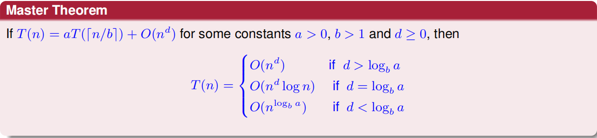


#### 更快的乘法

Suppose x and y are two n-integers, and assume for convenience that n is a power of 2. (不足则补零)

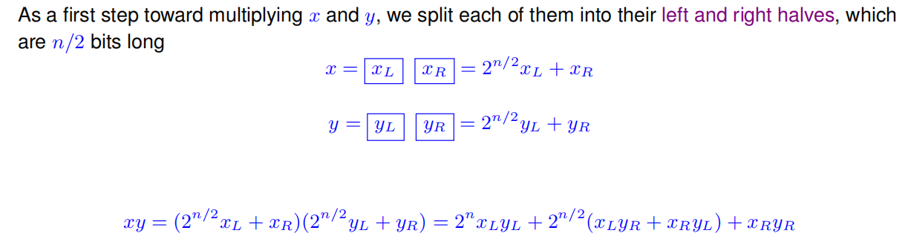

2^n只要左移n次即可

递推式：T(n) = 4T(n/2) + O(n)

高斯的技巧：(a + bi)(c + di) = ac − bd + (bc + ad)i； bc + ad = (a + b)(c + d) − ac − bd 只用三次乘法。

用来计算($x_Ly_R+x_Ry_L$)之后：T(n) = 3T(n/2) + O(n)

复杂度求和：$O(n)  [1 + \frac{3}{2} + ... + (\frac{3}{2})^k] = O(3^{log_2{n}}) = O(n^{log_2{3}})$ , 其中k = log n

（可以把分出去的子问题想象成一棵树，每层相加）


#### 归并排序


T(n) = 2T(n/2) + O(n)， 复杂度O(nlog n)


#### 第k小的值（k-selection）

全部排序得到结果：复杂度O(nlog n)。

分治：选择v进行快速排序，将数据分为三部分


如果每次减少一半，T(n)=T(n/2)+O(n)，复杂度O(n)

如果只减少一个，T(n)=T(n−1)+O(n)，O(n^2)

v is good if it lies within the 25th to 75th percentile of the array that it is chosen from. 

有50%概率选到好的v，至少需要选两次（几何分布期望E(X) = 1/p）

选到好的v之后至少减少1/4长度（因为25th to 75th）

T(n) ≤ T(3n/4) + O(n) = O(n) 


#### 计算逆序数

Similarity metric: number of inversions between two rankings.

• My rank: 1, 2, . . . , n.

• Your rank: a1，a2 , . . . , an.

• Songs i and j are inverted if i < j, but ai > aj .


问题：如何combine？：排序，分别排好之后就清楚，在B中的每个元素，有多少比它大的数在A中。


T(n) = 2 · T(n/2) + Θ(n)


### 贪心（greedy）

局部最优以求全局最优（尽量）


#### 最小生成树（MST）

（详见 “特殊算法” - “图的算法” ）


#### 集合覆盖（Set Cover)


例：建学校可以覆盖一定距离范围内的城镇，求最少的学校数量。

贪心算法：不断重复，选取包含未被覆盖元素的最大集合Si。

**Lemma** Suppose B contains n elements and that the optimal cover consists of OPT sets. Then the greedy algorithm will use at most ln n · OPT sets.

**Proof.**

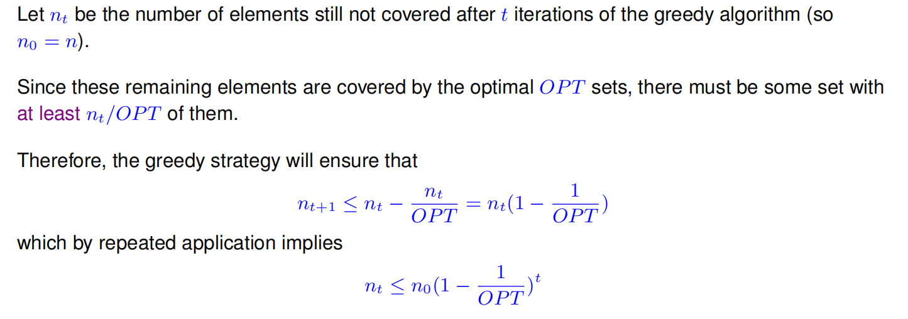


当t = ln n · OPT时，nt严格小于1，也就没有未被覆盖的元素了。


### 动态规划（dynamic programming）

思想：定义一组子问题，先解决最小的问题，用小问题的答案来支持大问题的求解，依次解决所有的小问题，直到解决所有的问题。

为什么不用递归？分治法：问题规模一次减小一半，DP：问题规模一次只减小一点点

需要考虑的问题：子问题是什么？边界条件（表格中最先填进去的值）？出口（最终的大问题在哪里）？


#### 最长递增子序列（**Longest Increasing Subsequences**）

input: a sequence of numbers  a1, . . . , an

子序列：从中挑出数字，先后顺序不变。

类比DAG的路径问题：从小数指向大数是有向边，实际就是在找形成的DAG的最长路径。


如果没有边(i, j)，那就是L(j) = 1 + 0 = 1

复杂度$O(n^2)$，DAG最多n(n-1)/2条边。


#### 编辑距离 (edit distance)

拼写检查一旦遇到一个可能拼错了的词，就要找到与它最相近的词

两个string的距离：在多大程度上相互对齐（有不同的对齐方式）

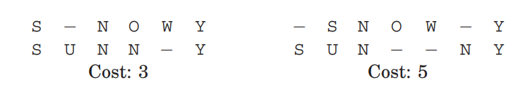

编辑距离：最小的对齐的cost（字母不同的行数）

字符串x[1, . . . , m] and y[1, . . . , n]，子问题：for 1 ≤ i ≤ m and 1 ≤ j ≤ n， E(i, j): 前缀x[1, . . . , i] and y[1, . . . , j] 的编辑距离。

**E(i, j) = min{1 + E(i − 1, j), 1 + E(i, j − 1), diff(i, j) + E(i − 1, j − 1)}**

对应的三种情况：

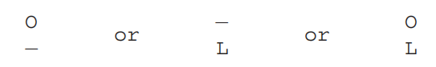

填表求解，复杂度O(mn)

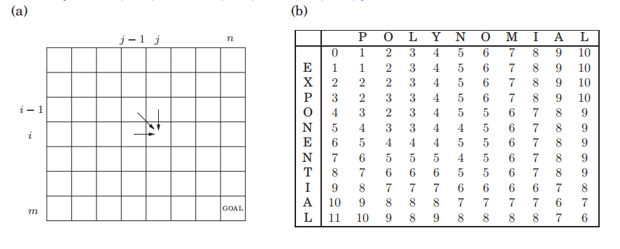

节省空间？其实只保留正在工作的两行即可。


#### 背包问题 (knapsack)

背包容量为W，有n个物品，重量wi，价值vi，最大化价值。

**类型1：无限物品 (Knapsack with Repetition)**


用一维表即可，复杂度O(nW)

**类型2：每样物品只有一个 (Knapsack without Repetition)**


|           | 0    | 1    | 2        | 3    | 4    | 5              |
| --------- | ---- | ---- | -------- | ---- | ---- | -------------- |
| 0         |      |      |          |      |      |                |
| {1}       |      |      |          |      |      |                |
| {1,2}     |      |      | use this |      |      | or this        |
| {1,2,3}   |      |      |          |      |      | to decide this |
| {1,2,3,4} |      |      |          |      |      |                |


#### 最长相同子序列(**Longest Common Subsequence**)

与编辑距离相比，求最短变成求最长

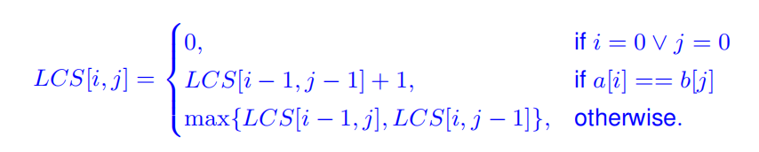

如果是最长相同子串（中间不能断开）呢？otherwise（i,j不相同）这一项直接为0。


#### 链式矩阵相乘

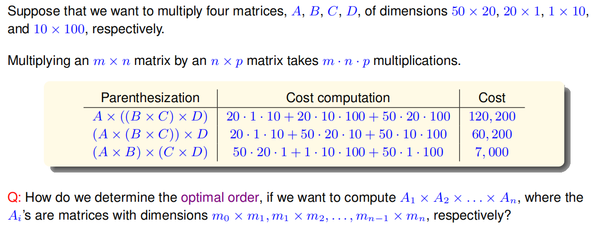

分析：相乘顺序可以表示成二叉树：

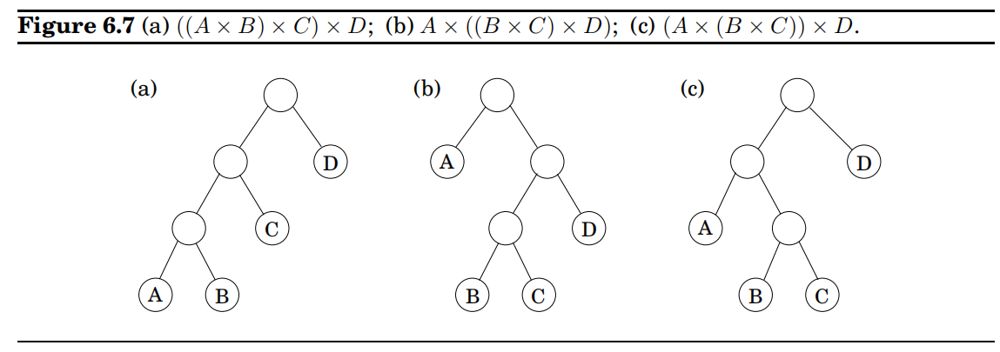

如果一个树是最优的，那么它的子树也是最优的。

子树对应的子问题:


构造二维表格，每个格计算时间O(n)，总共用时$O(n^3)$


#### 更复杂的最短路径问题

**最短可靠路径**

图G从s到t最短路径，但是最多用k条边。

子问题：dist(v,i) 从s到t使用i条边的最短路径

**所有顶点间的最短路径**

使用Bellman-Ford算法|V|次，$O(V^2 E)$

接下来介绍Floyd-Warshall算法：$O(V^3)$

思想：u和v之间的最短路径通常要用到一些“中间节点”，可以一开始不允许使用任何中间节点，然后逐渐扩展可用的中间节点的集合。每增加一个新的中间节点，就更新所有的最短路径。如果第k轮的时候，u到v之间出现新的最短路径，那这个新的最短路径一定是经过第k个点的，否则在k轮之前这个路径就应该被发现。

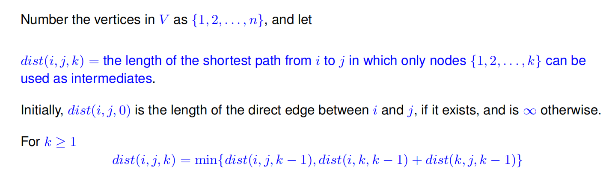

节点k不是在第k轮才加入的吗？怎么dist(i,k,k-1)在之前就被求出来了？答：0 \~k-1是可用的中间节点的范围，两端节点还是可以在0 \~ k-1范围以外的。每次更新，i和j的范围都是从0到n。

**旅行商问题（TSP）**

图上节点1~n是城市，旅行商人从1出发，把每个城市都恰好经过一遍，最后回到1，路径要最短。（任意两个城市之间的距离已知）

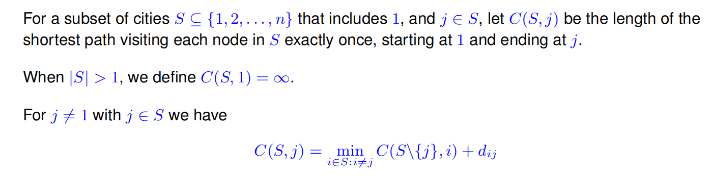

$2^nn$个子问题，每个子问题为O(n)。总共$O(2^nn^2)$【说明DP并不都能降到多项式时间】


#### 树中的独立集

A subset of nodes S ⊆ V is an independent set of graph G = (V, E) if there are no edges between them.

找最大独立集比较难，但是如果是在树上就可以利用DP。

自底向上求解整棵树。对于节点u，如果独立集包含u，那么必不能包含其儿子（否则有边相连），但是可以包含其孙子。如果独立集不含u则可能包含其儿子。


### 线性规划（linear programming）

求解优化任务，任务的特点是约束条件和优化准则都可以表示为线性函数。

给定一个变量集合，使其满足一组线性方程or不等式，使目标线性函数值最大or最小。


#### 利润问题

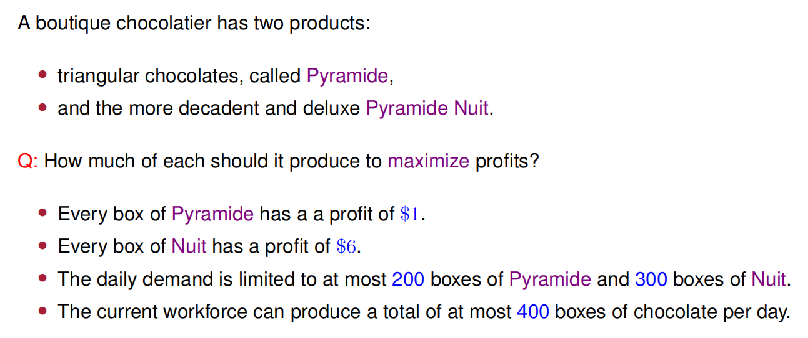

LP Formulation以及可行域：


<figure class="half">
    
    
</figure>

没有最优解：不可行或者无界。

求解：使用单纯形法。

有时候解决实际问题要求解是整数，可能要四舍五入，仍有一定差距。于是有整数线性规划问题，它没有多项式时间算法。


#### LP的标准型

标准型：所有的变量非负，采用等式约束条件，都以目标函数最小化为目标

求最大值变最小值：乘-1即可。

等式约束条件：松弛变量s：x ≤ 200 → x + s = 200, s ≥ 0

所有变量非负：对不确定符号的x，引入两个非负变量$x^+, x^-$，用$x^+ - x^-$代替x。


#### 对偶（duality)

还是上面的利润问题：

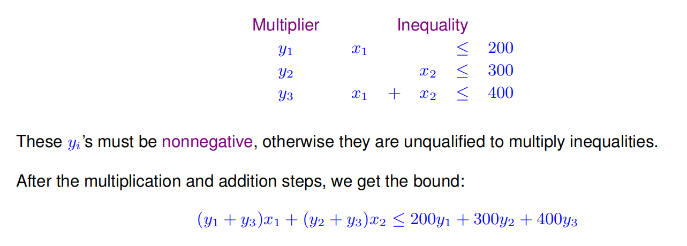

我们希望不等式左边能凑出objective function x1 + 6x2，然后希望右边尽可能小：

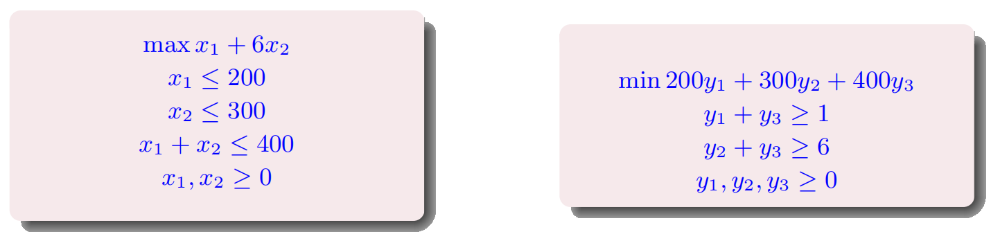


**Theorem (Duality)** If a linear program has a bounded optimum, then so does its dual, and the two optimum values coincide（一致）.

互补松弛条件 (**Complementary Slackness**)：如果一个变量在原始问题中的最优解中为非零，则对应的对偶问题中的约束条件的松弛变量为零，反之亦然。

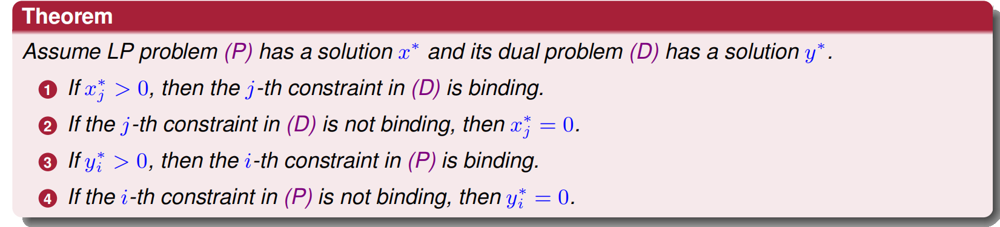

binding: 不等号取等号


#### 最短路径的LP形式

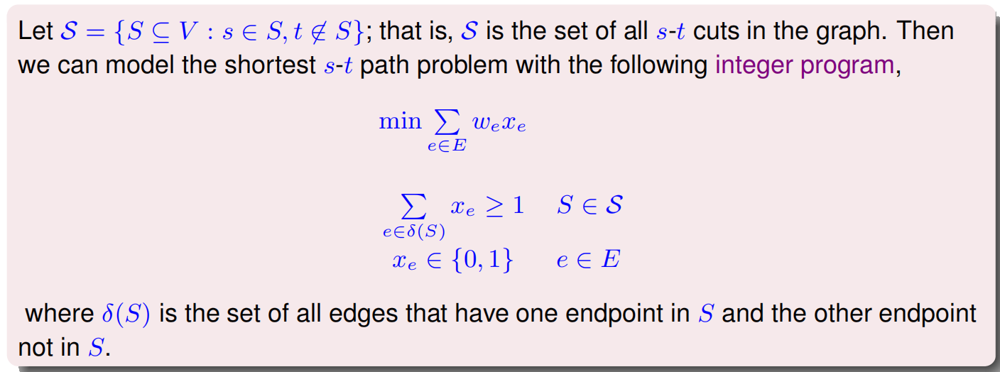


#### 集合覆盖（Set Cover）的LP形式


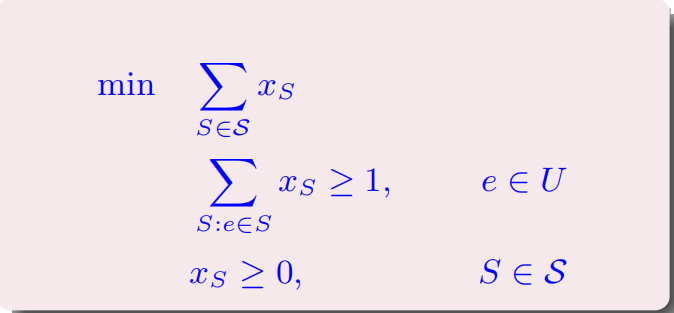

$x_s$表示集合s是否被选中。第一个不等式表示e至少要在选出来的一个s中。

例：U={e1,e2,e3,e4,e5}，s1={e1,e2,e3}，s2={es,e4,e5}，s3={e1,e5}

则对于e1来说，$x_{s_1}+x_{s_3}≥ 1$，也就是s1和s3至少有一个要被选中，才能覆盖到e1。

如果要求每个元素至少被覆盖r次，第一个不等式≥r即可。


#### 单纯形法 (simplex method)

对于约束不等式的一个子集，如果有唯一的点满足对应的所有等式，且该点是可行的，那就是一个顶点。

let v be any vertex of the feasible region, while there is a neighbor v ’ of v with better objective value: set v = v ’ （从一个顶点开始，不断寻找更优的邻居直至没有更优的邻居）

如果解空间是N维的，如何定义邻居？：N个平面（不等式）确定一个顶点，N个不等式中有N-1个相同就是邻居。有些顶点可能有大于N个平面，因为实际是多个顶点合在一起（如果多个顶点合在一起，应该采用退化，为bi引入某个随机的微小改变）。


现在假如LP问题是一般形式的最大值问题。

**Task 1 in the Origin** The origin is optimal if and only if all ci ≤ 0.

**Task 2 in the Origin** We release the tight constraint xi ≥ 0 and increase xi until some other inequality, previously loose, now becomes tight. We have exactly n tight inequalities, so we are at a new vertex.

以上task在原点上很容易，如果不在原点（origin）则可以坐标变换移动到原点：

如果定义u的n个不等式中的一个为ai · x ≤ bi，那么对应的yi = bi − ai · x。根据这些将x表示为y的函数，代回到原问题。于是得到修改后的LP问题，在这个问题中yi ≥ 0, 并且u是这个y-空间的原点。

example：

1. 首先x1= x2 = 0，放松x2使其增加，它会首先触碰到红色不等式的边界范围。将y1 = x1, y2 = 3 + x1- x2代入得到右边的新形式。

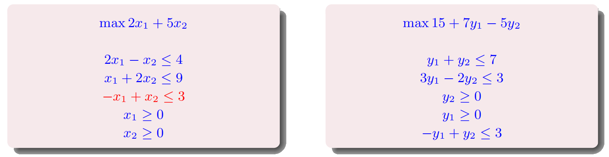

1. 现在还可以增大y1（y2在目标函数中系数已经为负），于是重复1，右边的形式所有ci都为负，此时原点处就是optimal

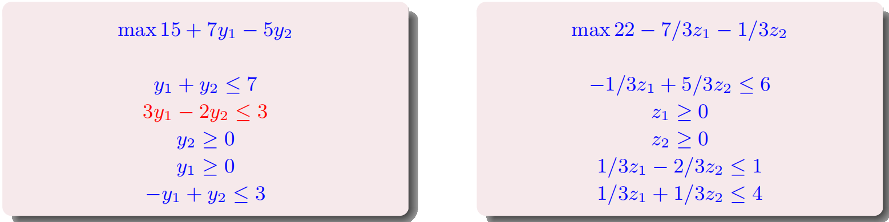

但是单纯形法之所以可以从原点开始，是因为不等式右侧都是正数，如果不是该如何寻找起始顶点？好在寻找起始顶点的问题也可以被规约为LP并求解。

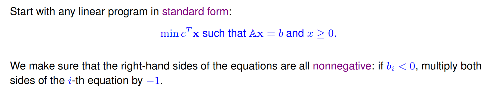

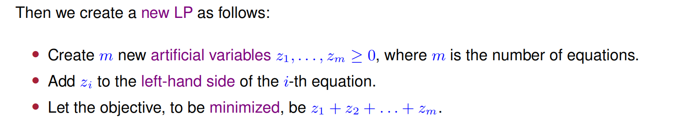

example:

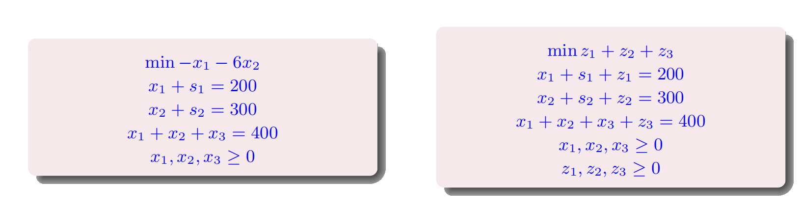

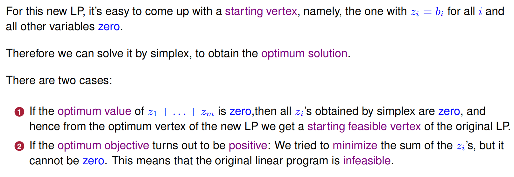

LP如果是无界的：在探索邻居时会发现新的线性方程组有无穷多的解。


## **特殊算法**

### 数字的算法

进制不同不影响复杂度（换底公式），数字N的size就是O(log N)

#### 各种操作的复杂度

n bits, n = log N

- addition: $O(n)$ 【最多进一位】
- multiplication: $O(n^2)$ 【相当于(n - 1)个加法】
- times 2: $O(1)$【左移1位】
- division (modular): $O(n^2)$
- Modular add:  $O(n)$  【结果大于N则减N】
- M mul:  $O(n^2)$【结果除以N】 
- M exp:  $O(n^3)$ 【最多n次循环调用（每次将指数除以2），每次一个乘法】 
- M gcd:  $O(n^3)$【Euclid算法，2n次循环调用，每次一个mod】
- M inv:  $O(n^3)$【扩展Euclid算法】 
- M div:  $O(n^3)$【$b/a\mod N = b  a^{-1}$】


#### 乘法的算法

**Multiplication by Al Khwarizmi**

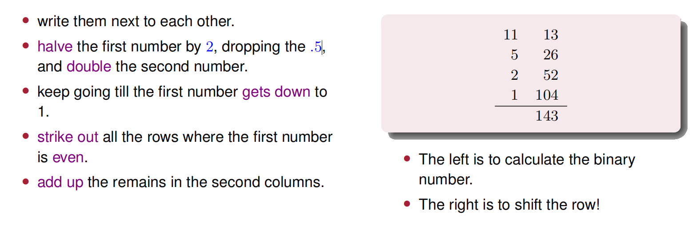

正确性？—— 左边是偶数，相当于下图算式中全是0的这一行


#### 模的规则

x = qN + r with 0 ≤ r < N， r = x modulo N

x ≡ y  mod N  ⇔   (x − y) = cN

b除以a，商为整数，且余数为零， 我们就说“a整除b”或“b能被a整除”，即a|b

**rules**

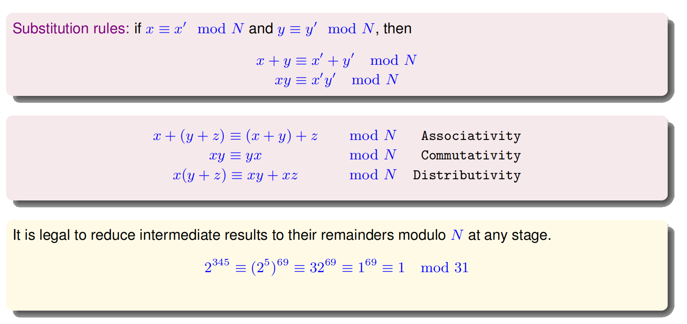


#### **模的指数运算: x^y mod N**

如果只是每次乘x，对于500位的y来说至少要乘2^500次，太多了。

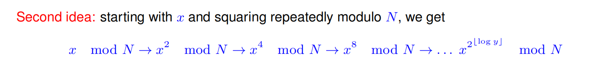


#### 最大公因数（**Greatest Common Divisor**）：gcd(x, y)

**Euclid’s rule**: If x and y are positive integers with x ≥ y, then gcd(x, y) = gcd(x ( mod y), y).

**Proof.** gcd(x, y) = gcd(x − y, y)，重复减即可

```
EUCLID(x, y)
// Two integers x and y with x ≥ y;
if y = 0 then return x;
return(EUCLID(y, x mod y));
```

**Lemma** If a ≥ b ≥ 0, then a mod b < a/2

**Proof.** 

- if b ≤ a/2, a mod b < b ≤ a/2;
- if b > a/2, a mod b = a − b < a/2

这意味着在任何连续的两轮之后，两个参数x y的值至少减半，也就是每个的长度至少减少1位。2n次循环调用。

**An Extension of Euclid’s Algorithm**

**Lemma** If d divides both x and y , and d = ax + by for some integers a and b , then necessarily d = gcd(x, y)

**Proof.** 显然d ≤ gcd(x, y)。gcd(x, y) 能整除 x and y, 一定也能整除 ax + by = d. 则d ≥ gcd(x, y)

证明d = gcd(a, b)，即找到两个x y使d = ax + by（a b 必一正一负）


#### 模倒数

We say x is the multiplicative inverse（乘法逆元） of a mod N, if ax ≡ 1 mod N

至多有一个这样的x，记为$a^{-1}$。逆元不一定存在。

**Lemma** If gcd(a, N) > 1（a n不互素）, then ax /≡ 1 mod N（逆元不存在）.

**Proof.** 

ax mod N = ax + kN,  gcd(a, N) 整除 ax mod N。所以当gcd(a, N) > 1时，将有ax /≡ 1 mod N。

If gcd(a, N) = 1, then extended Euclid algorithm gives us integers x and y such that ax + Ny = 1, which means ax ≡ 1 mod N.

求a mod N的逆元：看 gcd(a, N) = 1，找ax + Ny = 1, 于是ax ≡ 1 mod N


#### 素数与素性测试

费马小定理：If p is a prime, then for every 1 ≤ a < p, a^{p −1} ≡ 1 (mod p)

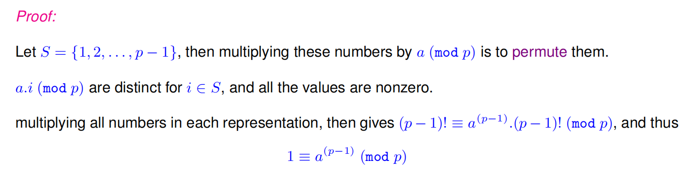

permute（重新排列）：i不同，a \ i mod p将各不相同且非零。否则a  i = a  j mod p 即 i = j mod p。

费马小定理并非充要条件。只能希望对于合数N，大部分a无法通过测试。

**Carmichael Number**：对所有与N互素的a都能通过测试。比较罕见。

**Non-Carmichael Number**：只要有一个a不通过测试，那么至少有一半的a < N都通不过测试。

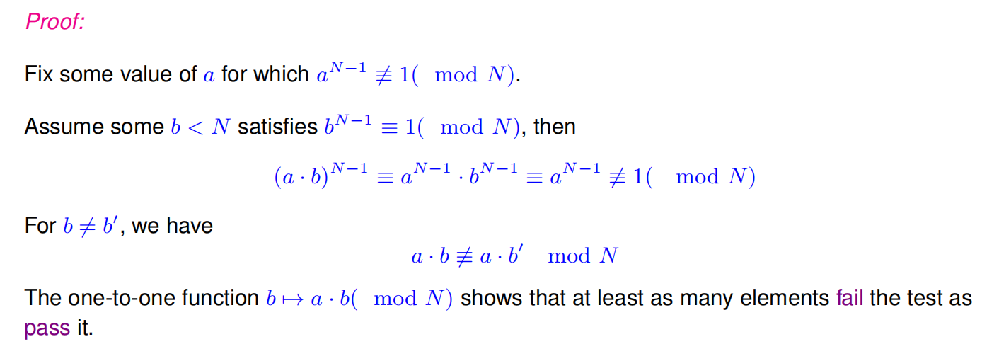

以下算法假阳性的概率小于$1/2^k$


素数的随机生成：


x个数里有x/ln(x)个素数，则n位数是素数的概率为 1/log x = 1/n。

每次挑选一个数验证是否素数，每次有1/n可能停下，平均需要O(n)轮次。M exp复杂度  $O(n^3)$ ，整体就是 $O(n^4)$。


### 图的算法

#### 图的DFS与连通性


被explore到的是“树边”，否则是“回边”（图中虚线）

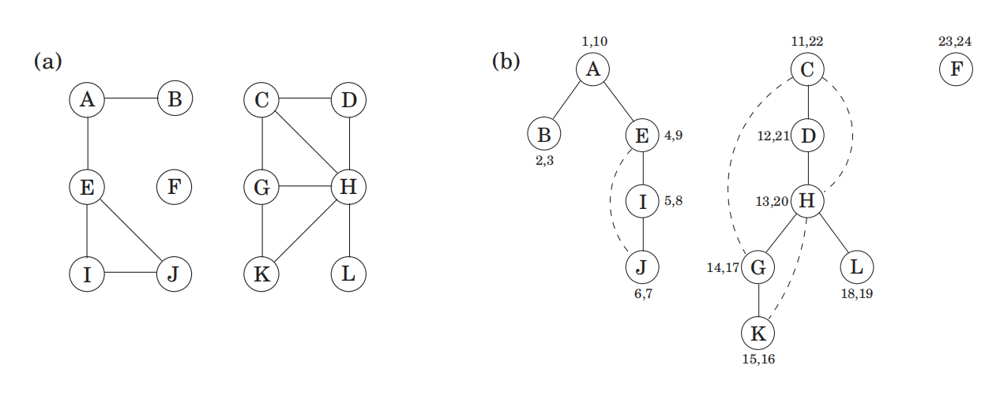

An undirected graph is **connected**, if there is a path between any pair of vertices.

A **connected component** is a subgraph that is internally connected but has no edges to the remaining vertices.

DFS外部循环的explore过程每从一个顶点开始，就能确定一个包含该顶点的连通部件。可以划分出连通部件

引入计时机制（在上图也有体现）。

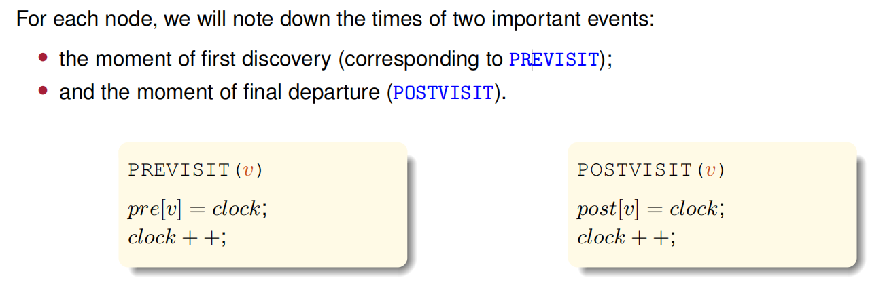


For any nodes u and v , the two intervals [pre(u), post(u)] and [pre(v), post(v)] are either disjoint（分离） or one is contained within the other（一个包含另一个）。原因：实际就是顶点在堆栈中的时间段，先进后出。

与无向图不同，有向图除了树边，还分前向边、回边和横跨边。

- Tree edges are actually part of the DFS forest.
- Forward edges lead from a node to a nonchild descendant（后裔） in the DFS tree. （当然是nonchild，如果是child的话那就是树边）
- Back edges lead to an ancestor（祖先） in the DFS tree.
- Cross edges lead to neither descendant nor ancestor.（就是从一个顶点指向已经被完全访问过、进行过postvisit的顶点的边）

<figure class="half">
    
    
</figure>

（上面右图的 [ 和 ] 分别代表previsit和postvisit）

**DAG：有向无环图**

A **cycle** in a directed graph is a circular path v0 → v1 → v2 → . . . vk → v0

**Lemma.** A directed graph has a cycle if and only if its depth-first search reveals（探测到） a back edge.

**Proof.** 

- 充分性：(u,v)是回边，则存在包含该边以及从v到u路径的环
- 必要性：如果含有环 v0 → v1 → v2 → . . . vk → v0，假设最先被访问的点为vi，环上其他顶点均为vi在搜索树中的后裔。边v_{i-1}→vi即为回边。

DAG没有回边。

**Lemma.** In a DAG, every edge leads to a vertex with a lower post number.

DAG可以被拓扑排序，即可以通过顶点的post值降序进行线性化。

**Lemma.** Every DAG has at least one source and at least one sink.

源点：post值最大，入度为0。汇点反之。


#### 强连通部件

Two nodes u and v of a directed graph are connected if there is a path from u to v and a path from v to u.

This relation partitions V into disjoint sets（分离的集） that we call strongly connected components (SCC).

**Lemma** Every directed graph is a DAG of its SCC.

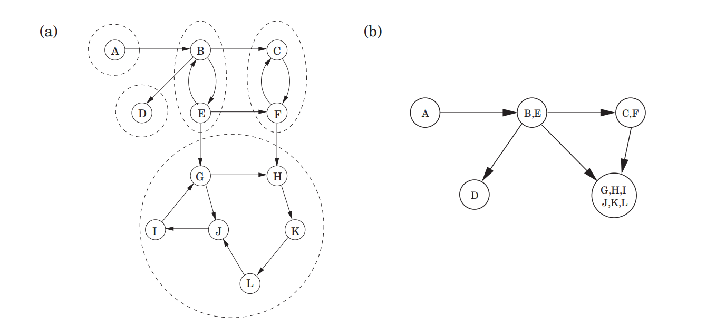


**Lemma** If the EXPLORE subroutine start at node u, then it will terminate precisely when all nodes reachable from u have been visited.

意味着如果在汇点强连通部件中的某个顶点调用explore，将恰好得到这个SCC。

**Lemma** If the EXPLORE subroutine at node u, then it will terminate precisely when all nodes reachable from u have been visited.

**Lemma** If C and C ′ are SCC, and there is an edge from a node in C to a node in C ′ , then the highest post number in C is bigger than the highest post number in C ′ .

那么这些SCC也能根据它们各自的最小post num进行线性化的排序。

图G的反转图$G^R $，在G上的sink在$G^R$上是source。

综上，输出所有SCC的办法：

1. 在$G^R$上DFS，找到post值最大的顶点u
2. 在G上对u进行DFS，得到一个汇点SCC，将其删除


#### 最短路径

The distance between two nodes is the length of the shortest path between them.

每条边没有权值，求从一个点出发求它到剩下所有点的距离：使用BFS（第1批被访问的是距离为1，以此类推）

有边长or权值：Dijkstra算法（高级数据结构笔记讲过，不赘述）

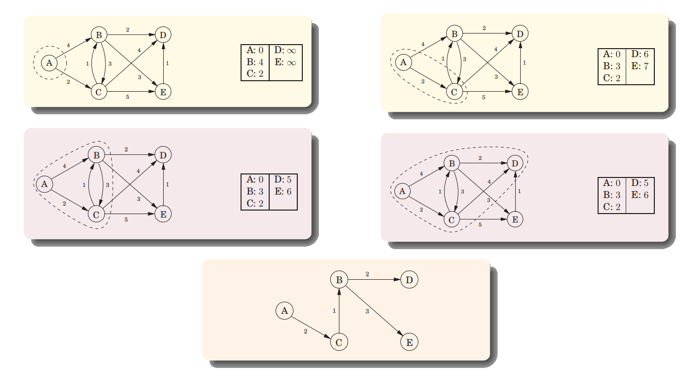

最短路径的局部也是最短路径

正确性证明：S is the set of vertex with the dist being set. 证每次向S中添加点时都有x.d == dist[x]，x.d表示s到x的真实的最短距离，dist[d]表示x在dist数组中的对应值。

**Proof.** 对源点肯定成立。假设第k次加入的结点仍为最短路径，第k+1次加入u。设u为第一个不满足x.d == dist[x]的点，设u的最短路径为s-> ... -> y -> ... -> u，y为该路径上不在S中的第一个点。dist[y] = y.d ≤ u.d＜dist[u]，而u加入时有dist[u] ≤ dist[y]，矛盾。

算法复杂度：|V| deletemin and |V | + |E| insert/decreasekey operations，具体视优先队列的实现而定。

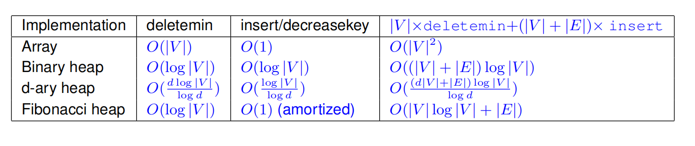

Dijkstra算法中边的权值不能为负：不会因为负边的出现而更新已经计算过(收录过)的顶点的路径长度，可能有某些顶点最终计算出的路径长度不是最短的长度。

**Bellman-Ford Algorithm**

```
UPDATE ((u, v) ∈ E)
dist(v) = min{dist(v), dist(u) + l(u, v)};
```


最短路径最多有 |V| − 1 条边，所以更新 |V| − 1次即可。

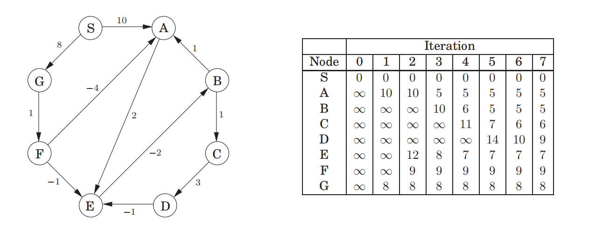

如果有负环也不行。可以在|V| − 1次次更新之后再更新一次，检查是否不变了。

DAG天生没有负环，按照拓扑排序的顺序进行update。


不难发现这其中蕴含着动态规划的思想：$dist(v) = \min_{(u,v)∈E} {\{dist(u) + l(u, v)\}}$

Even can find longest paths in a DAG by the same algorithm: just negate all edge lengths.


#### 最小生成树（MST）


**Lemma (1)** Removing a cycle edge cannot disconnect a graph.

**Lemma (2)** A tree on n nodes has n − 1 edges

**Proof.** 从一个空图开始，一次构建一个边。每个节点都与其他节点不连接，各自是一个连通部件。当添加边时，这些组件合并。由于每条边都结合了两个不同的组件，所以当树完全形成时，恰好增加了n - 1条边。当一条特定的边（u, v）出现时，我们可以确定u和v位于独立的连接分量中，否则它们之间就已经存在一条路径，这条边就会创建出一个环。

**Lemma (3)** Any connected, undirected graph G = (V, E) with |E| = |V| − 1 is a tree.

**Proof.** 它是(2)的逆命题，我们只需要证明G是无环的。当图包含一个环时，从这个环中删除一条边，直到得到无环的图G‘，G’ = (V, E‘)， 由(1)，G’也是连通的。因此G‘是一棵树。根据(2)，|E'| = |V| − 1，所以E' = E，实际没有边被移除，G一开始就是无环的。

**Lemma (4)** An undirected graph is a tree if and only if there is a unique path between any pair of nodes.

**Proof.**  如果多于1条则有环。

利用贪心的思想解决MST：

**Kruskal’s MST algorithm** starts with the empty graph and then selects edges from E according to the following rule:  Repeatedly add the next lightest edge that doesn’t produce a cycle.

其正确性来自于分割性质：

**Lemma** Suppose edges X are part of a MST of G = (V, E). Pick any subset of nodes S for which X does not cross between S and V \S, and let e be the lightest edge across this partition. Then X ∪ {e} is part of some MST.

**Proof.** （懒得翻译了）

> Edges X are part of some MST T; if the new edge e also happens to be part of T, then there is nothing to prove.
>
> So assume e is not in T. We will construct a different MST T ’ containing X ∪ {e} by altering T slightly, changing just one of its edges.
>
> Add edge e to T. Since T is connected, it already has a path between the endpoints of e, so adding e creates a cycle.
>
> This cycle must also have some other edge e’ across the cut (S, V \S). If we now remove e, T ’ = T ∪ {e}\ {e'}, which we will show to be a tree.
>
> T ' is connected by Lemma (1), since e ’ is a cycle edge. And it has the same number of edges as T ; so by Lemma (2) and Lemma (3), it is also a tree.
>
> Since weight(T ’ ) = weight(T) + w(e) − w(e’ ). Both e and e’ cross between S and V \ S, and e is the lightest edge of this type. Therefore w(e) ≤ w(e’ ), and weight(T ') ≤ weight(T)
>
> Since T is an MST, it must be the case that weight(T’) = weight(T) and that T ’ is also an MST.

分割性质表明，任何遵循以下模式的算法都是有效的：


**Prim算法**中，X总是构成一个子树。每一步迭代，这个子树会生长一条边，即选择S中的顶点与S外的顶点之间的最轻边加入X。


### 网络流的算法

#### 最大流问题

输油网络，每个管道有最大容量，输送过程中油无法被储存。目标是从源点到汇点输送尽可能多的石油。

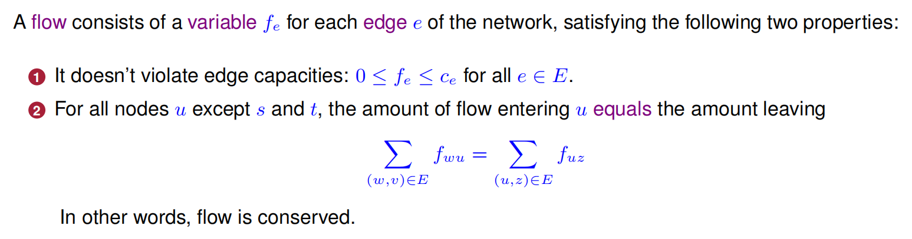


转化为LP问题。

另一种形式：s到t之间增加一条容量为∞的边，最大化这条边的flow


对这个LP采用单纯形法，实际就是不断选择从s到t的一条可能路径，然后尽可能增大它的流量。

允许两条路径的flow相互抵消（相减），也就是可以撤销路径上的某些流。


（第二种情况下最多增加流量为f，最多就是撤销路径上的全部流）

剩余网络的定义：

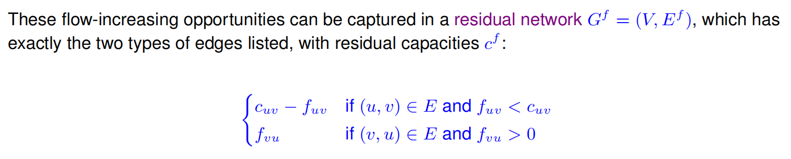

example（左边为当前的流，右边为剩余网络，粗线为选择的路径）：

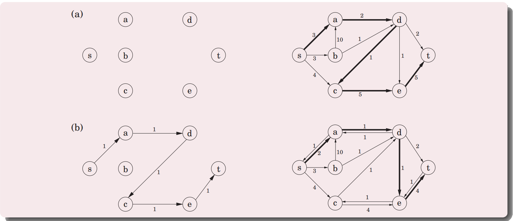

（直到最后没有s到t的路径为止）

如何证明这个流是最优的？：从流到割

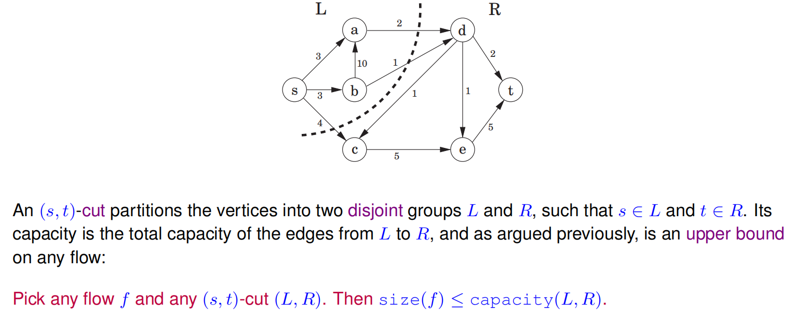

**Theorem (Max-flow min-cut)** The size of the maximum flow in a network equals the capacity of the smallest (s, t)-cut.

Proof.

> Suppose f is the final flow when the algorithm terminates.
>
> We know that node t is no longer reachable from s in the residual network  $G^f$.
>
> Let L be the nodes that are reachable from s in $G^f$ , and let R = V \ L be the rest of the nodes.
>
> We claim that size(f) = capacity(L, R).
>
> To see this, observe that by the way L is defined, any edge going from L to R must be at full capacity (in the current flow f), and any edge from R to L must have zero flow.
>
> Therefore the net flow across (L, R) is exactly the capacity of the cut.

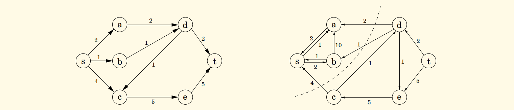

LP的对偶的解释：

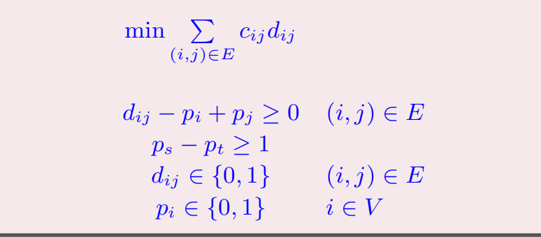

剩余网络中，源点s可达的pi都为1，s不可达（t可达）的pi都为0。如果dij = 0代表pi = pj。

**算法复杂度**：寻找路径的时间是O(E)。但是迭代次数是CE，C是所有容量的上限，因为可能经常出现两个流相互抵消的情况！

如果采用BFS，寻找到最少边的路径，那么迭代次数就是VE。总用时$O(VE^2)$

如果在每个节点上都有可能消耗/产出石油？构造一个S和T，所有的产出都与S相连，所有的消耗都与T相连。最后检查是否每个点都满足输入 - 输出=消耗/产出


#### 二部图的匹配

男孩和女孩有边相连表示彼此喜欢，找到一个配对使得配对双方都互相喜欢。

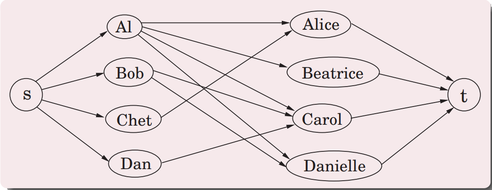

转换为最大流问题，每条边容量为1，存在完美匹配的条件是存在一个规模与最终配对数相等的最大流。


## **NP问题**

### 搜索问题

- 判定问题. Does there exist an assignment to satisfy the formula in CNF? 回答yes or no
- 优化问题. given an instance of TSP, find the minimum cost tour.
- 搜索问题. Find an assignment to satisfy the formula.

A **search problem** is specified by an algorithm C that takes two inputs, an instance I and a proposed solution S, and runs in time polynomial in |I|. We say S is a solution to I if and only if C(I, S) = true.

S必须足够简明且在多项式时间内可验证。

三类问题互相转化不改变复杂度。

然而，有些问题目前最快算法都还是指数时间的，和穷举相比没有本质改善。

搜索问题的例子：

1. **可满足性问题（SAT）**：给定一个采取合取范式的布尔公式，为其找到一个可满足的赋值或者判定该赋值不存在。

   每个子句都是多个文字的析取，可满足赋值：每个子句都取值为true。

   2-SAT是多项式时间可解的：如果实例I有n个变量和m个子句，构造图，2n个节点（变量及其否定），2m条边，对于每个子句A or B，加入从not A到B的边和从not B到A的边。如果图中有强连通分量同时包含x和x的否定，则I不可满足。

   3-SAT及以上则是指数时间才能求解的。

2. **TSP问题（但是限定了最高预算b）**：限定预算是为了方便检验解，指数时间。

3. **Euler Path**：Given a graph, find a path that contains **each edge exactly once**. 

   只要图是连通的并且除了起点终点之外所有点的度数为偶数即可，多项式时间！

4. **Rudrata Cycle**：Given a graph, find a cycle that visits **each vertex exactly once**.

   与TSP类似，指数时间。

5. **Minimum Cut**：given a graph and a budget b, find a cut with at most b edges.

   令每条边容量为1，求一个确定节点与其他所有节点的最大流，最小的流对应最小分割。多项式时间。

6. **Balanced Cut（平衡分割）**：Given a graph with n vertices and a budget b, partition the vertices into two sets S and T such that |S|, |T| ≥ n/3 and such that there are at most b edges between S and T. 指数时间。

7. **3D Matching**：There are n boys, n girls, and n pets. The compatibilities are specified by a set of triples, each containing a boy, a girl, and a pet. 与二部图匹配相似，但是指数时间。

8. **Independent Set**：Given a graph and an integer g, find g vertices, no two of which have an edge between them. 指数时间。

9. **Vertex Cover（顶点覆盖）**：Given a graph and an integer b, find b vertices cover (touch) every edge. 不存在多项式时间的精确算法（但是可以像集合覆盖一样，贪心算法近似）

   顶点覆盖是集合覆盖的特例：对每个顶点i定义子集Si，使Si包含与i相连的所有边。要覆盖的集合就是边集E。

10. **Cligue（团问题）**: Given a graph and an integer g, find g vertices such that all possible edges between them are present（即这些顶点之间两两都存在相同的边）.

11. **最长路径问题**：只能枚举解决

12. **背包问题**：Seek a set of items whose total weight is at most W and whose total value is at least g. O(nW)，由于是W而不是logW，因此也是指数时间。除非在一进制（unary）下，数字大小和数位大小是一样的。

13. **subset sum（子集和）**: Find a subset of a given set of integers that adds up to exactly W. 指数时间。

14. **图同构问题**


### NP, co-NP, NPC及其他

#### P, NP

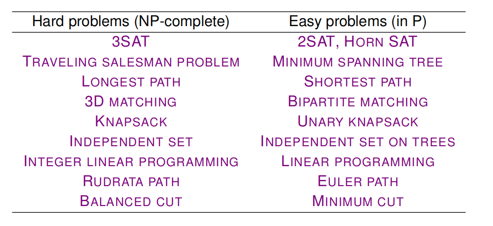

**NP**：任何可能解的正确性都能在多项式时间内检验。

P：能在多项式时间内求解。

NP包含P，但一般认为P≠NP。

#### co-P, co-NP

问题A回答yes，它的**补问题**回答no。

A class of problems C is **closed under complementation**（在补问题下封闭） if for any problem in C, its complement is also in C.

P is closed under complementation. P = co-P

NP is not closed under complementation! 验证回答yes，原问题回答yes，验证回答no不代表原问题回答no！NP ≠ co-NP

#### NPC

A NP problem is **NP-complete** if all other NP problems reduce to it.

If even one NP-complete problem is in P, then P = NP.

#### 其他

**co-NPC**:


**NPI**：属于NP但是不属于P和NPC。图同构、因数分解、判断质数可能都是这类问题。

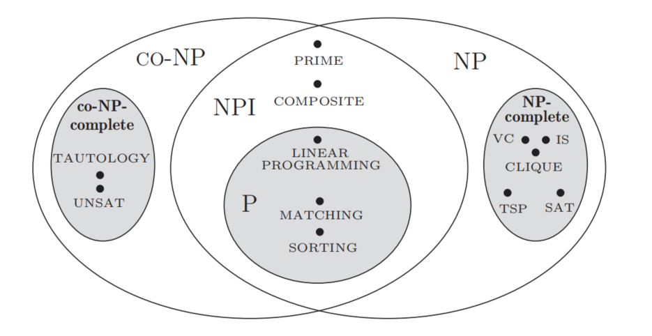


### 规约（reduction）

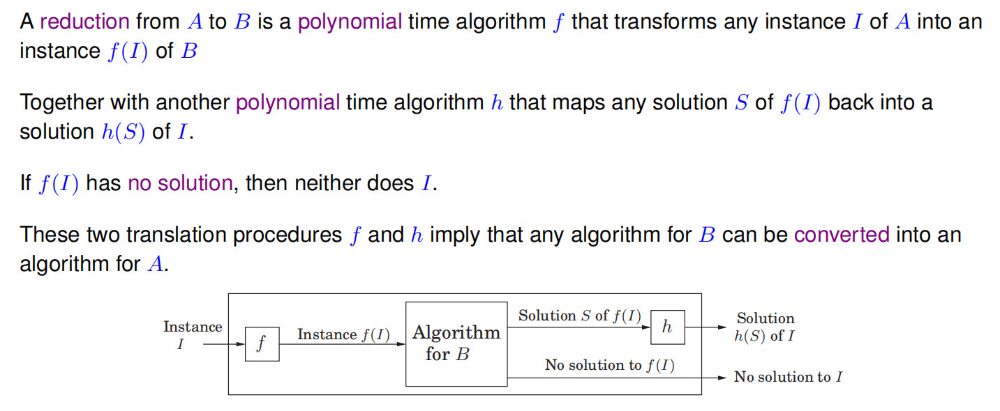

规约的用途：

1. solve. 从未知问题归约到已知问题
2. proof. 从已知问题归约到未知问题。A→B，如果A很难（没有多项式时间算法），那么B也很难。

**证明B是NPC问题：首先说明B是NP问题，然后将一个NPC问题A归约到B**。

以下这些问题都是NPC问题。

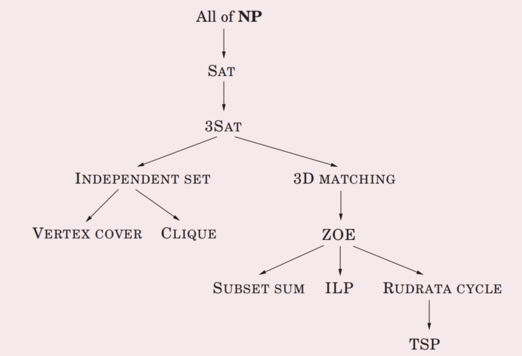


#### Rudrata Path → Rudrata Cycle

Rudrata Path：求一条从s到t的恰好经过每个顶点一次的路径。


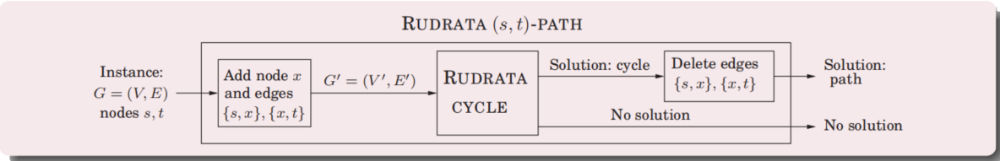


#### 3SAT → Independent Set

子句构成三角形，相反的文字之间添加边

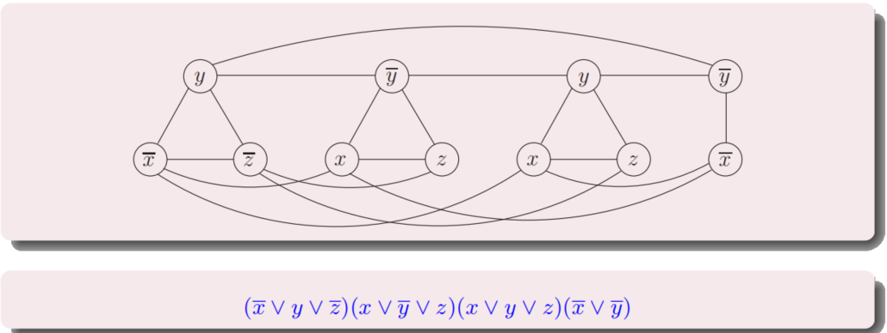


#### SAT → 3SAT

a1~ak至少有一个为真，否则y1必须为真，进而y2为真，y3为真...直至最后一个子句不满足。

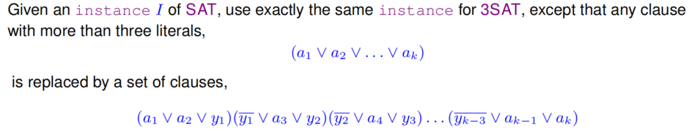

如果我要求3SAT中所有变量出现不超过三次？x出现k次就分裂为x1~xk。

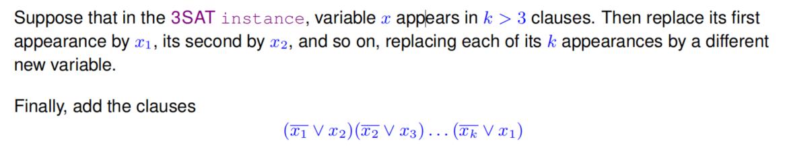

这样以来x1~xk必须同时为true，就相当于一个变量x。


#### Independent Set → Vertex Cover

S是G的顶点覆盖 当且仅当 V-S是G的一个独立集。

(如果V-S不是独立集，那么V-S顶点有边相连，那么S并没有覆盖完所有的边)

找大小为g的独立集 等价于 找大小为|V|- g的顶点覆盖。


#### Independent Set → Cligue

G的补集$\overline{G} = (V, \overline{E})$，其中$ \overline{E}$是所有不属于E的无序结点对。

G中的独立集就是G补集中的团。


#### Rudrata Cycle → TSP

如果城市u,v之间有边，则距离为1，否则距离为1+a，a≥1。TSP的预算等于节点数V即可。

为什么需要设置一个a？因为TSP对任意两个城市都有距离，但是现在的图上不一定任意两点之间都有边。


### 近似算法

为了多项式时间处理NPC需要的代价：

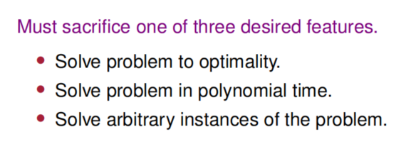

近似算法：牺牲准确性。

在优化问题中，对于实例I，OPT(I)即最优解，A(I)为算法A得到的解。算法A的逼近比例为：

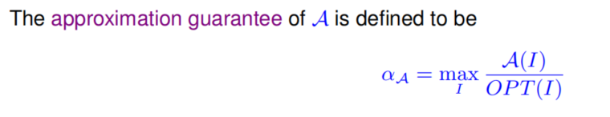

逼近比例体现了最坏情况下结果偏离最优解的程度。

例如set cover的逼近比例就是ln n。

问题在于，不知道OPT是多少，如何知道逼近比例？


#### vertex cover

匹配：没有共同端点的边组成的集合。

没有更多的边可以加入时，达到极大匹配。

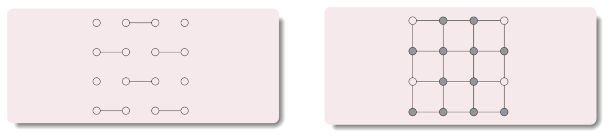

极大匹配M有M条边，2M个顶点，但是M ≤ OPT（因为匹配中的每条边必然有一个端点属于某个顶点覆盖）

逼近比例为2                        

#### 聚类（**Clustering**）

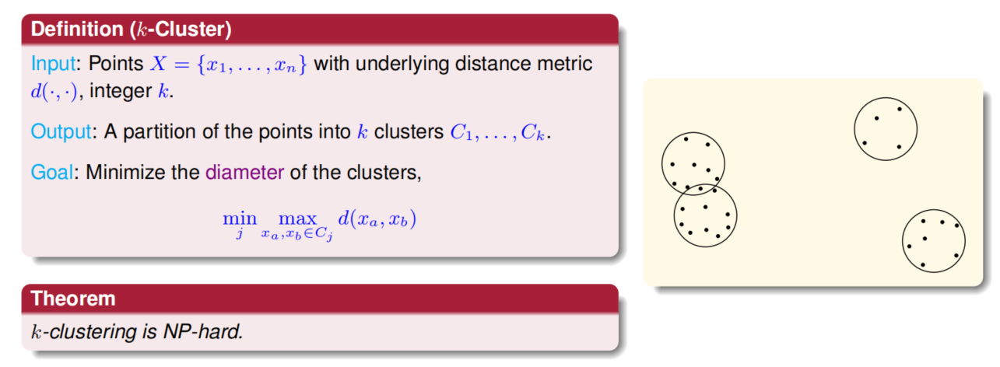

通俗来说，就是用k个大小相等的圆将空间中这n个点完全覆盖，这些圆的最小直径是多少。

贪心算法：选择k个中心点，每次选择的下一个中心点离现有的中心点最远。

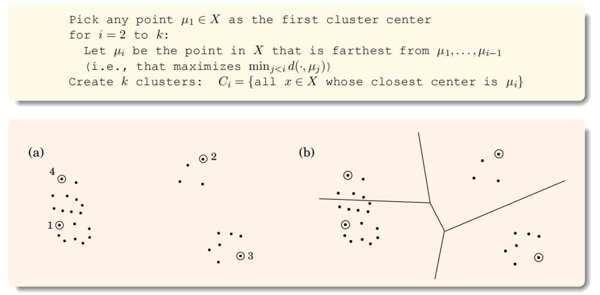

三角不等式也就是三角形的性质：d(x, y) ≤ d(x, z) + d(z, y)

解释1：如下图

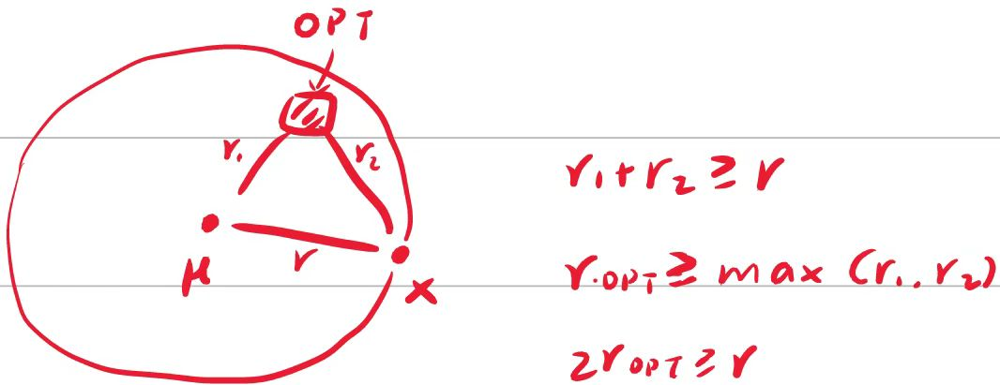


解释2：

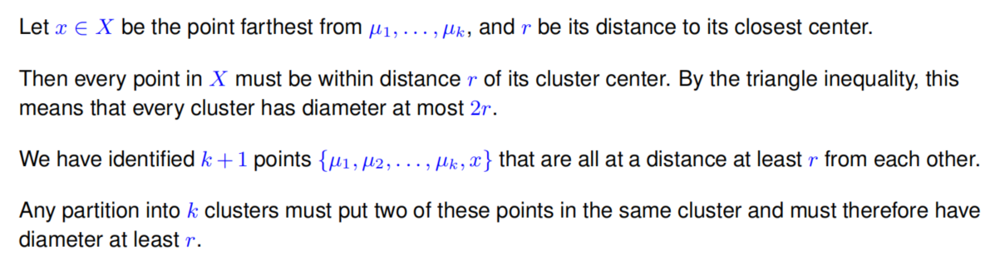

（k+1个中心点放入k个聚类，至少有两个中心点被放到同一个聚类。又知道中心点互相之间距离至少为r，那么OPT直径至少为r）


#### TSP（但是在几何意义上成立的）

之前TSP城市距离是随便定的，但是现在要求任意三个城市距离符合三角不等式（在几何上，真的能构成一个三角形）

TSP的环路删掉一条边就变成路径：TSP cost ≥ cost of this path ≥ MST cost

现在要从MST中构建一条商人旅行路线：

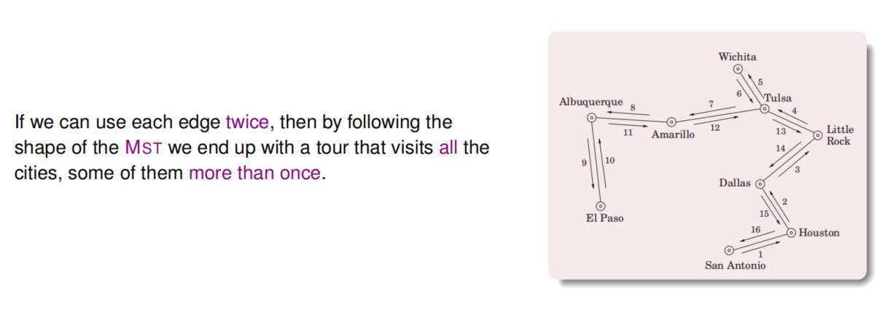

存在的问题是有些城市被访问不止一次，在“走投无路”时直接跳到某一个没访问过的城市即可，就不按照原来的MST走了。

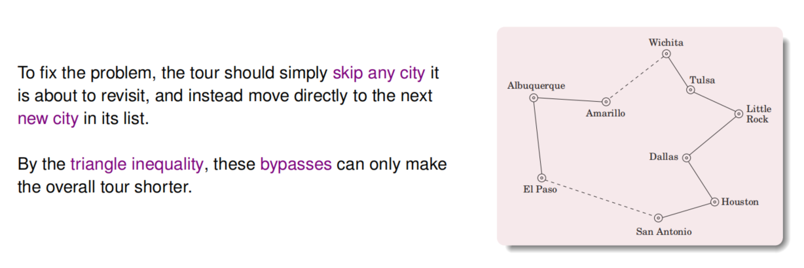

现在OPT cost ≥ MST cost，然后算法TSP cost ≤ 2  MST cost，因此逼近比例为2。

有没有更好的算法？找到所有奇数度的点（肯定总共有偶数个），找到这些点的最小Matching加入到MST中，比double MST要好。


#### 背包问题

要么O(nW)，要么O(nV)，V是物品价值的总和。W和V可能都很大。

如果把绝对价值转变为相对价值（有一点损失）：

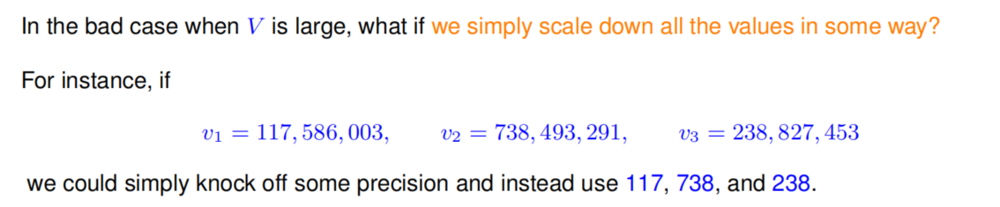

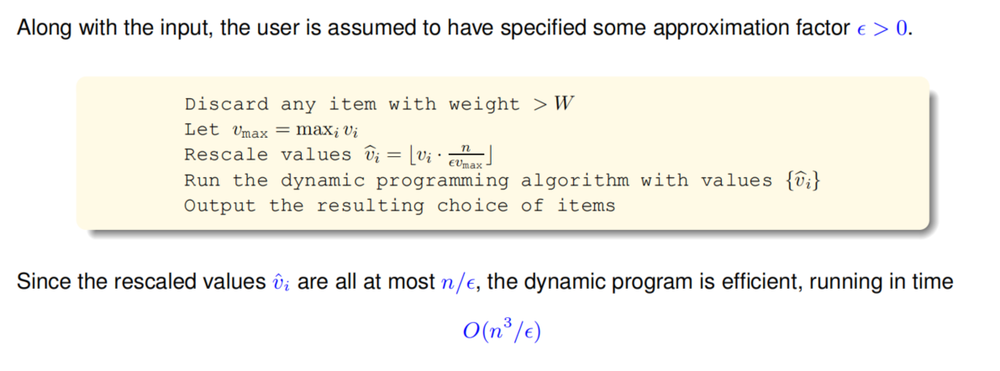

以下推导中有四样东西：没有收缩（shrunken）的最优值总和（K），收缩之后的最优值总和（第一个式子最左边），没有收缩的算法结果的值总和（第二个式子最左边），收缩之后的算法结果的值总和。利用的关系是：收缩之后的算法结果的值总和 ≥ 收缩之后的最优值总和。然后将没有收缩的与收缩的相联系，得到没有收缩情况下的关系。

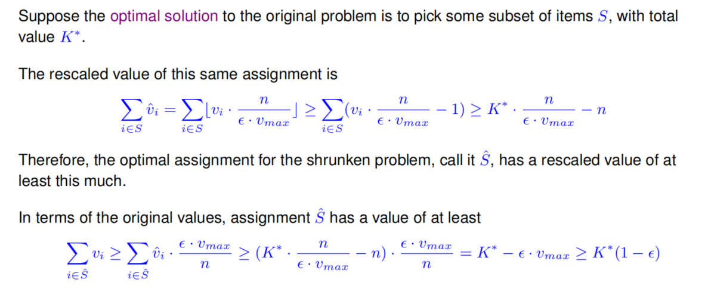

A ≥ (1 - ε) OPT，可以任意接近OPT！

## **考试题型**

M1. Show modelling ability, proof ability, and algorithm analysis ability (20’)

- given an problem, try to model it formally.

- proof the correctness of a simple algorithm.

- give an analysis to a piece of Pseudo codes.

- given a linear programming, figure out its duality, and find out the optimization solution. 【Required】

  

M2. Adopt algorithmic strategies to solve and analyze problems (greedy, D&C, DP, etc.) (30’)

- divide and conquer (Master Theorem)
- dynamic programming (design, border conditions, complexity) 【Required】
- greedy
- duality
- reduction

M3. Design algorithms and analysis on numbers, graphs, and flows. (25’)

- DFS, BFS
- Shortest path, MST
- Algorithms on DAG
- Algorithms on numbers (modular)
- Applications of network flows

M4. Prove a NPC problem (15’) 【Required: reduction】

- Prove an NP problem
- Prove an NPC problem

M5. Cope with NPH problem (10’)

- Approximation algorithm 【Required】
- Backtracking
- Local search


