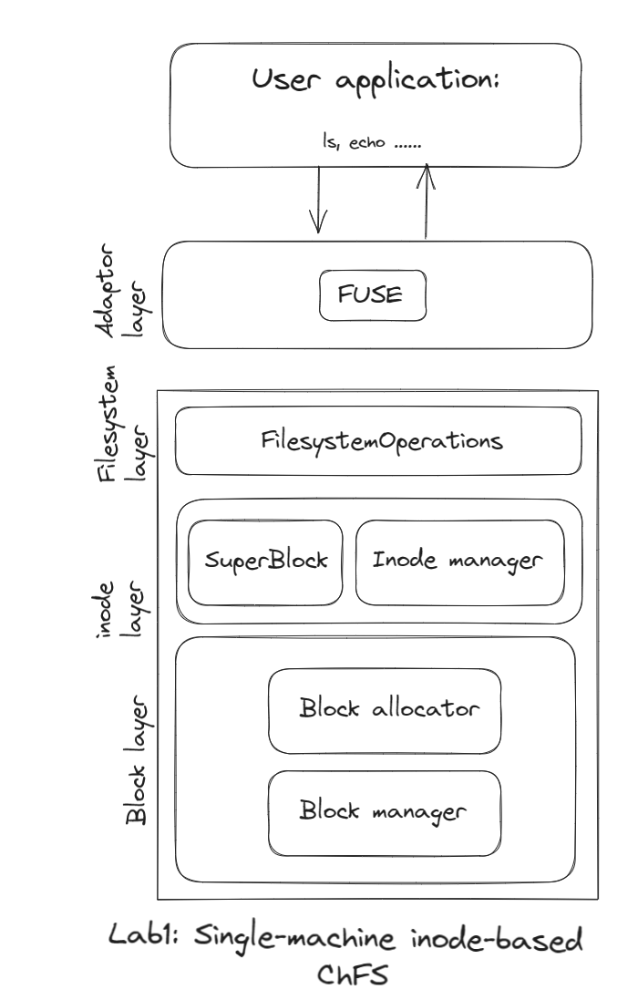
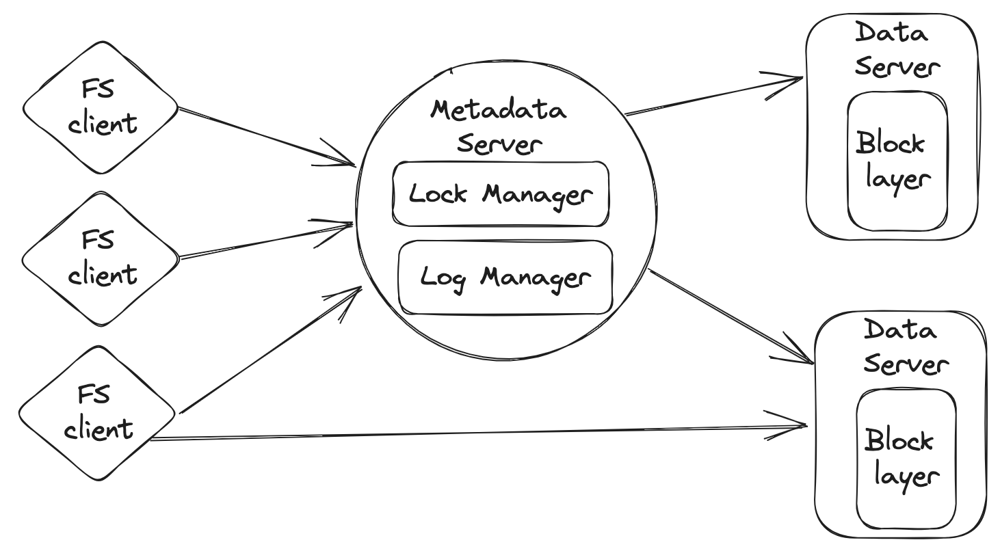
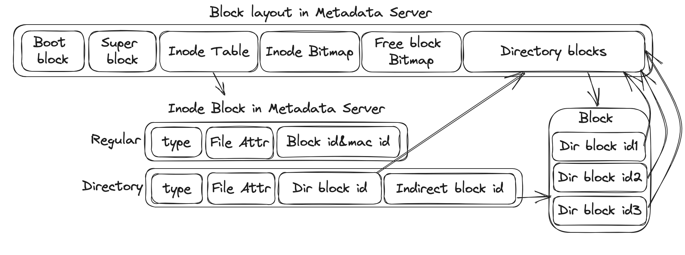

## 前言

### 完整实现

完整实现已上传代码仓库：[wdl339/chfs](https://github.com/wdl339/chfs)。博客内容目前只是简单概览，后续会加入对代码细节的解读。

### 参考资料

非常感谢助教们的及时耐心的答疑，以及我见过最好的作业文档：[CSE | Fall 2024 | Schedule](https://ipads.se.sjtu.edu.cn/courses/cse/)。本博客基本沿用了作业文档的框架，但站在已经完成后的视角而非正在实现的视角，有细微调整。

### 获取源代码

```bash
git clone ...(url) chfs -b final
```

更改目录权限。以下命令用于授予目录`chfs`内所有文件和目录的写入(`w`)权限给其他用户(`o`)，并且递归(`-R`)操作。

```bash
chmod -R o+w chfs
```

在`chfs`目录下，获取git子模块：

```bash
git submodule init
git submodule update
```

### 环境配置

我们使用docker容器来完成所有的实验，并且我们提供了一个包含这些实验所需所有环境的容器镜像，这将简化环境的配置。

- 要获取docker镜像，你有两种选择：

  - 从远程仓库拉取：

  ```bash
  docker pull registry.cn-shenzhen.aliyuncs.com/cse-lab/cse-lab:v1 
  
  docker tag registry.cn-shenzhen.aliyuncs.com/cse-lab/cse-lab:v1 chfs_image
  ```

  - 在本地构建docker镜像。在`chfs`目录内执行以下命令：

  ```bash
  docker build -t chfs_image .
  ```

- 创建一个docker容器。如果你没有删除容器，你只需要创建一次docker容器。在`chfs`目录内执行以下命令。以下命令将`chfs`目录挂载到docker容器，这意味着目录内文件的所有更改都会反映在docker容器内，反之亦然。

```bash
docker create -t -i --privileged --name chfs -v $(pwd):/home/stu/chfs chfs_image bash
```

- 启动docker容器：

```bash
docker start -a -i chfs
```

- 现在就已经在docker容器内，它应该看起来像这样：

```bash
stu@xxxxxxxx:~$
```

- 用户名是`stu`，密码是`000`。
- 可以在容器外编写代码，但必须在容器内编译代码并执行测试脚本。
- 可以在容器内输入`exit`命令或按下`Ctrl+D`来停止容器，然后将返回到宿主机的shell。下次不要忘记启动容器。
- 可以使用vscode并安装`Dev Containers`扩展，以便在docker容器内方便地开发。


## Basic Filesystem

### 概览

#### 架构

这部分内容是实现一个单机（多线程）的基于inode的文件系统。以下是文件系统的架构：



文件系统由三层组成：block 层、inode层和filesystem层。

block 层提供用于分配/释放block以及从block中读取/写入数据的API。

inode层以inode的形式管理block层提供的block。这一层提供了用于分配/释放inode以及从这些inode中读取/写入数据的API。superblock也位于这一层，它记录了文件系统的一些关键信息。

filesystem层提供了一些基本的文件系统API，包括文件操作API和目录操作API。

此外，为了让其他用户应用程序真正使用文件系统，还有一个Adaptor层。它是用户应用程序发出的标准文件系统请求（例如`ls`、`echo`命令）与文件系统对应操作之间的翻译器。

#### 编译

在容器内，进入`chfs`目录，并执行以下命令：

```bash
mkdir build
cd build
cmake ..
make build-tests -j
make fs -j
```

#### 测试

运行单元测试，在`build`目录下执行以下命令：

```bash
make build-tests -j
make test -j
```

集成测试将挂载文件系统，并执行一些真实的文件系统操作，如`ls`、`echo`等。要运行集成测试，首先编译Adaptor层，在`build`目录下执行以下命令：

```bash
make fs -j
```

然后在`scripts/lab1`目录下执行以下命令：

```bash
./integration_test.sh
```

#### Demo

在`chfs`目录下，执行：

```bash
./scripts/lab1/start_fs.sh 
```

脚本返回后，`chfs`目录内会出现一个`mnt`目录。进入`mnt`目录。CHFS文件系统已挂载到此目录，这意味着此目录内的每个文件系统请求都将CHFS来完成。

创建一个新目录：

```bash
mkdir my_dir 
```

在该目录内创建一个新文件：

```bash
touch my_dir/a.txt 
```

检查是否成功创建了文件：

```bash
ls my_dir 
```

向该文件写入内容：

```bash
echo "foo" >> my_dir/a.txt
echo "bar" >> my_dir/a.txt
```

读取文件，看到刚才写入的内容：

```bash
cat my_dir/a.txt 
```

删除文件：

```bash
rm my_dir/a.txt 
```

删除目录：

```bash
rm -rf my_dir 
```

然后你会看到输出：

```bash
rm: cannot remove 'a': Software caused connection abort 
```

这是因为当前这个文件系统不支持删除目录。如果你感兴趣，可以参考`daemons/single_node_fs/main.cc`中的`chfs_rmdir`并实现它。


### Block层

Block层实现了块设备，提供分配/释放block以及从block中读取/写入数据的API。

#### Block Manager

在`src/block/manager.cc`中：

- `write_block`：将一个block写入内部块设备。
- `write_partial_block`：将一个部分block写入块设备，提供block中写入内容的偏移量和长度。
- `zero_block`：清除一个block的内容。
- `read_block`：将block内容读入缓冲区。

#### Block Allocator

Block分配器使用bitmap来管理block的分配和释放。bitmap存储在块设备的某些block中。`src/include/common/bitmap.h`包含了操作bitmap的API。

在`src/block/allocator.cc`中：

- `allocate`：分配一个block，返回其block id。
- `deallocate`：释放一个block。


### Inode层

Inode层以inode的形式管理Block层提供的block。这一层提供了用于分配/释放inode以及从这些inode中读取/写入数据的API。Superblock也位于这一层，它记录了文件系统的一些关键信息。

Inode的结构在`src/include/metadata/inode.h`和`src/metadata/inode.cc`中实现。一个inode的布局正好适合一个block。

Inode管理器假设块设备上的布局如下：

```plaintext
| Super block | Inode Table | Inode allocation bitmap | Block allocation bitmap | Other data blocks |
```

- `Inode Table`是`inode_id`到`block_id`的映射， 这与直接存储inode的类不同。它将有更高的块利用率，代价是查找inode时的一次额外查找。`block_id`是实际存储`Inode`的块。首先读取相应的`Inode Table`块，然后获取`block_id`，然后通过这个`block_id`读取实际的`Inode`结构。
- `Inode allocation bitmap`用于指示每个Inode的使用情况。如果一个inode被占用，bit被设置为1。
- `Block allocation bitmap`用于指示每个Block的使用情况。如果一个block被分配，bit被设置为1。
- `Other data blocks`包含通过`BlockAllocator`分配的其他块。

给定一个inode的id，要了解它在Inode表中的索引（反之亦然），使用的是`src/metadata/manager.cc`中的宏`RAW_2_LOGIC`和`LOGIC_2_RAW`。

在`src/metadata/manager.cc`中：

- `allocate_inode`：分配一个inode并用特定类型初始化它。这个函数接受inode的block id，因为这个函数假设inode所在的块已经分配好了。
- `free_inode`：释放一个inode。
- `get`：获取当前inode所在的块的block id。
- `set_table`：在Inode表中设置一个inode的block id。


### Filesystem层

文件系统层提供了一些基本的文件系统API，包括文件操作API和目录操作API。

#### 文件操作

在`src/filesystem/data_op.cc`中：

- `alloc_inode`：分配一个inode并用给定的类型初始化它。这个函数将为创建的inode分配一个block。这是文件系统层的`create`文件操作。

- `read_file`：读取一个inode的block内容。
- `write_file`：写入一个inode的block。这个函数将在inode内动态分配/释放block。

#### 目录项操作

在`src/filesystem/directory_op.cc`中：

- `parse_directory`：解析目录的内容为条目并存储在列表中。
- `read_directory`：给定目录的inode id，读取其内容并解析为条目。
- `append_to_directory`：给定目录的内容，将一个新的`filename->inode_id`条目追加到内容中。
- `rm_from_directory`：给定目录的内容，通过给定的文件名从内容中移除一个条目。

#### 目录和文件结合

在`src/filesystem/directory_op.cc`中，这些函数操作目录内的文件：

- `lookup`：给定文件名及其父目录的inode id，返回其inode id。
- `mk_helper`：创建目录或文件在其父目录内的辅助函数。
- `unlink`：给定文件/目录的名称，从其父目录中移除它并释放其block。


### Adaptor层

Adaptor层作为用户应用程序发出的标准文件系统请求（例如`ls`、`echo`命令）与文件系统对应操作之间的翻译器。它将拦截这些请求并将它们传递到文件系统实现中的适当函数。这个适配器层确保文件系统无缝集成到现有的操作系统基础设施中，允许应用程序与文件和目录交互，就像与其他任何文件系统一样。

CHFS使用FUSE（Filesystem in Userspace）提供的[libfuse用户空间库](http://libfuse.github.io/doxygen/index.html)来实现Adaptor层。在`daemons/single_node_fs/main.cc`中一些重要的函数（顾名思义即可）：

- `chfs_open`

- `chfs_getattr`
- `chfs_readdir`
- `chfs_read`
- `chfs_mknod`
- `chfs_mkdir`
- `chfs_unlink`
- `chfs_write`
- `chfs_setattr`
- `chfs_lookup`


## Distributed FileSystem

### 概览

#### 架构

基于单机文件系统实现一个分布式文件系统。整体架构如下所示：



这个文件系统由三个部分组成：filesystem client、metadata server和data server。

一个文件被分割成一个或多个块，这些块存储在一组data server上。文件系统负责处理来自filesystem client的读写请求，以及来自metadata server的块创建和删除指令。

metadata server是一个维护所有文件系统元数据的服务器。它存储文件的inode和其他元数据，例如每个块的位置（机器ID）以及该机器上的`block_id`。此外，它还负责处理文件创建、删除以及查询读写数据块位置等元数据操作。CHFS只有一个metadata server（没有备份）。

filesystem client通过向metadata server和data server发出RPC来实现文件系统逻辑。

#### 环境配置

Demo和集成测试与之前略有不同，要使用`docker compose`来设置环境。

要启动环境，在`scripts/lab2`目录下执行以下命令：

```bash
# 拉取cse-lab2-base镜像
docker pull registry.cn-shenzhen.aliyuncs.com/cse-lab/cse-lab2-base
# 重命名镜像
docker tag registry.cn-shenzhen.aliyuncs.com/cse-lab/cse-lab2-base cse-lab2-base
# 设置环境
docker compose up
```

完成后，所有容器将启动并初始化。可以使用`docker ps`检查容器的状态。然后**打开另一个shell**并执行以下命令进入挂载文件系统的容器：

```bash
docker exec -it lab2-fs_client-1 bash
```

挂载点在`lab2-fs_client-1`容器中的`/tmp/mnt`目录。文件系统已挂载到此目录，这意味着此目录内的每个文件系统请求都将由你实现的文件系统来完成。

Demo流程与单机类似。

#### 测试

测试包括三个部分：

1. 单元测试
2. 压力测试
3. 集成测试

首先，在`build`目录下执行以下命令编译代码：

```bash
cmake ..
make -j
make build-tests -j
```

对于单元测试，在`build`目录下执行以下命令：

```bash
make test -j
```

对于压力测试，在`build`目录下执行以下命令：

```bash
make run_concurrent_stress_test
```

对于集成测试，在`lab2-fs_client-1`容器中的`scripts/lab2`目录下执行以下命令：

```bash
./integration_test.sh
```

**注意1**：如果主机操作系统是Windows，在运行集成测试之前，可能需要在`scripts`目录下执行以下命令：

```bash
./crlf2lf.sh
```

此脚本将把`scripts`目录下的所有脚本从CRLF转换为LF，以便在Linux上运行。

**注意2**：运行集成测试后，无论结果是通过还是失败，都需要执行以下命令：

```bash
docker rm -f lab2-fs_client-1 lab2-data-1 lab2-meta-1
```

此命令将删除`docker compose up`创建的所有容器。 下次运行集成测试时，你需要再次执行`docker compose up`，以便文件系统从空状态开始测试。


### RPC

这些组件通过使用RPC（Remote Procedure Call，远程过程调用）相互通信。**假设RPC不会失败。**

LibRPC是chfs中的RPC模块。它遵循服务器-客户端模式。服务器设置函数处理程序并接收客户端发送的请求。

#### 服务器

相关代码：`src/include/librpc/server.h`和`src/librpc/server.cc`

RPC服务器维护一个函数绑定的注册表，用于分发RPC调用。它在给定的地址和端口上监听，以建立连接和接收请求。

#### 客户端

相关代码：`src/include/librpc/client.h`和`src/librpc/client.cc`

RPC客户端连接到特定的RPC服务器。它可以调用RPC服务器上的RPC处理程序。 

基本上，RPC客户端支持两种调用方式：同步或异步。在同步方式中，客户端将等待请求完成。RPC调用的返回值是`RpcResponse`，可以将其视为一个字节列表。需要调用函数将其转换为你想要的内容。示例如下：

```cpp
auto cli = std::make_shared<RpcClient>("127.0.0.1", port, true);
auto add_res = cli->call("add", 2, 3);
int res = add_res.unwrap()->as<int>();
```

在异步方式中，客户端将立即返回。它返回一个`std::future`，以便稍后获取结果。示例如下：

```cpp
auto cli = std::make_shared<RpcClient>("127.0.0.1", port, true);
auto add_future = cli->async_call("add", 2, 3).unwrap();
int res = add_future->get().as<int>();
```


### Distributed filesystem

#### Data Server

在`src/distributed/dataserver.cc`中：

- `read_data`：从块设备中读取块中的一段数据，提供块的偏移量和长度。
- `write_data`：将部分块写入块设备，提供块中写入内容的偏移量和长度。
- `alloc_block`：创建一个空块。
- `free_block`：清除一个块的内容。

与单机的区别是，它们是远程调用。

#### Metadata Server

Metadata Server的块布局：



对于目录inode，它保存其所有直接和间接块ID，类似于单机。对于文件inode，它保存其所有块的映射（机器id和机器上的block id）。

在`src/distributed/metadata_server.cc`和`src/distributed/dataserver.cc`中（大多数函数的实现与单机几乎相同）：

- `mknode`：用给定的类型、名称和父目录创建一个inode。
- `unlink`：从其父目录中删除一个文件。
- `lookup`：尝试通过其名称和父目录搜索一个inode。
- `allocate_block`：为文件分配一个块，以便客户端可以将数据写入该块。
- `free_block`：在Data Server上释放文件的一个块，并在Metadata Server上删除其记录。
- `readdir`：读取目录的内容。
- `get_block_map`：返回inode的块映射。它包含每个块的块ID和机器ID。对于每个块，此函数还将返回其版本号。
- `get_type_attr`：获取inode的类型和属性。

#### Filesystem Client

在`src/distributed/client.cc`中：

- `mknode`：用给定的类型、名称和父目录创建一个inode。
- `unlink`：从其父目录中删除一个文件。
- `lookup`：尝试通过其名称和父目录搜索一个inode。
- `readdir`：读取目录的内容。
- `get_type_attr`：获取inode的类型和属性。
- `read_file`：读取文件的内容。
- `write_file`：写入文件的内容。
- `free_file_block`：释放文件的一个块，并在Metadata Server上删除其记录。

类似于GFS，如果客户端想要读写一个文件，它应该首先从Metadata Server获取块映射（属于该文件的块的块ID）。然后它可以直接向Data Server上的相应块发送读写请求。如果客户端想要写入一个空文件，它应该首先调用Metadata Server在Data Server上分配一个块。

由于这种分离设计，一个棘手的情况是可能会出现before-or-after原子性问题。如果一个客户端首先获取文件A的映射，另一个客户端删除文件A，最后第三个客户端根据文件A的旧映射创建一个新文件，第一个客户端可能会读取错误的数据。因此需要实现一个版本机制来检测这种竞争条件。具体来说，每个块都有一个版本号，该版本号与Data Server上的块一起存储，如下所示。基于版本，Metadata Server还将存储属于文件的块的版本。这些版本将作为映射的一部分返回给客户端。

如果一个块不再属于一个文件，我们将在Data Server上首先增加块的版本。基于这个方案，我们可以通过让Data Server拒绝版本不匹配的块读写请求来检测上述竞争。


为了实现上述方法，需要完善以下函数的实现：

- `DataServer::DataServer`：在构造函数中添加任何你想要持久化块版本到磁盘的内容。
- `DataServer::read_data`：检查版本是否有效。
- `DataServer::alloc_block`：分配一个块并更新其版本。
- `DataServer::free_block`：释放块并更新其版本。
- `MetadataServer::get_block_map`：也将块的版本返回给客户端。
- `MetadataServer::allocate_block`：也记录块的版本。


### 支持并发

为了应对多个线程并发处理客户端的RPC的情况，在系统中添加全局锁（2PL还是有点难了呜呜），以保持以下这些元数据操作的Before-or-After原子性。

- `mknode`
- `unlink`
- `allocate_block`
- `free_block`


### 故障恢复

使用重做日志来确保文件系统元数据操作的all-or-nothing原子性。有以下假设：

- 通过调用`BlockManager::write_block`写入磁盘的数据不会立即持久化到磁盘。这些更改会保留在页面缓存中，直到它们被刷新到磁盘。有两个接口用于将数据刷新到磁盘：`BlockManager::sync`和`BlockManager::flush`。前者将特定块刷新到磁盘，后者将页面缓存刷新到磁盘。这些调用返回后，数据才会持久化到磁盘。
- 向块写入数据是原子性的。也就是说，如果你向块写入数据，数据将被完全写入或根本不写入。

#### 日志管理器

为了简化，只在日志中记录更新的块值。例如，如果创建了一个文件，它将至少更新3个块，因此日志将包含3个新块。

首先，修改`BlockManager`以支持在磁盘上存储日志，在磁盘上保留1024个块用于持久化日志。并且每一次调用`write_block`，都会同时写下日志，将日志刷新到磁盘。

然后，在`src/distributed/commit_log.cc`中：

- `alloc_txn`：开启一个新的事务。
- `recover`：从磁盘读取块值的变化，并重做操作以实现全有或全无的原子性。

只确保以下两个函数的原子性：

- `MetadataServer::mknode`
- `MetadataServer::rmnode`

你可以参考`test/distributed/commit_log_test.cc`中这些测试的详细实现，以帮助你调试。

#### checkpoint

存储日志可能会占用大量磁盘空间，需要实现检查点以减少日志大小。在`src/distributed/commit_log.cc`中：

- `commit_log`：标记一个事务为完成。
- `checkpoint`：将所有完成的事务的修改写入磁盘，并丢弃它们的日志。
- `get_log_entry_num`：返回磁盘中的日志条目数量。


## Raft

### 介绍

**Raft** 是一种用于复制日志的共识算法。Raft将共识问题分解为相对独立的子问题，这些子问题更容易理解。 Raft中的关键数据结构是**log**，它将客户端的请求组织成一个序列。 Raft保证所有服务器将以相同的顺序应用相同的日志命令，这意味着服务器都将处于一致的状态。 如果服务器失败但后来恢复，Raft会负责将其日志更新到最新状态。 只要至少有大多数服务器处于活动状态并且连接，Raft就可以工作。

Raft通过首先在服务器之间选举一个领导者来实现共识，然后赋予领导者管理和管理日志的权限和责任。领导者接受客户端的日志条目（log entry），在其他服务器上复制它们，并告诉服务器何时可以安全地将日志条目应用到它们的状态机上。日志应该持久化，以容忍机器崩溃。随着日志的增长，Raft将通过快照（snapshot）来压缩日志。

Raft论文的[完整版本](https://raft.github.io/raft.pdf)。论文中的图2和图13可以涵盖本项目中的大部分设计。


### 代码概览

相关代码主要集中在`src/include/rsm/raft/node.h`, `src/include/rsm/raft/log.h`, `src/include/rsm/raft/protocol.h`。

有以下几个重要的C++类。

#### ChfsCommand

`src/include/rsm/state_machine.h`中的`ChfsCommand`类与状态机相关。当状态机追加或应用日志时，将使用`ChfsCommand`。状态机处理来自日志的相同序列的`ChfsCommand`，因此它们产生相同的输出。`ChfsCommand`提供serialize和deserialize方法。

#### ChfsStateMachine

`src/include/rsm/state_machine.h`中的`ChfsStateMachine`类表示Raft中的复制状态机。

```c++
class ChfsStateMachine {
public:
    virtual ~ChfsStateMachine() {}

    /* 将日志应用到状态机。 */
    virtual void apply_log(ChfsCommand &) = 0;

    /* 生成当前状态的快照。 */
    virtual std::vector<u8> snapshot() = 0;
    
    /* 将快照应用到状态机。 */
    virtual void apply_snapshot(const std::vector<u8> &) = 0;
};
```

#### RaftNode

`src/include/rsm/raft/node.h`中的`RaftNode`类表示一个Raft节点（或Raft服务器）。`RaftNode`是一个带有两个模板参数`StateMachine`和`Command`的类模板，意味着它将共识算法与状态机解耦。

Raft算法是**异步**实现的，这意味着事件（例如领导者选举或日志复制）都应该在后台发生。`RaftNode` 在调用 `RaftNode::start()` 后启动，并将创建4个后台线程。后台线程将在后台定期执行某些操作（例如在 `run_background_ping` 中发送心跳，或在 `run_background_election` 中开始选举），后台线程在每次循环迭代后睡眠一段时间，而不是一直等事件。

除了事件，`RaftNode` 之间的RPC也应该异步发送和处理，使用线程池（`ThreadPool`）来处理异步事件。

在`node.h`中有`RAFT_LOG`和`DEBUG_LOG`宏，将`RaftNode`中的`debug_log_enabled`设为true即可生成日志。

#### RaftLog

用`RaftLog`以持久化Raft日志和元数据。可以使用`ChfsCommand`提供的接口来实现日志持久化。

#### 序列化与反序列化

LibRPC 提供了 `MSGPACK_DEFINE` 来自动在RPC调用中序列化和反序列化自定义数据结构。例：

```c++
typedef struct {
  unsigned long ProtocolID;
  unsigned long RxStatus;
  unsigned long TxFlags;
  unsigned long Timestamp;
  unsigned long ExtraDataIndex;
  RPCLIB_MSGPACK::type::raw_ref DataRef;
  MSGPACK_DEFINE(
    ProtocolID,
    RxStatus,
    TxFlags,
    Timestamp,
    ExtraDataIndex,
    DataRef
  )
} RPC_PASSTHRU_MSG;
```

在使用 `MSGPACK_DEFINE` 之前，需要手动将自定义数据结构中的模板类型转换为基本类型。


### Leader Election & Heartbeat

主要涉及：

1. `protocol.h`中的`RequestVoteArgs`和`RequestVoteReply`类。
2. `node.h`中的：
   - `RaftNode::request_vote`：发起投票
   - `RaftNode::handle_request_vote_reply`：回复投票
   - `RaftNode::run_background_election`：在领导者超时后将节点转换为候选者，并异步发送`request_vote` RPC开始选举。

为了保持领导地位，领导者应该定期向追随者发送心跳（即一个空的`AppendEntries` RPC）。通过实现`AppendEntries` RPC来实现心跳。

1. 在`protocol.h`中的`AppendEntriesArgs`、`AppendEntriesReply`
2. 在`node.h`中的`RaftNode::append_entries`、`RaftNode::handle_append_entries_reply`、`RaftNode::run_background_ping`

**一些注意事项**：

- 为确保不同节点的选举超时不会总是同时发生，每个节点的timeout在一定范围内随机。
- 在所有事件的开头使用`std::unique_lock<std::mutex> lock(mtx);`以避免并发错误。
- 在访问RPC客户端指针之前检查空指针。


### Log Replication

在`node.h`中：

1. `RaftNode::new_command`：将新命令追加到领导者的日志中。
2. 完成与`AppendEntries` RPC相关的方法
3. `RaftNode::run_background_commit`：异步将日志发送给追随者。
4. `RaftNode::run_background_apply`：将提交的日志应用到状态机。

**一些注意事项**：

- 第一个日志索引是1而不是0。为了简化编程，在日志的最开始追加一个空的日志条目。由于`lastApplied`索引从0开始，第一个空的日志条目永远不会被应用到状态机。


### Log Persistency

在`log.h`中实现`RaftLog`类。在`RaftNode`中创建`RaftLog`对象。每个Raft节点将有自己的日志来持久化状态。并且在故障后或者节点被创建时，节点将通过日志恢复。日志存储在`/tmp/raft_log`下。

假设Raft日志的总大小总是小于64K，单个日志条目的大小总是小于4K。不考虑磁盘I/O期间的崩溃。


### Snapshot 

主要涉及：

1. `protocol.h`中的`InstallSnapshotArgs `和`InstallSnapshotReply`类。
2. `RaftNode::install_snapshot`：发送snapshot。
3. `RaftNode::handle_install_snapshot_reply`：接受并应用snapshot。
4. `RaftNode::save_snapshot`：将snapshot应用到日志中。
5. 修改之前实现的所有与日志相关的代码。现在需要使用两个概念来表示日志索引：物理索引（例如`std::vector`的索引）和逻辑索引（物理索引+快照索引）。
6. 在`RaftNode`构造函数中恢复快照。


## Map Reduce

### 概览

基于前面实现的分布式文件系统构建一个MapReduce框架。实现一个调用Map和Reduce函数并处理读写文件的worker进程，以及一个coordinator进程，该进程将任务分配给worker进程并处理失败的worker进程。

可以参考[MapReduce论文](https://www.usenix.org/legacy/events/osdi04/tech/full_papers/dean/dean.pdf)以获取更多详细信息。

新增文件：

- `src/include/map_reduce/protocol.h`：定义了本实验中所需的基本数据结构和接口
- `src/map_reduce/basic_mr.cc`：基本`Map`函数和`Reduce`函数的实现
- `src/map_reduce/mr_sequential.cc`：顺序MapReduce的实现
- `src/map_reduce/mr_coordinator.cc`：coordinator的实现
- `src/map_reduce/mr_worker.cc`：worker的实现


### 测试

```
cd build
cmake ..
make -j
make build-tests -j
make run_mr_test
```

测试所需的文件预先存储在分布式文件系统中。例如，获取名为`being_ernest.txt`的文件的文件描述符：

```cpp
auto res_lookup = chfs_client->lookup(1, "being_ernest.txt");
auto inode_id = res_lookup.unwrap();
```


### Sequential MapReduce

在`src/map_reduce/basic_mr.cc`中实现了Word Count的Mapper和Reducer，以及在`src/map_reduce/mr_sequential.cc`中的主干逻辑，在单个进程中依次运行Map和Reduce。


### Distributed MapReduce

分布式MapReduce包括两个程序，`mr_coordinator.cc`和`mr_worker.cc`。

只有一个coordinator，但一个或多个worker并发执行。worker通过RPC与coordinator通信。每个worker将向coordinator请求一个任务，从一个或多个文件中读取任务的输入，执行任务，并将任务的输出写入一个或多个文件，然后向coordinator提交任务以提示完成。

coordinator的基本循环如下：首先分配Map任务；当所有Map任务完成后，然后分配Reduce任务；当所有Reduce任务完成后，`Done()`循环返回true，表示所有任务完全完成。

coordinator需要注意，如果worker在合理的时间内未完成其任务，将相同的任务分配给不同的worker（这个逻辑以前是有的，为了通过作业的测试反而删掉了）

worker有时需要等待，例如Reduce任务在最后一个Map任务完成之前不能开始。如果coordinator告知让worker等待，worker将睡眠一小段时间。

