## 前言

### 项目概览

Tiger编译器包括一个前端和一个后端。前端进行**词法分析、语法分析、构造抽象语法树、类型检查和翻译成中间代码**；后端进行**指令选择、数据流分析和寄存器分配**。

Tiger编译器“尽可能简单，但不过于简单”。一些比较棘手的问题包括：

1. **嵌套函数**。Tiger有嵌套函数，因而需要某种机制（如静态链）来实现对非局部变量的访问。会有“逃逸”的变量，需要放在栈上。
2. **结构化的左值**。Tiger 没有记录和数组变量，所有的记录和数组实际上都是指向分配在堆中的数据的指针。
3. **LLVM IR**。LLVM IR有类型系统丰富、优化能力强、高度模块化、人类易读等优点。但是，LLVM IR比较抽象，接口较为复杂，文档也比较混乱，给debug造成不小的麻烦。LLVM IR不能描述过程的入口和出口。人口和出口由隐含在Frame模块中的生成LLVM IR的过程来处理，不是完全与机器无关的。“视角移位”也是通过过程的入口处理和出口处理实现的。
4. **寄存器分配**。它需要全局数据流（活跃）分析，需要构造冲突图，等等。虽然会使后端变得较大，但是这样一来不用把所有局部变量都放在栈上，可以提高性能。

本项目的参考教材是《现代编译原理：C语言描述（修订版）》


### 语法概览

tiger语言语法详见书籍附录或者网页[Tiger 语言参考 | Tiger](https://yufeiminds.github.io/tiger/appendix/tiger.html)。以下语法概览参考自[Tiger Compiler - Step by Step](https://bcmi.sjtu.edu.cn/home/limu/tiger/Res/Tiger_Compiler_Doc.pdf)。

tiger允许的类型：int（如**123**）， string（如"**abc**"）， 数组（如**array of int**），记录（如{**x: int, y: string**}）。

tiger的声明：

- 函数声明，如：**function func (p1:int, p2:string) = ( … )** 
- 类型声明，如：**type mytype = {x: int, y: string}** 
- 变量声明，如：**var row := mytype [10] of 0** 

tiger程序是由表达式组成的，表达式的类型有：

- 空表达式：**nil**
- 整数表达式，字符串表达式，数组表达式，记录表达式（都属于以上“tiger允许的类型”）
- 变量表达式，如：**a**
- 列表表达式，如：**123 ; “abc”**
- if 表达式：**if … then … （else …）**
- for 表达式，如：**for i:=1 to 10 do …** 
- while 表达式，如：**while (a>0) do …**
- break 表达式：**break**
- let 表达式：**let … in … end**
- 关系表达式，如：**a>b**
- 赋值表达式，如：**a:=5**
- 计算表达式，如：**a+3**
- 函数调用表达式，如：**func(1)**

### 完整实现

完整代码已上传github：[tiger-compiler](https://github.com/wdl339/tiger-compiler)

本实现的不足之处：暂未考虑函数有6个变量以上的情况。

### 环境配置

参见[Tiger-compiler实验环境配置](https://ipads.se.sjtu.edu.cn/courses/compilers/tiger-compiler-environment.html)。

### 运行指南

运行单个程序：

```
cd build
build tiger-compiler
./tiger-compiler ../testdata/lab5or6/testcases/tif.tig
gcc -Wl,--wrap,getchar -m64 ../testdata/lab5or6/testcases/tif.tig.s ../src/tiger/runtime/runtime.c -o test.out
./test.out
```

运行评分程序

```
make gradelab6
```


## 词法分析

运用 **flexc++** 来完成词法分析。词法分析（lexical analysis）是将输入分解成一个个独立的词法符号，即 “单词符号”（token）。flexc++的[语法规则](https://fbb-git.github.io/flexcpp/manual/flexc++.html)。 

> `flexc++` 是一个用于生成词法分析器的工具，类似于传统的 `flex` 工具，但它生成的是 C++ 代码。`flexc++` 读取词法规则文件，生成多个文件，这些文件包含一个Scanner类的声明和实现。Scanner类的成员函数 `lex` 用于分析输入文本，查找与正则表达式匹配的部分，并执行关联的 C++ 代码。

需要完成普通词法、字符串和注释的词法分析，以及错误处理。主要代码位于 `src/tiger/lex/tiger.lex` 中。

### 处理普通词法

```C++
%filenames = "scanner"

/* lex definitions here. */
%x COMMENT STR IGNORE STR_ESC

/* reserved words */
"array" {adjust(); return Parser::ARRAY;}
...

/* operators */
"," {adjust(); return Parser::COMMA;}
...

/* ID and number */
[0-9]+ {adjust(); return Parser::INT;}
[a-zA-Z][_0-9a-zA-Z]* {adjust(); return Parser::ID;}

/* string */
...

/* comments */
...

/* skip white space chars*/
[ \t]+ {adjust();}
\n {adjust(); errormsg_->Newline();}

 /* illegal input */
. {adjust(); errormsg_->Error(errormsg_->tok_pos_, "illegal token");}
```

### 处理字符串
初始状态下，识别到"进入到STR状态。接下来过程中遇到可打印字符时调用`matched()`并append到`string_buf_`中。STR状态下识别到下一个"则退出STR状态，使用`setMatched(string_buf_)`获取字符串，并返回`Parser::STRING`。

需要注意，STR状态下还可能遇到\\开头的转义字符，这时进入STR_ESC状态。转义字符包括：

- \n，换行
- \t，制表符
- \\"，双引号
- \\\，反斜杠
- \^c，Control-c，c 可以是 @A…Z[\]^_ 中的一个
- \ddd，ASCII码 ddd 表示的字符（三个数字）
- \\...\，任何被 \ 包围的空白字符（空格，制表符，换行，回车，换页）序列都被忽略。这允许字符串常量通过以一个起始和结束反斜杠跨越多行。

前6种情况均在识别成功后退回到STR状态，如果是最后一种情况（\\后紧接着的是\n等），则进入IGNORE状态。IGNORE状态下任何非可打印字符将被忽视，直至遇到下一个\\，退回到STR状态。

```
\" {adjust(); begin(StartCondition_::STR);}

<STR>{
  \\ {
    adjustStr();
    begin(StartCondition_::STR_ESC);
  }

  \" {
    adjustStr();
    begin(StartCondition_::INITIAL); 
    setMatched(string_buf_);
    string_buf_.clear();
    return Parser::STRING;
  }

  [[:print:]] {
    adjustStr();
    string_buf_.append(matched());
  }

  . {
    errormsg_->Error(errormsg_->tok_pos_, "illegal string");
  }
}

<STR_ESC>{
  [n] {
    adjustStr();
    string_buf_.append(1, '\n');
    begin(StartCondition_::STR);
  }
  ...
}

<IGNORE>{...}
```

### 处理注释

识别到"/\*"进入到COMMENT状态。注释是可以多层嵌套的，因此用`comment_level_`记录嵌套层数，识别到"\*/"且层数为1时退出COMMENT状态。

### 处理错误

通过调用`errormsg_->Error`方法处理异常情况。注意换行时需要`errormsg_->Newline()`。


## 语法分析

运用 **Bisonc++** 来完成语法分析。Bisonc++的 [语法规则](https://fbb-git.gitlab.io/bisoncpp/manual/bisonc++.html)。

### 基本概念

> **语法分析**（syntax analysis）是将词法分析器生成的词法单元组织成语法结构（如表达式、语句、程序等）的过程。语法分析器根据语法规则，验证输入代码的结构是否符合语言的语法，并生成相应的语法树（AST）。
>
> `bisonc++` 是一个通用的语法分析器的生成器，它将 LALR(1) 上下文无关文法的语法描述转换为 C++ 类，这个类可以构建分析表并解析输入。它的同类还有 `yacc`和`bison`。

> **上下文无关文法**（context-free grammar）是用于定义语法的形式化文法，通常由以下四个部分组成：
>
> - 非终结符号（Non-terminal symbols）：表示语法结构的抽象符号，通常用大写字母表示。例如，S、A、B 等。
> - 终结符号（Terminal symbols）：表示语法结构的具体符号，通常用小写字母或具体的字符表示。例如，a、b、+、* 等。
> - 产生式规则（Production rules）：描述如何将一个非终结符号替换为一个终结符号序列或非终结符号序列。例如，S -> aSb 表示非终结符号 S 可以替换为 aSb。
> - 起始符号（Start symbol）：文法生成字符串的起点，通常用 S 表示。

> 语法分析器有一个栈和一个输入，输入中的前k个单词是超前查看的单词。根据栈的内容和超前查看的单词，分析器执行移进或者归约：
>
> - **移进**（shift）：将第一个单词压入栈顶
> - **归约**（reduce）：选择一个文法规则X→ABC，依次从栈顶弹出ABC，然后将X压入栈

> **LR(1)**（Left-to-right, Rightmost derivation with 1 lookahead）是一种自底向上的语法分析方法，用于解析上下文无关文法。LR(1) 分析器在每一步都使用当前状态和下一个输入符号（lookahead），根据**LR(1)分析表**来决定是进行移入操作还是归约操作。
>
> 如何构建LR(1)分析表？
>
> 1. 构造LR(1)项目集规范族
>
> - **拓广文法**：在原始文法的基础上增加一个新的起始符号S'，并添加产生式S' → S，其中S是原始文法的起始符号。
> - **构造初始项目集$I_0$**：包含项目S' → ·S, $，其中$是输入结束符。
> - **计算闭包（Closure）**：对于每个项目集I，计算其闭包CLOSURE(I)。闭包操作会递归地添加所有可以从当前项目推导出的项目，并带上适当的超前查看符号。
> - **状态转移**：根据项目集中的项目，通过输入符号或非终结符进行状态转移，生成新的项目集。
>
> 2. 根据项目集规范族，构造LR(1) DFA。每个状态对应一个项目集，状态之间的转换由输入符号和转移动作决定。
> 3. 根据DFA构建分析表。
>
> 例子：
>
> 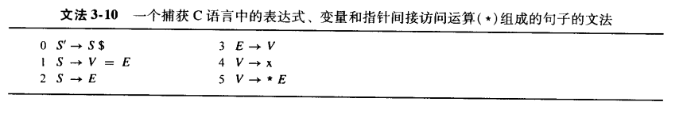
>
> 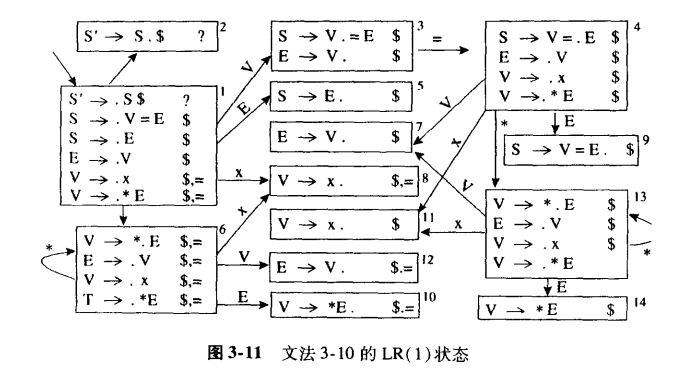
>
> 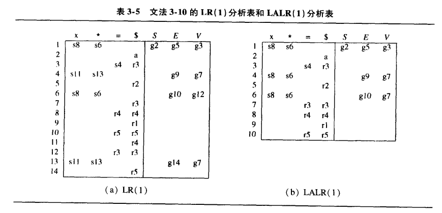
>
> 分析表中：
>
> - sn表示移进到状态n
> - gn表示转换到状态n
> - rk表示用规则k归约
> - a表示接收

> 在当前状态和下一个输入符号可以同时匹配一个移入操作和一个归约操作时，会发生 **Shift-Reduce 冲突**。
>
> 在当前状态和下一个输入符号可以同时匹配两个不同的归约规则时，会发生 **Reduce-Reduce 冲突**。

> **LALR(1)**（Look-Ahead LR(1)）是 LR(1) 的简化版本。它通过合并 LR(1) 分析表中的某些状态来减少状态的数量（某些状态指除了超前查看符号集合外其余部分都相同的两个状态，例如例子中的状态6和状态13），从而降低内存消耗。LALR(1) 分析器的性能和 LR(1) 分析器相当，但它的状态表更小。对于某些语法，LALR(1)可能引入reduce-reduce冲突。

> **语义动作**（Semantic Actions）是指在语法分析过程中，当解析器匹配到某个语法规则时，执行的一段代码。这段代码通常用于构建抽象语法树。在解析器生成器中，语义动作通常嵌入在语法规则中，并用 `{}` 包围。语义动作可以访问和操作语法规则中的各个部分，并将结果存储在特殊变量 `$$` 中，以便在后续规则中使用。

### 代码实现

主要代码位于 `src/tiger/parse/tiger.y` 中。`src/tiger/absyn/absync`下是所有抽象语法类（抽象语法树的结点）的声明和定义。代码示例如下：

```C++
%union {
  int ival;
  std::string* sval;
  sym::Symbol *sym;
  absyn::Exp *exp;
  absyn::ExpList *explist;
 	... /* 包含所有可能的语义值类型 */
 }

%token <sym> ID /* 某些终结符有属性类型，ID的属性类型为sym */
%token <sval> STRING
%token <ival> INT

%token
  COMMA COLON ...

 /* token priority */
...

%type <exp> exp expseq sequencing
    /* 指定非终结符的属性类型，exp, expseq, sequencing 这三个非终结符的类型是 exp */
...

%start program

%%
program: exp {absyn_tree_ = std::make_unique<absyn::AbsynTree>($1); };
...
    
/* 对应于：class VarDec : public Dec {
            public:
              sym::Symbol *var_;
              sym::Symbol *typ_;
              Exp *init_;
              bool escape_;

              VarDec(int pos, sym::Symbol *var, sym::Symbol *typ, Exp *init)
                  : Dec(pos), var_(var), typ_(typ), init_(init), escape_(true) {}
              ...
          }
*/
vardec: VAR ID ASSIGN exp  {$$ = new absyn::VarDec(scanner_.GetTokPos(), $2, nullptr, $4);}
  |  VAR ID COLON ID ASSIGN exp  {$$ = new absyn::VarDec(scanner_.GetTokPos(), $2, $4, $6);}
  ;
/* 这里$2对应的是第1个ID在规则右侧的位置 */
/* {$$ = new absyn::VarDec(scanner_.GetTokPos(), $2, $4, $6);}就是一种“语义动作” */

/* 下面是一个有点像在“递归”定义的例子 */
expseq: sequencing_exps {$$ = new absyn::SeqExp(scanner_.GetTokPos(), $1);}
  ;

sequencing_exps: exp  {$$ = new absyn::ExpList($1);}
  |  exp SEMICOLON sequencing_exps  {$$ = $3; $$->Prepend($1);}
  ;
```

### 如何避免冲突

#### 定义优先级和结合性

```plaintext
/* token priority */
%left OR
%left AND
%nonassoc EQ NEQ LT LE GT GE
%left PLUS MINUS
%left TIMES DIVIDE
%left UMINUS
```

- 在解析表达式 `a - b - c `时，由于 MINUS 是左结合性，解析器会将其解析为` (a - b) - c`。
- 在解析表达式 `a < b < c` 时，由于 LT 是非结合性，解析器会产生语法错误。

#### 使用 `%prec` 指定优先级

```plaintext
exp: ...
    |  MINUS exp %prec UMINUS  {$$ = new absyn::OpExp(scanner_.GetTokPos(), absyn::MINUS_OP, new absyn::IntExp(scanner_.GetTokPos(), 0), $2);}
```

例如在`--1`的情况下，会优先将`-1`归约为exp，整体解释为`-(-1)`。

#### 规则的顺序

```plaintext
exp: ...
    |  IF exp THEN exp ELSE exp  {$$ = new absyn::IfExp(scanner_.GetTokPos(), $2, $4, $6);}
    |  IF exp THEN exp  {$$ = new absyn::IfExp(scanner_.GetTokPos(), $2, $4, nullptr);}
```

这样在遇到`IF exp THEN exp`之后，会优先移入else而不是直接归约。


## 语义分析，类型检查

**语义分析**是指将变量的定义与它们的各个使用联系起来，检查每一个表达式是否有正确的类型，并将抽象语法转换成更简单的、适合于生成机器代码的表示。

### 具体步骤

语义分析的一般步骤为: 当检查某个语法结点时, 需要递归地检查结点的每个子结点。具体来说：

#### 对变量的检查

1. 简单变量SimpleVar：到vEnv中查看，若没找到变量名或类型不是VarEntry则报告变量未定义。
2. 域变量FieldVar：若除去域部分后不是记录类型，则报错。然后逐个查找记录的域，如果没有一个匹配当前域变量的域，则报错。
3. 下标变量SubscriptVar：如果它除去下标部分后的类型不是数组类型，则报错。若下标部分不是int类型报错。

#### 对表达式的检查

1. 下面的表达式无需检查：
   - 整数表达式IntExp  
   - 字符串表达式StringExp 
   - nil表达式NilExp   
   - 变量表达式VarExp   
2. 函数调用CallExp：如果在vEnv里查不到函数名或者它不是FuncEntry则报错：函数未定义。然后逐个检查形参和实参是否匹配，遇到不匹配则报错。在遍历形参链表的时候，可能遇到链表空或有剩余的情况，此时分别报告实参过多或不足的错误。
3. 算术表达式OpExp:   如果是运算符，要求左右均为int类型。如果是比较，左右中任一个不能为void类型；左右不能全为nil，可以一个为nil一个为record类型；其它情况下必须左右类型完全一致（只要一个IsSameType就能搞定这些）。
4. 记录表达式RecordExp：先在tEnv中查找类型是否存在，若否或非记录类型报告未知记录类型错误。然后逐个检查记录表达式和记录类型域的名字是否相同，逐个检查记录表达式和记录类型域的类型是否匹配......（与CallExp类似）
5. 赋值运算符AssignExp：t1:=t2，如果t1是简单变量并且在vEnv中查得它是readonly的，则报错：不能给循环变量赋值。如果t2是void类型则出错。如果t2不能强制转换成t1则出错。赋值表达式无返回值。
6. if表达式IfExp：如果测试条件的表达式不返回整数，报告测试条件错误。如果没有else子句，且then子句有返回值，报错。如果有else子句,检查then和else的类型是否匹配。
7. while表达式WhileExp：如果测试条件不是整数，报告测试条件错误。如果循环体有返回值，则报错。注意这里不需要使用Begin/EndScope。递归地检查body时需要将labelcount加1，为break的检查做准备。
8. for表达式ForExp：如果初始值和终止值不是整数类型，则报错。用BeginScope进入新的符号表 ，把循环变量添加到vEnv中，用EndScope退出符号表。如果循环体有返回值，则报错。
9. break表达式BreakExp：labelcount为0则退无可退，报错。
10. let表达式LetExp：无需错误检查，只需按如下步骤进行:  vEnv和tEnv分别用BeginScope进入新的符号表，翻译定义部分，翻译body部分，返回到原符号表 。把body部分的类型作为最终的类型。
11. 数组表达式ArrayExp：先在tEnv中查找类型是否存在，若否或非数组类型报告未知记录类型错误。再检查数组范围是否为整数。再检查tEnv中的数组类型和实际类型是否匹配。
12. 顺序表达式SeqExp：无需错误检查，只需要递归地检查各个exp，并且返回最后一个exp的返回值。

#### 对声明的检查

1. 函数声明FunctionDec：对于每个声明，第一轮检查：

   - 检查是否有重复的声明
   - 检查是否与标准函数冲突
   - 检查函数返回值，有返回值则检查类型是否存在
   - 无误后，将函数作为FuncEntry添加到vEnv中  

   然后再重新扫描一遍声明，第二轮检查:

   - 进入vEnv的一张子表（函数内部用）
   - 将函数参数存入子表
   - 递归地检查函数体，检查函数体的返回类型是否和声明部分匹配
   - 退出子表

2. 变量声明VarDec：如果有显式的类型声明，检查类型存在与是否类型匹配，以及注意只有记录类型可以用nil初始化。若无显式的类型声明且初始值为nil，则报错。若无初始值，报错，因为所有的变量声明必须有初始化。如果没有以上错误，则把变量作为VarEntry添加到vEnv中。 

3. 类型声明TypeDec：和函数声明类似，也是两轮。

   第一轮检查是否有重复的声明，用一个只有名字的NameTy，将类型名加入到tenv中。

   第二轮进行真正的对每个类型的检查，将检查结果补充到NameTy中。需要考虑循环定义的问题，需要构建图并检查是否有环。如果检查结果类型是NameTy，那么需要将这一类型加入到图中。

#### 对类型的检查

1. 未知类型NameTy：检查tEnv，若没有发现类型，则报告未知类型错误。
2. 数组类型ArrayTy：检查tEnv，若没有发现类型，则报告未知类型错误。返回type::ArrayTy。
3. 记录类型RecordTy：检查该记录类型每个域的类型在tEnv中是否存在，否则报告未知类型错误。返回type::RecordTy。

### 代码实现

与这部分内容相关的代码：

- **src/tiger/semant/type.\*** 一系列type类
- **src/tiger/env/env.\*** EnvEntry类，在类型检查时存储变量or函数的信息
- **src/tiger/symbol/symbol.\*** 符号和符号表。符号表常用方法：`Look`，`Enter`（基类Table自带的两个），`BeginScope`（在当前符号表中新建一个子符号表），`EndScope`（退回到上一级符号表 ）。

主要代码位于 `src/tiger/semant/semant.cc` 中。代码示例：

```C++
type::Ty *SimpleVar::SemAnalyze(env::VEnvPtr venv, env::TEnvPtr tenv, int labelcount, err::ErrorMsg *errormsg) const {
  env::EnvEntry *entry = venv->Look(sym_);
  if(entry && typeid(*entry) == typeid(env::VarEntry)) {
    return (static_cast<env::VarEntry*>(entry))->ty_->ActualTy();
  } else {
    errormsg->Error(pos_, "undefined variable %s", sym_->Name().data());
  }
  return type::IntTy::Instance();
}

void FunctionDec::SemAnalyze(env::VEnvPtr venv, env::TEnvPtr tenv, int labelcount, err::ErrorMsg *errormsg) const {
  std::list<FunDec *> function_list = functions_->GetList();
  std::unordered_map<std::string, env::FunEntry *> function_map;
  // precheck
  for (FunDec *function : function_list) {
    if (function_map.find(function->name_->Name()) != function_map.end()) {
      errormsg->Error(function->pos_, "two functions have the same name");
      return;
    }
    absyn::FieldList* params = function->params_;
    type::Ty* result_ty = nullptr;
    if (function->result_) {
      result_ty = tenv->Look(function->result_);
      if (!result_ty) {
        errormsg->Error(function->pos_, "undefined type %s", function->result_->Name().data());
        return;
      }
    } else {
      result_ty = type::VoidTy::Instance();
    }
    type::TyList* formals = params->MakeFormalTyList(tenv, errormsg);
    env::FunEntry* entry = new env::FunEntry(formals, result_ty);
    function_map[function->name_->Name()] = entry;
    venv->Enter(function->name_, entry);
  }

  for (FunDec *function : function_list) {
    venv->BeginScope();
    absyn::FieldList* params = function->params_;
    env::FunEntry* entry = function_map[function->name_->Name()];
    type::TyList* formals = entry->formals_;
    auto formal_it = formals->GetList().begin();
    auto param_it = params->GetList().begin();
    for(; param_it != params->GetList().end(); formal_it++, param_it++){
      venv->Enter((*param_it)->name_, new env::VarEntry((*formal_it)->ActualTy()));
    }
    type::Ty* body_ty = function->body_->SemAnalyze(venv, tenv, labelcount, errormsg);
    if (!body_ty->IsSameType(entry->result_)) {
      if (typeid(*entry->result_) == typeid(type::VoidTy)) {
        errormsg->Error(function->pos_, "procedure returns value");
      } else {
        errormsg->Error(function->pos_, "return type mismatch");
      }
      return;
    }
    venv->EndScope();
  }
}
```


## 逃逸分析，翻译

**逃逸变量**是指一个变量是传地址实参、被取了地址或者内层的嵌套函数对其进行了访问。主要的逃逸变量来源于内层嵌套函数访问外层变量。要访问外层变量，则需要static link。

**中间表示**是指一种抽象机器语言，可以表示目标机的操作而不需太多涉及机器相关的操作，且独立于源语言的细节。一个可移植的编译器先将源语言转换成 IR，然后再将 IR 转换成机器语言，这样便只需要 $N$ 个前端和 $M$ 个后端，而不是$N*M$个编译器。

与教材不同的是，我们使用LLVM IR，关于如何构建LLVM IR，可以参考[这个写得很烂的语法规则](https://releases.llvm.org/1.1/docs/ProgrammersManual.html)。

### 逃逸分析

**逃逸分析** 部分利用递归完成对各个变量是否是逃逸变量的标记。

计算逃逸变量：每当在深度d处发现了变量or形参的声明，则将EscapeEntry(d, &x->escape)添加到环境中，escape设为false。在大于d的深度中使用该变量时，将其escape设为true。

主要代码位于 `src/tiger/escape/escape.cc` 。

1. 首先，根部深度为0：

```
void AbsynTree::Traverse(esc::EscEnvPtr env) {
  this->root_->Traverse(env, 0);
}
```

2. 在不涉及到变量定义的Var或Exp的Traverse，一般就是进一步深入地对其组成部分进行Traverse：例如SubscriptVar的定义为：

```
class SubscriptVar : public Var {
public:
  Var *var_;
  Exp *subscript_;

  ...
};
```

​		那么在这里要做的就是：

```
void SubscriptVar::Traverse(esc::EscEnvPtr env, int depth) {
  var_->Traverse(env, depth);
  subscript_->Traverse(env, depth);
}
```

3. 每当在深度d处发现了变量or形参的声明，则将EscapeEntry(d, &x->escape)添加到环境中，escape设为false。这里主要就是LetExp和FunctionDec。LetExp的写法为：

```
void LetExp::Traverse(esc::EscEnvPtr env, int depth) {
  env->BeginScope();
  for (auto dec : decs_->GetList()) {
    dec->Traverse(env, depth);
  }
  body_->Traverse(env, depth);
  env->EndScope();
}
```

在LetExp中是通过VarDec声明变量

```
void VarDec::Traverse(esc::EscEnvPtr env, int depth) {
  escape_ = false;
  init_->Traverse(env, depth);
  env->Enter(var_, new esc::EscapeEntry(depth, &this->escape_));
}
```

只有VarDec、ForExp和Field中定义了`escape_`这个变量。对ForExp也要做和VarDec类似的操作（关于Field，在接下来FunctionDec中再说）。

FunctionDec与LetExp类似，但不同的是它是通过每一个FunDec的params_声明变量的，并且变量真正开始起作用的位置不是depth而是depth + 1（嵌套！）。

```
void FunctionDec::Traverse(esc::EscEnvPtr env, int depth) {
  for (auto func : functions_->GetList()) {
    env->BeginScope();
    for (auto field : func->params_->GetList()) {
      ...
    }
    ...
    env->EndScope();
  }
}
```

4. 在大于d的深度中使用该变量时，将其escape设为true。具体表现在SimpleVar：

```
void SimpleVar::Traverse(esc::EscEnvPtr env, int depth) {
  auto res = env->Look(sym_);
  if (res && res->depth_ < depth) {
    *res->escape_ = true;
  }
}
```

### 栈帧

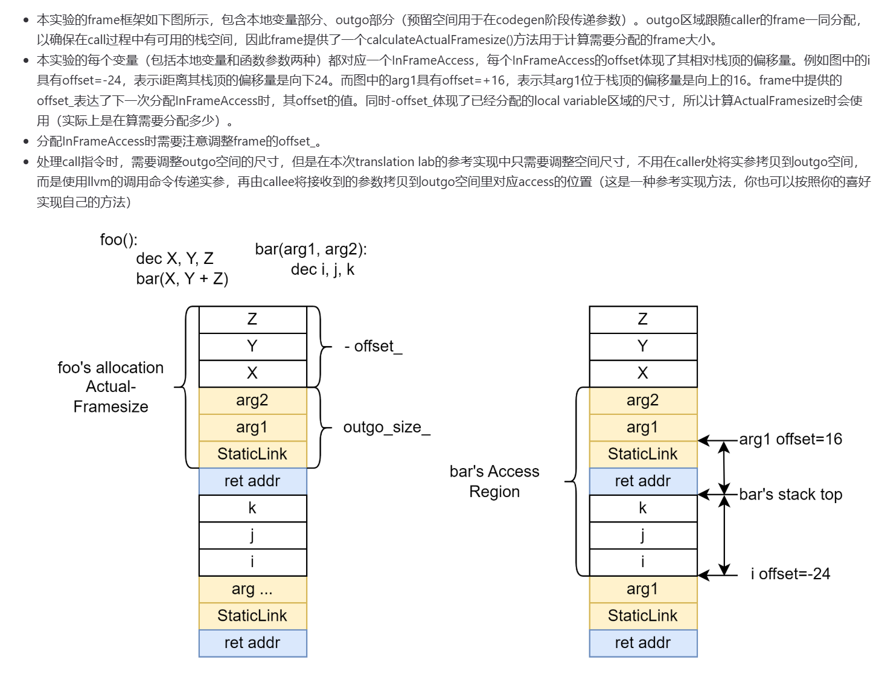

相关文件：src/tiger/frame/.*

**Frame**定义了抽象的栈帧结构，记录了一个函数的参数、栈帧大小等重要信息。

**Access**用于描述那些存放在帧中或是寄存器中的形式参数和局部变量。

先看Access：

```
class InFrameAccess : public Access {
public:
  int offset;
  frame::Frame *parent_frame;

  explicit InFrameAccess(int offset, frame::Frame *parent)
      : offset(offset), parent_frame(parent){}

  llvm::Value *ToLLVMVal(llvm::Value* frame_addr_ptr) const {
    auto local_framesize_global = ir_builder->CreateLoad(llvm::Type::getInt64Ty(ir_builder->getContext()), parent_frame->framesize_global);
    auto new_offset = ir_builder->CreateAdd(local_framesize_global, ir_builder->getInt64(offset));
    auto new_sp = ir_builder->CreateAdd(frame_addr_ptr, new_offset);
    return new_sp;
  }

  void storeValue(llvm::Value *val, llvm::Value *sp) const {
    auto addr_int = ToLLVMVal(sp);
    auto addr = ir_builder->CreateIntToPtr(addr_int, llvm::PointerType::get(val->getType(), 0));
    ir_builder->CreateStore(val, addr);
  }
  
  llvm::Value* getValue(llvm::Type *type, llvm::Value *sp, std::string name = "") const {
    auto addr_int = ToLLVMVal(sp);
    auto addr = ir_builder->CreateIntToPtr(addr_int, llvm::PointerType::get(type, 0), name);
    return addr;
  }
}

class InRegAccess : public Access {
public:
  llvm::Value *value;

  explicit InRegAccess(llvm::Type* type = nullptr) {
        if (type != nullptr) {
          value = ir_builder->CreateAlloca(type);
        } else {
          value = ir_builder->CreateAlloca(llvm::Type::getInt64Ty(ir_builder->getContext()));
        }
      }

  llvm::Value *ToLLVMVal(llvm::Value* frame_addr_ptr) const {
    return value;
  }

  void storeValue(llvm::Value *val, llvm::Value *sp) const {
    ir_builder->CreateStore(val, value);
  }
  
  llvm::Value* getValue(llvm::Type *type, llvm::Value *sp, std::string name = "") const {
    return value;
  }
};
```

对于栈上的变量，存值的时候要先计算出它的地址（至于为什么这样算可以看前面那幅图），取值也是返回地址。frame_addr_ptr指当前InFrameAccess所在的栈帧的基地址。framesize的global变量先初始化为0，当完成了整个function的翻译之后之后再计算实际需要的framesize，然后回填到framesize global变量。

对于寄存器变量（非逃逸），直接一个value搞定即可。注意两种access的getValue拿到的结果有差异，需要根据变量是否逃逸来进行不同的处理。

在实现过程中，为了方便起见，一开始是把所有变量都放到栈上，也就是全都是InFrameAccess。完成了寄存器分配后，再返回来增加实现InRegAccess。

frame中的功能函数（具体为何这样计算，还是看图）：

```
frame::Access *AllocLocal(bool escape, llvm::Type *type = nullptr) override {
    if (escape) {
        offset_ -= reg_manager->WordSize();
        auto access = new InFrameAccess(offset_, this);
        return access;
    } else {
        auto access = new InRegAccess(type);
        return access;
    }
}

void AllocOutgoSpace(int size) override {
    if (size > outgo_size_)
    	outgo_size_ = size;
}

int calculateActualFramesize() { 
    return (-offset_ + outgo_size_) + 8; 
}
```

每次call一个别的函数时，需要将本地的sp作为第一个参数传递给对方，对方才可以从形参表拿出caller的sp，用于计算自己的栈帧内存范围。


### 静态链（static link）

**Level**是用来描述静态连接用的数据结构，方便实现static link，成员变量是一个它的Frame和它的父Level。

（以下内容参考自[2024-12-5 问题总结（包括调试建议和一篇StaticLink的详细分析） (#4) · Issues · compilers-2024 / compilers-2024 · GitLab](https://ipads.se.sjtu.edu.cn:2020/compilers-2024/compilers-2024/-/issues/4)）

static link的本质是为了确保子函数可以访问母函数的所有局部变量。也就是说对于某个特定函数，我们需要一种机制去访问他在level的parent链表上的所有祖先。

- 比如在嵌套定义关系中，自顶向下有f1->f2->f3->(f4,f5)，其中f1类似于tigermain，是最外层函数，中间经过了f2和f3，最后在f3的定义域中，我们定义了两个同级别的函数f4和f5。
- 那么为了实现tiger的跨函数访问，需要可以让f5访问到f1，f2，f3的所有局部变量（当然也包括f5的，但是不包括f4的）。

这个机制就是static link。我们需要让f5的static link能够指向f3的sp（栈帧基地址），需要让f3的static link能够指向f2的sp，以此类推。一旦我们找到了上一个层次的sp，就可以结合编译阶段就知道的frame结构，算出上个level的任意变量在运行时的地址了。

具体来说，call的时候到底要做什么呢？

- 如果caller就是callee的直接父函数（level层面上的），那么只需要把自己的sp传给他，即可满足sl的定义。
- 如果不是的话（比如上述例子中，f4可以合法的调用f5，但是f4不是f5的父函数，f5希望接受到的sl应该是f3的sp），那么你需要在call之前，先追溯f4的sl，向前追溯若干次sl（这个例子里只需要1次，你可以静态的通过level之间的关系在编译阶段就知道要往前追溯几次，追溯N次意味着用ir builder输出N次取sl的代码）找到f3的sp，从而作为第二个实参放进call命令里。


### 翻译为IR

与类型检查类似，Translate也是递归地进行的。

一些（还没提到的）需要注意的事项:

1. alloc_record, init_array, string_equal这三个function需要在translate.cc中定义（而不是在FillBaseVEnv()）。因为translate.cc需要用到它们。

2. func_stack的作用是在一些exp中创建basicblock需要知道插在哪个函数中，func_end_stack的作用是在每次翻译完函数体之后确认接下来插入指令的位置，loop_stack的作用是遇到break确认退出之后的位置。

3. 在AbsynTree::Translate中定义tigermain函数。

4. TypeDec和FunctionDec还是需要扫描两轮，第二轮才是真正的翻译。

5. FunctionDec需要做的事项：

   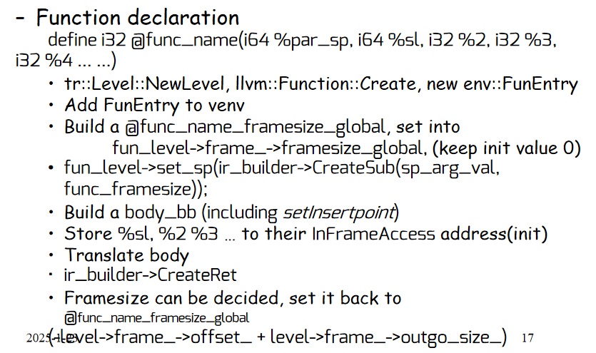

6. 对于StringExp，ir_builder->CreateGlobalStringPtr返回的是i8\*指针，不符合本lab的参考做法，应该使用type::StringTy::CreateGlobalStringStructPtr来构造string*类型的llvm变量。

7. 在CallExp中，如果是默认函数，不需要传递sp 和 static link。如果发现arg的类型与函数声明的不一致，是因为arg是指针（例如list[1]）需要load一下。

8. 注意AND和OR是短路求值。和IfExp类似利用PHI节点。

9. 在结构体类型的CreateIntToPtr（i64 -> %MyStruct*）之前，需要先GetLLVMType()

   ```
   auto actualty = tenv->Look(typ_);
   auto actualty_struct_type = actualty->GetLLVMType()->getPointerElementType();
     // i64 -> %MyStruct*
   auto record_val_ptr = ir_builder->CreateIntToPtr(record_val, llvm::PointerType::get(actualty_struct_type, 0));
   ```

10. 取结构体的域的指针，用CreateStructGEP：

    ```
    auto field_val = ir_builder->CreateStructGEP(var_ptr->getType()->getPointerElementType(), var_ptr, offset);
    ```

    取数组元素的指针，用CreateInBoundsGEP：

    ```
    auto subscript_val_ptr = ir_builder->CreateInBoundsGEP(var_val->getType()->getPointerElementType(), var_val, subscript_val);
    ```

11. IfExp考虑没有else子句的情况。

12. i1（布尔值），i32，i64之间的转换，用CreateIntCast和CreateZExt。

13. runtime_llvm.c包含了一些会用到的外部函数的定义。

主要代码位于 `src/tiger/translate/translate.cc` 中。样例代码如下：

#### Exp的示例

```C++
tr::ValAndTy *WhileExp::Translate(env::VEnvPtr venv, env::TEnvPtr tenv, tr::Level *level, err::ErrorMsg *errormsg) const {
  auto func = func_stack.top();
  auto test_bb = llvm::BasicBlock::Create(ir_builder->getContext(), "while_test", func);
  auto body_bb = llvm::BasicBlock::Create(ir_builder->getContext(), "while_body", func);
  auto next_bb = llvm::BasicBlock::Create(ir_builder->getContext(), "while_next", func);

  ir_builder->CreateBr(test_bb);
  ir_builder->SetInsertPoint(test_bb);

  auto test_val_ty = test_->Translate(venv, tenv, level, errormsg);
  auto test_val = ir_builder->CreateIntCast(test_val_ty->val_, llvm::Type::getInt1Ty(ir_builder->getContext()), true);
  
  ir_builder->CreateCondBr(test_val, body_bb, next_bb);
  ir_builder->SetInsertPoint(body_bb);

  loop_stack.push(next_bb);
  auto body_val_ty = body_->Translate(venv, tenv, level, errormsg);
  loop_stack.pop();
  
  ir_builder->CreateBr(test_bb);

  ir_builder->SetInsertPoint(next_bb);
  return new tr::ValAndTy(nullptr, new type::VoidTy());
}
```

#### Var的示例

```c++
tr::ValAndTy *SimpleVar::Translate(env::VEnvPtr venv, env::TEnvPtr tenv, tr::Level *level, err::ErrorMsg *errormsg) const {
  // If access is in the level, return the value.
  // Otherwise, static links must be used to find the value.
  if (auto entry = venv->Look(this->sym_)) {
    if (auto var_entry = dynamic_cast<env::VarEntry *>(entry)) {
      auto var_level = var_entry->access_->level_;
      auto var_access = var_entry->access_->access_;
      auto tmp_sp = level->get_sp();
      if (level != var_level) {
        findFrameAddr(tmp_sp, level, var_level);
      }
      llvm::Value *val = var_access->getValue(var_entry->ty_->GetLLVMType(), tmp_sp, level->frame_->name_->Name() + "_" + this->sym_->Name() + "_ptr");
      return new tr::ValAndTy(val, var_entry->ty_->ActualTy());
    }
  } 
  errormsg->Error(this->pos_, "Variable " + sym_->Name() + " not found");
  return new tr::ValAndTy(nullptr, new type::NilTy());
}

void findFrameAddr(llvm::Value* &sp, tr::Level *level, tr::Level *target_level) {
  auto tmp_level = level;
  while (tmp_level != target_level) {
    // The first accessible frame-offset_ values is the static link
    auto sl_formal = tmp_level->frame_->Formals()->begin();
    auto sl_access = ((frame::InFrameAccess *)(*sl_formal));
    auto static_link_addr = sl_access->getValue(llvm::Type::getInt64Ty(ir_builder->getContext()), sp);
    auto static_link_ptr = ir_builder->CreateIntToPtr(
        static_link_addr, llvm::PointerType::get(llvm::Type::getInt64Ty(ir_builder->getContext()), 0));
    sp = ir_builder->CreateLoad(static_link_ptr->getType()->getPointerElementType(), static_link_ptr);
    tmp_level = tmp_level->parent_;
  }
}
```
#### Dec的示例

```
void VarDec::Translate(env::VEnvPtr venv, env::TEnvPtr tenv, tr::Level *level, err::ErrorMsg *errormsg) const {
  // Update venv
  // An assignment for init
  // Store the value to the InFrameAccess address
  auto init_val_ty = init_->Translate(venv, tenv, level, errormsg);
  Load_if_pointer_but_not_struct_and_string(init_val_ty->val_, nullptr);
  // 1. example: var key:= list[left]
  // 2. is_struct == true, example: 
  //    type t = {a:int, b:int}
  //    var x := t{a = 3, b = 4}
  // 3. for "var col := intArray [ N ] of 0" ?
  //    Its init_val_ty->val_->getType() = IntegerTy !

  auto access = level->frame_->AllocLocal(this->escape_, init_val_ty->val_->getType());
  access->storeValue(init_val_ty->val_, level->get_sp());

  auto tr_access = new tr::Access(level, access);
  venv->Enter(var_, new env::VarEntry(tr_access, init_val_ty->ty_));
}

void Load_if_pointer_but_not_struct_and_string(llvm::Value* &val, type::Ty *ty) {
  // 若未传入ty，则不校验是否为string
  if (val != nullptr && val->getType()->isPointerTy() && (ty == nullptr || ty != type::StringTy::Instance())) {
    auto sub_type = val->getType()->subtype_begin();
    bool is_struct = sub_type != nullptr && (*sub_type)->isStructTy();
    if (!is_struct) {
      val = ir_builder->CreateLoad(val->getType()->getPointerElementType(), val);
    }
  }
}
```

#### Ty的示例

```
type::Ty *ArrayTy::Translate(env::TEnvPtr tenv, err::ErrorMsg *errormsg) const {
  return new type::ArrayTy(tenv->Look(this->array_));
}
```


## 指令选择

**指令选择** 将IR用指令进行覆盖。

### Function Entry/Exit

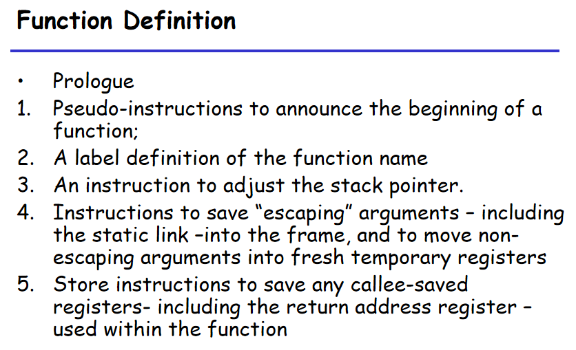

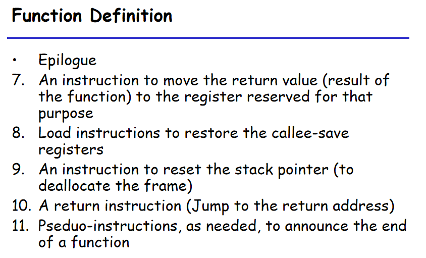

ProcEntryExit1\~3起作用的地方如下。ProcEntryExit3之所以后调用是因为要等到frame size确定下来。

```
/* codegen.cc */

auto *list = new assem::InstrList();
assem_instr_ = std::make_unique<AssemInstr>(frame::ProcEntryExit2(
      frame::ProcEntryExit1(traces_->GetFunctionName(), list)));

/* output.cc */

assem::InstrList *il = assem_instr.get()->GetInstrList();
assem::Proc *proc = frame::ProcEntryExit3(body_->getName().str(), il);
```

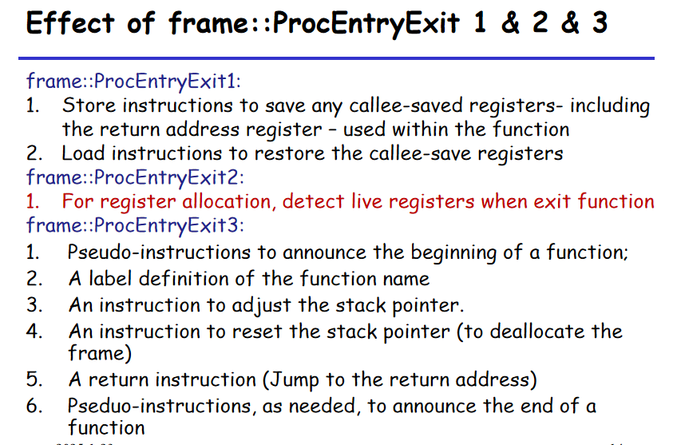

### 一些重要的类

#### AssemGen，Frags，Traces

在`src/tiger/main/main.cc`中，翻译为IR之后，紧接着就是构造`AssemGen`类，调用`LoadllvmAndGen`进行生成汇编生成。

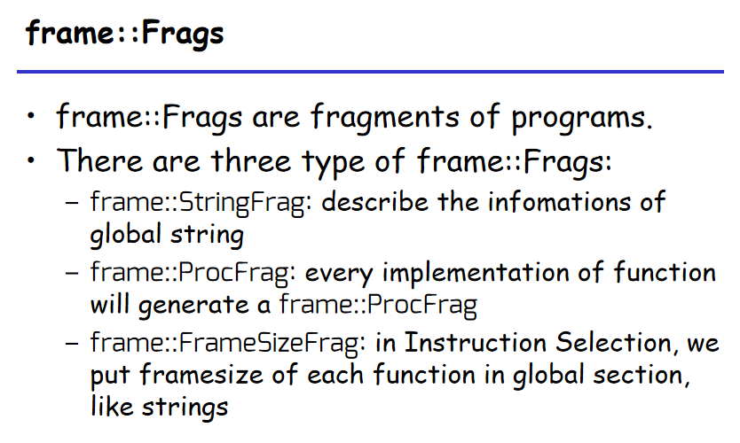

在`src/tiger/output/output.cc`的`LoadllvmAndGen`中，对program构建出Frag的list，然后调用`GenAssem`。在`GenAssem`中，对每个frag调用相应的`OutputAssem`。

在ProcFrag的`OutputAssem`中，进行Trace的构建，调用本模块的主角`Codegen`，然后进行寄存器分配，最后加上一些必要信息然后输出。

Trace（轨迹）的定义是在程序执行期间可能连贯执行的语句序列。在参考教材的Tree IR的情况下，需要先形成“基本块”，然后对基本块排序形成轨迹。但是LLVM IR就不需要排序，一个函数就对应一个Trace，因此Trace也没有多大作用，只是用来修改函数的basicblock的label使它们不会冲突。

#### Instr

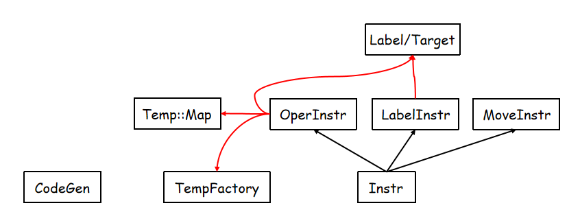

```
class OperInstr : public Instr {
public:
  std::string assem_;
  temp::TempList *dst_, *src_;
  Targets *jumps_;
  ...
};
```

在还没分配寄存器的时候，用Temp来代替寄存器，Temp是可以无限使用的。调用`temp::TempFactory::NewTemp()`获得新Temp

#### RegManager

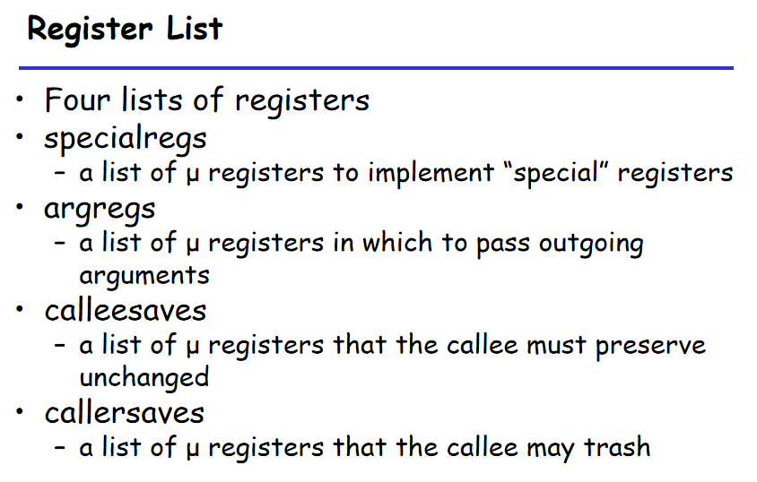

Manager也会维护一个temp_map_，使每个Reg都有一个对应的Temp。


### 代码实现

主要代码位于 `src/tiger/codegen/codegen.cc` 。

#### CodeGen

```
class CodeGen {
public:
  ...

private:
  // record mapping from llvm value to temp
  std::unordered_map<llvm::Value *, temp::Temp *> *temp_map_;
  // for phi node, record mapping from llvm basic block to index of the block, to check which block it jumps from
  std::unordered_map<llvm::BasicBlock *, int> *bb_map_;
  // for phi node, use a temp to record which block it jumps from
  temp::Temp *phi_temp_;
  std::unique_ptr<canon::Traces> traces_;
  std::unique_ptr<AssemInstr> assem_instr_;
  std::set<temp::Temp *> alloca_temps_;
};
```

CodeGen::Codegen() 的流程：

1. get all global string's location ("leaq " + std::string(str_frag->str_val_->getName()) + "(%rip),`d0")
2. move arguments to temp (first arguement is rsp, we need to skip it)
3. pass-by-stack parameters
4. construct bb_map
5. record every return value from llvm instruction (insert to temp_map)
6. For each basicblock: Generate label for basic block, Generate instructions for basic block(`InstrSel`)
7. ProcEntryExit1 & ProcEntryExit2

#### InstrSel

将llvm::Instruction翻译成指令，样例代码如下：

```C++
// bb is to add move instruction to record which block it jumps from
// function_name can be used to construct return or exit label
void CodeGen::InstrSel(assem::InstrList *instr_list, llvm::Instruction &inst, std::string_view function_name, llvm::BasicBlock *bb) {
    switch (inst.getOpcode()) {
        case llvm::Instruction::Load: {
            auto *load = llvm::cast<llvm::LoadInst>(&inst);
            auto *dst = temp_map_->at(&inst);
            auto load_val = load->getPointerOperand();
            // 如果load的是一个全局变量, 那么直接使用全局变量的名字
            if (auto *global = llvm::dyn_cast<llvm::GlobalVariable>(load_val)) {
                instr_list->Append(new assem::OperInstr(
                    "movq " + std::string(global->getName()) + "(%rip),`d0",
                    new temp::TempList(dst), new temp::TempList(), nullptr));
            } else {
                auto *src = temp_map_->at(load_val);
                if (alloca_temps_.find(src) == alloca_temps_.end()) {
                    instr_list->Append(new assem::OperInstr(
                        "movq (`s0),`d0", new temp::TempList(dst),
                        new temp::TempList(src), nullptr));
                } else {
                    instr_list->Append(new assem::MoveInstr(
                        "movq `s0,`d0", new temp::TempList(dst),
                        new temp::TempList(src)));
                }
            }
            break;
        }

        case llvm::Instruction::Br: {
            auto *br = llvm::cast<llvm::BranchInst>(&inst);
            int this_bb = bb_map_->at(bb);
            if (br->isConditional()) {
                auto *cond = temp_map_->at(br->getCondition());
                auto true_bb = br->getSuccessor(0);
                auto false_bb = br->getSuccessor(1);
                // Before every jump, move bb index into %rax
                instr_list->Append(new assem::OperInstr(
                    std::string("movq $") + std::to_string(this_bb) + std::string(",`d0"),
                    new temp::TempList(phi_temp_), new temp::TempList(), nullptr));
                instr_list->Append(new assem::OperInstr(
                    "cmpq $0,`s0", new temp::TempList(), new temp::TempList(cond), nullptr));
                instr_list->Append(new assem::OperInstr(
                    std::string("je `j0"), new temp::TempList(), new temp::TempList(),
                    new assem::Targets(new std::vector<temp::Label *>{temp::LabelFactory::NamedLabel(false_bb->getName())})));
                instr_list->Append(new assem::OperInstr(
                    std::string("jmp `j0"), new temp::TempList(), new temp::TempList(),
                    new assem::Targets(new std::vector<temp::Label *>{temp::LabelFactory::NamedLabel(true_bb->getName())})));
            } else {
                auto succ_bb = br->getSuccessor(0);
                instr_list->Append(new assem::OperInstr(
                    std::string("movq $") + std::to_string(this_bb) + std::string(",`d0"),
                    new temp::TempList(phi_temp_), new temp::TempList(), nullptr));
                instr_list->Append(new assem::OperInstr(
                    std::string("jmp `j0"), new temp::TempList(), new temp::TempList(),
                    new assem::Targets(new std::vector<temp::Label *>{temp::LabelFactory::NamedLabel(succ_bb->getName())})));
            }
            break;
        }
            
        ...
    }
}
```

其它一些注意事项：

1. 对%rsp的处理，除了头和尾对%rsp调整之外，中间不要对%rsp加减，如果需要应该leaq

2. 加减的实现使用 getOperand()获取lhs和rhs，需要考虑立即数

3. 除法要先cqto再idivq

4. Call的生成：

   - Skip the first %xx_sp parameter（直接使用%rsp）

     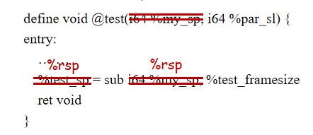

   - Move all values to arg registers

   - Move all pass-by-stack values into stack

   - Call the target function

   - Get return value from %rax

   注意callq指令的dst是reg_manager->CallerSaves()（这些可以被callee随意修改）。如果调用的是外部函数，它们还会使用%rbp，因此也要加入其中。

5. 遇到ret，返回值放入%rax，然后跳到exit label处。这样是为了方便ProcEntryExit3的操作，不用费劲去找ret在哪里，ret就在exit label之后。

6. 遇到Icmp需要有set指令

7. 为了PHI节点，需要一个变量记录从哪个block跳转而来的（详见class CodeGen）

   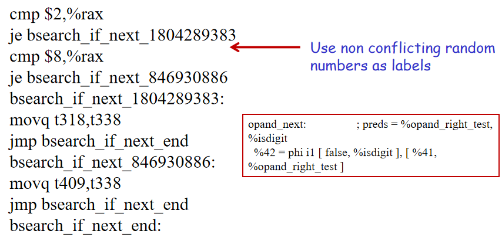


## 活性分析，寄存器分配

（以下内容参考自[WilliamX1/tiger-compiler: tiger compiler reference to Modern Compiler Implementation in C (Tiger Book).](https://github.com/WilliamX1/tiger-compiler/blob/lab6/README.md)）

### 活跃分析

在**活跃分析**部分，在 `src/tiger/liveness/flowgraph.cc` 中完成控制流图的构建，主要是给顺序执行的语句前后结点添加边、以及处理直接/间接跳转的情况。代码如下：

```C++
void FlowGraphFactory::AssemFlowGraph() {
  auto instr_list = instr_list_->GetList();
  for (auto instr : instr_list) {
    if (typeid(*instr) == typeid(assem::LabelInstr)) {
      auto label_instr = dynamic_cast<assem::LabelInstr *>(instr);
      auto node = flowgraph_->NewNode(instr);
      label_map_->insert({label_instr->label_->Name(), node});
    }
  }

  FNodePtr prev_node = nullptr;
  for (auto instr : instr_list) {
    FNodePtr this_node = nullptr;
    if (typeid(*instr) == typeid(assem::LabelInstr)) {
      std::string name = dynamic_cast<assem::LabelInstr *>(instr)->label_->Name();
      this_node = (*label_map_)[name];
    } else {
      this_node = flowgraph_->NewNode(instr);
    }

    if (prev_node) {
      flowgraph_->AddEdge(prev_node, this_node);
    }
    prev_node = this_node;

    if (typeid(*instr) == typeid(assem::OperInstr)) {
      auto oper_instr = dynamic_cast<assem::OperInstr *>(instr);
      if (oper_instr->jumps_) {
        if (oper_instr->assem_.find("jmp") != std::string::npos) {
          prev_node = nullptr;
        }
        for (auto label : *(oper_instr->jumps_->labels_)) {
          auto jump_node = (*label_map_)[label->Name()];
          flowgraph_->AddEdge(this_node, jump_node);
        }
      }
    } 
  }
}
```

在 `src/tiger/liveness/liveness.cc` 中 `livemap` 函数，根据活跃分析的数据流方程：

$$
in[n] = use[n] \cup (out[n] - def[n])
$$

$$
out[n] = \bigcup_{s \in succ[n]} in[s]
$$


利用集合的不可重复性，遇到“不动点”的时候就完成了所有结点的活跃性分析 。

### 构建冲突图

然后，在 `src/tiger/liveness/liveness.cc` 中 `InterGraph` 函数中完成冲突图的构建，主要参考以下原则：

- 对于任何对变量 $a$ 定值 `def` 的 **非传送指令**，以及在该指令处是 **出口活跃** `out` 的变量 $b_1, \cdots, b_j$ ，添加冲突边 $(a, b_1), \cdots, (a, b_j)$ 。
- 对于 **传送指令** $a \leftarrow c$，如果变量 $b_1, \cdots, b_j$ 在该指令处是 **出口活跃** `out` 的，则对每一个 **不同于 $c$ 的 $b_i$** 添加冲突边 $(a, b_1), \cdots, (a, b_j)$ 。
- **机械寄存器**相互之间都一定有冲突边（这一点其实在我的代码中不是在这里体现的，而是在后面寄存器分配的时候，将机械寄存器的结点度数设为无限大）

### 寄存器分配

**寄存器分配**部分主要参考教材上**图着色算法**，流程如下：

1. **构造**：构造冲突图。在 `liveness` 部分实现。

2. **简化**：每次一个地从图中删除低度数的（度 $\lt K$）与传送无关的结点。

3. **合并**：对简化阶段得到的简化图实施保守的合并，即遵循 $Briggs$ 原则【如果两个节点 \( u \) 和 \( v \) 可以合并，那么合并后的节点 \( uv \) 的度数必须小于寄存器的数量 \( K \)】或 $George$ 原则【如果两个节点 \( u \) 和 \( v \) 可以合并，那么对于 \( u \) 的每一个邻居 \( t \)，要么 \( t \) 已经与 \( v \) 相邻，要么 \( t \) 的度数小于寄存器的数量 \( K \)】
4. **冻结**：如果简化和合并都不能再进行，就寻找一个度数较低的传送有关的结点，我们冻结这个结点所关联的传送指令，即放弃对这些传送指令进行合并的希望。
5. **溢出**：如果没有低度数的结点，选择一个潜在可能溢出的高度数结点并将其压入栈（这里我选择的是度数最高的结点）
6. **选择**：弹出整个栈并指派颜色。先尝试给栈中的每一个结点分配颜色。如果分配不成功，则实际溢出一个高度数结点，重新构造图，重复以上流程。

在 `src/tiger/regalloc/regalloc.cc` 中整合整个寄存器分配的全过程。

```C++
void RegAllocator::RegAlloc() {
    Build();
    MakeWorklist();
    while (true) {
        if (!simplify_worklist_.empty()) {
            Simplify();
        } else if (!worklist_moves_.empty()) {
            Coalesce();
        } else if (!freeze_worklist_.empty()) {
            Freeze();
        } else if (!spill_worklist_.empty()) {
            SelectSpill();
        } else {
            break;
        }
    }
    AssignColors();
    if (!spilled_nodes_.empty()) {
        RewriteProgram();
        clearMovesAndMaps();
        RegAlloc();
    } else {
        clearRedundantMoves();
    }
}
```


## 总结

这篇博客实际成文于考试周以后，抱着“这么好一个项目，不赶紧总结下来就亏了”、“万一以后求职面试问到”的心态，花了约一天半的时间成文。

由于课程难度较大较枯燥、理论与实践结合不足、Lab安排不合理、新引入LLVM IR导致难以“借鉴”、考试难度不合理等种种缘故，导致这门《编译原理与技术》的风评不甚好。我其实到后面也开始有点“厌学”。不过现在这样记录下来，感觉就是，嗯，起码不至于一无所获吧。

感谢**臧斌宇**老大和**吴明瑜**老师，感谢勇敢重构代码和耐心解答问题的助教们，感谢在每个有lab的不眠之夜鼓励我的朋友们，感谢能坚持到现在的我自己。


## 参考资料

1. [SE3355 / 2024 / Welcome](https://ipads.se.sjtu.edu.cn/courses/compilers/index.shtml)
2. [Tiger-compiler实验环境配置](https://ipads.se.sjtu.edu.cn/courses/compilers/tiger-compiler-environment.html)
3. [WilliamX1/tiger-compiler: tiger compiler reference to Modern Compiler Implementation in C (Tiger Book).](https://github.com/WilliamX1/tiger-compiler/blob/lab6/README.md)
4. [Tiger 语言参考 | Tiger](https://yufeiminds.github.io/tiger/appendix/tiger.html)
5. [Tiger Compiler - Step by Step](https://bcmi.sjtu.edu.cn/home/limu/tiger/Res/Tiger_Compiler_Doc.pdf)
6. [Issues · compilers-2024 / compilers-2024 · GitLab](https://ipads.se.sjtu.edu.cn:2020/compilers-2024/compilers-2024/-/issues)

