## Hardware Acceleration for Linear Algebra

### 通用的加速技术

现代机器学习框架可以视为两层：上层是计算图，用于前向推理、自动微分和反向传播；下层是张量线性代数库，其负责底层的张量计算。

**Vectorization 向量化**： 如果我们要将两个256长度的array相加，一种标量的处理方式是256个元素逐个相加：

```C
void add(float* A, float* B, float* C){
    for(int i=0; i<256; i++){
        C[i] = A[i] + B[i];
    }
}
```

但是很多硬件都提供了批量从内存读取、向量运算指令，即优化为如下代码：

```C
void vecadd(float* A, float* B, float* C){
    for(int i=0; i<64; i++){
        float4 a = load_float4(A + i*4);
        float4 b = load_float4(B + i*4);
        float4 c = add_float4(a, b);
        store_float4(C + i*4, c);
    }
}
```

这里要求ABC所在的内存块要是按照128 bit对齐的。

**Data layout & strides 数据布局&步幅：** 在内存中，数据是线性排列的，因此一个矩阵在内存中有两种布局方式：行优先和列优先。现代的语言偏向使用行优先：`A[i, j] = Adata[i * A.shape[1] + j `

在许多库中，还引入了一种stride格式布局，即在保存张量时，额外保存一个数据，用于标识每个维度上需要移动的步长。在这种情况下，`A[i, j] = Adata[i * A.strides[0] + j * A.strides[1]]`

这个方案的优点是可以在不用复制数据的情况下实现很多操作：通过改变offset和shape来实现切片；通过交换strides来实现转置；通过插入等于0的stride来实现广播。

缺点是访存操作可能不再连续，因此会把向量化技术变得复杂，很多线性代数操作可能需要先压缩数组。

**Parallelization 并行化：** 使用openmp可以将计算分配给多个核并行处理：

```C
void vecadd(float* A, float* B, float* C){
    #pragma omp parallel for
    for(int i=0; i<64; i++){
        float4 a = load_float4(A + i*4);
        float4 b = load_float4(B + i*4);
        float4 c = add_float4(a, b);
        store_float4(C + i*4, c);
    }
}
```


### 样例学习：矩阵乘法

本节讨论如何优化矩阵乘法。

**Vanilla matrix multiplication 朴素矩阵乘法：** 任务：计算C = dot(A, B.T)。最朴素的想法是使用三重循环完成，即如下代码：

```c
float A[n][n], B[n][n], C[n][n];

for(int i=0; i<n; i++){
    for(int j=0; j<n; j++){
        c[i][j] = 0;
        for(int k=0; k<n; k++){
        c[i][j] += A[i][k] * B[j][k];
        }
    }
}
```

通过优化数据的读取可以显著提升计算速度：

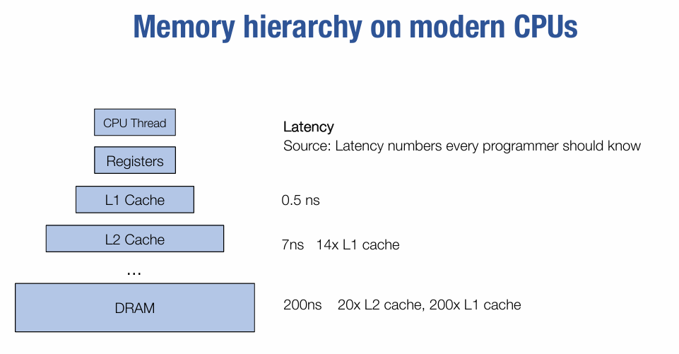

考虑到这一点，我们可以将中间变量保存到寄存器中，即：

```c
dram float A[n][n], B[n][n], C[n][n];

for(int i=0; i<n; i++){
    for(int j=0; j<n; j++){
        register float c = 0;
        for(int k=0; k<n; k++){
            register float a = A[i][k];
            register float b = B[j][k];
            c += a*b;
        }
        C[i][j] = c;
    }
}
```

上述代码中，从读取A、B到寄存器的操作分别进行了$n^3$次，需要3个寄存器来完成该操作。

**Register tiled matrix multiplication 寄存器分块矩阵乘法：** 该方案的思路是将结果进行分块，每次计算其中的一块，即：

```c
dram float A[n/v1][n/v3][v1][v3];
dram float B[n/v2][n/v3][v2][v3];
dram float C[n/v1][n/v2][v1][v2];

for (int i = 0; i < n/v1; ++i) {
    for (int j = 0; j < n/v2; ++j) {
        register float c[v1][v2] = 0;
        for (int k = 0; k < n/v3; ++k) {
            register float a[v1][v3] = A[i][k];
            register float b[v2][v3] = B[j][k];
            c += dot(a, b.T);
        }
        C[i][j] = c;
    }
}
```

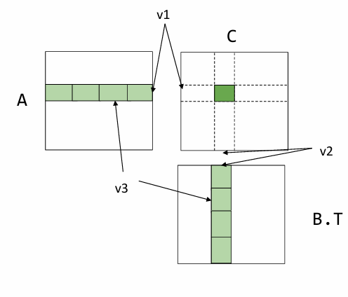

A的数据加载开销是 $n^3/v2$，B的数据加载开销是 $n^3/v1$，A的寄存器开销是v1×v3，B的寄存器开销是v2×v3，C的寄存器开销是v1×v2。注意到v3不影响数据加载的开销，因此可以取v3为1，然后在满足寄存器总数约束的情况下，最大化v1和v2。

之所以能够减小开销是因为在矩阵计算中，元素被重复使用，通过每次计算一个分块的方式，可以保证这个分块内用到的重复数据只要加载一次。

**Cache line aware tiling 缓存行感知分块：** 前面我们使用寄存器来进行加速，本节我们考虑使用cache来加速。我们的实现代码为：

```c
dram float A[n/b1][b1][n];
dram float B[n/b2][b2][n];
dram float C[n/b1][n/b2][b1][b2];

for (int i = 0; i < n/b1; ++i) {
    l1cache float a[b1][n] = A[i];
    for (int j = 0; j < n/b2; ++j) {
        l1cache float b[b2][n] = B[j];
        
        C[i][j] = dot(a, b.T); #可进一步使用寄存器分块
    }
}
```

上述代码中，A的加载开销是 $n^2$，B的加载开销是 $n^3/b1$。有两个约束，一个是b1 × n + b2 × n <l1 chche size，另一个是为了使用寄存器分块，b1 %  v1 == 0, b2 % v2 == 0。

**Put it together** 将缓存版本的dot运算使用寄存器版本展开，可以得到最终的分块乘法实现：

```c
dram float A[n/b1][b1/v1][n][v1];
dram float B[n/b2][b2/v2][n][v2];

for (int i = 0; i < n/b1; ++i) {
    l1cache float a[b1/v1][n][v1] = A[i];
    for (int j = 0; j < n/b2; ++j) {
        l1cache b[b2/v2][n][v2] = B[j];
        for (int x = 0; x < b1/v1; ++x)
            for (int y = 0; y < b2/v2; ++y) {
                register float c[v1][v2] = 0;
                for (int k = 0; k < n; ++k) {
                    register float ar[v1] = a[x][k][:];
                    register float br[v2] = b[y][k][:];
                    C += dot(ar, br.T)
                }
            }
    }
}
```

上述代码的数据加载开销是：$l1speed * (n^3 / v2 + n^3/v1) +  dramspeed * (n^2 + n^3/b1)$。

**Common reuse patterns：**` C[i][j] = sum(A[i][k] * B[j][k], axis=k)`。A的访问与j无关，将j维度平铺v，可以重用A v次。

**possible reuse pattern in convolution：**

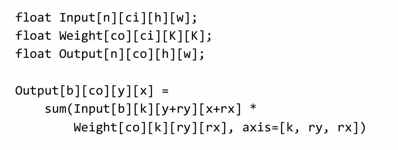


## GPU Acceleration

### GPU编程

在本节我们主要讨论CUDA，尽管还有OpenCL（ARM GPU）、Metal（Apple设备）这些编程模型。

CPU是一种通用处理器，每个核都有独立的控制器，可以灵活地处理不同的任务。GPU擅长处理大量的重复任务（例如在图形渲染中，对每个像素都进行相同的处理），大量的核可以批量执行同一指令。

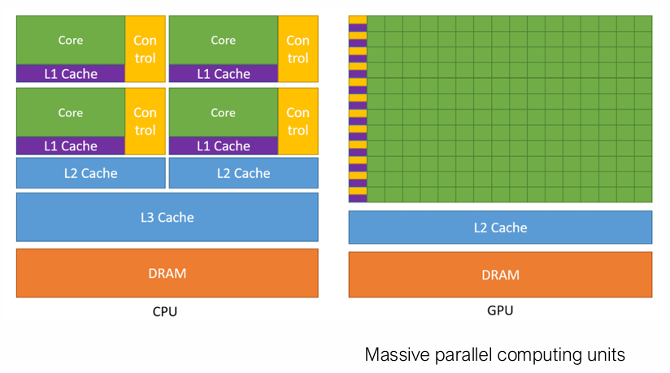

SIMT是NVIDIA CUDA 架构的核心概念。SIMT允许多个线程同时执行相同的指令，但在不同的数据上操作。线程被分组为block，每个block共享内存。block被分组为grid，一个kernel执行一个grid。当线程遇到分支（如 if 语句）时，SIMT 架构会处理分支发散，即不同线程可能执行不同的路径。

例1：CPU和GPU上的向量加法：

```
void VecAddCPU(float* A, float *B, float* C, int n) {
    for (int i = 0; i < n; ++i) {
        C[i] = A[i] + B[i];
    }
}

__global__ void VecAddKernel(float* A, float *B, float* C, int n) {
    int i = blockDim.x * blockIdx.x + threadIdx.x;
    if (i < n) {
        C[i] = A[i] + B[i];
    }
}
```

- `blockIdx.x` 是线程块的索引
- `blockDim.x` 是每个线程块中的线程数
- `threadIdx.x` 是线程在线程块中的索引


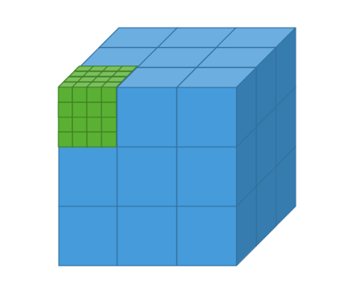

每个线程计算向量 `a` 和 `b` 的一个元素之和，并将结果存储在向量 `c` 中。如果数据之间的依赖关系较强的话，可能就没办法并行。

为了执行上述GPU的向量加法，在主机端要执行以下内容：

```
void VecAddCUDA(float *Acpu, float *Bcpu, float *Ccpu, int n) {
    float *dA, *dB, *dC;
    cudaMalloc(&dA, n * sizeof(float));
    cudaMalloc(&dB, n * sizeof(float));
    cudaMalloc(&dC, n * sizeof(float));

    cudaMemcpy(dA, Acpu, n * sizeof(float), cudaMemcpyHostToDevice);
    cudaMemcpy(dB, Bcpu, n * sizeof(float), cudaMemcpyHostToDevice);

    int threads_per_block = 512;
    int nblocks = (n + threads_per_block - 1) / threads_per_block;
    VecAddKernel<<<nblocks, threads_per_block>>>(dA, dB, dC, n);

    cudaMemcpy(Ccpu, dC, n * sizeof(float), cudaMemcpyDeviceToHost);

    cudaFree(dA);
    cudaFree(dB);
    cudaFree(dC);
}
```

首先在GPU上分配显存，将两个加数拷贝到设备中，根据数据的规模确定要启用的block数量，然后执行GPU代码，最后将结果拷贝回CPU内存，释放相应显存。

内存拷贝非常耗时，因此我们希望将数据一直保留在GPU显存中进行计算，而非在CPU和GPU之间频繁地拷贝。

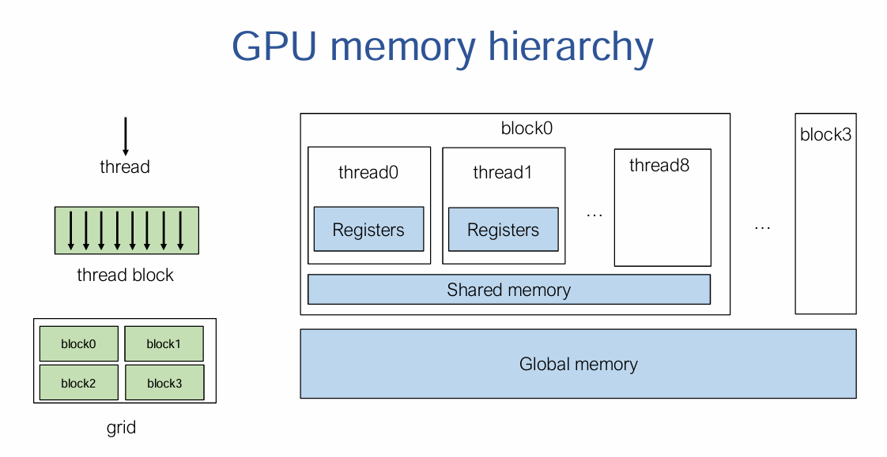

例2：window sum是一种权重全为1的卷积，可以这么写：

```
#define RADIUS 2

__global__ void WindowSumSimpleKernel(float* A, float *B, int n) {
    int out_idx = blockDim.x * blockIdx.x + threadIdx.x;
    if (out_idx < n) {
        float sum = 0;
        for (int dx = -RADIUS; dx <= RADIUS; ++dx) {
            sum += A[dx + out_idx + RADIUS];
        }
        B[out_idx] = sum;
    }
}
```

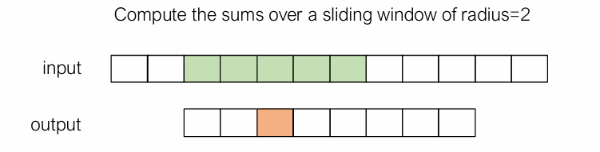

但这个算法并不高效，会重复访问数据。这时候可以引入共享内存进行优化，将一个block内会用到的数据全部读取到共享内存中。数据加载的任务可以分给每个线程并行完成。

```
__global__ void WindowSumSharedKernel(float* A, float* B, int n) {
    __shared__ float temp[THREADS_PER_BLOCK + 2 * RADIUS];
    int base = blockDim.x * blockIdx.x;
    int out_idx = base + threadIdx.x;
    if (base + threadIdx.x < n) {
        temp[threadIdx.x] = A[base + threadIdx.x];
    }
    if (threadIdx.x < 2 * RADIUS && base + THREADS_PER_BLOCK + threadIdx.x < n) {
        temp[threadIdx.x + THREADS_PER_BLOCK] = A[base + THREADS_PER_BLOCK + threadIdx.x];
    }
    __syncthreads();
    if (out_idx < n) {
        float sum = 0;
        for (int dx = -RADIUS; dx <= RADIUS; ++dx) {
            sum += temp[threadIdx.x + dx + RADIUS];
        }
        B[out_idx] = sum;
    }
}
```

通过`__syncthreads`同步，确保所有线程都将数据加载完毕。

### 样例学习：GPU上的矩阵乘

最简单的版本：

```
__global__ void mm(const float* a, const float* b, float* out, uint32_t M, uint32_t N, uint32_t P) {
    int row = blockIdx.x * blockDim.x + threadIdx.x;
    int col = blockIdx.y * blockDim.y + threadIdx.y;
    float sum = 0.0f;
    if (row < M && col < P) {
        for (int k = 0; k < N; ++k) {
            sum += a[row * N + k] * b[k * P + col];
        }
        out[row * P + col] = sum;
    }
}

void Matmul(const CudaArray& a, const CudaArray& b, CudaArray* out, uint32_t M, uint32_t N, uint32_t P) {
  dim3 grid_dim = dim3((M + TILE - 1) / TILE, (P + TILE - 1) / TILE, 1);
  dim3 block_dim = dim3(4, 4, 1);
  MatmulKernel<<<grid_dim, block_dim>>>(a.ptr, b.ptr, out->ptr, M, N, P);
}
```

从线程的细粒度来说，我们可以在GPU上实现一个寄存器分块版本的矩阵乘法：

```
__global__ void mm(float A[N][N], float B[N][N], float C[N][N]) {
    int ybase = blockIdx.y * blockDim.y + threadIdx.y;
    int xbase = blockIdx.x * blockDim.x + threadIdx.x;

    float c[V][V] = {0};
    float a[V], b[V];
    for (int k = 0; k < N; ++k) {
        a[:] = A[k, ybase*V : ybase*V + V];
        b[:] = B[k, xbase*V : xbase*V + V];
        for (int y = 0; y < V; ++y) {
            for (int x = 0; x < V; ++x) {
                c[y][x] += a[y] * b[x];
            }
        }
    }
    C[ybase * V : ybase * V + V, xbase * V : xbase * V + V] = c[:,:];
}
```

每个线程负责计算一个分块的结果。

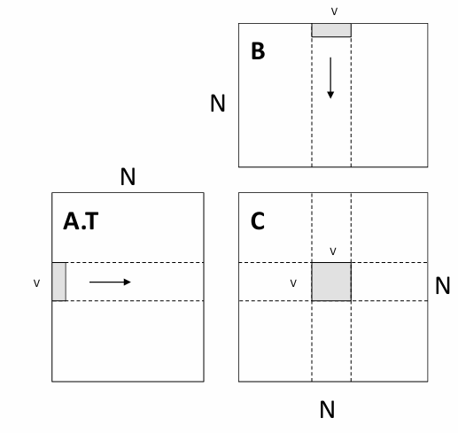

还可以将计算一块的任务交给一个block，这样就可以使用共享内存技术由block内的线程共同加载要用到的数据。

```
__global__ void mm(float A[N][N], float B[N][N], float C[N][N]) {
    __shared__ float sA[S][L], sB[S][L];
    float c[V][V] = {0};
    float a[V], b[V];
    int yblock = blockIdx.y;
    int xblock = blockIdx.x;

    for (int ko = 0; ko < N; ko += S) {
        __syncthreads();
        // needs to be implemented by thread cooperative fetching
        sA[:, :] = A[ko + S, yblock * L : yblock * L + L];
        sB[:, :] = B[ko + S, xblock * L : xblock * L + L];
        __syncthreads();
        for (int ki = 0; ki < S; ++ki) {
            a[:] = sA[ki, threadIdx.x * V + V];
            b[:] = sB[ki, threadIdx.x * V + V];
            for (int y = 0; y < V; ++y) {
                for (int x = 0; x < V; ++x) {
                    c[y][x] += a[y] * b[x];
                }
            }
        }
    }
    int ybase = blockIdx.y * blockDim.y + threadIdx.y;
    int xbase = blockIdx.x * blockDim.x + threadIdx.x;
    C[ybase * V : ybase * V + V, xbase * V : xbase * V + V] = c[:, :];
}
```

上述代码从全部内存到共享内存的加载过程被复用L次（计算每个分块矩阵都要读取L次AB的行列向量），从共享内存到寄存器被复用V次（在分块矩阵中按照长度V进行了二次分块计算）各线程读取数据到共享内存的过程为（以`sA[:, :] = A[k : k + S, yblock * L : yblock * L + L]`为例)：

```
int nthreads = blockDim.y * blockDim.x;
int tid = threadIdx.y * blockDim.x + threadIdx.x;
for(int j = 0; j < L * S / nthreads; ++j) {
    int y = (j * nthreads + tid) / L;
    int x = (j * nthreads + tid) % L;
    s[y, x] = A[k + y, yblock * L + x];
}
```

### 更多GPU优化技术

- Global memory continuous read（尽量使内存访问是连续的）
- Shared memory bank conflict（共享内存被分成多个“银行”，每个银行可以同时处理一个访问请求。如果多个线程同时访问同一个银行的不同地址，就会发生冲突，导致访问延迟）
- Software pipelining（通过重排指令顺序，使得计算和内存访问可以重叠进行）
- Warp level optimizations （warp 是一个更小的执行单元，通常包含 32 个线程）
- Tensor Core（NVIDIA GPU 中专门用于加速矩阵乘法和深度学习计算的硬件单元）


## Training Large Models

mlsys的三个元素：data，model，compute

### 节省内存

节省内存消耗，在一台设备上fit更大的model。GPU的全局内存（global memory）大小是bottleneck。

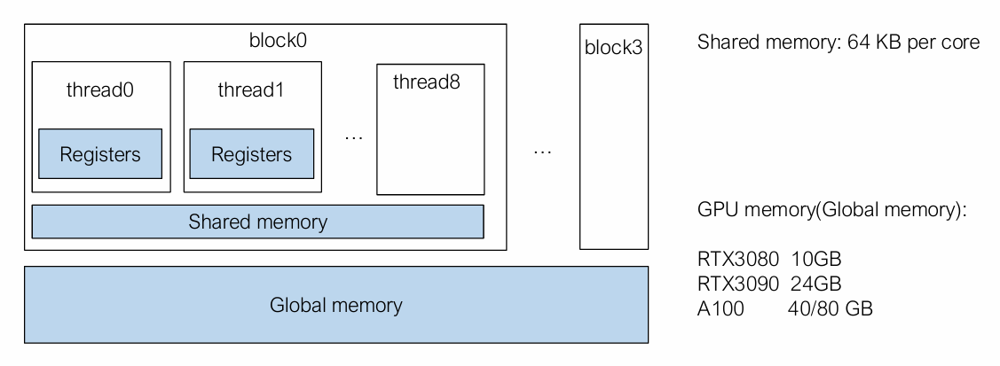

内存消耗的来源包括：模型权重、优化器状态、中间激活层的输出值。

对于推理来说，保存激活层状态只需要两块buffer（O(1)），分别保存输入和输出，下一层的输入就是上一层的输出。

对于训练而言，由于计算每一层的梯度时都用到了该层的输入，所以每个激活层都要一块buffer，空间复杂度O(n)。

checkpoint技术节省内存：每隔一个激活层才保存该层的值，在反向传播时，如果用到未保存的隐藏层，则通过上一个隐藏层计算出该层的值。以时间换空间。对于一个n层的网络，每隔k个隐藏层保存一次结果，空间复杂度为O(n/k)+O(k)，当$k=\sqrt{n}$时取到最小值。

### 模型并行（Model parallel training）

是将计算图进行划分，并分配给不同的worker进行执行，通过network在worker间传递数据。

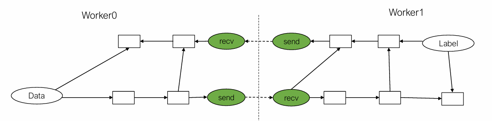

当worker1计算来自worker0的数据时，worker0可以并行计算下一个minibatch的数据。

### 数据并行（Data parallel training）

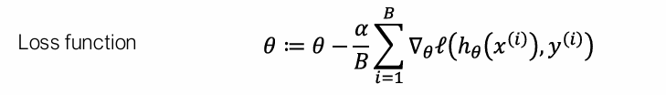


让k个worker分别访问minibatch的B / k个部分，并运行梯度计算，然后将所有梯度加在一起。allreduce抽象进行汇总：

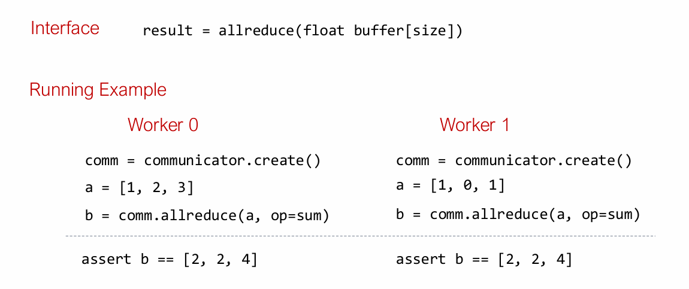

我们还可以将参数使用专门的参数服务器保存，需要访问或者更新参数时调用相应API即可。参数服务器的好处是其不需要等待所有的worker都计算结束再更新。

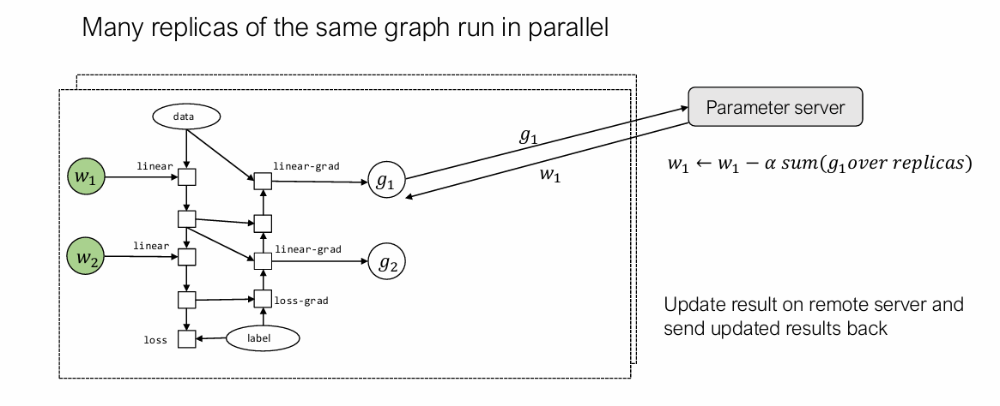

通信与计算的平衡（overlap）：

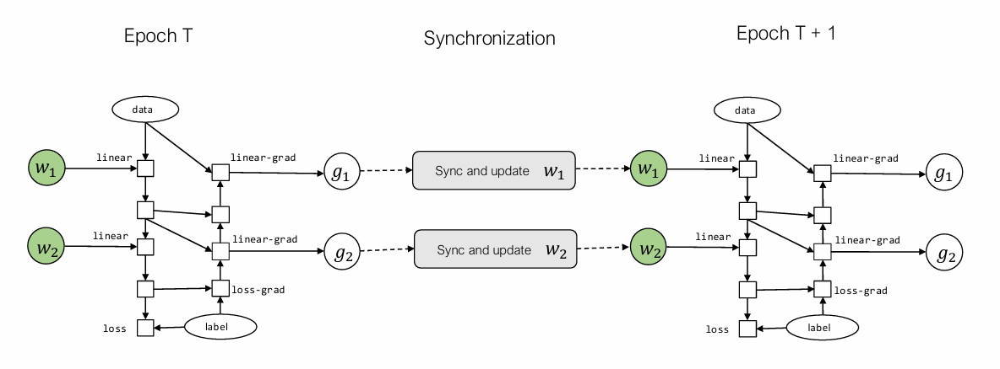

$w_2$没算完也没关系，$w_1$算完可以继续算下一个epoch的。

（Model Deployment 和 Machine learning compilation就不记了）


## 参考

1. [《CMU 10-414 deep learning system》学习笔记](https://www.zhouxin.space/notes/notes-on-cmu-10-414-deep-learning-system/#lecture-3-manual-neural-networks)
2. [深度学习系统作业 - 知乎 (zhihu.com)](https://www.zhihu.com/column/c_1582462878204063744)


