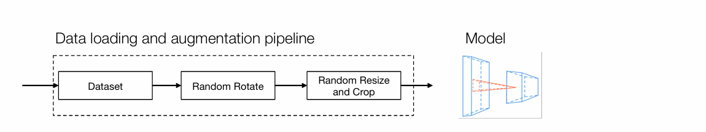
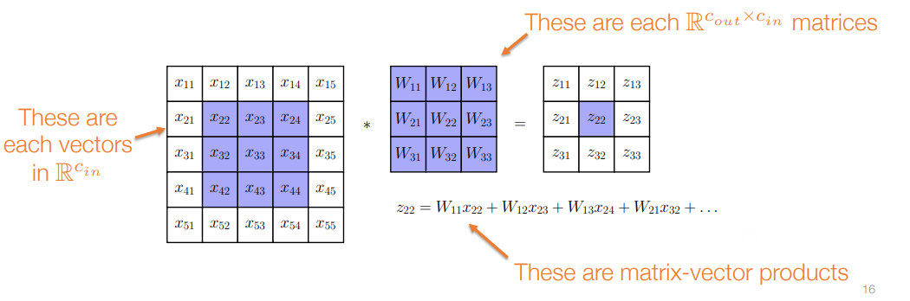

## 前言

当下人工智能、大模型等概念大火，Pytorch 和 Tensorflow这类实用而强大的编程框架功不可没，训练和推理所需要的基础设施也同样重要。我本人是对AI挺感兴趣的，目前在读的又是系统软件方向，就对深度学习系统这方面也感兴趣起来。CMU的Deep Learning Systems这门课呢据说是覆盖了深度学习系统全栈的知识体系（除了分布式训练），因此我暑假期间开始在网络上寻找资料，自学这门课程。

课程资料如下：

- 课程官网：[Lectures (dlsyscourse.org)](https://dlsyscourse.org/lectures/)
- 课程视频：https://www.bilibili.com/video/BV1Rg4y137jH/
- 课程作业与部分讲座代码：[Deep Learning Systems: Algorithms and Implementation (github.com)](https://github.com/dlsyscourse)
- 作业可参考解答：[《CMU 10-414 deep learning system》学习笔记 | 周鑫的个人博客 (zhouxin.space)](https://www.zhouxin.space/notes/notes-on-cmu-10-414-deep-learning-system/) ， [深度学习系统作业 - 知乎 (zhihu.com)](https://www.zhihu.com/column/c_1582462878204063744)

既然是学习，记笔记是很重要的，于是就有了这篇笔记。坦诚地说，我学习的时候有很多不太理解的地方都是靠看[《CMU 10-414 deep learning system》学习笔记 | 周鑫的个人博客 (zhouxin.space)](https://www.zhouxin.space/notes/notes-on-cmu-10-414-deep-learning-system/#lecture-3-manual-neural-networks) 理解的，那篇博客写的很好。如果你仔细看，会发现我的这篇笔记有很多地方和那篇博客是比较像的，一来是因为记笔记是边听边记的，有些地方来不及记，就直接翻出那篇博客copy-and-paste，然后再做改动了；二来那篇博客一些内容也是翻译PPT得到的，翻译得好就没必要改了。如果你觉得我笔记写得过于啰嗦，或者没看懂，那可以去看看那篇博客。

目前学到大概一半的位置，一段时间内可能没空学下半段了，就先搬上来一半，供君参考吧。


## Lecture 1: Introduction and Logistics

深度学习系统的要素：

- 组合多个张量操作来构建现代机器学习模型
- 转换操作序列（自动微分）
- 通过专用硬件加速计算
- 扩展更多的硬件后端，更多的运算符号

在本课程结束时，你将：

- 了解现代深度学习库的基本功能，包括自动微分、基于梯度的优化等概念
- 从零开始实现几个标准的深度学习架构（mlp, ConvNets, rnn, Transformers）
- 了解硬件加速（例如GPU）如何在现代深度学习架构下工作，并能够开发高效代码


## Lecture 2: ML Refresher / Softmax Regression

### 机器学习基础

深度学习模型的三个组成部分：

- The hypothesis class（假说模型）：模型的结构，用一系列参数描述模型从输入到输出的映射关系
- The loss function（损失函数）：对模型的评价，损失函数值越小，模型越好
- An optimization method（优化方法）：对参数进行优化，使得损失函数最小的方法


### Softmax 回归


假说模型$h:R^n→R^k$。输出的k维向量的第i个元素$h_i(x)$表示属于第i个类别的概率。

线性假说模型， $ h_θ(x)=θ^Tx $，其中$\theta \in R^{n \times k}$。

一次输入多个数据可以使用矩阵：


最直觉的损失函数：预测对则为1，否则为0。不可微分，无法优化。

交叉熵损失函数：


最优化问题：


求解方法：梯度下降法（gradient desecent）：
$$
\theta_{t+1} = \theta_t - \alpha\nabla_{\theta} f(\theta_t)
$$
其中α为学习率，$\nabla_{\theta} f(\theta_t)$的计算方法为：


（对谁求梯度，结果的维度就与谁相同）

随机梯度下降 （Stochastic gradient descent）：每次使用数据集的一个子集对参数进行更新。


具体对于softmax的优化问题，该如何计算呢：


先推导了关于向量求梯度的情况，现在要计算关于矩阵求导而不是向量，正确的做法太过麻烦，一般都是采用比较hacky的做法，也就是：将所有的矩阵和向量当作标量，使用链式法则求解，并进行转置操作使得结果的size符合预期，最后检查数值上结果是否正确。


注解：$z - e_y$为k × 1列向量，x为n × 1列向量。Z为B × k矩阵，X为B × n矩阵。softmax不改变维度。


## Lecture 3:  “Manual” Neural Networks

### 从线性模型到非线性模型

线性模型本质上是将样本空间划分为线性的几个部分，能力十分有限。

解决方案：先映射，再线性划分。
$$
h_\theta = \theta^T \phi(x)
$$
$$
\theta \in R^{d \times k}, \phi:R^n \to R^d
$$
Φ的选择：需要一个非线性函数σ：
$$
\phi(x) = \sigma(W^Tx)
$$
$$
W \in R^{n \times d}, \sigma: R^d \to R^d
$$
这就是最简单的一种神经网络。


### 神经网络

神经网络是机器学习中一类特定的假说模型，由多层组成，每一层都有大量可以微分的参数。

双层神经网络：


h为B × k矩阵，X为B × n矩阵。

L层神经网络（图中的m即是上面的B）：


### 反向传播

对双层神经网络求解梯度：


h和S为B × k矩阵，X为B × n矩阵，$W_1$为n × d矩阵，$W_2$为d × k矩阵。


对L层神经网络求解梯度：


其中$Z_i,G_i \in R^{m \times n_i}, W_i \in R^{n_i \times n_{i+1}}$。

整合，前向与反向传播：


反向传播中需要用到前向传播的中间结果Z，可以进行存储，以空间换时间。


## Lecture 4: Automatic Differentiation


目的：计算梯度


### 传统方法

方法1：Numerical differentiation


$e_i$是第i个方向的单位向量。第二个公式的由来：泰勒展开。

以上方法存在误差且效率低，常用于验证其它方法的具体实现是否出错，即验证如下等式是否成立：
$$
\delta^{T} \nabla_{\theta} f(\theta)=\frac{f(\theta+\epsilon \delta)-f(\theta-\epsilon \delta)}{2 \epsilon}+o\left(\epsilon^{2}\right)
$$
其中$\delta$是单位球上的某个向量，$\bigtriangledown_\theta f(\theta)$是使用其它方法计算得到的梯度。

方法2：Symbolic differentiation

$$
\frac{\partial (f(\theta) + g(\theta))}{\partial \theta}  = \frac{\partial f(\theta)}{\partial \theta} + \frac{\partial g(\theta)}{\partial \theta}
$$
$$
\frac{\partial (f(\theta)g(\theta))}{\partial \theta}  = g(\theta)\frac{\partial f(\theta)}{\partial \theta} + f(\theta)\frac{\partial g(\theta)}{\partial \theta}
$$
$$
\frac{\partial f(g(\theta))}{\partial \theta}  = \frac{\partial f(g(\theta))}{\partial g(\theta)} + \frac{\partial g(\theta)}{\partial \theta}
$$

也就是一般的手算方法。


### Automatic Differentiation


是一个DAG（有向无环图）。


对于$f:R^n→R^k$，前向传播需要n次前向计算才能得到关于每个输入的梯度，这就意味前向传播适合n比较小、k比较大的情况。但是在深度学习中，通常n比较大、k比较小。


前向和后向differentiation的区别：前向是看有哪些指向这个node，后向是看这个node指向其他哪些node。


### 代码实现


`node_to_grad`是一个字典，保存着每个节点的partial adjoint值。按照逆拓扑排序计算$\overline{v_{i}}$的值。

示例：$v_4 = exp(v_1) \times (exp(v_1) + 1)$


红色图是从$\overline{v_4}$开始画的，画到$\overline{v_1}$结束。其中，由于：

$$
\overline{v_3} = \overline{v_4} \times \frac{\partial v_4}{\partial v_3}  = \overline{v_4} \times v_2
$$
因此可以看到$\overline{v_4}$和$v_2$指向了$\overline{v_3}$。这样的好处是节省内存，依赖关系清晰，只需要输入$v_1$的值就能进行整个计算。


现代普遍应用反向AD的原因：

- 某些损失函数是关于梯度的函数，这种情况下需要计算梯度的梯度，但反向传播就不能计算此类情况，而在反向AD中只要增加一个节点后在此计算梯度即可；
- 反向AD优化空间更大。

由标量推广到张量：


## Lecture 5: Automatic Differentiation Implementation

本节主要对needle作业框架进行大致的讲解。

如果不是在colab环境下做，可能出现无法`import needle`的情况，可以做如下改动，把

```
%set_env PYTHONPATH /content/needle/python:/env/python
import sys
sys.path.append("/content/needle/python")
```

改为：

```
%set_env PYTHONPATH ./python:/env/python
import sys
sys.path.append("./python")
```

`autograd.py`实现自动微分相关的代码。其中最重要的两个类：`Value`类代表计算图上的节点，`Op`类代表各种算子

```python
class Value:
    """A value in the computational graph."""

    # trace of computational graph
    op: Optional[Op]
    inputs: List["Value"]
    # The following fields are cached fields for
    # dynamic computation
    cached_data: NDArray
    requires_grad: bool
```

```python
class Op:
    """Operator definition."""

    def compute(self, *args: Tuple[NDArray]):
        """Calculate forward pass of operator.

        Parameters
        ----------
        input: np.ndarray
            A list of input arrays to the function

        Returns
        -------
        output: nd.array
            Array output of the operation

        """
        raise NotImplementedError()

    def gradient(
        self, out_grad: "Value", node: "Value"
    ) -> Union["Value", Tuple["Value"]]:
        """Compute partial adjoint for each input value for a given output adjoint.

        Parameters
        ----------
        out_grad: Value
            The adjoint wrt to the output value.

        node: Value
            The value node of forward evaluation.

        Returns
        -------
        input_grads: Value or Tuple[Value]
            A list containing partial gradient adjoints to be propagated to
            each of the input node.
        """
        raise NotImplementedError()

```

其他的内容参见代码即可。


## Lecture 6: Fully connected networks, optimization,  initialization

### 全连接网络


其中$$Z_i \in  R^{n_i}, W_i \in R^{n_i \times n_{i+1}}, b_i \in R^{n_{i+1}} $$


用一个全1的列向量（m×1），将$b_i^T$广播到与矩阵相匹配的形状。

在实际实现过程中，我们直接使用广播算子。在NumPy有许多自动的广播操作，在我们实现的needle库中，这一操作更加显式，例如对于(n×1)→(m×n)，要执行的操作为`A.reshape((1, n)).broadcast_to((m, n))`。

训练全连接网络的一些关键问题：


### Optimization

常用的优化算法：

**梯度下降 （gradient desecent）**
$$
\theta_{t+1} = \theta_t - \alpha\nabla_{\theta} f(\theta_t)
$$
当f是二次函数（二次优化问题）：


（左图：收敛快，但是变化较大；右图反之）

**牛顿法（Newton's Method）**
$$
\theta_{t+1} = \theta_t - \alpha(\nabla_{\theta}^2 f(\theta_t))^{-1}\nabla_{\theta} f(\theta_t)
$$
其中：
$$
\nabla_{\theta}^{2} f\left(\theta_{t}\right)=H=\left[\begin{array}{cccc}
\frac{\partial^{2} f}{\partial x_{1}^{2}} & \frac{\partial^{2} f}{\partial x_{1} \partial x_{2}} & \cdots & \frac{\partial^{2} f}{\partial x_{1} \partial x_{n}} \\
\frac{\partial^{\prime} f}{\partial x_{2} \partial x_{1}} & \frac{\partial^{2} f}{\partial x_{2}^{2}} & \cdots & \frac{\partial^{2} f}{\partial x_{2} \partial x_{n}} \\
\vdots & \vdots & \ddots & \vdots \\
\frac{\partial^{2} f}{\partial x_{n} \partial x_{1}} & \frac{\partial^{2} f}{\partial x_{n} \partial x_{2}} & \cdots & \frac{\partial^{2} f}{\partial x_{n}^{2}}
\end{array}\right]
$$
这一方法广泛用于传统凸优化领域，但是很少用于深度学习优化，因为Hessian矩阵是n×n的，参数量稍大一点就会很耗时。

**（作者注：在博客的环境里，二维矩阵公式的显示都有点问题，暂时没找到解决办法。读者可以自行理解这是个二维矩阵，或者去对着官方PPT看，或者把公式放到markdown环境下看）**

**动量梯度下降法 （Momentum）**
$$
u_{t+1} = \beta u_t + (1- \beta)\nabla_{\theta} f(\theta_t)
$$
$$
\theta_{t+1} = \theta_t - \alpha u_{t+1}
$$
$\beta$为0即为梯度下降法。


Momentum的优化曲线会更为平滑。

**无偏动量法（“Unbiasing” momentum terms）**

一般$u_0$初始化为0，那么第一次进行更新时的梯度值是正常更新的(1−β)倍，前期的收敛过程会稍慢。可以这样改进：
$$
\theta_{t+1} = \theta_t - \frac{\alpha u_{t+1}}{1-\beta^{t+1}}
$$


**Nesterov momentum**

一个trick，计算“下一步”的梯度。收敛速度更快。
$$
u_{t+1} = \beta u_t + (1- \beta)\nabla_{\theta} f(\theta_t - \alpha u_t)
$$


**Adam**

一种自适应的梯度下降算法。不同参数其对应的梯度之间的大小差异可能很大，Adam的解决方案是提供一个缩放因子，梯度值小则将其缩放得大一点。
$$
u_{t+1}=\beta_{1} u_{t}+\left(1-\beta_{1}\right) \nabla_{\theta} f\left(\theta_{t}\right)
$$
$$
v_{t+1}=\beta_{2} v_{t}+\left(1-\beta_{2}\right)\left(\nabla_{\theta} f\left(\theta_{t}\right)\right)^{2}
$$
$$
\theta_{t+1}=\theta_{t}-\frac{\alpha u_{t+1}}{\sqrt{v_{t+1}}+\epsilon}
$$
（这里的平方为逐元素运算）


虽然这种方法是否好还有争议，但是实践中效果还不错。

**随机梯度下降 （Stochastic gradient descent）**

在优化过程中加入随机变量（噪声）。每次使用数据集的一个子集对参数进行更新。
$$
\theta_{t+1} = \theta_t - \frac{\alpha}{|B|} \sum_{i \in B}^{} \nabla_{\theta} l(h_\theta(x^{(i)},y^i))
$$


看上去SGD的迭代次数比梯度下降要多得多，但是其每轮迭代的计算代价都要小的多。

以上介绍的所有方法，实际使用的过程中，一般使用的都是他们的Stochastic形式。从简单(凸、二次)优化问题中获得的关于这些优化方法的有效直觉是有限的。


### Initialization

初始化参数$W_i,b_i$对梯度的影响很大。如果W初始值为0，那么梯度也将为0，每层的输出都是0。那就随机初始化：$W_i \sim N(0, \sigma^2I)$

对$\sigma$的选择也很重要：


随着层数的增加，如果激活值范数变化的太剧烈，会导致梯度爆炸或者消失问题。这就是为什么选择$\sigma^2 = 2/n$。

(梯度消失：梯度趋近于零，网络权重无法更新或更新的很微小，网络训练再久也不会有效果；梯度爆炸：梯度呈指数级增长，变的非常大，然后导致网络权重的大幅更新，使网络变得不稳定。)

可能存在这样一个误区：无论初始值如何选择，这些参数最终都会收敛到某个区域附近。但事实并非如此，整个训练过程中权重的变化可能很小。


## Lecture 7: Neural Network Library Abstractions

### 经典库


这里v1~v4仅仅是占位符，用于构建计算图，在没有输入传入前并没有值。通过会话来获取某个输入的情况下输出的值。上述过程被称为声明式编程。即计算图在定义时并不会立即执行，而是等到会话（session）运行时才执行。


PyTorch使用命令式编程，在构建计算图时就指定其值。

Tensorflow1.0的效率更高，适合推理和部署。PyTorch1.0则更适合开发和debug，并且可以很方便地与Python原生控制流语句结合。


### 高级模块化库组件


PyTorch中的`nn.Module`，对应的就是模型中一个个子模块，其特点是以Tensor同时作为输入和输出。损失函数是一种特殊的模块，它的输入是Tensor，输出是Scalar。


为了防止过拟合，有些模型还具有正则项，有两种实现方式：

- 作为损失函数的一部分进行实现
- 直接整合进optimizer中

参数初始化：一般在构建`nn.Module`中指定。

数据加载和预处理（数据增强）也是重要的模块。常见处理方式有随机洗牌和变换输入（randomly shuffle and  transform the input），能提高模型预测精度。



各组件之间数据流图如下：


## Lecture 8: Neural Network Library Implementation

### 修改tensor的data域

在实现SGD时，由于存在多个batch，可能会在一个循环里对待学习参数进行更新，即：

```python
for _ in range(iterations):
	w -= lr * grad
```

如果直接使用Tensor之间的算子进行参数更新，会导致每次更新都会在计算图上增加一个新的需要求梯度的节点w，这个节点具有Op和inputs，严重拖累反向传播速度。

为了避免这种情况，needle库提供了`Tensor.data()`方法，用于创建一个与`Tensor`共享同一个底层data的节点，但其不存在Op和inputs，也不用对其进行求导，能在不干扰计算图反向传播的前提下对参数进行正常的更新，即：

```python
w.data -= lr * grad.data
```


### 数值稳定性

每个数值在内存中的存储空间有限，保存的数值的范围和精度都有限，计算过程中难免出现溢出或者精度丢失的情况。

例如在softmax公式中，由于指数运算的存在，数值很有可能上溢，一个修正方式是在进行softmax运算前，每个元素都减去输入的最大值，以防止上溢。即：
$$
z_i = \frac{exp(x_i)}{\sum_k exp(x_k)} = \frac{exp(x_i-c)}{\sum_k exp(x_k-c)}
$$
其中 $c = max(x)$ 


### 重要的类实现

`Parameter`类用于表示可学习的参数，其是`Tensor`的子类。相比`Tensor`类，这个类不必再引入新的行为或者接口。

`Module`类用于表示神经网络中一个个子模块。

```python
def _get_params(value):
    if isinstance(value, Parameter):
        return [value]
    if isinstance(value, dict):
        params = []
        for k, v in value.items():
            params += _get_params(v)
        return params
    if isinstance(value, Module):
        return value.parameters()
    return []

class Module:
	# 获取模块中所有的可学习的参数
    def parameters(self):
        return _get_params(self.__dict__)

	# 进行前向传播
    def __call__(self, *args, **kwargs):
        return self.forward(*args, **kwargs)
```

`Optimizer`类用于优化模型中可学习参数。

```python
class Optimizer:
    def __init__(self, params):
        self.params = params

    def reset_grad(self):
        for p in self.params:
            p.grad = None

    def step(self):
        raise NotImplemented()
```

此外还实现了`TensorTuple`类，能返回多个`Value`。


## Lecture 9: Normalization and Regularization

### Normalization（标准化）
**（作者注：把下面这段搬到博客的环境里后，公式的显示有点问题，暂时没找到解决办法。读者可以去对着官方PPT看，或者把公式放到markdown环境下看）**

前面提到，参数初始值的选择很重要。最后训练出的权重值很可能和初始值差不多。为了修复这一问题，引入layer normalization对激活层的输出进行标准化，即将输出减去期望后除以标准差：
$$
\hat{z}_{i+1}=\sigma_{i}\left(W_{i}^{T} z_{i}+b_{i}\right)
$$
$$
z_{i+1}=\frac{\hat{z}_{i+1}-E\left(\hat{z}_{i+1}\right)}{\operatorname{Var}\left(\hat{z}_{i+1}\right)+\epsilon}
$$
虽然这种方法已经被广泛应用于例如transformer架构中，但是这样会导致模型难以收敛到一个很小的loss值。

另外一种技巧是batch norm。layer norm是对每一个sample（z的每一行）做归一化，而batch norm对每一列归一化，使得每个batch的所有样本都会对该batch中某个样本的推理结果有影响。
$$
\left(z_{i+1}\right)_{j}=\frac{\left(\hat{z}_{i+1}\right)_{j}-\left(\hat{\mu}_{i+1}\right)_{j}}{\left(\left(\hat{\sigma}_{i+1}^{2}\right)_{j}+\epsilon\right)^{1 / 2}}
$$


### Regularization（正则化）

正则化用于对抗过拟合，所谓过拟合是指模型在训练集上性能非常好，但在测试集上泛化性能很差。正则化就是限制参数复杂度的过程，可以分为显式正则和隐式正则。

隐式正则化是指现有算法或架构在不显式添加正则化项的情况下，自然地对函数类进行限制。具体来说，可以通过以下方式实现：

- **算法的固有特性**：例如，随机梯度下降（SGD）等优化算法在训练过程中自带某些正则化效果。我们实际上并不是在“所有神经网络”上进行优化，而是在SGD考虑的具有给定的权重初始化所有神经网络上进行优化
- **架构的设计**：某些网络架构设计本身就具有正则化效果。例如，卷积神经网络（CNN）的共享权重机制和局部连接特性，自然地减少了模型参数的数量，从而降低了模型复杂度

显式正则化指的是通过显式地修改模型使其能够避免对训练集过拟合。

一种最常见的应用于参数的正则化方案是$l_2$正则化，或者叫weight decay（权重衰减）。一般认为，模型参数值的大小可以在一定程度上指示出模型的复杂度，因此可以在减小loss的同时让参数值尽量小，将优化问题可以表示为：

$$
\operatorname{minimize}_{W_{1: L}} \frac{1}{m} \sum_{i=1}^{m} \ell\left(h_{W_{1: L}}\left(x^{(i)}\right), y^{(i)}\right)+\frac{\lambda}{2} \sum_{i=1}^{L}\left\|W_{i}\right\|_{F}^{2}
$$
$$
\text { Results in the gradient descent updates: }
$$
$$
W_{i}:=W_{i}-\alpha \nabla_{W_{i}} \frac{1}{m} \sum_{i=1}^{m}\ell(h(X^{(i)}), y^{(i)})-\alpha \lambda W_{i}
$$
$$
=(1-\alpha \lambda) W_{i}-\alpha \nabla_{W_{i}} \frac{1}{m} \sum_{i=1}^{m}\ell(h(X^{(i)}), y^{(i)})
$$

其中，$\left\|W_{i}\right\|_{F}$是Frobenius范数，表示矩阵每个元素的平方和的平方根。

引入$l_2$正则化后，每轮迭代都会将参数缩小至原来的$(1−αλ)$。很多地方不将$l_2$正则化作为损失函数的一部分，而是将其作为优化器的一部分，直接将参数进行缩小，这种方法被称为weight decay，二者是等价的。

另外一种正则化方法是dropout，其思想是在训练过程中随机地将一些激活层的输出置为0，并对其他输出放大，以确保整层输出的数学期望不变，形式化表示为：


在推理时，则不需要进行dropout。换句话说就是训练时随机删除一些神经元，在使用模型时将所有的神经元加入。

dropout能够提升模型在激活层部分缺失时进行推理的能力（鲁棒性），但这一能力似乎没什么用。另一种解释是dropout提升了模型训练过程中的随机性，类似SGD。


###  Interaction of optimization, initialization, normalization, regularization


## Lecture 10: Convolutional Networks

### Convolutional operators in deep networks

之前我们通过flatten操作将图片视作一个向量进行计算，这对于小尺寸的图片是可行的，但对于大尺寸的图片，例如256×256的图片，将会导致输入异常庞大，网络也随之变大，也不利于提取图片的内在特征。

卷积网络出于以下两个动机：

- 层之间的激活以局部的方式发生，并且隐藏层的输出也被视为图像
- 在所有的空间位置共享权重


卷积网络有以下两个优点：

- 使用的参数量少。参数量由卷积网络的大小决定，而和输入的shape无关
- 能够很好地捕获图片的内在不变性

卷积的计算示意如下图所示，卷积核在原图上滑动，从而产生一张新的图片。

在深度学习中，输入和隐藏层都很少是一个1D的矩阵，一般都是由多个通道组成的。例如，一张彩色图片由RGB三通道组成，而中间的隐藏层，通常会有比较大的通道数，如下图所示：


多通道卷积包含每个input-output channel pair的卷积fliter，单个输出通道是所有输入通道的卷积之和（卷积输出的某个通道，都是由输入在同一个局部的所有通道共同决定的）。因此卷积过程可以形式化表示为：
$$
z[:,:, s]=\sum_{r=1}^{c_{i n}} x[:,:, r] * W[r, s,:,:]
$$
关于多通道卷积，另外一种更符合直觉的理解是将相同位置的各通道的组合看作是一个向量，如下图所示：


### Elements of practical convolutions

在实际的卷积操作中，通常还会应用一些别的技术。

**Padding**：原始的卷积操作，会将输出的长宽变小k−1个长度，通过在周围填充(k−1)/2个0元可以保证输出的shape与输入一致。为了避免两侧填充不一致这个别扭的情况，我们一般选取卷积核大小为奇数。


**Strided Convolutions / Pooling** ：经过padding之后的卷积操作，不改变图片的shape，但在实际应用中，通常会对图片进行下采样。用两种解决方案：

1. 使用最大/平均池化（取最大值/平均值）来聚合信息，例如，使用一个2×2的核进行池化操作，每次移动的步长为2，就可以将整张图片长宽各放缩至原来一半
2. 卷积操作时，卷积核移动的步长大于1


**Grouped Convolutions** ：当输入和输出的通道数很大时，卷积核的参数量仍可能非常非常大。一种解决方案是使用分组卷积，即将输入通道分为多个组，每个组独立进行卷积操作，如下图所示：

**Dilations** ：传统卷积的感受野和卷积核一样大，扩张卷积的思路是在卷积区域中插入间隔，能够扩大卷积核的感受野，如下图所示：


### Differentiating convolutions

正如前文所提到的，我们可以通过一系列矩阵向量乘法和求和运算来实现卷积操作，但这么做效率太低了，我们的计算图上有很多中间节点，这些中间变量将消耗大量的内存空间。因此，我们不应该使用微分库中的算子来计算卷积，而是将其作为一个算子来实现，并手动计算其微分。

首先定义卷积操作：


首先考虑最简单的矩阵和向量相乘的情况，即：Z=Wx

那么z对x的导数就是W，即其与adjoint的乘法计算公式为：$W^T \overline{v}$

对于卷积来说，它的“转置” $W^T$是什么呢？


然后可以写出：
$$
\hat{W}^{T}=\left[\begin{array}{ccccc}
w_{2} & w_{1} & 0 & 0 & 0 \\
w_{3} & w_{2} & w_{1} & 0 & 0 \\
0 & w_{3} & w_{2} & w_{1} & 0 \\
0 & 0 & w_{3} & w_{2} & w_{1} \\
0 & 0 & 0 & w_{3} & w_{2}
\end{array}\right]
$$
不难发现，这相当于卷积核变成了原始卷积核（即$ \left[w_{3}, w_{2}, w_{1}\right] $）翻转（flip）后的卷积核。进而得到：
$$
\hat{v} \frac{\partial \operatorname{conv}(x, w)}{\partial x}=\operatorname{conv}(\hat{v}, \operatorname{flip}(w))
$$
z对W的导数同理：


这里构造出的$\hat{X}$矩阵是一个密集矩阵（0很少），被称为“im2col”矩阵（image to column）。矩阵里相同元素出现了很多次，实际上可以节约一些存储空间，不要让计算图变得很大。


## Lecture 11: Hardware Acceleration for Linear Algebra

### General acceleration techniques

现代机器学习框架可以视为两层：上层是计算图，用于前向推理、自动微分和反向传播；下层是张量线性代数库，其负责底层的张量计算。在needle中，我们目前使用numpy作为线性代数库。

**Vectorization 向量化**： 如果我们要将两个256长度的array相加，一种标量的处理方式是256个元素逐个相加：

```C
void add(float* A, float* B, float* C){
	for(int i=0; i<256; i++){
		C[i] = A[i] + B[i];
	}
}
```

但是很多硬件都提供了批量从内存读取、向量运算指令，即优化为如下代码：

```C
void vecadd(float* A, float* B, float* C){
	for(int i=0; i<64; i++){
		float4 a = load_float4(A + i*4);
		float4 b = load_float4(B + i*4);
		float4 c = add_float4(a, b);
		store_float4(C + i*4, c);
	}
}
```

这里要求ABC所在的内存块要是按照128 bit对齐的。

**Data layout & strides 数据布局&步幅：** 在内存中，数据是线性排列的，因此一个矩阵在内存中有两种布局方式：行优先和列优先。现代的语言偏向使用行优先：`A[i, j] = Adata[i * A.shape[1] + j `

在许多库中，还引入了一种stride格式布局，即在保存张量时，额外保存一个数据，用于标识每个维度上需要移动的步长。在这种情况下，`A[i, j] = Adata[i * A.strides[0] + j * A.strides[1]]`

这个方案的优点是可以在不用复制数据的情况下实现很多操作：通过改变offset和shape来实现切片；通过交换strides来实现转置；通过插入等于0的stride来实现广播。

缺点是访存操作可能不再连续，因此会把向量化技术变得复杂，很多线性代数操作可能需要先压缩数组。

**Parallelization 并行化：** 使用openmp可以将计算分配给多个核并行处理：

```C
void vecadd(float* A, float* B, float* C){
	#pragma omp parallel for
	for(int i=0; i<64; i++){
		float4 a = load_float4(A + i*4);
		float4 b = load_float4(B + i*4);
		float4 c = add_float4(a, b);
		store_float4(C + i*4, c);
	}
}
```


### Case study: matrix multiplication

本节我们将讨论如何优化矩阵乘法。

**Vanilla matrix multiplication 朴素矩阵乘法：** 任务：计算C = dot(A, B.T)。最朴素的想法是使用三重循环完成，即如下代码：

```c
float A[n][n], B[n][n], C[n][n];

for(int i=0; i<n; i++){
	for(int j=0; j<n; j++){
		c[i][j] = 0;
		for(int k=0; k<n; k++){
		c[i][j] += A[i][k] * B[j][k];
		}
	}
}
```

通过优化数据的读取可以显著提升计算速度：


考虑到这一点，我们可以将中间变量保存到寄存器中，即：

```c
dram float A[n][n], B[n][n], C[n][n];

for(int i=0; i<n; i++){
	for(int j=0; j<n; j++){
		register float c = 0;
		for(int k=0; k<n; k++){
            register float a = A[i][k];
            register float b = B[j][k];
            c += a*b;
		}
		C[i][j] = c;
	}
}
```

上述代码中，从读取A、B到寄存器的操作分别进行了$n^3$次，需要3个寄存器来完成该操作。

**Register tiled matrix multiplication 寄存器分块矩阵乘法：** 该方案的思路是将结果进行分块，每次计算其中的一块，即：

```c
dram float A[n/v1][n/v3][v1][v3];
dram float B[n/v2][n/v3][v2][v3];
dram float C[n/v1][n/v2][v1][v2];

for (int i = 0; i < n/v1; ++i) {
    for (int j = 0; j < n/v2; ++j) {
        register float c[v1][v2] = 0;
        for (int k = 0; k < n/v3; ++k) {
            register float a[v1][v3] = A[i][k];
            register float b[v2][v3] = B[j][k];
            c += dot(a, b.T);
        }
        C[i][j] = c;
    }
}
```


A的数据加载开销是 $n^3/v2$，B的数据加载开销是 $n^3/v1$，A的寄存器开销是v1×v3，B的寄存器开销是v2×v3，C的寄存器开销是v1×v2。注意到v3不影响数据加载的开销，因此可以取v3为1，然后在满足寄存器总数约束的情况下，最大化v1和v2。

之所以能够减小开销是因为在矩阵计算中，元素被重复使用，通过每次计算一个分块的方式，可以保证这个分块内用到的重复数据只要加载一次。

**Cache line aware tiling 缓存行感知分块：** 前面我们使用寄存器来进行加速，本节我们考虑使用cache来加速。我们的实现代码为：

```c
dram float A[n/b1][b1][n];
dram float B[n/b2][b2][n];
dram float C[n/b1][n/b2][b1][b2];

for (int i = 0; i < n/b1; ++i) {
    l1cache float a[b1][n] = A[i];
    for (int j = 0; j < n/b2; ++j) {
        l1cache float b[b2][n] = B[j];
        
        C[i][j] = dot(a, b.T); #可进一步使用寄存器分块
    }
}
```

上述代码中，A的加载开销是 $n^2$，B的加载开销是 $n^3/b1$。有两个约束，一个是b1 × n + b2 × n <l1 chche size，另一个是为了使用寄存器分块，b1 %  v1 == 0, b2 % v2 == 0。

**Put it together** 将缓存版本的dot运算使用寄存器版本展开，可以得到最终的分块乘法实现：

```c
dram float A[n/b1][b1/v1][n][v1];
dram float B[n/b2][b2/v2][n][v2];

for (int i = 0; i < n/b1; ++i) {
    l1cache float a[b1/v1][n][v1] = A[i];
    for (int j = 0; j < n/b2; ++j) {
        l1cache b[b2/v2][n][v2] = B[j];
        for (int x = 0; x < b1/v1; ++x)
            for (int y = 0; y < b2/v2; ++y) {
                register float c[v1][v2] = 0;
                for (int k = 0; k < n; ++k) {
                    register float ar[v1] = a[x][k][:];
                    register float br[v2] = b[y][k][:];
                    C += dot(ar, br.T)
                }
            }
    }
}
```

上述代码的数据加载开销是：$l1speed * (n^3 / v2 + n^3/v1) +  dramspeed * (n^2 + n^3/b1)$。

**Common reuse patterns：**` C[i][j] = sum(A[i][k] * B[j][k], axis=k)`。A的访问与j无关，将j维度平铺v，可以重用A v次。

**possible reuse pattern in convolution：**


## 参考

1. [《CMU 10-414 deep learning system》学习笔记 | 周鑫的个人博客 (zhouxin.space)](https://www.zhouxin.space/notes/notes-on-cmu-10-414-deep-learning-system/#lecture-3-manual-neural-networks)


