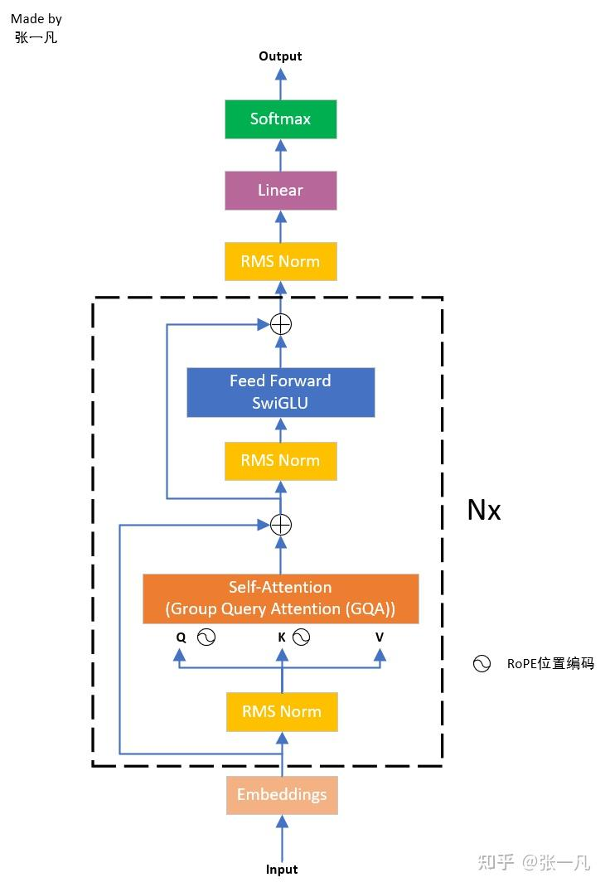
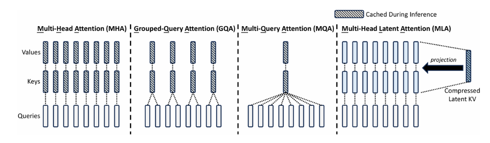
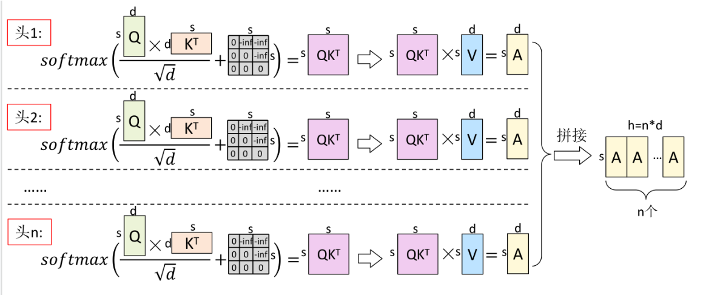
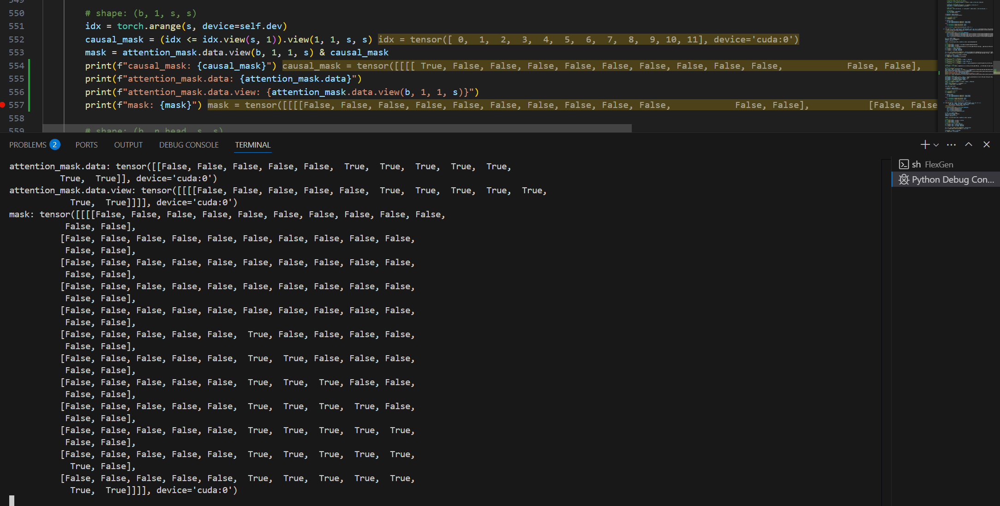
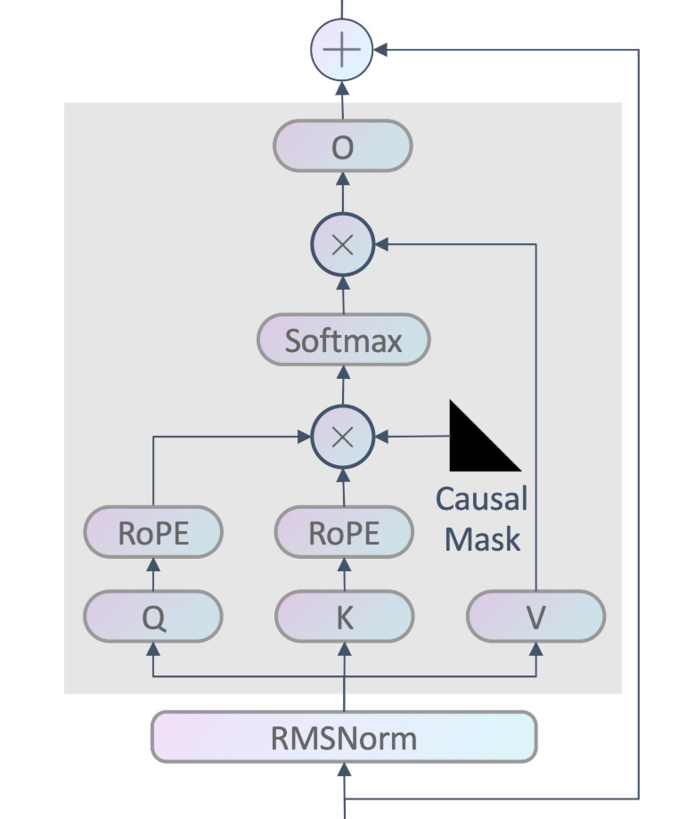
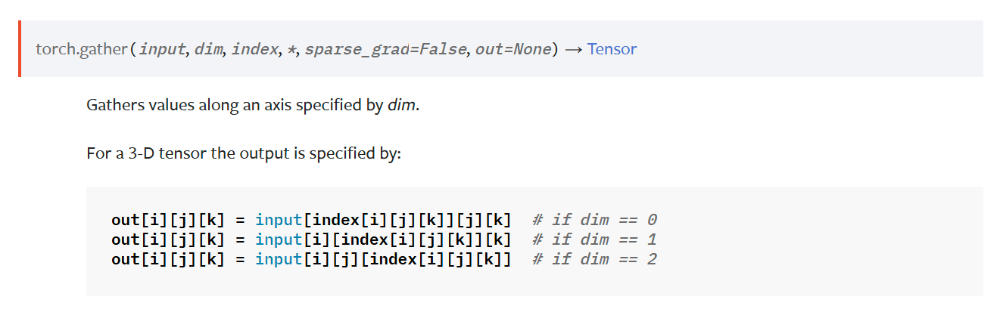
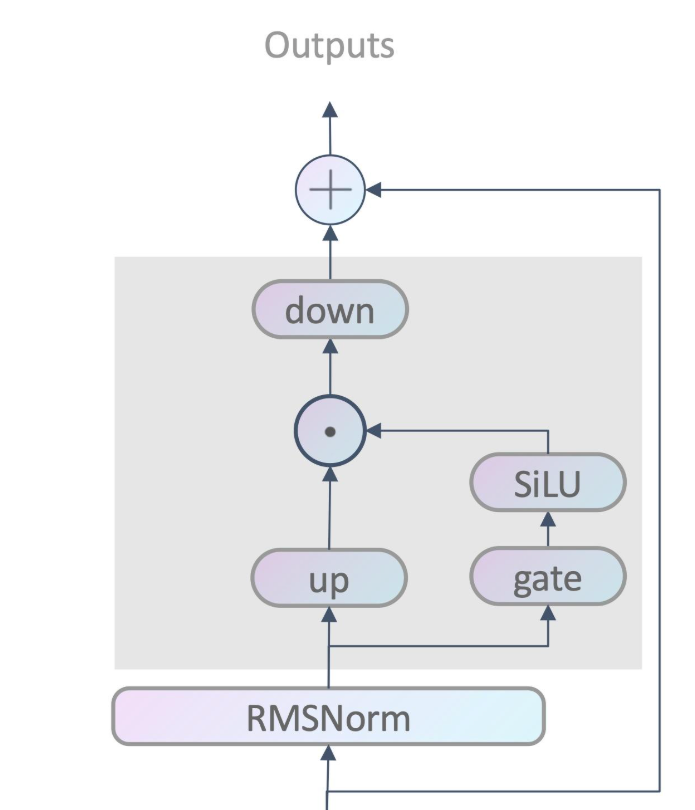
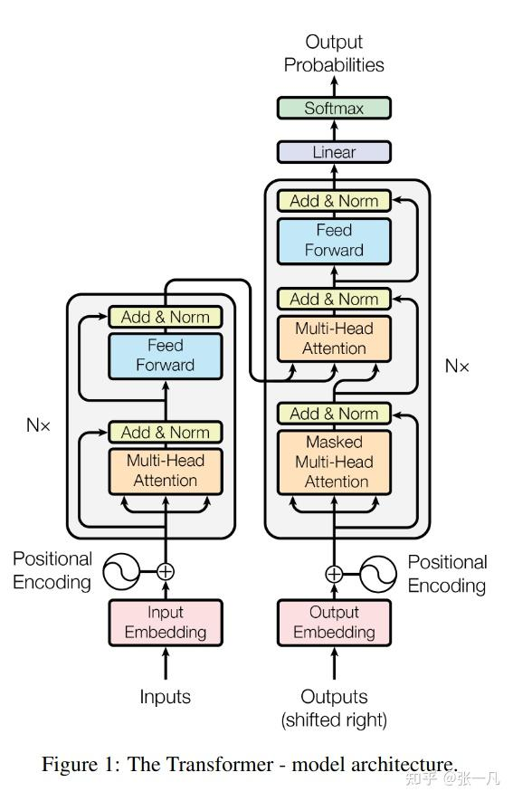

## 前言

FlexGen 是 LLM 推理加速领域较早的一个研究在内存受限的单个 GPU 环境中的高性能解决方案。FlexGen 关注的是批量处理的对延迟不敏感的任务，因此牺牲 latency 来换取 throughput。

我在实验室做科研实习的时候接触到 FlexGen 这个工作。我们把 FlexGen 作为实验的 baseline 之一，但很快就发现了它的问题：它只支持 OPT 模型。然而我们的实验希望能用较新的模型，幸好 github 上有前辈已经为其支持了 Qwen1.5 和 llama2（虽然 bug 比较多），于是我在前人基础上再添加了对llama3.1、llama3.2 与 Qwen2.5 模型的支持，并且根据实验的需要，增加了server功能，增加了batched prefill的功能，使其在 prefill 文本较长的情况下也能跑得起来。项目地址：[wdl339/FlexGen-for-llama-3.x](https://github.com/wdl339/FlexGen-for-llama-3.x) 。

FlexGen 也有它的优点，它麻雀虽小，五脏俱全，代码上比 transformers 和 llama.cpp 简洁的多，能完整支持特定模型，还支持 GPU、CPU 和 Disk 三种 backend。感觉 FlexGen 源码其实算是入门 LLM 推理比较好的一份教材，我自己对 LLM 还是一知半解，正好也学习和总结一下。

参考资料：

1. [FlexGen: High-Throughput Generative Inference of Large Language Models with a Single GPU](https://arxiv.org/abs/2303.06865)
2. [LLM推理论文精读1 -- FlexGen ICML'23 | Qingwei Ji](https://qingweiji.github.io/post/10_flexgen/#policy-search)
3. [一文读懂llama1、llama2、llama3、llama3.1、llama3.2技术细节及实战应用 - 知乎](https://zhuanlan.zhihu.com/p/696571171)
4. [【attention1】MHA、MQA、GQA和MLA - 知乎](https://zhuanlan.zhihu.com/p/21151178690)
5. [Huggingface🤗NLP笔记5：attention_mask在处理多个序列时的作用 - 知乎](https://zhuanlan.zhihu.com/p/414511434)
6. [#彻底理解# pytorch 中的 squeeze() 和 unsqueeze()函数 - 知乎](https://zhuanlan.zhihu.com/p/368920094)
7. [LLaMA 3/2/1模型结构总览 - 知乎](https://zhuanlan.zhihu.com/p/636784644)


## 总览

FlexGen 推理的真正意义上的“ main 函数”是 `run_flexgen`，推理一次的流程就是获取模型 config → 获取 device → 计算 policy → 创建模型 → 模型 generate → 输出 log 。

以我自己的项目代码的 llama3 系列为例，在 `flex_llama3.py`下，模型类：

```Python
class LlamaLM(OptLM):
	def __init__(...):
		...
		layers = []
        layers.append(LlamaInputEmbed(self.config, self.env, self.policy))
        for i in range(self.config.num_hidden_layers):
            if policy.sep_layer:
                layers.append(LlamaSelfAttention(self.config, self.env, self.policy, i, prefill_batch_size))
                layers.append(LlamaMLP(self.config, self.env, self.policy, i))
            else:
                layers.append(LlamaTransformerLayer(self.config, self.env, self.policy, i, prefill_batch_size))
        layers.append(LlamaOutputEmbed(self.config, self.env, self.policy))
        self.layers = layers
```

 这里可以看出 llama 模型的结构被拆分成4个组件，对应着看 llama3 的模型结构图：



这是基于 Transformer Decoder 的架构。LlamaLM 继承自 OptLM，四个组件也各自继承自 OPT 的组件，可以重用部分功能。

在 OptLM 类的 generate 函数，如果是端侧推理 num_gpu_batches = 1（而不是论文中的 multi batch ），最后会落到 `generation_loop_overlap_single_batch` 函数中：

```Python
def generation_loop_overlap_single_batch(self):
        self.load_weight(0, 0, 0)
        self.sync()

        # Generate
        for i in range(self.execute_gen_len):
            self.update_attention_mask(i, 0)
            for j in range(self.num_layers):
                self.load_weight(i, j+1, 0)
                self.load_cache(i, j+1, 0)
                self.load_hidden(i, j, 0)
                self.compute_layer(i, j, 0)
                self.store_cache(i, j-1, 0)
                self.store_hidden(i, j, 0)
                self.sync()

            if self.task.stop and np.all(self.stopped):
                break
```

这些 load 和 store 打头的函数，主要是由于可以选择各种矩阵 offload 的 device 和比例：

```Python
parser.add_argument("--percent", nargs="+", type=int,
        default=[100, 0, 100, 0, 100, 0],
        help="Six numbers. They are "
         "the percentage of weight on GPU, "
         "the percentage of weight on CPU, "
         "the percentage of attention cache on GPU, "
         "the percentage of attention cache on CPU, "
         "the percentage of activations on GPU, "
         "the percentage of activations on CPU")
```

再来看 `compute_layer`：

```Python
def compute_layer(self, i, j, k):
        # Update the hidden in place
        # Clear the weight_read_buf if it is the last gpu batch
        # Clear the cache_read_buf
        # Run layer computation
        self.layers[j].forward(self.hidden[i][j][k], self.cache_read_buf[j][k],
            self.weight_read_buf[j], self.attention_mask[k],
            self.cache_write_buf[j][k], i, k)
```

`forward` 方法在各组件中实现，例如：

```Python
class LlamaInputEmbed(InputEmbed):
    def forward(...):
        ...
        h, donate[0] = hidden.val, True
        ...
        h = self.compute.llama_input_embed(h, mask, w_token, self.config.pad_token_id, donate)
        hidden.val = h
```

最主要的就是 `self.compute.xxx` 方法，self.compute 就是推理的 device backend。于是看到 `llama_backend.py`，这里的 Llama3TorchDevice 类中就实现了 `llama_mha` 等方法。

模型推理需要加载权重矩阵，这在各组件的 `init_weight` 方法中体现。


## 计算过程

> LLM的推理过程通常包含两个阶段：
>
> （1）Prefill（预填充）：输入一个prompt序列，为每个transformer层生成 key cache 和 value cache（KV cache）
>
> （2）Decoding（解码）：使用并更新KV cache，一个接一个地生成token，当前生成的token词依赖于之前已经生成的token

### Input Embedding

先从 input 部分开始，

```Python
class LlamaInputEmbed(InputEmbed):
    def init_weight(self, weight_home, path):
        v, h, dtype = (self.config.vocab_size, self.config.input_dim,
            self.config.dtype)
        path = os.path.join(path, "")
        weight_specs = [
            # w_token
            ((v, h), dtype, path + "embed_tokens.weight"),
        ]
        weights = init_weight_list(weight_specs, self.policy, self.env)
        weight_home.store(weights)
```

- v：词表大小，llama3.1的 vocab_size = 128256
- h：隐藏层维度，在 config 中又叫 input_dim，llama3.1的 hidden_size = 4096

其 forward 方法为：

```Python
def forward(...):
    ...
    h, donate[0] = hidden.val, True
    ...
    h = self.compute.llama_input_embed(h, mask, w_token, self.config.pad_token_id, donate)
    hidden.val = h

# in llama_backend.py
def llama_input_embed(self, inputs, attention_mask, w_token, pad_token_id, donate):
    ...
    token_ids = inputs.data
    ...
    token_embed = F.embedding(token_ids, w_token.data, pad_token_id)
    return TorchTensor.create_from_torch(token_embed, self)
```

这里有个小细节是 hidden 是一个 ValueHolder 封装类，封装了 store, pop, clear 方法，用 .val 拿到它的实际值。inputs 是一个 TorchTensor 类，用 .data 拿到它的值。

```
For a tensor on a TorchDevice, self.data is a primitive tensor.
      type: torch.Tensor.
For a tensor on a TorchDisk, self.data is a filename.
      type: str
For a tensor on a TorchMixedDevice, self.data is (tensors, segment_points)
      type: Tuple[Tuple[TorchTensor], Tuple[int]]
For a tensor on a TorchCompressedDevice, self.data is (data, scale, compression_config)
      type: Tuple[TorchTensor, TorchTensor, CompressionConfig]
```

F 就是`torch.nn.functional`，`F.embedding` 的作用是将输入的 token_ids 映射到对应的嵌入向量。

w_token 的维度是 [v,h]，那 token_ids 呢？ token_ids 是从 hidden 来的，前文有出现过 `load_hidden` 函数：

```Python
def load_hidden(self, i, j, k):
        # Handle corner cases
        ...
        # Load to hidden states buffers
        dst = self.layers[j].compute
        if j == 0:
            gpu_batch_size = self.policy.gpu_batch_size
            left, right = k * gpu_batch_size, (k + 1) * gpu_batch_size
            if i == 0:
            	# load from the input ids
                val = dst.allocate((gpu_batch_size, self.task.prompt_len), np.int32)
                val.load_from_np(self.output_ids[left:right, :self.task.prompt_len])
            else:
            	# load from the last generated token
                pos = self.task.prompt_len + i
                val = dst.allocate((gpu_batch_size, 1), np.int32)
                val.load_from_np(self.output_ids[left:right, pos-1:pos])
        else:
     		# load from the last layer
            val = self.hidden[i][j-1][k].pop().move(dst)
        self.hidden[i][j][k].store(val)
```

- b：推理的 batch size
- s：prefill 输入序列的长度

于是，token_ids 的维度是 [b, s] （prefill 阶段）或 [b, 1] （decode 阶段）。`F.embedding`  得到的则是一个维度为 [b, s, h] 或 [b, 1, h] 的张量。


### Attention

#### Overview

在 FlexGen 论文中介绍了多头注意力（**M**ulti **H**ead **A**ttention）。第 i 个 self-attention 块的权重矩阵 $W_Q^i$，$W_K^i$，$W_V^i$，$W_O^i$ 维度均为 [h, h]（论文里是 $h_1$）。输入为 $x_i$，key、value、query 和 output 分别表示为 $x_K^i$，$x_V^i$，$x_Q^i$，$x_{out}^i$，它们的维度都是  [b, s, h] /  [b, 1, h] 。计算公式：
$$
x_K^i = x^i \cdot W_K^i
$$

$$
x_V^i = x^i \cdot W_V^i
$$

$$
x_Q^i = x^i \cdot W_Q^i
$$

$$
Attention(Q,K,V) = \operatorname{softmax}\left(\frac{x_{Q}^{i} {x_{K}^{i}}^{T}}{\sqrt{d}}\right) \cdot x_{V}^{i}
$$

$$
x_{out}^{i}=Attention(Q,K,V)\cdot W_{O}^{i}+x^{i}
$$

上面的公式是论文的写法，感觉实际上也不是很准确，更准确应该是：
$$
\operatorname{head}_{j}=\operatorname{Attention}\left(Q_j, K_j, V_j\right)
$$

$$
\operatorname{MHA}(Q,K,V)= \operatorname{Concat} (\operatorname{head}_1, \operatorname{head}_2, \ldots, \operatorname{head}_h)
$$

$$
x_{out}^{i}=\operatorname{MHA}(Q,K,V)\cdot W_{O}^{i}+x^{i}
$$

![MHA 图示，虽然 h 这个维度划分成了 n 个头，但本质上还是 [b,s,h] ](index.assets/image-20250408200436188.png)

> 1. Query (to match others)：输入信息，具有引导作用
> 2. Key (to be matched)：内容信息
> 3. Score (Q,K) = $x_{Q}^{i} {x_{K}^{i}}^{T}$
> 4. 当向量维度变大的时候，点积的方差会变大。元素的差值变大会导致 softmax 函数退化为 argmax 函数，也就是最大值 softmax 后的值为1，其他值则为0。 softmax 后的向量成为一个 one hot 向量，只有一个值为 1 的元素，其他都为 0 的话，反向传播的梯度会变为 0，也就是所谓的梯度消失。因此需要缩放因子，即除以 $\sqrt{d}$，把点积归一化成一个均值为 0， 方差为1的向量。（这是在训练的时候会有这样的好处，如果只是推理的话，似乎不除也行？）
> 5. $\text{softmax}(x_i) = e^{x_i}/ \sum_{j} e^{x_j} $，$x_i$ 是输入向量的第 i 个元素。Softmax 的作用是对向量做归一化，归一化到 [0,1] 之间。矩阵中，某个值的权重越大（越接近1），表示相似度越高。
> 6. 虽然 K 和 Q 都是三维向量，但它们之间的点积操作实际上是在序列长度这一维度上进行的。
> 7. Value (information to be extracted)：信息本身


#### GQA

现在看看 Attention 模块的权重：

```Python
class LlamaSelfAttention(SelfAttention):
    def init_weight(self, weight_home, path):
        h, n_head, n_kv_head, dtype = (self.config.input_dim, self.config.n_head, self.config.num_key_value_heads, self.config.dtype)
        head_dim = h // n_head
        path = os.path.join(os.path.join(path, f"layers.{self.layer_id}."))
        weight_specs = [
            # w_ln
            ((h,), dtype, path + "input_layernorm.weight"),
            # w_q
            ((h, n_head * head_dim), dtype, path + "self_attn.q_proj.weight"),
            # w_k
            ((n_kv_head * head_dim, h), dtype, path + "self_attn.k_proj.weight"),
            # w_v
            ((n_kv_head * head_dim, h), dtype, path + "self_attn.v_proj.weight"),
            # w_o
            ((n_head * head_dim, h), dtype, path + "self_attn.o_proj.weight"),
        ]...
```

好像和前面说的有点不同？这是因为 llama3 系列模型采用了分组查询注意力 (**G**rouped **Q**uery **A**ttention) 技术。

为了节省 KV cache，有奇才发明了 MQA (**M**ulti **Q**uery **A**ttention)，所有头共享 K 矩阵和 V 矩阵，内存占用直接降到 $\frac{1}{n}$，但是性能下降想必是很厉害的。于是折中的 GQA 就出现了，一组 Q 共用一个 K 和 V，在减少计算量的同时保持更多的多样性。



DeepSeek-V2 还提出 **M**ulti-head **L**atent **A**ttention，不过有点难懂就是了。

- $n_{head}$：注意力头数，llama3.1的 n_head=32
- $n_{kv head}$：GQA 的组数，llama3.1的 n_kv_head=8

现在 K 和 V 的维度是  [b, s, h * n_kv_head / n_head ] or  [b, 1, h * n_kv_head / n_head] 。


#### Attention Mask

现在看看 Attention 模块的 `forward`：

```Python
def forward(...):
        n_head = self.config.n_head
        n_kv_head = self.config.num_key_value_heads
        ...

        if i == 0:  # prefill ...
            position_ids = torch.cumsum(mask.data, dim=1).int() * mask.data - 1
            if self.prefill_batch_size == 0:
                h, new_k_cache, new_v_cache = self.compute.llama_mha(h, position_ids, mask, w_ln,
                    w_q, w_k, w_v, w_o, n_head, n_kv_head, donate, self.config.rms_norm_eps,
                    self.policy.compress_cache, self.policy.comp_cache_config)
            else:
                h, new_k_cache, new_v_cache = self.compute.llama_mha_batched(... ,
                    batch_size=self.prefill_batch_size)
            cache_write_buf.store((new_k_cache, new_v_cache))
        else:  # decoding ...
            position_ids = torch.cumsum(mask.data, dim=1).int() * mask.data - 1
            position_ids = position_ids[:, -h.shape[1]].unsqueeze(1)
            h, new_k_cache, new_v_cache = self.compute.llama_mha_gen(...)
            cache_write_buf.store((new_k_cache, new_v_cache))
```

由于 prefill 和 decode 的差异（除了维度之外，还有是否可以 compress 等区别），以及对于较长的输出，我为其支持了 batch prefill 的方式减少显存占用，这里分出了三种不同的方法。

还值得注意的一个是 position_ids 和 mask。

这里首先举一个例子，batch size为1，输入是：

```Python
prompts = ["Paris is the capital city of"]
input_ids = tokenizer(prompts, padding="max_length",
                      max_length=12, truncation=True).input_ids
```

在 prefill 的计算前，加上打印：

```Python
print(mask.data)
print(torch.cumsum(mask.data, dim=1).int())
print(position_ids)
```

得到的结果是：

```
tensor([[False, False, False, False, False,  True,  True,  True,  True,  True,
          True,  True]], device='cuda:0')
tensor([[0, 0, 0, 0, 0, 1, 2, 3, 4, 5, 6, 7]], device='cuda:0',
       dtype=torch.int32)
tensor([[-1, -1, -1, -1, -1,  0,  1,  2,  3,  4,  5,  6]], device='cuda:0',
       dtype=torch.int32)
```

这个句子可以被分为7个词（虽然只有6单词），不过我们指定了12个词，那么前面多余的部分都是 padding，真正的文字部分是从下标0开始的（这里有个很坑的点是，对 OPT 模型下标是从2开始了，一开始 `position_ids = torch.cumsum(mask.data, dim=1).int() * mask.data - 1` 这句是错误的+1，找了好久才把这个 bug 找出来）

而在第1次 decode，`position_ids = position_ids[:, -h.shape[1]].unsqueeze(1)` 前后分别 `print(position_ids)`，得到：

```
tensor([[-1, -1, -1, -1, -1,  0,  1,  2,  3,  4,  5,  6,  7]], device='cuda:0',
       dtype=torch.int32)
tensor([[7]], device='cuda:0',dtype=torch.int32)
```

这时候每次就截的只剩下最后一个 token 了。关于 mask 的生成和更新，以下两个函数负责更新 mask：

```Python
def update_attention_mask(self, i, k):
        if i > 0:
            mask = self.attention_mask[k]
            assert mask.val is not None
            mask.val = mask.val.device.extend_attention_mask(mask.val, [True])
            return

        ...
        input_ids = self.output_ids[left:right, :self.task.prompt_len]
		...
        val.load_from_np((input_ids != self.config.pad_token_id))
        self.attention_mask[k].store(val)

def extend_attention_mask(self, attention_mask, donate):
        bs = attention_mask.shape[0]
        data = torch.concat((attention_mask.data,
             torch.ones((bs, 1), dtype=attention_mask.dtype, device=self.dev)), dim=1)
        return TorchTensor.create_from_torch(data, self)
```

- `torch.concat` 将多个张量沿着指定的维度进行拼接
- `torch.cumsum` 用于计算张量沿指定维度的累积和

一开始我的感觉是，这个 attention mask 是不是没有太大意义？其实不是，想想如果在同时处理多个序列的情况下：

```Python
prompts = ["Paris is the capital city of", "London is the capital"]
input_ids = tokenizer(prompts, padding="max_length",
                          max_length=12, truncation=True).input_ids
```

第1次 decode：

```
position_ids: tensor([[-1, -1, -1, -1, -1,  0,  1,  2,  3,  4,  5,  6,  7],
        [-1, -1, -1, -1, -1, -1, -1,  0,  1,  2,  3,  4,  5]], device='cuda:0',
       dtype=torch.int32)
position_ids: tensor([[7],
        [5]], device='cuda:0', dtype=torch.int32)
```

两句长短不一，前面那些复杂计算就有用处了。这句`position_ids = position_ids[:, -h.shape[1]].unsqueeze(1)` 产生的计算是：

```
# h shape: [b,1,h]
position_ids[:, -h.shape[1]] = tensor([7, 5])
position_ids[:, -h.shape[1]].unsqueeze(1) = tensor([[7], [5]])
```

> torch.unsqueeze()函数的作用增加数组A指定位置N的维度，例如两行三列的数组A维度为(2，3)，那么这个数组就有三个位置可以增加维度，分别是（ [位置0] 2，[位置1] 3 [位置2] ）或者是 （ [位置-3] 2，[位置-2] 3 [位置-1] ），如果执行 torch.unsqueeze(A，1)，数据的维度就变为了 （2，1，3）
>
> torch.squeeze()函数的作用减少数组A指定位置N的维度，如果数组A的维度为（1，1，3）那么执行 torch.squeeze(A，1) 后A的维度变为 （1，3），中间的维度被删除。如果指定的维度大于1，那么操作无效，如果不指定维度N，那么将删除所有维度为1的维度

关于计算过程中的 mask ，后面还会再看到。


#### RMSNorm

接下来看看具体的 prefill 计算，`llama_mha`（的前面一小部分）：

```Python
def llama_mha(self, inputs, position_ids, attention_mask, w_ln, w_q, w_k, w_v,
            w_out, n_head, n_kv_head, donate, eps, compress_cache, comp_config):
        """Multi-head attention (prefill phase)."""
        b, s, h = inputs.shape
        head_dim = h // n_head
        scaling = head_dim ** -0.5

        hidden = rms_norm(inputs.data, weight=w_ln.data, eps=eps)

        # shape: (b, s, h)
        q = F.linear(hidden, w_q.data) * scaling
        k = F.linear(hidden, w_k.data)
        v = F.linear(hidden, w_v.data)
        # shape: (b, s, n_head, head_dim)
        q = q.view(b, s, n_head, head_dim)
        k = k.view(b, s, n_kv_head, head_dim)
        v = v.view(b, s, n_kv_head, head_dim)
```


这里还值得注意的是 RMSNorm：RMSNorm 是一种用于神经网络的归一化方法，全称是 Root Mean Square Normalization，它的核心思想是对输入特征进行归一化，使得它们具有统一的均方根。

假设输入向量为$ x = (x_1, x_2, \dots, x_h)$，RMSNorm的计算步骤如下：

1. **计算均方根（RMS）值**：$\text{RMS}(x) = \sqrt{\frac{1}{h} \sum_{i=1}^{h} x_i^2}$

2. **归一化**：$\hat{x}_i = \frac{x_i}{\text{RMS}(x) + \epsilon}$

3. **缩放**：$y_i = \gamma \cdot \hat{x}_i$ ，其中 $\gamma$ 也就是 w_ln 矩阵。

RMSNorm 与 Batch Normalization 和 Layer Normalization 的区别：

| 特性                 | RMSNorm                                            | Batch Normalization              | Layer Normalization                        |
| -------------------- | -------------------------------------------------- | -------------------------------- | ------------------------------------------ |
| **归一化维度**       | 每个样本的特征维度 h                               | 批量维度（每个特征）b            | 每个样本的特征维度 h                       |
| **计算内容**         | 计算均方根                                         | 计算均值和方差                   | 计算均值和方差                             |
| **是否依赖批次大小** | 否                                                 | 是                               | 否                                         |
| **计算复杂度**       | 较低（仅计算RMS）                                  | 较高（需计算均值和方差）         | 较高（需计算均值和方差）                   |
| **适用场景**         | Transformer等序列模型                              | CNN等需要批次归一化的场景        | Transformer、RNN等序列模型                 |
| **优势**             | 简化计算、提升效率，避免方差接近零导致的数值不稳定 | 提升训练稳定性，适用于大规模数据 | 适用于变长序列，保持特征内部的相对大小关系 |

代码实现：

```Python
def rms_norm(input, weight, eps) -> torch.Tensor:
    input_dtype = input.dtype
    hidden_states = input.to(torch.float32)
    variance = hidden_states.pow(2).mean(-1, keepdim=True)
    hidden_states = hidden_states * torch.rsqrt(variance + eps)
    return weight * hidden_states.to(input_dtype)
```


#### RoPE

```Python
def llama_mha(self, inputs, position_ids, attention_mask, w_ln, w_q, w_k, w_v,
            w_out, n_head, n_kv_head, donate, eps, compress_cache, comp_config):
		...
        cos, sin = self.llama3_rotary_embedding(v, position_ids)
        q, k = llama3_apply_rotary_pos_emb(q, k, cos, sin)
```

这部分数学对我来说还是太难了，我当时支持它的时候就是直接搬 transformers 库的实现...... 总之我们学系统的，知道这样操作之后维度还是不变应该也足够了。

几个重要函数：

-  `rope_init_fn`：初始化频率参数，生成倒数频率并根据配置调整。
- `llama3_rotary_embedding`：生成旋转嵌入，根据频率和位置 ID 计算正弦和余弦嵌入。
- `llama3_apply_rotary_pos_emb`：应用旋转嵌入，将正弦和余弦嵌入应用到 Q 和 K 上。

> Kimi 告诉我，LLaMA 3 使用旋转位置编码（RoPE）的原因主要有以下几点：
>
> 1. **有效结合绝对和相对位置信息**
>
> RoPE 是一种结合了绝对和相对位置编码优点的方法。它通过旋转矩阵对每个位置进行编码，能够同时保留绝对位置信息和相对位置信息。这种编码方式使得模型在处理长序列时能够更好地捕捉词与词之间的相对位置关系，从而提高对序列顺序的理解能力。
>
> 2. **提升长序列处理能力**
>
> RoPE 在处理长序列时表现出色。通过调整基频参数，RoPE 能够在长序列中保持准确的距离信息，从而有效支持更长的上下文长度。例如，LLaMA 3 将 RoPE 的基频超参数增加到 500,000，使其能够处理长达 32,768 个 token 的上下文。这种能力对于处理长文本或多轮对话等任务尤为重要。
>
> 3. **增强模型的外推性**
>
> RoPE 具有良好的外推性，能够生成超过预训练长度的位置编码。这意味着模型在训练时使用的序列长度较短，但在推理时可以处理更长的序列，而不会导致性能下降。这种外推能力使得模型在处理长文本时更加灵活和高效。
>
> 4. **提高模型的灵活性和鲁棒性**
>
> RoPE 的旋转矩阵设计使得位置编码具有周期性和旋转不变性，能够更好地处理序列中词语的位移问题。这种设计不仅提高了模型对位置信息的感知能力，还增强了模型在不同任务中的鲁棒性。
>
> 5. **优化训练和推理效率**
>
> RoPE 的实现相对简单，且计算效率较高。它通过简单的向量运算而不是矩阵乘法来执行旋转，减少了计算复杂度。此外，RoPE 在训练时表现出更快的收敛速度，并且在各种架构和训练设置中都表现稳健。
>
> 综上所述，RoPE 的这些特性使得它成为 LLaMA 3 等大语言模型中处理位置信息的理想选择。


#### Remaining Part of Prefill

继续往下看：

```Python
def llama_mha(self, inputs, position_ids, attention_mask, w_ln, w_q, w_k, w_v,
            w_out, n_head, n_kv_head, donate, eps, compress_cache, comp_config):
		...
        n_kv_groups = n_head // n_kv_head
        k = repeat_kv(k, n_kv_groups)
        v = repeat_kv(v, n_kv_groups)

        # shape: (b * n_head, s, head_dim)
        q = q.permute(0, 2, 1, 3).reshape(b * n_head, s, head_dim)
        # shape: (b * n_head, head_dim, s)
        k = k.permute(0, 2, 3, 1).reshape(b * n_head, head_dim, s)
        # shape: (b * n_head, s, head_dim)
        v = v.permute(0, 2, 1, 3).reshape(b * n_head, s, head_dim)

        # shape: (b * n_head, s, s)
        attn_weights = torch.bmm(q, k)
```

这里先把 Q, K, V 的 维度全都转成 [b, s, n_head, head_dim]，接下来维度再变换，将多头注意力的计算分解为多个独立的单头注意力计算。`torch.bmm` 是批量矩阵乘法。



```Python
# shape: (b, 1, s, s)
idx = torch.arange(s, device=self.dev)
causal_mask = (idx <= idx.view(s, 1)).view(1, 1, s, s)
mask = attention_mask.data.view(b, 1, 1, s) & causal_mask

# shape: (b, n_head, s, s)
attn_weights = attn_weights.view(b, n_head, s, s)
attn_weights = torch.where(mask, attn_weights, -1e4)
```

这里如果打印出来的话，causal_mask 是一个下三角矩阵，主要作用是确保每个位置只能关注其之前的位置。最终的 mask 则是一个砍掉了 padding 部分的下三角矩阵（如图，现在 padding 在左边，有时候也会在右边）。



随后，使用 `torch.where` 将掩码之外的值设置为一个非常小的值，以确保这些位置在softmax后接近于0。

```Python
attn_weights = attn_weights.view(b * n_head, s, s)
attn_weights = F.softmax(attn_weights, dim=2)
# shape: (b, n_head, s, head_dim)
value = torch.bmm(attn_weights, v).view(b, n_head, s, head_dim)
# shape: (b, s, h)
value = value.transpose(1, 2).reshape(b, s, h)
value = F.linear(value, w_out.data)
value.add_(inputs.data)

# (s, b * n_head, head_dim)
k = k.permute(2, 0, 1)
v = v.permute(1, 0, 2)
...
return TorchTensor.create_from_torch(value, self), k, v
```

这里就是后续的计算了，最后为什么要再把 K 和 V 变形为 [s, b * n_head, head_dim] ？因为这里 return 回去是作为 KCache 和 VCache 保存起来，到了 decode 阶段维度是 [1, b * n_head, head_dim] ，就方便  KVCache 的拼接。




#### Batched Prefill

由于我们科研是做端侧的研究，端侧显存实在是少得可怜，加载完权重之后就不剩多少地方了。FlexGen 又是比较早的工作，如果不加以优化，就容易 OOM 然后根本就跑不起来。比如这个地方：

```Python
# shape: (b * n_head, s, s)
attn_weights = torch.bmm(q, k)
```

如果prefill 的 s 长度达到几千的数量级就炸了...

改进方法就是分批次地做矩阵乘：

```python
# shape: (b * n_head, s, head_dim)
q = q.permute(0, 2, 1, 3).reshape(b * n_head, s, head_dim)
# shape: (b * n_head, head_dim, s)
k = k.permute(0, 2, 3, 1).reshape(b * n_head, head_dim, s)
# shape: (b * n_head, s, head_dim)
v = v.permute(0, 2, 1, 3).reshape(b * n_head, s, head_dim)

value_out = torch.zeros((b, s, h), dtype=inputs.data.dtype, device=self.dev)
num_batches = (s + batch_size - 1) // batch_size
idx = torch.arange(s, device=self.dev)
causal_mask = (idx <= idx.view(s, 1)).view(1, 1, s, s)

for i in range(num_batches):
    start_idx = i * batch_size
    end_idx = min((i + 1) * batch_size, s)
    current_len = end_idx - start_idx

    # shape: (b * n_head, current_len, head_dim)
    q_batch = q[:, start_idx:end_idx, :]

    # shape: (b * n_head, current_len, s)
    attn_weights = torch.bmm(q_batch, k)

    # shape: (b, 1, current_len, s)
    batch_mask = attention_mask.data.view(b, 1, 1, s) & causal_mask[:, :, start_idx:end_idx, :]

    # shape: (b, n_head, current_len, s)
    attn_weights = attn_weights.view(b, n_head, current_len, s)
    attn_weights = torch.where(batch_mask, attn_weights, -1e4)
    attn_weights = attn_weights.view(b * n_head, current_len, s)
    attn_weights = F.softmax(attn_weights, dim=2)

    # shape: (b, n_head, current_len, head_dim)
    value_batch = torch.bmm(attn_weights, v).view(b, n_head, current_len, head_dim)

    # shape: (b, current_len, h)
    value_batch = value_batch.transpose(1, 2).reshape(b, current_len, h)
    value_batch = F.linear(value_batch, w_out.data)

    value_out[:, start_idx:end_idx, :] = value_batch + inputs.data[:, start_idx:end_idx, :]

    del attn_weights, value_batch
    torch.cuda.empty_cache()
```


#### Decode

decode 和 prefill 的计算区别我感觉本质上还是 [b, s, h] 和 [b, 1, h] 的区别。例如：

```python
def llama_mha_gen(...):
    b, tgt_s, h = inputs.shape
    src_s = attention_mask.shape[1]
```

这里 tgt_s = 1，src_s 就是当前序列的长度，例如 prefill 长度 s = 12，第一次 decode 的时候 src_s = 13。

主要的不同还是在 RoPE 之后，有一个 KVCache 的拼接。这里的代码我省去了那些对于权重压缩、不同 device 和 attention 稀疏性的处理，只保留主干：

```python
# shape: (b * n_head, 1, head_dim)
q = q.permute(0, 2, 1, 3).reshape(b * n_head, tgt_s, head_dim)
# shape: (1, b * n_head, head_dim)
k_new = k.permute(1, 0, 2, 3).reshape(tgt_s, b * n_head, head_dim)
# shape: (1, b * n_head, head_dim)
v_new = v.permute(1, 0, 2, 3).reshape(tgt_s, b * n_head, head_dim)

# shape: (s, b * n_head, head_dim)
k = k_cache.data[:src_s]
v = v_cache.data[:src_s]
k[src_s - 1:src_s] = k_new
v[src_s - 1:src_s] = v_new

# shape: (b * n_head, head_dim, s)
k = k.permute(1, 2, 0).reshape(b * n_head, head_dim, src_s)
# shape: (b * n_head, s, head_dim)
v = v.permute(1, 0, 2).reshape(b * n_head, src_s, head_dim)

value = self._attention_value(q, k, v, attention_mask.data, b,
                              src_s, tgt_s, n_head, head_dim)

# shape: (b, 1, h)
value = value.transpose(1, 2).view(b, tgt_s, h)
value = F.linear(value, w_out.data)

value.add_(inputs.data)
```

`_attention_value` 的算法其实和前面差不多的，不过为了对维度清楚一些，还是列在这里：

```python
def _attention_value(...):
        # shape: (b * n_head, 1, s)
        attn_weights = self._attention_weights(q, k, mask, b, src_s, n_head)
        # shape: (b, n_head, 1, head_dim)
        return torch.bmm(attn_weights, v).view(b, n_head, tgt_s, head_dim)
```


#### Sparsity

为了加速计算，可以利用 attention 的稀疏性：

```python
k = k_cache.data[:src_s]
k[src_s - 1:src_s] = k_new
k = k.permute(1, 2, 0).reshape(b * n_head, head_dim, src_s)
value = self._sparse_attention_value(q, k, v_new, v_cache,
                        attention_mask.data, b, src_s, tgt_s, n_head, head_dim,
                        attn_sparsity)
```

这里只稀疏了 V 矩阵，来到 `_sparse_attention_value	` 函数：

```python
def _sparse_attention_value(...):
        # shape: (b * n_head, 1, s)
        attn_weights = self._attention_weights(q, k, mask, b, src_s, n_head)
        topk = int(attn_sparsity * (attn_weights.shape[2] - 1))
        topk_weights, topk_indices = attn_weights[:, :, :-1].topk(
            topk, dim=2, sorted=False)
        # shape: (b * n_head, 1, topk) -> (topk, b * n_head)
        topk_indices = topk_indices.view(b * n_head, topk).transpose(0, 1)
        # shape: (b * n_head, 1, topk+1)
        attn_weights = torch.cat([topk_weights,
            attn_weights[:, :, -1].unsqueeze(-1)], dim=-1)

        # shape: (s, b * n_head, head_dim)
        v_home = v_cache
        v_buf = self.allocate((topk+1, b*n_head, head_dim), np.float16)

        indices_src = topk_indices
        indices_tgt = (slice(0, indices_src.shape[0]), slice(0, v_home.shape[1]))
        general_copy(v_buf, indices_tgt, v_home, indices_src)

        # shape: (topk + 1, b * n_head, head_dim)
        v_buf[topk:topk+1] = v_new
        # shape: (b * n_head, topk+1, head_dim)
        v = v_buf.permute(1, 0, 2).reshape(b * n_head, topk+1, head_dim)

        # shape: (b * n_head, 1, head_dim)
        return torch.bmm(attn_weights, v).view(b, n_head, tgt_s, head_dim)
```

这里我也稍微改动了一下。简而言之就是 attn_weights 的 s 维度的前 s - 1 个里面抽 topk 个，与最后1个位置拼成形状为 [b * n_head, 1, topk+1] 的矩阵，然后对应 v 也相应地切片。因为 v_new 是照算不误的，所以 v_home 实际上还是存了全部的 v 矩阵。

这里 v 的切片其实不是用 v_home =  v_home [indices_src] 来切片的，如果这样做的话， v_home 维度 [s, b * n_head, head_dim]，indices_src 维度 [topk, b * n_head]，最终结果维度其实是 [topk, b * n_head, b * n_head, head_dim]。v 的切片用的是这样一个函数：

```python
def vector_gather(vectors, indices):
    """
    Gathers (batched) vectors according to indices.
    Arguments:
        vectors: Tensor[S, B, H]
        indices: Tensor[K, B]
    Returns:
        Tensor[K, B, H]
    """
    S, B, H = vectors.shape
    K, B2 = indices.shape
    assert B == B2
    indices = indices.reshape(K, B, 1).expand(K, B, H)
    out = vectors.gather(dim=0, index=indices)
    return out
```




### MLP

权重：

```python
class LlamaMLP(MLP):
    def init_weight(self, weight_home, path):
        h, intermediate, dtype = (self.config.input_dim, self.config.intermediate_size, self.config.dtype)
        path = os.path.join(os.path.join(path, f"layers.{self.layer_id}."))
        weight_specs = [
            # w_ln
            ((h,), dtype, path + "post_attention_layernorm.weight"),
            # w_g
            ((intermediate, h), dtype, path + "mlp.gate_proj.weight"),
            # w_u
            ((intermediate, h), dtype, path + "mlp.up_proj.weight"),
            # w_d
            ((h, intermediate), dtype, path + "mlp.down_proj.weight"),
        ]...
```

ih：intermediate size，MLP块提升的维度

MLP 结构：



inputs 维度为 [b,s,h]，代码：

```python
def llama_mlp(self, inputs, w_ln, w_g, w_u, w_d, eps, donate):
		# eps = self.config.rms_norm_eps
        out = rms_norm(inputs.data, weight=w_ln.data, eps=eps)
        # shape:  [b, s, ih]
        gate_out = F.linear(out, w_g.data)
        F.silu(gate_out, inplace=True)
        up_out = F.linear(out, w_u.data)
        out = F.linear(gate_out * up_out, w_d.data)
        out.add_(inputs.data)
        return TorchTensor.create_from_torch(out, self)
```

> LLaMA没有使用ReLU，而是使用了 SwiGLU，有时也被称为 SiLU。公式为： Sigmoid(x) ∗ x ，效果类似平滑版的ReLU
>
> 这里最后还有一个加法操作（前面 attention 也是），这是叫残差连接（Residual Connection），能够缓解深层网络中的梯度消失问题，同时加速训练过程。


### Output Embedding

权重：

```python
class LlamaOutputEmbed(OutputEmbed):
    def init_weight(self, weight_home, path):
    	...
        if self.config.has_lm_head:
            weight_specs = [
                # w_ln
                ((h,), dtype, path + "norm.weight"),
                # w_token
                ((v, h), dtype, path + "lm_head.weight"),
            ]
        else:
        	# 如果没有 lm_head.weight，可能是与 embed_tokens.weight 相同
            weight_specs = [
                # w_ln
                ((h,), dtype, path + "norm.weight"),
                # w_token
                ((v, h), dtype, path + "embed_tokens.weight"),
            ]
```

代码：

```python
def llama_output_embed(self, inputs, w_ln, w_token, eps, donate, do_sample, temperature):
        hidden = rms_norm(inputs.data, weight=w_ln.data, eps=eps)
        if donate[0]: inputs.delete()

        # output embedding
        # logits = F.linear(hidden, w_token.data)
        # last_token_logits = logits[:,-1,:]
        last_token_hidden = hidden[:, -1, :]
        last_token_logits = F.linear(last_token_hidden, w_token.data)

        if do_sample and not temperature < 1e-5:
            probs = torch.softmax(last_token_logits / temperature, dim=-1)
            ids = torch.multinomial(probs, num_samples=1)
        else:
            ids = last_token_logits.argmax(dim=1, keepdim=True)
        return TorchTensor.create_from_torch(ids, self)
```

这里注释掉的是它原本的代码，我给它优化了下。不然按 hidden 的维度 [b, s, h]，logits 的维度将达到 [b, s, v]，在 s 较大的时候也是容易 OOM 的。


## 参数量分析

模型权重占用（按 FP16 算，一个数占两个 bytes）：

```python
def model_bytes(self):
    h = self.input_dim
    intermediate = self.intermediate_size
    return 2 * (
            # input
            self.vocab_size * h +
            self.num_hidden_layers * (
                # self-attention
                2 * h * h + 2 * h * h / (self.n_head / self.num_key_value_heads) +
                # mlp
                3 * h * intermediate +
                # layer norm
                2 * h
            ) +
            # output
            h + self.vocab_size * h
    	)
```

KVCache 占用：

```python
def cache_bytes(self, batch_size, seq_len):
    return 2 * batch_size * seq_len * self.input_dim * self.num_hidden_layers * 2
```

经典 [b, s, h]，最后乘2当然是因为 K 和 V 一样占用。

中间结果占用，也是 [b, s, h]：

```python
def hidden_bytes(self, batch_size, seq_len):
    return 2 * batch_size * seq_len * self.input_dim
```

对于 llama 3.1 8b instruct 模型，以上变量的取值为：

- vocab_size = 128256
- input_dim (h) = 4096
- num_hidden_layers = 32
- n_head = 32
- num_key_value_heads = 8
- intermediate_size = 14336

对于 llama 3.2 3b instruct 模型，以上变量的取值为：

- vocab_size = 128256
- input_dim (h) = 3072
- num_hidden_layers = 28
- n_head = 24
- num_key_value_heads = 8
- intermediate_size = 8192


## 附录

Transformer 模型结构图：


