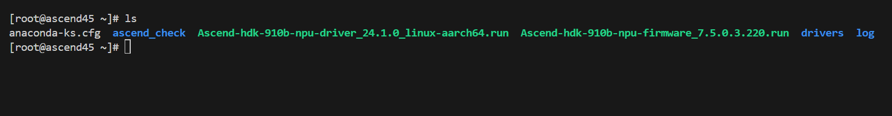
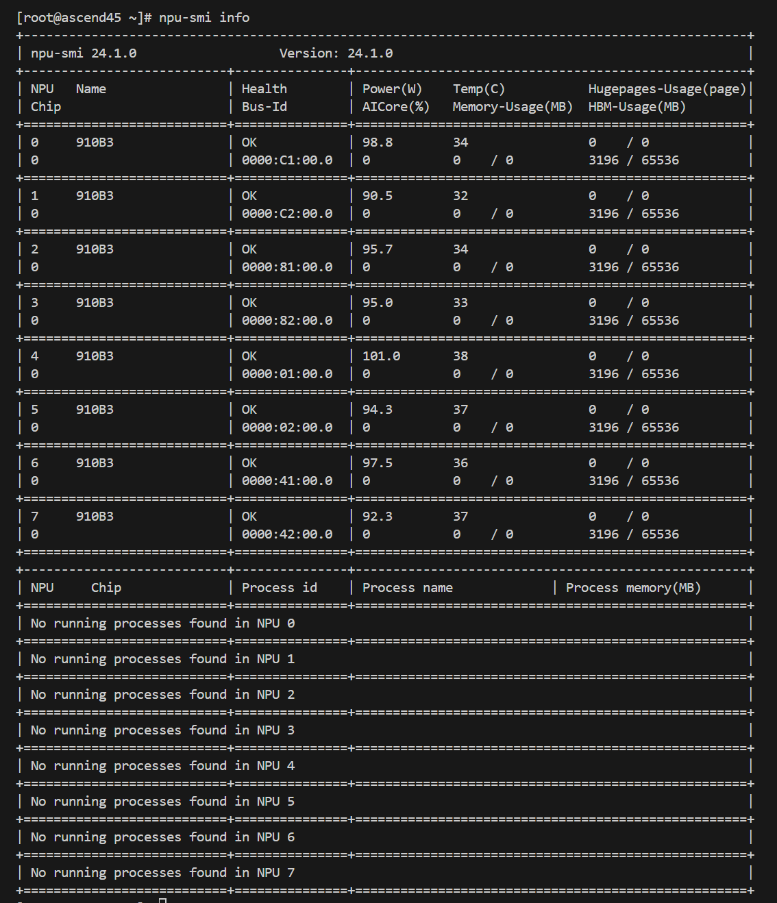
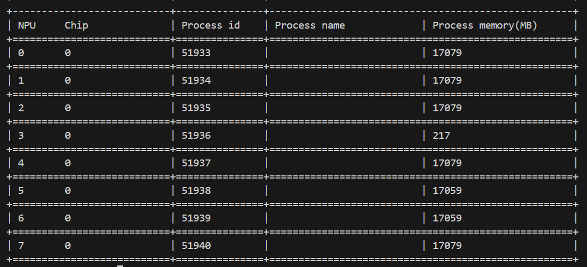
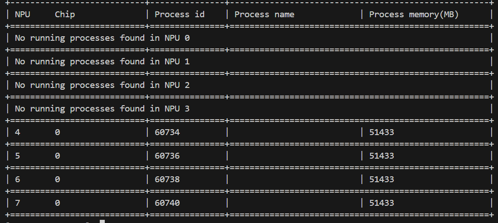
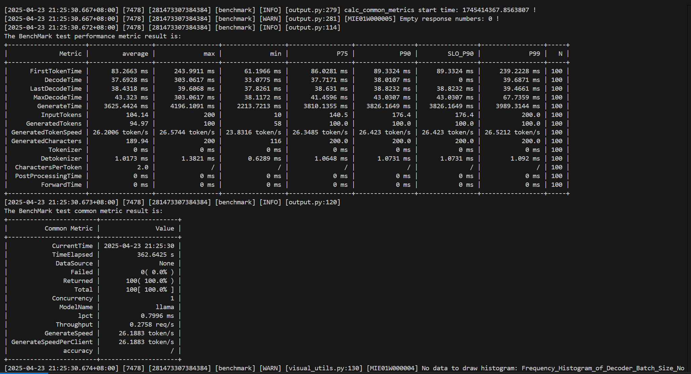

## 前言

前面忘了，后面忘了，总之现在有一个机会，需要我在一台晟腾 Atlas 800I A2 服务器上部署 DeepSeek-R1-Distill-Llama-70B 模型，就顺便把部署的过程记录下来。

参考资料：

1. [DeepSeek-R1-Distill-Llama-70B-模型库-ModelZoo-昇腾社区](https://www.hiascend.com/software/modelzoo/models/detail/ee3f9897743a4341b43710f8d204733a)
2. [功能介绍-MindIE Benchmark-MindIE Service Tools-MindIE Service组件-MindIE Service开发指南-服务化集成部署-MindIE1.0.0开发文档-昇腾社区](https://www.hiascend.com/document/detail/zh/mindie/100/mindieservice/servicedev/mindie_service0150.html)
3. [非root用户安装git-lfs - 知乎](https://zhuanlan.zhihu.com/p/691699741)
4. [mindie](https://www.hiascend.com/developer/ascendhub/detail/af85b724a7e5469ebd7ea13c3439d48f)


## 环境检查

来到计算节点上，检查现在上面都有啥：



额......还真是一穷二白啊。

检查驱动：



幸好驱动还是有的。


## 安装docker

```
curl -Lo docker-28.0.0.tgz https://download.docker.com/linux/static/stable/aarch64/docker-28.0.0.tgz
```

> 踩坑！这里 openeuler 对应的是 aarch64 架构（ `uname -a` 可查），一开始不小心装到了 x86_64 的安装包，导致无法执行！

由于计算节点并不联网，因此很多时候需要先在登陆节点上下载好东西，再 scp 传到计算节点上。

> 踩坑！scp 一直没成功，找了专家来看才知道是因为远程 shell 在非交互式会话中输出了内容，干扰了 SCP 协议。总之就是把 .bashrc 里面的 print 注释掉就好......

```
tar -zxvf docker-28.0.0.tgz
cp ./docker/* /usr/bin
cd /etc/systemd/system/
touch docker.service
vim docker.service
```

docker.service 中写入：

```
[Unit]
Description=Docker Application Container Engine
Documentation=https://docs.docker.com
After=network-online.target firewalld.service
Wants=network-online.target

[Service]
Type=notify
ExecStart=/usr/bin/dockerd
ExecReload=/bin/kill -s HUP $MAINPID 

TimeoutSec=0

RestartSec=2

ExecStartPost=/usr/sbin/iptables -P FORWARD ACCEPT
Restart=always

TimeoutStartSec=0


LimitNOFILE=infinity
LimitNPROC=infinity

LimitCORE=infinity

Delegate=yes
KillMode=process
StartLimitBurst=3
StartLimitInterval=60s

[Install]
WantedBy=multi-user.target
```

上面这段是从另一台服务器上直接copy下来的，具体就不追究了。

```
chmod +x docker.service
systemctl daemon-reload
systemctl start docker
systemctl status docker
```

看到状态是 active (running) 就好。


## 下载模型权重

首先需要 git-lfs （如果没有的话），我这边没有 root 权限不能 yum install ，所以只能这样装：

```
wget https://www.github.com/git-lfs/git-lfs/releases/download/v3.2.0/git-lfs-linux-arm64-v3.2.0.tar.gz
tar -xzf git-lfs-linux-arm64-v3.2.0.tar.gz
cd git-lfs-3.2.0
vim install.sh
```

修改 predix：

```
prefix="/xxx/git-lfs-3.2.0"
```

退出 vim ：

```
./install.sh
```

出现 Git LFS initialized 安装成功。

```
git-lfs version
```

如果出现 -bash: git-lfs: command not found ，要设置环境变量

```
echo $PATH
export PATH=XXX/git-lfs-3.2.0/bin:$PATH
```

下载模型权重：

```
git lfs install
git clone https://huggingface.co/deepseek-ai/DeepSeek-R1-Distill-Llama-70B
```


## 下载MindIE镜像

按照 [mindie](https://www.hiascend.com/developer/ascendhub/detail/af85b724a7e5469ebd7ea13c3439d48f) 的指引下载适配DeepSeek-R1-Distill-Llama-70B的镜像包：1.0.0-800I-A2-py311-openeuler24.03-lts。

不知道为什么居然还要申请，幸好我急中生智，发现另一台计算节点上有这个镜像的压缩包，直接几下 scp 传到我的节点上，再

```
docker load -i mindie_1.0.0.tar
```

搞定！最后使用 `docker images` 命令确认镜像名称正确就好了。


## 容器内操作

新建容器：

```
docker run -it -d --net=host --shm-size=1g \
    --privileged \
    --name deepseek-r1-distill-llama-70b \
    --device=/dev/davinci_manager \
    --device=/dev/hisi_hdc \
    --device=/dev/devmm_svm \
    -v /usr/local/Ascend/driver:/usr/local/Ascend/driver:ro \
    -v /usr/local/sbin:/usr/local/sbin:ro \
    -v /root/DeepSeek-R1-Distill-Llama-70B:/root/DeepSeek-R1-Distill-Llama-70B:rw \
    swr.cn-south-1.myhuaweicloud.com/ascendhub/mindie:1.0.0-800I-A2-py311-openeuler24.03-lts bash
```

进入容器：

```
docker exec -it deepseek-r1-distill-llama-70b bash
```

删除容器（如有必要）：

```
docker stop deepseek-r1-distill-llama-70b
docker rm -it deepseek-r1-distill-llama-70b
```


## 简单测试

对话测试

```
cd $ATB_SPEED_HOME_PATH
torchrun --nproc_per_node 2 \
         --master_port 20037 \
         -m examples.run_pa \
         --model_path /root/DeepSeek-R1-Distill-Llama-70B \
         --input_texts 'What is deep learning?' \
         --max_output_length 20
```

实际上模型不量化的话铁定OOM，试图加上--nnodes 4 参数，但是又直接卡住了。反正后面还有机会验证，先跳过这个测试。

性能测试

```
cd $ATB_SPEED_HOME_PATH/tests/modeltest/
bash run.sh pa_bf16 performance [[256,256]] 1 llama /root/DeepSeek-R1-Distill-Llama-70B 8
```

直接拉满！




## 服务化推理

```
vim /usr/local/Ascend/mindie/latest/mindie-service/conf/config.json
```

更改配置文件

```
{
    ...
    "ServerConfig" :
    {
        ...
        "port" : 1339, #自定义
        "managementPort" : 1340, #自定义
        "metricsPort" : 1341, #自定义
        ...
        "httpsEnabled" : false,
        ...
    },

    "BackendConfig": {
        ...
        "npuDeviceIds" : [[4,5,6,7]],
        ...
        "ModelDeployConfig" :
        {
            "maxSeqLen" : 40960,
            "maxInputTokenLen" : 20480,
            "truncation" : false,
            "ModelConfig" : [
                {
                    "modelInstanceType" : "Standard",
                    "modelName" : "llama",
                    "modelWeightPath" : "/root/DeepSeek-R1-Distill-Llama-70B",
                    "worldSize" : 4,
                    "cpuMemSize" : 5,
                    "npuMemSize" : 18,
                    "backendType" : "atb",
                    "trustRemoteCode" : false
                }
            ]
        }
        ...
        
        "ScheduleConfig" :
        {
            ...
            "maxPrefillTokens" : 61440,
            ...
            "maxIterTimes" : 40960,
            ...
        }
    }
}
```

> 这里把 maxSeqLen 之类的参数调的比较大，主要是因为模型的思维链的存在，可能会输出较多内容才能得到答案，因此需要给足够的输出空间。有些参数是凭感觉调的，有些则是参考了[性能调优流程-性能调优-MindIE Service开发指南-服务化集成部署-MindIE1.0.0开发文档-昇腾社区](https://www.hiascend.com/document/detail/zh/mindie/100/mindieservice/servicedev/mindie_service0105.html#ZH-CN_TOPIC_0000002151290336__table1382538164418)，例如 npuMemSize 的计算，参考了计算公式：Floor[(单卡显存 - 空闲占用 - 权重 / NPU卡数 ) * 系数]，系数取值为0.8。npuMemSize = Floor[ (64 - 3.3 - 132/4 )] * 0.8 = 22G，然后稍微取小，取到18G

拉起服务化

```
cd /usr/local/Ascend/mindie/latest/mindie-service/bin
chmod 750 /root/DeepSeek-R1-Distill-Llama-70B/config.json
nohup ./mindieservice_daemon > mindie-log 2>&1 &
```

在后台运行 `mindieservice_daemon` 程序，并将其输出（包括错误信息）记录到 `mindie-log` 文件中，即使终端关闭，程序也会继续运行。

查看当前情况：

```
npu-smi info
```



新建窗口测试

```
# vllm 接口
curl 127.0.0.1:1339/generate -d '{
    "prompt": "What is deep learning?",
    "max_tokens": 2048,
    "stream": false,
    "do_sample":true,
    "repetition_penalty": 1.00,
    "temperature": 0.01,
    "top_p": 0.001,
    "top_k": 1,
    "model": "llama"
}'

# openAI 接口
curl 127.0.0.1:1339/v1/chat/completions ...
```

终止程序（如有必要）：

```
ps aux | grep mindieservice_daemon | grep -v grep | awk '{print $2}' | xargs kill
```


## 性能测试

测试信息：

- 测试工具：[功能介绍-MindIE Benchmark-MindIE Service Tools-MindIE Service组件-MindIE Service开发指南-服务化集成部署-MindIE1.0.0开发文档-昇腾社区](https://www.hiascend.com/document/detail/zh/mindie/100/mindieservice/servicedev/mindie_service0150.html)
- 卡数统一设置4
- 数据集：合成数据（synthetic）
- 模式：Client

在进行 Client 模式测试之前，需要先进行至服务化推理 “拉起服务化” 前的步骤。不过如果是性能测试的话，服务化推理的配置文件其实只要改模型路径（modelWeightPath）和 httpsEnabled 就行了，剩下都可以原封不动。

进入 docker 中：

```
pip show mindiebenchmark
pip show mindieclient
```

结果显示路径均在：/usr/local/lib/python3.11/site-packages。修改文件权限：

```
chmod 640 /usr/local/lib/python3.11/site-packages/mindiebenchmark/config/config.json
chmod 640 /usr/local/lib/python3.11/site-packages/mindiebenchmark/config/synthetic_config.json
```

配置环境变量：

```
source /usr/local/Ascend/ascend-toolkit/set_env.sh     # CANN
source /usr/local/Ascend/nnal/atb/set_env.sh           # ATB
source /usr/local/Ascend/llm_model/set_env.sh          # ATB Models (may be failed?)
source /usr/local/Ascend/mindie/set_env.sh             # MindIE
```

运行指令：

```
benchmark --DatasetType "synthetic" --ModelName llama --ModelPath "/root/DeepSeek-R1-Distill-Llama-70B" --TestType vllm_client --Http http://127.0.0.1:1025 --ManagementHttp http://127.0.0.2:1026 --Concurrency 1 --MaxOutputLen 2048 --TaskKind stream --Tokenizer True --SyntheticConfigPath /usr/local/lib/python3.11/site-packages/mindiebenchmark/config/synthetic_config.json        
```

运行结果：


