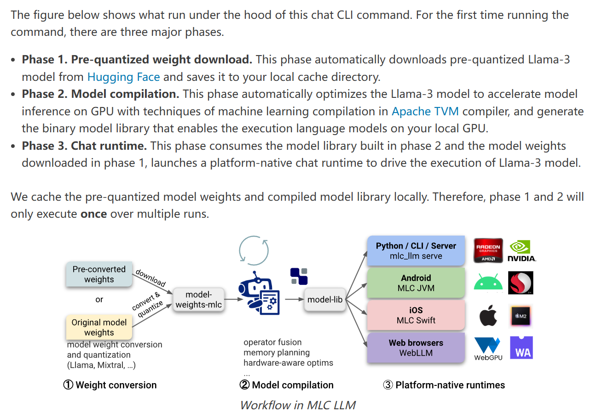
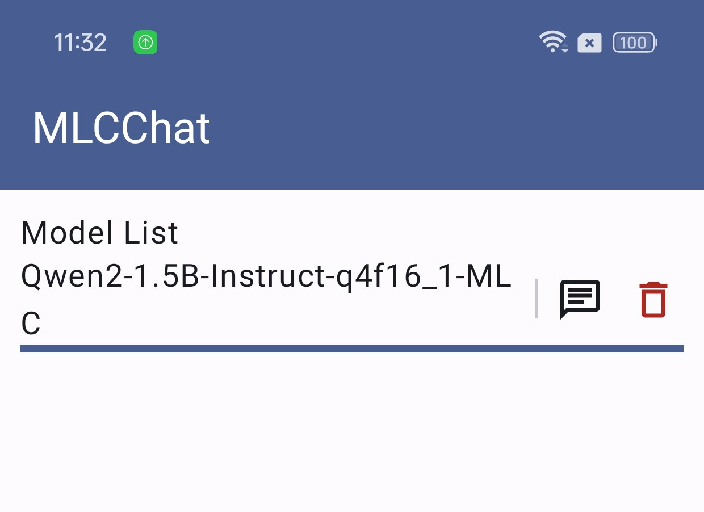
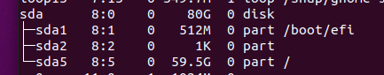
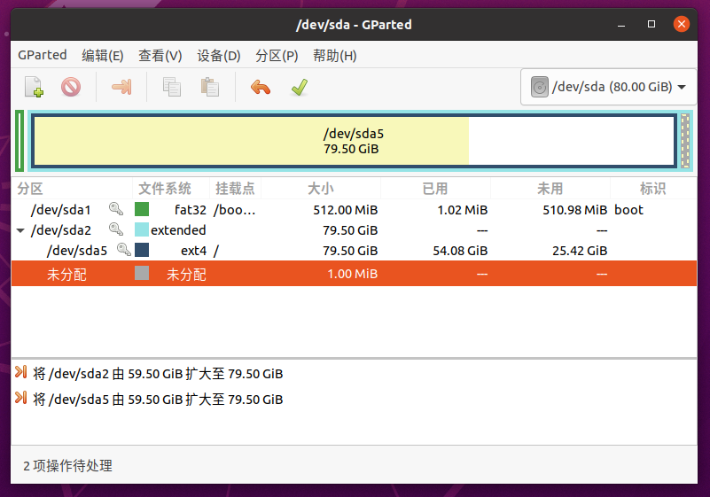

## 前言

MLC LLM是一个用于大语言模型（LLM）的机器学习编译器和高性能部署引擎，它能让你在任何平台上开发、优化和部署LLM。通过MLC LLM可以在手机端侧部署LLM，也就是说在不联网的情况下，可以与手机本地的LLM进行对话，这对于个人隐私保护和数据安全之类的都是非常有用处的。

以下是它的原理图：



这篇攻略就是我在使用MLC LLM在我的手机上部署通义千问2的时候写下的，需要提醒的是整套流程做下来耗时较长（我几乎是从零开始配置的，大概花了一天半的时间完工），所以建议你把这篇教程先大概看过一遍再决定要不要跟着做。

我自己配置的时候是参考官方文档[Android SDK — mlc-llm 0.1.0 documentation](https://llm.mlc.ai/docs/deploy/android.html)来配的，如果你看我的这篇攻略没看懂或者有攻略里没涉及到的报错的话，可以再去参考这个。


## 我的环境

Ubuntu 20.04虚拟机（建议不要用windows，我就是windows逝了逝不行才换到虚拟机里的，如果是虚拟机的话需要注意留足够空间，参考“后传”）

一加Ace 2手机（手机啥的都无所谓了，很难说哪种模型在哪台机型上跑不了，都是看脸的）


## 前期准备

### 安装rust

命令行输入

```
curl --proto '=https' --tlsv1.2 -sSf https://sh.rustup.rs | sh
```

安装完成后，输入

```
rustc --version
cargo --version
rustup --version
```

检查这仨是否被安装并可用于你的`$PATH`变量中。

配置环境变量，主目录下修改`.bashrc`文件，在末尾添加：

```
source $HOME/.cargo/env
```

保存之后，终端执行`source ~/.bashrc`使修改立即生效。


### 安装Android Studio

1. 来到[Android Studio开发者主页](https://developer.android.com/studio?hl=zh-cn)，安装linux版本的Android Studio。

   将下载的 `.tar.gz` 文件解压缩到喜欢的位置，例如 `/usr/local/` ：

   ```
   sudo tar -xzf android-studio-2024.1.1.12-linux.tar.gz -C /usr/local
   ```

2. 对于 64 位版本的 Linux，需要安装64 位计算机所需的库，对于Ubuntu需要安装的是：

   ```
   sudo apt-get install libc6:i386 libncurses5:i386 libstdc++6:i386 lib32z1 libbz2-1.0:i386
   ```
   安装这些库过程中发现PPA源访问不了，这是个在国外的第三方源，可以替换为中科大源。主目录下：

   ```
   sudo vim /etc/apt/sources.list.d/ubuntu-toolchain-r-ubuntu-test-xenial.list
   ```
   将文件中`http://ppa.launchpad.net`替换为`https://launchpad.proxy.ustclug.org`，`sudo apt-get update`之后再安装即可。

3. 接下来，进入 `android-studio/bin/` 目录，并执行 `studio.sh`。主目录下：

   `````
   cd /usr/local/android-studio/bin
   sudo chmod +x studio.sh
   ./studio.sh
   `````
   跳出来安装向导，全选默认就行了。中间会跳出来一个窗让你配代理proxy，我是一直开着梯子的，就让它auto-detect就行。

   进入Android Studio之后菜单栏点"Tools" - "Create Desktop Entry"创建桌面快捷方式，然后能在全部应用里看到它。再添加到收藏夹，访问就更方便了，不用每次都cd到位置然后`./studio.sh`。

4. 在"Settings"里找到Android SDK，在SDK Tools里勾选NDK与CMake并下载。

   配置环境变量，主目录下修改`.bashrc`文件，在末尾添加：

   ```
   export ANDROID_NDK=$HOME/Android/Sdk/ndk/27.0.12077973
   export TVM_NDK_CC=$ANDROID_NDK/toolchains/llvm/prebuilt/linux-x86_64/bin/aarch64-linux-android24-clang
   export JAVA_HOME=/usr/local/android-studio/jbr
   ```

   （注意版本号可能有所不同，以实际为准）

   执行`source ~/.bashrc`使修改立即生效。终端输入`$JAVA_HOME/bin/java -version` 确认。

   

### TVM Unity runtime

1. 添加环境变量：

   ```
   export TVM_SOURCE_DIR=/path/to/mlc-llm/3rdparty/tvm
   ```

   方法同上。因为我是打算代码直接clone到主目录下，所以`/path/to/mlc-llm`就是`$HOME`

2. 安装conda（有conda了可以跳过这节）

   非常建议使用conda，可以避免很多环境错乱的问题。我这里还没装conda，先把conda下载了，准备环境：

   ```
   sudo apt-get install libgl1-mesa-glx libegl1-mesa libxrandr2 libxrandr2 libxss1 libxcursor1 libxcomposite1 libasound2 libxi6 libxtst6
   ```

   正式下载：

   ```
   curl -O https://repo.anaconda.com/archive/Anaconda3-2024.06-1-Linux-x86_64.sh
   ```

   下载后：

   ```
   chmod +x Anaconda3-2024.06-1-Linux-x86_64.sh
   ./Anaconda3-2024.06-1-Linux-x86_64.sh
   ```

   然后会出来一大段协议，按Enter下滑最后输入yes，等待下载然后再输个yes。

   继续`source ~/.bashrc`，可以看到现在就进入到了conda的base环境中。如果想禁用自动激活base环境，可以这样配置：

   ```
   conda config --set auto_activate_base false
   ```

   想激活base的时候`conda activate`即可。这里我就不禁用了。

   执行`anaconda-navigator`可以打开GUI窗口，能打开就说明安装成功

3. 开启新环境：

   ```
   conda create --name mlc-prebuilt python=3.11
   conda activate mlc-prebuilt
   ```

   【退出环境是`conda deactivate`，想退的时候再退】

   这里它提供了两种安装方法，一种是Prebuilt Package，另一种是Build from Source。我选择的是Prebuilt Package这个方法。通过pip安装MLC-LLM：

   ```
   python -m pip install --pre -U -f https://mlc.ai/wheels mlc-llm-nightly mlc-ai-nightly
   ```

   需要装很多东西然后等一段时间。安装成功之后还有个git-lfs（一个Git扩展，用于改善大文件的处理，后面会用到）要装。conda-forge是个第三方频道所以下载可能也要等一定的时间：

   ```
   conda install -c conda-forge git-lfs
   ```

   检查是否成功：

   ```
   python -c "import mlc_llm; print(mlc_llm)"
   ```

   如果成功会输出：

   ```
   <module 'mlc_llm' from '/path-to-env/lib/python3.11/site-packages/mlc_llm/__init__.py'>
   ```

   

## 正式搭建

能历经以上种种考验来到这里，我都佩服我自己了。良好的开始是成功的一半，终于进入到正式搭建的环节了。

### 克隆仓库

```
git clone https://github.com/mlc-ai/mlc-llm.git
cd mlc-llm
git submodule update --init --recursive
cd android
```


### Build Runtime and Model Libraries

这标题我也不知道该咋翻译了。

这个APP会用到的模型都写在`MLCCHat/mlc-package-config.json`文件里了，为了节约起见，我把model_list里的除了通义千问之外的model都删掉了【后续发现千问模型跑出来效果并不理想，这里也可以换成其他模型，从[mlc-ai (machine learning compilation) (hf-mirror.com)](https://hf-mirror.com/mlc-ai)里选都行，都是类似的。然后模型最多7 8B就行了，太大了可能也跑不了】。现在这个文件里剩下的内容有：

```
{
    "device": "android",
    "model_list": [
        {
            "model": "HF://mlc-ai/Qwen2-1.5B-Instruct-q4f16_1-MLC",
            "estimated_vram_bytes": 3980990464,
            "model_id": "Qwen2-1.5B-Instruct-q4f16_1-MLC"
        }
    ]
}
```

运行：

```
cd MLCChat  
export MLC_LLM_SOURCE_DIR=$HOME/mlc-llm
mlc_llm package
```

运行成功的标志是MLCChat文件夹里出现一个dist文件夹，文件夹的内部结构如下：

```
dist
└── lib
    └── mlc4j
        ├── build.gradle
        ├── output
        │   ├── arm64-v8a
        │   │   └── libtvm4j_runtime_packed.so
        │   └── tvm4j_core.jar
        └── src
            ├── cpp
            │   └── tvm_runtime.h
            └── main
                ├── AndroidManifest.xml
                ├── assets
                │   └── mlc-app-config.json
                └── java
                    └── ...
```

按理来说，到这里成功了的话，就可以直接到下一节的内容了。

然而我并没有成功，报错是：

```
Traceback (most recent call last):
  File "/home/wdl/anaconda3/envs/mlc-prebuilt/bin/mlc_llm", line 8, in <module>
    sys.exit(main())
             ^^^^^^
  File "/home/wdl/anaconda3/envs/mlc-prebuilt/lib/python3.11/site-packages/mlc_llm/__main__.py", line 53, in main
    cli.main(sys.argv[2:])
  File "/home/wdl/anaconda3/envs/mlc-prebuilt/lib/python3.11/site-packages/mlc_llm/cli/package.py", line 64, in main
    package(
  File "/home/wdl/anaconda3/envs/mlc-prebuilt/lib/python3.11/site-packages/mlc_llm/interface/package.py", line 351, in package
    model_lib_path_for_prepare_libs = build_model_library(
                                      ^^^^^^^^^^^^^^^^^^^^
  File "/home/wdl/anaconda3/envs/mlc-prebuilt/lib/python3.11/site-packages/mlc_llm/interface/package.py", line 73, in build_model_library
    model_path = download_cache.get_or_download_model(model)
                 ^^^^^^^^^^^^^^^^^^^^^^^^^^^^^^^^^^^^^^^^^^^
  File "/home/wdl/anaconda3/envs/mlc-prebuilt/lib/python3.11/site-packages/mlc_llm/support/download_cache.py", line 228, in get_or_download_model
    model_path = download_and_cache_mlc_weights(model)
                 ^^^^^^^^^^^^^^^^^^^^^^^^^^^^^^^^^^^^^
  File "/home/wdl/anaconda3/envs/mlc-prebuilt/lib/python3.11/site-packages/mlc_llm/support/download_cache.py", line 180, in download_and_cache_mlc_weights
    git_clone(git_url, tmp_dir, ignore_lfs=True)
  File "/home/wdl/anaconda3/envs/mlc-prebuilt/lib/python3.11/site-packages/mlc_llm/support/download_cache.py", line 70, in git_clone
    raise ValueError(
ValueError: Git clone failed with return code 128: None. The command was: ['git', 'clone', 'https://huggingface.co/mlc-ai/Qwen2-1.5B-Instruct-q4f16_1-MLC.git', '.tmp']
```

按照这个issue（[[Question\] can't download model · Issue #2571 · mlc-ai/mlc-llm (github.com)](https://github.com/mlc-ai/mlc-llm/issues/2571)）里的内容，解决办法是下载模型到本地然后改config。然而运行

```
git clone https://huggingface.co/mlc-ai/Qwen2-1.5B-Instruct-q4f16_1-MLC
```

又会报错

```
fatal: 无法访问 'https://huggingface.co/mlc-ai/Qwen2-1.5B-Instruct-q4f16_1-MLC/'：Could not resolve host: huggingface.co
```

解决办法，换国内源：

```
git lfs install
git lfs clone https://hf-mirror.com/mlc-ai/Qwen2-1.5B-Instruct-q4f16_1-MLC
```

这里比较奇怪，我原本是想clone在MLCChat文件夹里的，但是一直clone失败。最后直接换成clone到mlc-llm文件夹里（高了两个层级）就行了。

clone成功之后，`mlc-package-config.json`也要修改。"model"的值改为到模型文件夹的相对路径，还要加上一行`"bundle_weight": true`

```
{
    "device": "android",
    "model_list": [
        {
            "model": "../../Qwen2-1.5B-Instruct-q4f16_1-MLC",
            "estimated_vram_bytes": 3980990464,
            "model_id": "Qwen2-1.5B-Instruct-q4f16_1-MLC",
            "bundle_weight": true
        }
    ]
}
```

这时候再运行`mlc_llm package`就能继续下去了。中途我就出了个cmake版本太低的报错，更新一下就好了。运行`mlc_llm package`成功之后出现的dist文件夹结构是：

```
dist
├── bundle
|   └── Qwen2-1.5B-Instruct-q4f16_1-MLC
|       └── ...
└── lib
    └── mlc4j
        ├── build.gradle
        ├── output
        │   ├── arm64-v8a
        │   │   └── libtvm4j_runtime_packed.so
        │   └── tvm4j_core.jar
        └── src
            ├── cpp
            │   └── tvm_runtime.h
            └── main
                ├── AndroidManifest.xml
                ├── assets
                │   └── mlc-app-config.json
                └── java
                    └── ...
```

与之前那个相比就多了个bundle文件夹，可以看到是把整个模型都copy进来了


### 搭建安卓APP

用Android Studio打开MLCChat文件夹。电脑连接上物理设备（这一步可参考[在硬件设备上运行应用  | Android Studio  | Android Developers](https://developer.android.com/studio/run/device?hl=zh-cn)，必须要用物理设备，不能用虚拟的），设备要调成开发者模式。 

如果在上一节中，你的模型能从huggingface上下载，没有那么多的波折，那么你只需要点击菜单栏 **“Build → Make Project”** ，build结束之后点击 **“Run → Run ‘app’”** 。就能看到app跑在手机上了。

但是假如你和我一样不走运，只能把模型下载到本地的话，那这时候就比较麻烦了：

点击菜单栏 **“Build → Generate Signed Bundle/APK”** ，这时候的目标是构建一个APK。如果是头一次构建这个APK，还需要遵循[Android Studio generate-key](https://developer.android.com/studio/publish/app-signing#generate-key)里的指引去新建一个key。APK需要被放在`android/MLCChat/app/release/app-release.apk`路径下。

点击菜单栏 **“Tools - SDK manager - SDK Tools”**，确保Android SDK Platform-Tools被安装上了。添加环境变量：

```
export PATH=$PATH:$HOME/Android/Sdk/platform-tools
```

执行`adb devices`确保环境变量设置成功。

回到MLCChat目录下。运行：

```
python bundle_weight.py --apk-path app/release/app-release.apk
```

即可成功运行APP。

如果遇到报错：

```
INFO bundle_weight.py:15: Install apk "/home/wdl/mlc-llm/android/MLCChat/app/release/app-release.apk" to device
Performing Streamed Install
adb: failed to install app/release/app-release.apk: Failure [INSTALL_FAILED_UPDATE_INCOMPATIBLE: Existing package ai.mlc.mlcchat signatures do not match newer version; ignoring!]
Traceback (most recent call last):
  File "/home/wdl/mlc-llm/android/MLCChat/bundle_weight.py", line 65, in <module>
    main(args.apk_path, args.package_output_path)
  File "/home/wdl/mlc-llm/android/MLCChat/bundle_weight.py", line 16, in main
    subprocess.run(["adb", "install", str(apk_path)], check=True, env=os.environ)
  File "/home/wdl/anaconda3/envs/mlc-prebuilt/lib/python3.11/subprocess.py", line 571, in run
    raise CalledProcessError(retcode, process.args,
subprocess.CalledProcessError: Command '['adb', 'install', 'app/release/app-release.apk']' returned non-zero exit status 1.
```

说明“尝试安装的APK与设备上已存在的应用包签名不一致”，这时候需要做：

```
adb uninstall ai.mlc.mlcchat
adb install app/release/app-release.apk
python bundle_weight.py --apk-path app/release/app-release.apk
```

重新安装和运行。

运行成功的截图：



点击那个对话按钮就能开启对话了。我这里非常不巧啊，这个1.5B对话效果非常的糟糕（就是冒出来一大堆乱七八糟的字符），换成7B之后又出现了GPU memory不够的问题，然后就懒得尝试了.....毕竟是号称能跑任何模型，通用性强了，就比较难做到对每个模型每个机型都完美适配了。总之模型选得对的话理论上应该是没问题的，祝大家好运！


## 外传

### 扩展虚拟机磁盘空间

配置环境的过程中发现虚拟机空间满了，确实安装太多东西了。关机出来在设置里给虚拟机多匀了20G，这样还没完，还需要在虚拟机里设置。

输入`lsblk`查看所有磁盘和空间的列表：



可以发现刚加的20G还没用上。我现在要扩展sda5，先安装个gparted：

```
sudo apt install gparted
sudo gparted
```

然后会出来图形化界面，右键调整分区大小，点打勾应用设置。下图是我调整过后的情况（还没正式应用）：



分区调整之后自动会完成文件系统大小的调整，如果要手动调整可以输入`sudo resize2fs /dev/sda5`。如果它已经自动完成了，那么执行这条指令就会告诉你无事发生。

大功告成。
