## 前言

这篇论文是大三时候面试IPADS实验室前我选择阅读的，面试现场老师会针对论文内容提问。当时做了很多功课，就有了这篇笔记。

## 内容概述

这篇论文介绍了为PC上的消费级GPU设计的大语言模型推理引擎——PowerInfer。具体来说，需要解决的是在PC上部署LLM的难题，需要低延迟地处理小批量数据，受到参数量过大以及GPU内存限制的挑战，现有的模型压缩和offloading方法无法完美解决。论文发现在LLM中稀疏性广泛存在，少数热神经元在不同输入中频繁激活，而大多数冷神经元的激活依赖于特定输入。经常被访问的数据应该放在GPU上，但如果激活的神经元在CPU内存中，直接在CPU上计算它们比转移到GPU上更快。基于这些发现，PowerInfer 采用了一个 GPU-CPU 混合推理引擎。offline状态下根据profiler的识别以及求解器给出的放置策略，将热神经元加载到 GPU，冷神经元加载到 CPU。在推理过程中采用自适应预测器预测神经元的激活，CPU和GPU各自计算，跳过不激活的神经元，将结果传输到GPU中集成，还引入了神经元感知的稀疏算子。显著减少GPU内存需求和 CPU-GPU之间数据传输，提高推理速度。在实验中，PowerInfer 实现了平均13.2 个 token/s的生成速度，这一性能在4090上仅比A100低18%，同时比 llama.cpp 性能高出多达 11.69 倍，且保持了模型的准确性。

## 论文精读

### 摘要

论文介绍了PowerInfer，一个专为PC上的消费级 GPU 设计的LLM高速推理引擎。PowerInfer的核心设计理念是利用 LLM 推理过程中的**高局部性**，这种局部性表现为神经元激活的幂律分布，即少数热神经元在不同输入中频繁激活，而大多数冷神经元的激活依赖于特定输入。

PowerInfer 采用了一个 **GPU-CPU 混合推理**引擎，将**热激活神经元预加载到 GPU** 以实现快速访问，而将**冷激活神经元的计算放在 CPU 上**执行，以此显著减少 GPU 内存需求和 CPU-GPU 之间的数据传输。此外，PowerInfer 还集成了**自适应预测器**和**神经元感知的稀疏算子**，以优化神经元激活和计算稀疏性的效率。

在评估中，PowerInfer 在各种 LLM上实现了平均每秒生成 13.20 个 token 的速度，峰值达到 29.08 个 token/s，这一性能在单个 NVIDIA RTX 4090 GPU 上仅比顶级服务器级 A100 GPU 低 18%，同时比现有的 llama.cpp 性能高出多达 11.69 倍，且保持了模型的准确性。

### 解决什么问题？

PC部署LLM：隐私、定制模型、减少推理消耗。数据中心侧重高吞吐量，本地部署侧重低延迟地处理小批量数据。

挑战：GPU内存限制，尤其在处理单个请求时突出，并行处理机会很少。LLM通常包含数百亿个参数，并且这些参数在推理过程中需要连续访问。

现有的模型压缩（量化、蒸馏、剪枝）和卸载（offloading）方法在消费级GPU上仍然面临挑战，因为即使经过深度压缩的模型也可能过大而无法完全加载到GPU内存中。模型卸载方法受到PCIe互连速度慢和CPU计算能力有限的限制。

### 有哪些发现？

**旧发现：**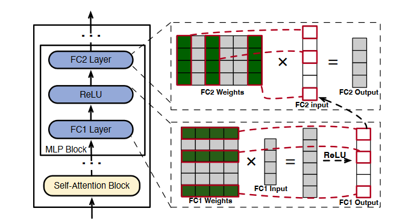

稀疏性广泛存在：

- self-attention块中近一半的attention heads贡献很小。这在OPT这种早期模型中常见，在现在模型如llama中却不常见。
- MLP块中稀疏性由激活函数的性质决定。如图，由于ReLU激活函数会筛掉负值，因此会影响神经元的激活。不过稀疏性都是由具体输入决定，在推理迭代开始前不可知，只能是在迭代进行时提前几个layer开始确定。

**新发现：**

内存上的问题主要来源于局部性失配（locality mismatch）。理想情况下经常被访问的数据应该放在GPU上，因为GPU内存高带宽低容量，CPU反之。

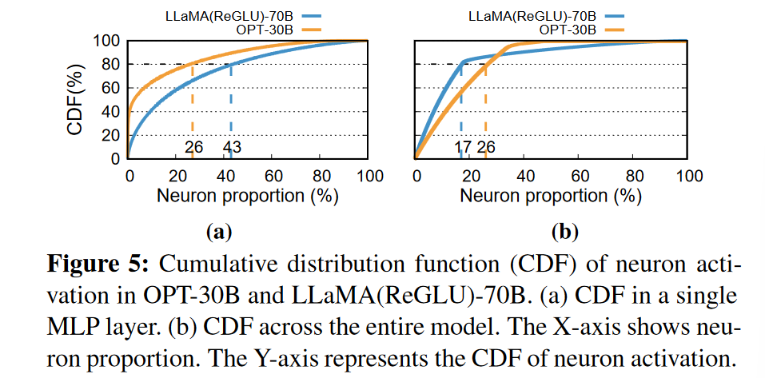

神经元激活的幂律分布（skewed power-law distribution）。少数热神经元（hot-activated neurons）（MLP层中大约10%）在不同输入中频繁激活，而大多数冷神经元（cold-activated neurons）的激活依赖于特定输入。

如果激活的神经元存在于CPU内存中，在CPU上计算它们比将它们转移到GPU上更快，特别是激活神经元数量较少时。

### 如何解决问题？

利用LLM推理的高局部性，将热神经元预加载到GPU以实现快速访问，而将冷神经元存在CPU上。PowerInfer只计算那些被预测为激活的神经元，跳过大部分。在CPU上的冷神经元就在CPU内计算，避免传输。

1. **offline workflow**：PowerInfer的离线部分具有LLM profiler和policy solver。profiler根据数据集，能识别稀疏性，识别出每一层的神经元激活；policy solver分类出冷热神经元，能规划workload使得GPU具有最大化的impact metric。

2. **online workflow**：PowerInfer的在线部分为Neuron-aware LLM Inference Engine。在推理开始前加载神经元到GPU和CPU上；在运行期间，创建GPU和CPU的executor，也就是运行在CPU侧的线程，以管理CPU和GPU的并发计算；predictor预测神经元的激活，并跳过非激活的神经元；在GPU内存中预加载的激活神经元在GPU处理，而CPU计算并将其神经元的结果传输到GPU中进行集成。在CPU和GPU上都使用稀疏神经元感知算子（sparse-neuron-aware operators），专注于矩阵中的单个神经元行/列。

   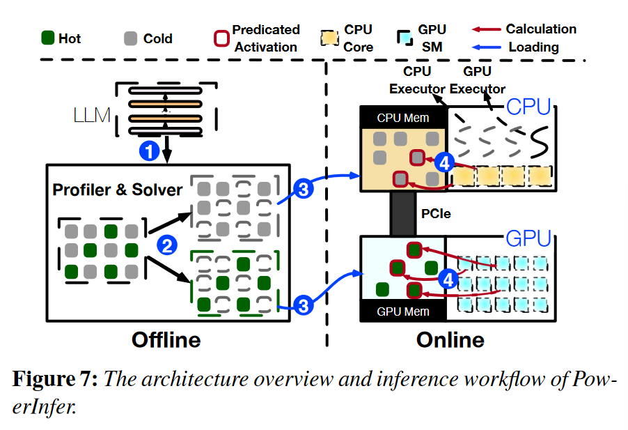

   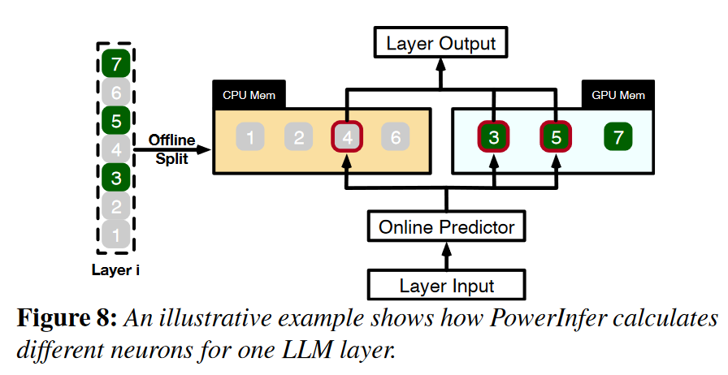

3. **自适应稀疏性预测器**：DejaVu训练了一系列MLP predictors，在每一layer都使用两个预测器分别预测self-attention与MLP blocks的激活。

   为本地部署设计predictor的挑战是平衡预测精度和占用大小。predictor应放在GPU里来快速访问，但会占用相当数量的GPU内存。PowerInfer为具有较高激活稀疏度和偏度的layer构造较小的predictor，在保持预测精度的同时减小了预测器的规模，从而节约GPU内存。

   构造方法是为每一layer设计非固定大小predictor的方法，先根据sparsity粗调，再根据观察到的内部skewness迭代地细调。MLP predictor通常包括输入层、隐藏层和输出层。由于输入层和输出层的维度由Transformer层的结构决定，因此修改主要针对隐藏层。使预测精度保持在95%左右，能使predictor参数限制在LLM总参数的10%。

4. **神经元的管理**：为确保被拆分开的神经元在适当的顺序下的精确计算，为CPU和GPU分别创建两个神经元表。这些表将每个神经元与其在矩阵中的原始位置相关联。在与输入张量相乘的过程中，每个神经元根据神经元表中的映射与其对应的张量值进行交互。神经元表所需的额外内存相对较小，对于像OPT175B（350GB）这样的LLM，神经元表总共只需要约9MB。

5. **GPU-CPU混合执行模型**：PowerInfer允许GPU和CPU独立地处理各自的激活神经元集，然后在GPU上合并结果。这种混合执行模型平衡了计算负载，同时减少了数据传输的开销。

   在推理之前，PowerInfer构建一个计算有向无环图( DAG )，每个节点代表一个LLM推理算子（operator），并将其存储在CPU内存中的全局队列中。在推理过程中，两类executor（由宿主机创建的pthread）分别管理CPU和GPU上的计算，从全局队列中拉取算子，检查依赖关系，并将其分配到合适的处理单元（processing unit）。在执行算子之前，CPU executor还确定并行计算所需的线程数。为了管理依赖关系，特别是当CPU算子的父节点在GPU上处理时，一个barrier可以确保顺序。

   处理单元之间的同步至关重要。一个单元完成其神经元计算后，等待另一个单元合并结果。由于GPU神经元被更频繁地激活，PowerInfer将合并操作分配给GPU。为了优化同步开销，采用了选择性同步策略，在CPU executor没有激活神经元的情况下绕过结果同步。

6. **神经元感知（neuron-aware）的稀疏算子**：为了矩阵乘法运算可以绕过冷神经元，需要使用稀疏算子。目前的稀疏矩阵乘法工具，包括SparTA和FlashLLM等先进的稀疏感知编译器，以及cuSPARSE和Spunik等库，都存在不足。它们要么只支持静态编译（LLM推理有动态稀疏性），要么需要将稀疏矩阵动态地转换为稠密格式，从而导致显著的性能开销。动态JIT编译器PIT虽然对GPU上的一般稀疏矩阵乘法非常有效，但并不适合CPU - GPU混合执行。

   PowerInfer引入了神经元感知算子，直接在GPU和CPU上计算激活神经元及其权重，而不需要运行时转换为稠密格式。这些算子关注的是矩阵中的单个行/列向量，而不是整个矩阵。它们首先确定一个神经元的激活状态，如果预测是活跃的，则将其与参数矩阵的相应行或列一起处理。

   GPU上的神经元感知算子：尽管向量-向量计算在GPU上的效率低于矩阵-向量计算，当批处理规模较小时，基于向量-向量计算的算子具有优势。它们直接与单个神经元交互，避免了与不活跃神经元相关的不必要的计算和记忆操作，并且不需要昂贵的矩阵转换。GPU executor使用cudaLaunchKernel等API启动算子。

   CPU上的神经元感知算子：对于一般具有较低并行度和矩阵计算效率的CPU特别有利。CPU executor将一个算子分配给多个核，将神经元划分为更小的批次以进行并发的激活检查。每个核只处理其批次中激活的神经元，通过硬件向量扩展(如AVX2 )优化向量-向量计算。

7. **神经元放置策略**：PowerInfer的profiler根据C4、Wikipedia等数据集生成请求，在layer中插入监督kernel，在GPU中建立神经元信息表，每次神经元被激活就增加在表中的count，以此来收集记录每个神经元的运行时推理数据。

   使用一个离线求解器（solver）来确定每个神经元在GPU和CPU之间的最佳放置位置。这个策略考虑神经元的激活频率、通信开销以及处理单元的硬件规格（如内存大小和带宽）。solver为每个神经元定义影响量（impact metric），即每个神经元对LLM推理输出的贡献，将分配问题转为线性规划问题，使GPU具有最大的impact metric。

   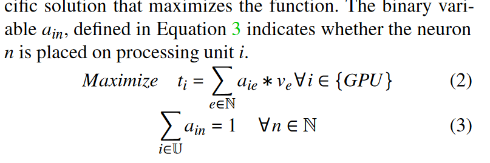

   通信限制：GPU必须比CPU高效，$C_l$是在layer l上放置神经元的最小数量。在小batch size情况下，层间传输开销约等于层内传输开销。

   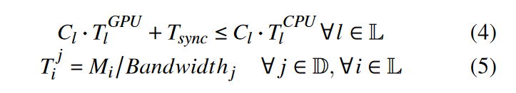

   内存限制：$y_l$为1或0，表示l层神经元是否被放在GPU上，K为一个较大的正数。

   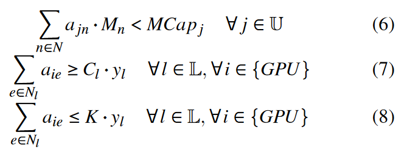

   ILP（Integer Linear Programming）优化：求解器利用ILP优化目标函数。考虑到ILP问题本质上是NP完全问题，为了加速获得近似解，求解器将64个具有相似影响的神经元从一个层组合成单个批次，这种批处理将神经元总数N从几百万减少到几万，将求解时间降至10秒。

在线推理的实现是在llama.cpp基础上增加4k多行C++和CUDA代码完成，主要改动在model loader、优化GPU-CPU hybrid execution和引入10个neuron-aware算子，KVcache仍在CPU上。离线部分则在transformers框架上增加400多行Python代码，使其能作为profiler and solver。predictor是利用DejaVu来训练，但是利用了自适应的训练方法。PowerInfer支持the OPTfamily (from 7B to 175B parameters), the LLaMA family (7B to 70B), and Falcon40B。

### 做了哪些实验？

**实验设置**：实验在两种不同的PC配置上进行，分别代表高端和低端硬件场景。PC-High配置包括Intel i9-13900K处理器、192GB主机内存、NVIDIA RTX 4090 GPU；PC-Low配置包括Intel i7-12700K处理器、64GB主机内存、NVIDIA RTX 2080Ti GPU。

**模型和工作负载**：OPT models 6.7B to 175B, Falcon(ReLU)-40B and LLaMA(ReGLU)-70B models。工作负载来自ChatGPT prompts和Alpaca数据集，覆盖了广泛的语言模型应用场景。模型为F16或INT4量化。

**baseline**：llama.cpp（改造后支持OPT）。

**核心度量指标**：每秒平均生成的token数。计算方法是使用prompt和输出的总token数，除以prompt phase和generation phase的总时间。各种时间度量如下：

- `load time` 是程序启动直到完成第一次decode所花费的时间
- `prompt eval time` 是把prompt全部decode一遍花费的时间（包括计算embeddings，初始化KV cache等等）
- `eval time` 是通过decoder预测token花费的总时间（不包括prompt eval time）
- `sample time` 是根据模型输出的logits，决定使用哪一个token作为输出，这个过程花费的时间

**实验内容**：

1. **端到端性能比较**：batch size 1，从数据集中采样prompt，范围为8 ~ 128个字符。PowerInfer和llama.cpp分别生成8、128和512个token。测出PowerInfer平均8.32 tokens/s，优势随token数增大而明显。在PC-Low上优化效果更少，因为GPU存储限制。GPU推理在总推理中占的比例可达到70%。长输入短输出的情况不占优势，CPU会成为瓶颈。

   【在测试中，当输入长度超过 80（经验阈值）时，我们在提示阶段切换到密集计算，然后在生成阶段恢复为 powerinfer 的计算图。这种方法速度较快，但也增加了代码的复杂性。】

2. **量化推理**：INT4量化下测出PowerInfer平均13.2 tokens/s。

3. **批量推理**：batch size从1到32，随size增大，稀疏性降低，模型优化效果放缓。

4. **消融研究**：逐步集成PowerInfer的不同组件到llama.cpp中，分析每个组件对整体性能提升的贡献。添加顺序依次为predictors and neuron-aware operators、hybrid engine（允许同一层同时由CPU、GPU处理，朴素策略）、optimized policy（即offline solver，多考虑了通信开销）。

5. **稀疏算子性能**：CPU算子baseline为PyTorch sparse，GPU算子baseline为PIT。测试[4096, 4096] × [4096, 1]矩阵乘法，在矩阵中引入部分0值。CPU上明显优秀，GPU上大致相当，但是PIT仅支持GPU而不支持CPU-GPU。

6. **online predictor开销**：predictor的平均用时占总用时小于10%，归功于自适应的方法以及GPU的并行处理能力。

7. **与A100的性能比较**：PowerInfer+4090 GPU上的性能与llama.cpp+4090 GPU和vLLM+A100 GPU的性能比较，在PC - High上，OPT-30B和Falcon-40B的llama.cpp在A100上比vLLM分别滞后93 %和92 %，但PowerInfer将其降低到18 %和23 %。

8. **推理准确性**：只计算激活神经元，造成准确性的微小波动。

这些实验全面评估了PowerInfer在不同硬件配置、模型大小、输入输出长度、量化精度、批量大小以及与现有系统和高端服务器级GPU的性能和准确性。

### 改进点

1. **动态神经元放置策略**：开发动态调整神经元在GPU和CPU之间分配的策略。offline像之前的静态剪枝方法，一次完成多次使用，但缺少灵活性；online predictor发现预测不合理的时候能否调整。神经元性质拿不准的情况下，能否GPU和CPU上都放一份？可以更灵活一些。
2. **能效优化**：如何降低PowerInfer在推理过程中的能耗。
3. **GPU显存占用估计**：无法做到非常准确的GPU显存占用估计，因此存在轻微的显存浪费。如果希望尽可能占用满显存，可以设置 `--vram-budget` 到一个大于物理显存大小，但在工作负载下不会OOM的值。
4. **总用时**：load model时间稍长，可以改进。

### 质疑点

1. 适配模型比较麻烦，只适用于ReLU激活函数的模型。对于llama这种用了SILU的模型需要重新finetune一个ReLU版本的。Turbo Sparse提出dReLU。ReLU的缺点：在训练过程中，如果一个神经元的输出始终是负数，则该神经元的梯度为0，这意味着在反向传播过程中它不会接收到任何更新，从而“死亡”（不再对任何数据有所响应）。
2. 7B/13B的模型通过量化也能轻松load进消费级显卡，随着llm量化的发展PowerInfer的优势会越来越小。

### 相关研究

1. **LLM Activation Sparsity**: 这类研究关注于利用LLM推理过程中神经元激活的稀疏性来优化推理速度。例如DejaVu和PIT。
2. **LLM Weight Sparsity**: 这类研究通过模型剪枝（pruning）来减少模型参数的数量。例如，SparseGPT和Wanda通过设置一些权重为零来实现近50%的无结构稀疏性。
3. **Speculative LLM Inference**: 投机推理。Speculative decoding使用草稿模型来预测token，然后由主模型进行批量验证。
4. **LLM-Specific Serving Optimizations**: 这类研究专注于为Transformer模型提供专门的服务系统。例如，Orca引入了迭代级别的调度，vLLM实现了Paged Attention来解决KV缓存的连续存储限制问题。

### 相似研究

1. **FlexGen**：GPU-Centric Offloading，优先考虑吞吐量而不是延迟，按顺序处理每个层的批次。延迟高的原因是GPU和CPU间频繁的数据传输。

2. **DejaVu**：利用稀疏性进行加速，但是它是为数据中心设计的，在消费级GPU上不管用，因为它就需要频繁在CPU和GPU间传数据。Dejavu只为GPU服务，必须使用NVIDIA unified memory。

3. **llama.cpp**：在CPU和GPU之间分配层。缺点是没有利用好局部性，每个推理迭代都访问整个模型。大部分计算负载都在CPU上。

4. **mlc-llm**：它允许将任何语言模型本地部署在各种硬件后端和本地应用程序上。MLC LLM 的主要工作流基于 Apache TVM Unity，利用TVM，机器学习算法可以自动编译成可供下层硬件执行的机器语言。

   

5. **vLLM**：核心技术PagedAttention。传统的LLM服务系统容易出现内存碎片化、内存共享困难等问题。PagedAttention背后的想法是创建映射到 GPU 内存中的物理块的连续虚拟块。所有块都是虚拟连续的，并映射到碎片化 GPU 内存中在推理期间按需分配的物理非连续块。内存中会创建一个索引表。这样一来，就能实现共享prompt处理。

   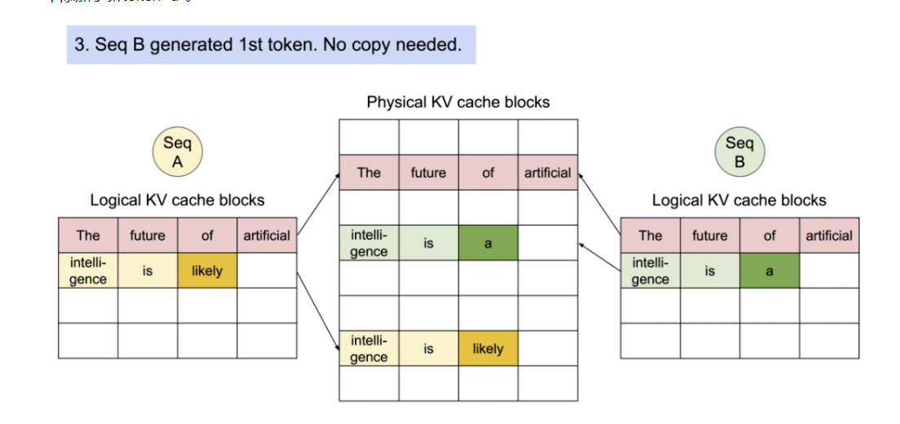

## 术语解释
（这部分很多都是直接问GPT的哈哈）

### 神经元（neuron）

权重矩阵中的一个特定的行/列。

### Sparsity and Skewness

描述神经元激活模式的两个不同的统计特性：

1. **Sparsity（稀疏性）**：描述的是在LLM的某一层中，非激活的神经元占总体神经元的比例。
2. **Skewness（偏斜度）**：偏斜度是一个统计学概念，用来衡量数据分布的不对称性。在论文中用来描述神经元激活频率的分布是否均匀。高偏斜度意味着激活频率集中在少数神经元上。换句话说，即使在激活的神经元中，它们的激活频率也可能大不相同。

在 PowerInfer中，稀疏性用来决定哪些神经元应该被分配到 GPU（热神经元）以及哪些可以留在 CPU（冷神经元）。而偏斜度则用来进一步细化这些决策，特别是对于那些频繁激活的神经元（高偏斜度层中的热神经元），系统可以设计更小的预测器，并优化这些层的计算过程。

### 量化、蒸馏、剪枝

1. **量化（Quantization）**：
   - 量化是一种减少模型大小和加速推理的技术，它通过降低模型参数和中间表示的精度来实现。在量化过程中，模型的权重和激活通常从32位浮点数（FP32）转换为更低位数的格式，如16位浮点数（FP16）、8位整数（INT8）或更低位。
   - 量化可以显著减少模型在存储和传输时所需的内存和带宽，同时还可以加快计算速度，因为低精度运算通常可以在硬件上更高效地执行。
2. **蒸馏（Distillation）**：
   - 蒸馏是一种模型压缩技术，它通过训练一个较小的“学生”模型来模仿一个较大的“教师”模型的行为。教师模型通常是一个已经训练好的、性能优异但计算成本较高的模型。
   - 在蒸馏过程中，学生模型不仅学习如何从输入数据中提取特征，还学习如何模仿教师模型的输出。这通常通过一个特殊的损失函数实现，该损失函数结合了对教师模型输出的模仿和对正确标签的预测。
   - 蒸馏可以有效地将教师模型的知识迁移到学生模型中，使得学生模型在保持较小模型大小的同时，达到接近教师模型的性能。
3. **剪枝（Pruning）**：
   - 剪枝是一种通过移除神经网络中的一些权重或神经元来减少模型大小和计算量的技术。剪枝可以是结构化的，也可以是非结构化的。
   - 非结构化剪枝通常涉及移除权重矩阵中不重要的单个权重，而保留网络的整体结构。这种方法通常在训练后进行。
   - 结构化剪枝则涉及移除整个神经元或神经网络的整个通道（例如卷积核或过滤器），这可能会改变网络的结构。
   - 剪枝不仅可以减少模型的大小，还可以减少模型的计算复杂度，因为移除的权重或神经元不再参与前向传播。

通过这些技术，可以在保持模型性能的同时，显著提高模型的运行效率和减少资源消耗。

### Offloading

Offloading技术，也称为动态计算卸载或混合部署，是一种在资源受限的设备上优化内存使用的技术。它通过将计算任务或数据卸载到其他资源或分布在多种设备上，以减少主设备的内存负载。

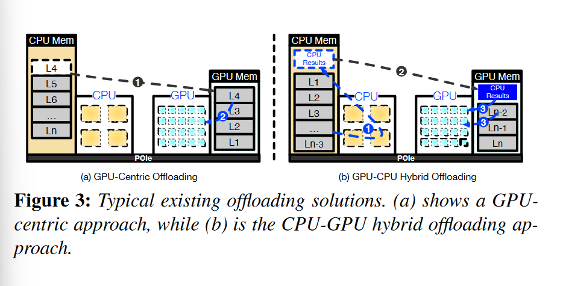

论文中提到了两种主要的offloading方法，它们分别是：

1. **GPU-Centric Offloading**：
   - 利用CPU内存来存储超出GPU内存容量的模型参数。
   - 在每次迭代过程中，处理存储在GPU内存中的参数，并且根据需要从CPU内存传输更多参数。
   - 这种策略允许推理不同大小的LLMs，只要有足够的组合CPU内存和硬盘存储空间。
   - 一个典型的GPU-Centric Offloading的例子是FlexGen，它采用zig-zag调度方法，优先考虑吞吐量而不是延迟，按顺序处理每个层的批次。延迟高的原因是GPU和CPU间频繁的数据传输。
   - DejaVu利用稀疏性进行加速，但是它是为数据中心设计的，在消费级GPU上不管用，因为它就需要频繁在CPU和GPU间传数据
2. **Hybrid Offloading**：
   - 这种方法在Transformer层级上将模型参数分布在GPU和CPU之间。
   - CPU首先处理它的层，然后将中间结果发送到GPU以生成token。
   - 这种方法通过最小化数据传输和缓解慢速PCIe带宽的影响来减少推理延迟。
   - 典型例子是llama.cpp，在CPU和GPU之间分配层。缺点是没有利用好局部性，每个推理迭代都访问整个模型。大部分计算负载都在CPU上。

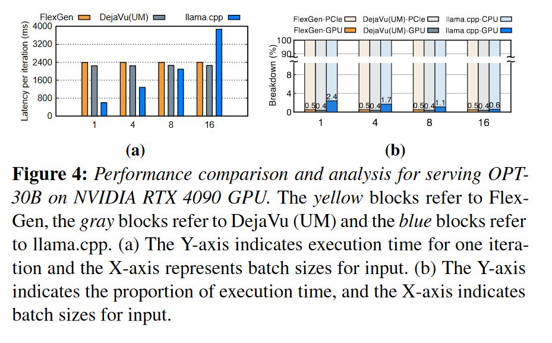

### GPU推理

GPU，即图形处理单元（Graphics Processing Unit），是一种专门设计用于处理图形和视觉计算任务的处理器。它最初被开发用于加速图形渲染，现在被广泛应用于各种计算密集型任务，包括科学计算、数据分析、深度学习等领域。

显卡（Video Card）是电脑硬件的一部分，它的主要功能是将计算机的数字信号转换为显示器可以显示的图像。显卡内部通常包含一个或多个GPU，以及用于存储图形数据的显存。集成显卡通常共享系统内存，而独立显卡拥有自己的专用显存，通常配备更强大的GPU。

CPU 和 GPU 在 LLM 推理中的主要差距：

1. **核心数量和并行处理能力**：
   - **GPU** 拥有成千上万个小核心，非常适合并行处理大量数据。这种并行性使得 GPU 能够同时执行多个计算任务，这对于 LLM 推理中的大规模矩阵运算非常有用。GPU 支持多卡并行处理，可以通过增加更多的 GPU 来扩展计算资源。
   - **CPU** 通常拥有较少的核心（如几核心到几十核心），并且设计上更注重单线程性能，并行处理能力通常不如 GPU。
2. **内存带宽和访问模式**：
   - **GPU** 提供更高的内存带宽，这对于快速访问和处理大量数据至关重要。GPU 优化了数据的并行访问，减少了内存访问延迟。
   - **CPU** 的内存带宽相对较低，且设计上更注重顺序执行和缓存优化。
3. **浮点运算能力**：
   - **GPU** 通常支持单精度和半精度浮点运算。大量浮点运算是深度学习和 LLM 推理的基础。
4. **专用硬件和软件优化**：
   - **GPU** 拥有专门为深度学习操作设计的硬件加速器（如张量核心），并且深度学习框架和库（如 cuDNN、TensorFlow、PyTorch）通常针对 GPU 进行了优化。
   - **CPU** 缺乏专门为深度学习操作设计的硬件加速器。
5. **能效比、成本效益**：
   - **GPU**在较低的功耗、成本下提供更高的计算性能。
7. **适用场景**：
   - **GPU** 更适合于处理数据并行性高、计算密集型的任务，如 LLM 推理、图像处理和科学计算。
   - **CPU** 更适合于处理顺序执行、控制流复杂、数据并行性低的任务，如 Web 服务器、数据库处理和一般应用程序。

### PCIe

PCIe，全称为“Peripheral Component Interconnect Express”，即外围组件互连快速总线，是一种通用的串行连接标准，用于计算机内部硬件组件之间的连接。它由英特尔公司在2003年推出。

PCIe 的主要特点包括：

1. **高速串行通信**：PCIe 使用高速串行通信而非并行通信，这减少了信号干扰和系统复杂性，并且提高了数据传输速率。
2. **点对点连接**：每个 PCIe 设备都有自己的专用连接，每个设备不需要与总线上的其他设备共享带宽。
3. **可扩展性**：PCIe 支持多个通道，可以根据需要提供不同的带宽级别。例如，PCIe x1 提供单通道，而 PCIe x16 提供16通道，后者的数据传输速率是前者的16倍。
4. **灵活性**：PCIe 接口可以用于连接各种类型的硬件，如显卡、网络卡、声卡、存储设备等。
5. **电源供应**：PCIe 接口还提供电源供应功能，可以直接为连接的设备供电，减少了对外部电源的需求。

在LLM推理中，PCIe 总线是 GPU 与其他系统组件（如 CPU 和内存）之间数据传输的重要通道。

### Transformer

Transformer 是一种深度学习模型架构，在自然语言处理（NLP）领域广泛应用。核心特点包括：

1. **自注意力机制（Self-Attention）**：允许模型在序列中的每个token上计算注意力权重，这样模型就可以捕捉到序列内部的长距离依赖关系。这种机制替代了传统的循环神经网络（RNN）和卷积神经网络（CNN）中的循环或滑动窗口操作。

   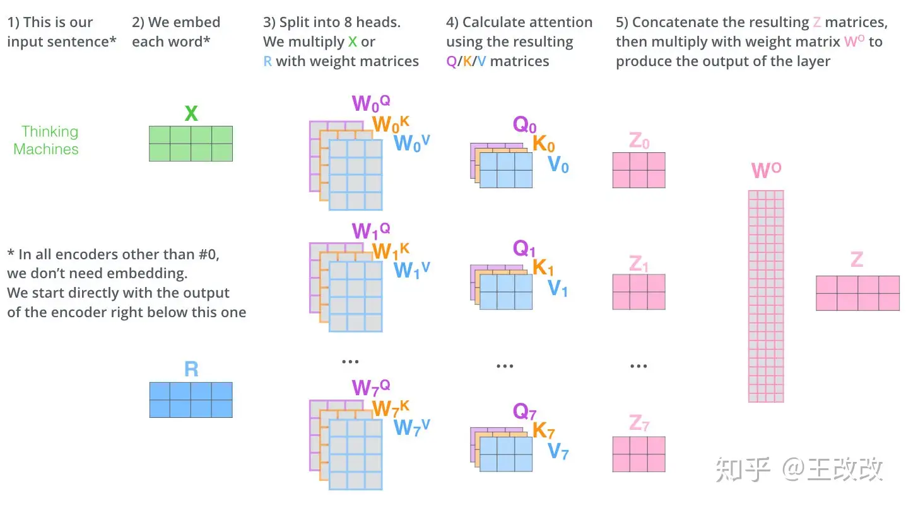

2. **位置编码**：由于Transformer模型没有明确的处理序列顺序的机制，所以需要添加位置编码来提供序列中单词的位置信息。位置编码是一个向量，与输入单词的嵌入向量相加，然后输入到模型中。

3. **编码器-解码器架构（Encoder-Decoder Architecture）**：在标准的 Transformer 模型中，编码器部分处理输入序列，而解码器部分生成输出序列。编码器和解码器都由多个相同的层组成，每层都包含自注意力和前馈神经网络。

4. **多头注意力（Multi-Head Attention）**：在处理自注意力时，Transformer模型将自注意力过程分割成多个并行的“头”，每个头学习序列的不同方面，执行自己的自注意力计算，有自己独立的权重矩阵，提取不同的特征信息。例如一个头可能关注句法结构，而另一个头可能关注语义信息。

5. **前馈神经网路（Feed-Forward Neural Network）**：在自注意力之后，Transformer模型会通过多个前反馈神经网络路来进一步处理序列。这个网络由两层全连接层和一个ReLU启动函数组成，可以进行非线性的变化。

6. **残差连接和层归一化**：Transformer 在每个子层（自注意力层和前馈神经网络层）之后使用残差连接和层归一化。这些技术有助于避免深层网络中的梯度消失问题，使得可以训练更深的网络。

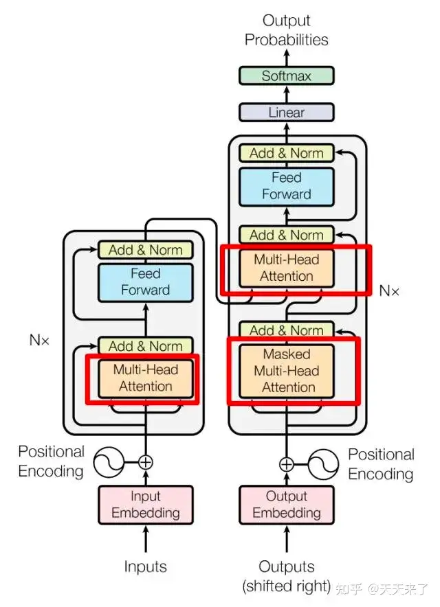

GPT模型的主要结构是一个多层的Transformer解码器，但它只使用了Transformer解码器的部分，没有使用编码器-解码器的结构。另外，为了保证生成的文本在语法和语义上的连贯性， GPT模型采用了自回归掩码（auto-regressive mask），这使得每个单词只能看到其前面的单词，而不能看到后面的单词。

在本论文中，LLM架构包括多个Transformer层，每个Transformer层包含一个自注意力模块和一个MLP（多层感知器）模块（对应前述的多头注意力和前馈网络）。

### KVCache

注意力机制的核心概念是Query（查询）、Key（键）和Value（值）。

- Query (Q)：当前单词的一种表示，用于对所有其他单词进行评分（使用它们的Key）。我们只关心当前正在处理的token的Query 。在生成任务中，通常是最后一个token的表示。
- Key (K)：是该句段中所有单词的标签。它们是我们在搜索相关单词时所匹配的内容。用于与Query进行匹配，决定应该关注哪些信息。
- Value (V)：是实际的单词表示，一旦我们对每个单词的相关性进行了评分，这些就是我们聚合起来用来表示当前单词的值。

注意力机制允许模型动态地"查阅"之前的信息。不同的信息源(早先的词)会根据其相关性获得不同程度的"注意力"。最终的表示是多个信息源的加权组合。

KV Cache的核心思想是缓存并重用之前计算过的Key和Value,从而避免重复计算。

例：对于输入序列"A robot must obey"，我们首先计算每个token的Key和Value，将计算得到的Key和Value存储在缓存中。当模型需要生成下一个token "the" 时：只需为新token "the" 计算Query，用这个新Query与缓存中的所有Key计算注意力分数，基于注意力分数和缓存的Value生成新的表示，更新缓存。

### CUDA

**统一计算设备架构**（Compute Unified Device Architecture, **CUDA**），是由**NVIDIA**推出的通用并行计算架构。

在 CUDA 6 之前，CPU 和 GPU 之间共享的数据必须在两个内存中分配，并由程序在它们之间显式复制。这给 CUDA 程序增加了很多复杂性。统一内存（unified memory）创建了一个在 CPU 和 GPU 之间共享的托管内存池，弥合了 CPU-GPU 鸿沟。CPU 和 GPU 都可以使用单个指针访问托管内存。关键是系统会自动在主机和设备之间迁移统一内存中分配的数据。
