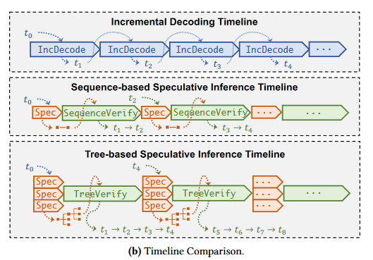
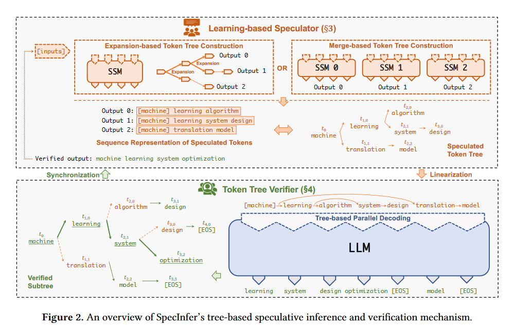
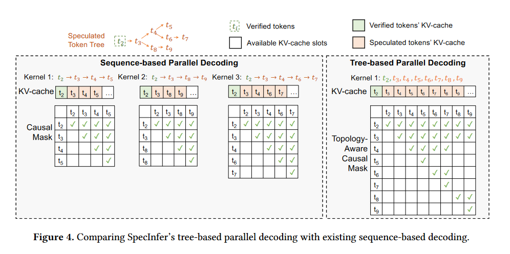
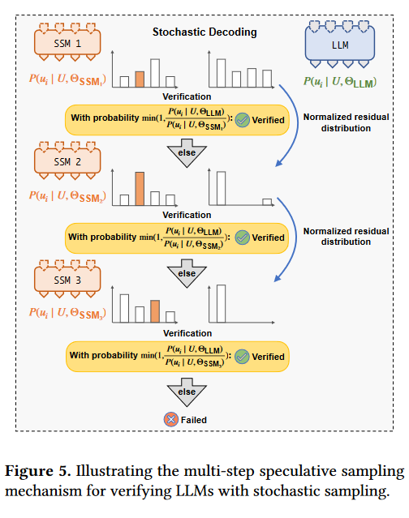
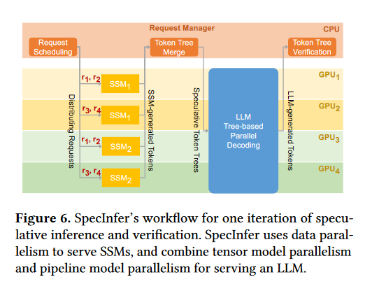
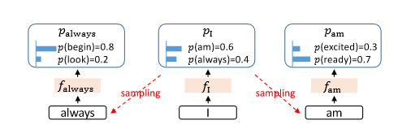
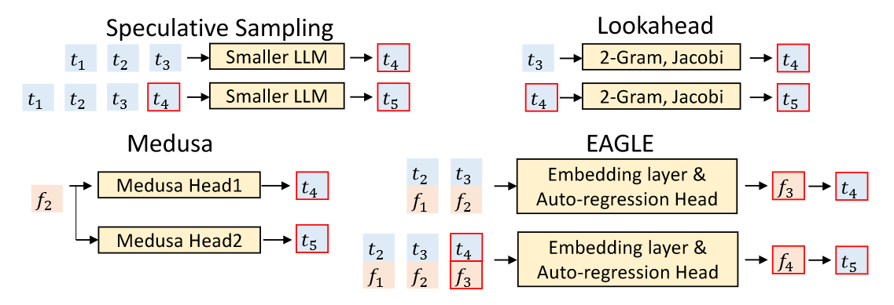
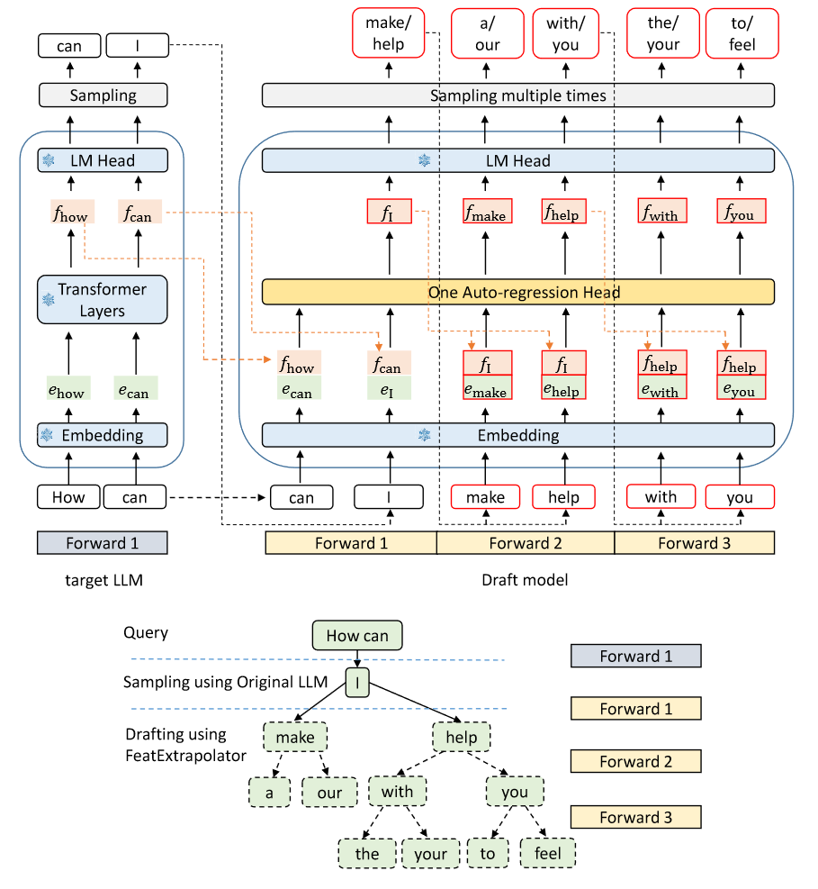
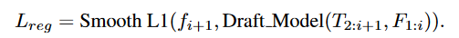
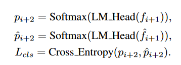

## SpecInfer

### 摘要

The key idea behind SpecInfer is leveraging small speculative models to predict the LLM’s outputs; the predictions are organized as a **token tree,** whose nodes each represent a candidate token sequence. The correctness of all candidate token sequences represented by a token tree is verified against the LLM in parallel using a novel **tree-based parallel decoding mechanism**. SpecInfer **uses an LLM as a token tree verifier** instead of an incremental decoder, which significantly reduces the end-to-end latency and computational requirement for serving generative LLMs while provably preserving model quality.

### 相关研究

**sequencebased speculative inference**：leverages a small speculative model (SSM) to generate a sequence of tokens and uses an LLM to examine their correctness in parallel. 缺点：only consider a token sequence generated by a single SSM for speculation, which cannot align well with an LLM due to the model capacity gap between them.

### 技术细节

1. **Tree-based Speculative Inference**：
   - 利用小型推测模型（SSM）生成多个候选的 token 序列，并将这些序列组织成 token 树结构，每个 token 树的节点代表一个或多个推测的 token 序列。
   - 有Expansion-based token tree construction和Merge-based token tree construction两种方式，区别在于单个/多个SSM。
   - 如果是多个SSM，为了使SSM 的输出结果尽可能接近 LLM，使用Collective Boost-Tuning 方法，即在一个公开的通用数据集（如 OpenWebText）上，从一个较弱的 SSM 开始进行微调，将匹配程度较低的序列不断从数据中过滤，交由新的 SSM 来学习，持续多次，提高整体的推测质量。此外还引入了一个可学习的scheduler来决定选用哪些 SSM 以获得更长的匹配序列长度。
   - 
2. **Parallel Verification**：
   - 采用基于树的并行解码（tree-based parallel decoding）机制，同时验证 token 树中所有候选 token 序列的正确性。
   - 计算tree attention，节点u的tree attention就是对应序列S的attention。
   - 基于树的并行解码就是同时计算所有token的tree attention。挑战在于如何安排kvcache。解决的关键技术是用深度优先搜索机制来更新 key-value 缓存和使用拓扑感知的因果掩码（topology-aware causal mask）来融合所有 token 的注意力计算。
   - 
3. **Multi-step Speculative Sampling**：
   - 支持greedy/stochastic decoding，其中stochastic decoding引入了新的采样方法Multi-step Speculative Sampling。
   - Multi-step Speculative Sampling用于在保持与增量解码相同概率分布的同时，最大化可以验证的推测 token 的数量。
   - 
4. **系统设计和实现**：
   - SpecInfer 在分布式多 GPU 运行时系统上实现，使用数据并行和模型并行技术来服务 SSM 和 LLM。
   - 
   - 连续批处理（Continuous Batching），SpecInfer 调度 LLM 执行的粒度是迭代而不是请求，允许同时处理多个请求，减少了端到端的推理延迟。
   - 在FlexFlow（a distributed multi-GPU runtime for DNN computation）的基础上实现。
5. **应用场景**：
   - 论文还讨论了 SpecInfer 如何适用于分布式 LLM 推理和基于卸载的 LLM 推理等实际应用场景。

SpecInfer 实现了在保持模型质量的同时，显著减少了服务生成性 LLMs 的端到端延迟和计算需求。评估表明，SpecInfer 在分布式 LLM 推理中比现有系统快 1.5-2.8 倍，在基于卸载的 LLM 推理中快 2.6-3.5 倍。

## Eagle

### 摘要

In this paper, we reconsider speculative sampling and derive two key observations. Firstly, **autoregression at the feature (second-to-top-layer) level is more straightforward than at the token level**. Secondly, **the inherent uncertainty in feature (second-to-top-layer) level autoregression constrains its performance**. Based on these insights, we introduce EAGLE (Extrapolation Algorithm for Greater Language-model Efficiency), a simple yet highly efficient speculative sampling framework. By **incorporating a token sequence advanced by one time step**, EAGLE effectively resolves the uncertainty, enabling precise second-to-top-layer feature prediction with minimal overhead.

（如图f即为特征层）

### 技术细节

**Speculative sampling**：a low-cost draft stage and a parallelized verification stage over the drafted tokens. 

**Drafting phase**: EAGLE’s draft model comprises three modules: the Embedding layer, LM Head, and Autoregression Head. 

- The Embedding layer and LM Head employ the parameters of the target LLM and do not necessitate additional training.
- The Autoregression Head consisting of an FC layer（全连接层） and a decoder layer. The FC layer reduces the dimensionality of the fused sequence and then we utilize the decoder layer to predict the next feature. The LM Head calculates the distribution based on the feature, from which the next token is sampled. Finally, the predicted feature and the sampled token are concatenated into the input.
- EAGLE creates a tree-structured draft using tree attention.

**Training of the draft models**: By integrating regression loss and classification loss, we train the Autoregression Head using the combined loss function $L = L_{reg} + w_{cls}L_{cls}, w_{cls} = 0.1$.

EAGLE exhibits low sensitivity to training data. Instead of employing text generated by the target LLM, we utilize a fixed dataset, substantially reducing the overhead. Inaccuracies in features can lead to error accumulation. To mitigate this issue, we employ data augmentation by adding random noise sampled from a uniform distribution U (−0.1, 0.1) to features of the target LLM during training.

**Verification phase**: The speculative sampling algorithms is consistent with SpecInfer.

