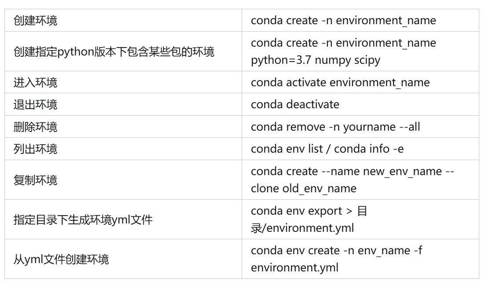
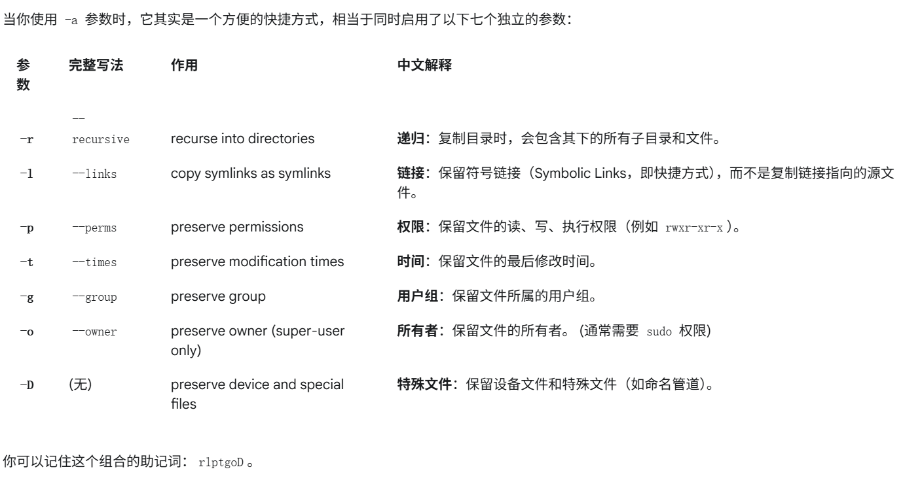
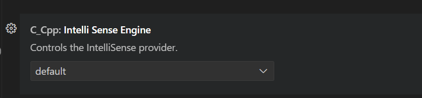

## Environment

### 查看系统架构

```
uname -m
```

### 查看CPU

```
lscpu
```

**关键信息**:

- Architecture: 架构，如 x86_64。
- CPU(s): 总逻辑核心数。
- Socket(s): CPU 插槽数（物理 CPU 数量）。
- Core(s) per socket: 每个物理 CPU 的核心数。
- Model name: CPU 型号，例如 Intel(R) Xeon(R) Gold 6248R。
- CPU max MHz: 最大睿频 (Turbo Boost) 频率。
- Flags: CPU 支持的指令集

### 设置环境变量

在 ~/.bashrc

```
export CUDACXX=/usr/local/cuda/bin/nvcc
```

命令行

```
source ~/.bashrc
```

### ssh permission

Permissions 0664 for '/home/wdl/.ssh/id_wdl' are too open.

```
chmod 600 /home/wdl/.ssh/id_wdl
```

### ssh passphrase

linux

```
eval $(ssh-agent -s)
ssh-add ~/.ssh/id_rsa
ssh-add -l	# 验证是否成功
```

windows：打开PowerShell

```
Start-Service ssh-agent
ssh-add C:\Users\韦东良\.ssh\id_rsa
```

### Host key has changed

ssh -v 报错：

```
@@@@@@@@@@@@@@@@@@@@@@@@@@@@@@@@@@@@@@@@@@@@@@@@@@@@@@@@@@@
@    WARNING: REMOTE HOST IDENTIFICATION HAS CHANGED!     @
@@@@@@@@@@@@@@@@@@@@@@@@@@@@@@@@@@@@@@@@@@@@@@@@@@@@@@@@@@@
IT IS POSSIBLE THAT SOMEONE IS DOING SOMETHING NASTY!
Someone could be eavesdropping on you right now (man-in-the-middle attack)!
It is also possible that a host key has just been changed.
The fingerprint for the ED25519 key sent by the remote host is ...
Please contact your system administrator.
Add correct host key in C:\\Users\\.../.ssh/known_hosts to get rid of this message.
Offending ECDSA key in C:\\Users\\.../.ssh/known_hosts:58
Host key for 192.168.1.79 has changed and you have requested strict checking.
Host key verification failed.
```

原因：远程主机的主机密钥（Host Key）发生了变化，而本地的 `known_hosts` 文件中记录的旧密钥与当前服务器的密钥不匹配，导致了 SSH 客户端拒绝连接

解决方案：更新本地的 `known_hosts` 文件，找到并删除与 `192.168.1.79` 相关的行，重新连接

### externally-managed-environment

error: externally-managed-environment

1. 直接捂嘴

```
sudo mv /usr/lib/python3.12/EXTERNALLY-MANAGED /usr/lib/python3.12/EXTERNALLY-MANAGED.bak
```

2. 创建虚拟环境

```
python -m venv ENV_DIR
source ENV_DIR/bin/activate
```

`ENV_DIR` 指定存放环境的目录

退出环境：

```
deactivate
```

### 挂载新硬盘

```
sudo fdisk -l	# 查看设备名
sudo mkdir /mnt/newdisk
sudo mount /dev/sdb1 /mnt/newdisk
df -h 	# 检查挂载情况
```

设置开机自动挂载：编辑 /etc/fstab 文件，添加一行：

```
/dev/sdb1    /mnt/newdisk    ext4    defaults    0 
```

### 添加用户

```
sudo adduser wdl
```

给予 sudo 权限

```
sudo usermod -aG sudo wdl
```

验证 sudo 权限

```
su - wdl
sudo ls /root
```

删除用户

```
sudo deluser wdl
sudo deluser --remove-home wdl	# 删除主目录与文件
```

### Conda



注意：conda create 的时候指定 python 版本，可以避免出现 error: externally-managed-environment

### 清华源

```
pip3 install numpy -i https://pypi.tuna.tsinghua.edu.cn/simple
```

```
conda config --add channels https://mirrors.tuna.tsinghua.edu.cn/anaconda/pkgs/free/
conda config --add channels https://mirrors.tuna.tsinghua.edu.cn/anaconda/cloud/conda-forge 
conda config --add channels https://mirrors.tuna.tsinghua.edu.cn/anaconda/cloud/msys2/
```


## Files

### scp

```
scp -r xxx:path yyy:path
```

### rsync

```
rsync -avzP src dst
```



**-z**：在传输过程中对数据进行压缩

**-P**：进度条与断点续传

### 统计文件夹下的所有文件大小

```
du -sh .
```

### 校验是否损坏

```
md5sum test.txt
```

### 压缩与解压

```
tar -czvf archive.tar file1 file2 directory
tar -zxvf archive.tar
```


## Markdown

强制换页

```
<div STYLE="page-break-after: always;"></div>
```

空格


图片居中显示

```
<center class="half">
    
    
</center>
```


## Git

### git diff

仅输出不同文件名

```
git diff --name-only .. ..
```

### git submodule

```
git submodule update --init --recursive
```

### 临时保存工作进度

场景：需要临时保存当前的工作进度，切换到另一个分支，之后再回来继续工作，但是又不希望 commit

```
git stash save "..."
git stash pop	# 应用最近一次的储藏，并从储藏列表中删除它
git stash apply # 不会删除
```

如果你多次使用 git stash，它会把你的修改都存成一个列表：

```
git stash list
git stash pop stash@{1}
```

git stash 不会储藏新建的、未被 Git 跟踪的文件。如果想一起储藏需要加上 -u 参数

```
git stash save -u "..."
```

### 本地彻底回退

git log 找到希望回退到的 commit 的哈希值

```
git reset --hard <commit-hash>
```


## Debug

### VScode python

launch.json：

```
{
    "version": "0.2.0",
    "configurations": [
        {
            "name": "sync test",
            "type": "debugpy",
            "request": "launch",
            "python": "/disk2/wdl/miniconda3/envs/infinigen/bin/python",
            "program": "flex_llama3.py", 
            "args": [
                "--model", "/disk2/wdl/llama-3.2-3b-instruct",
                "--path", "/disk2/wdl/FlexGen/llama_weights",
                "--offload-dir", "/disk2/wdl/FlexGen/offload_dir", 
                "--prompt-len", "7",
                "--gen-len", "10",
                "--gpu-batch-size", "1",
                "--num-gpu-batches", "2",
                "--prefill-batch-size", "512",
                "--percent", "100", "0", "0", "0", "100", "0", 
                "--attn-sparsity", "0.1",
                "--compress-weight",
            ],
            "console": "integratedTerminal",
            "cwd": "/disk2/wdl/FlexGen/flexgen",
        },
    ]
}
```

### VScode C++

```
{
    "version": "0.2.0",
    "configurations": [
        {
            "name": "qkv fuse",
            "type": "cppdbg",
            "request": "launch",
            "program": "/home/wdl/powerinfer-refactor/build_qkv/bin/llama-cli",
            "args": [
                "-t", "4",
                "-no-cnv",
                "--temp", "0.6", 
                "--top-k", "20", 
                "--top-p", "0.95", 
                "--no-warmup",
                "-n", "256",
                "--samplers", "'temperature;top_k;top_p'",
                "-m", "/home/wdl/our-20b-q4_0.gguf",
                "-p", "Once upon a time ",
                // "-f", "/home/wdl/context_1000.txt",
            ],
            "stopAtEntry": true,
            "cwd": "/home/wdl/powerinfer-refactor/build_qkv/bin/",
            "environment": [],
            "externalConsole": false,
            "MIMode": "gdb",
            "setupCommands": [
                {
                    "description": "Enable pretty-printing for gdb",
                    "text": "-enable-pretty-printing",
                    "ignoreFailures": true
                },
                {
                    "description": "Set Disassembly Flavor to Intel",
                    "text": "-gdb-set disassembly-flavor intel",
                    "ignoreFailures": true
                }
            ]
        }
    ]
}
```

### Segmentation fault (core dump)

程序发生 Segmentation fault (core dump) 之后：

```
sudo coredumpctl
```

如果没有出现信息，则需要：

```
sudo apt-get install systemd-coredump
sudo systemctl restart systemd-sysctl.service
echo "|/usr/lib/systemd/systemd-coredump %P %u %g %s %t %c %h" | sudo tee /proc/sys/kernel/core_pattern
```

这时候重新运行出错程序，如果还是不行，可能是因为为了防止程序错误地产生巨大的核心转储文件占满硬盘，默认情况下将core dump的大小限制为0，需要：

```
ulimit -c 				# 查看core文件大小限制
ulimit -c unlimited
```

`sudo coredumpctl`有输出之后：

```
coredumpctl gdb
```

默认会查看最近的一个core dump。gdb内用`bt`可以查看调用堆栈，用`fr N`可以去往第N层堆栈

### llama.cpp 打印算子

```
ggml_barrier(params->threadpool);

if (ith == 0 && strncmp(dst->name, "kq-", 3) == 0) {
    const struct ggml_tensor *t = src1;
    FILE *fp = NULL;
    char file_name[100];

    sprintf(file_name, "data/attention_score_%s.log", dst->name);
    fp = fopen(file_name, "a+");

    fprintf(fp, "dst->name: %s\n", dst->name);
    fprintf(fp, "num_kv: %lld, num_tokens: %lld, num_head: %lld\n", t->ne[0], t->ne[1], t->ne[2]);

    for (int i2 = 0; i2 < t->ne[2]; ++i2) {
        fprintf(fp, "i2: %d\n", i2);
        for (int i1 = 0; i1 < t->ne[1]; ++i1) {
            fprintf(fp, "i1: %d\n", i1);
            for (int i0 = 0; i0 < t->ne[0]; ++i0) {
                fprintf(fp, "i0: %d: %f\n",
                    i0, *((float *)((char *)t->data + i2 * t->nb[2] + i1 * t->nb[1] + i0 * t->nb[0])));
            }
            fprintf(fp, "\n");
        }
        fprintf(fp, "\n\n");
    }

    fclose(fp);
}
```


## VSCode

### IntelliSense 卡顿问题

先删除 .cache/vscode-cpptools/ipch

还卡就没别的办法了，只能设置里 disable




## Coding

### C代码使用C++代码

例：现在需要调用在某个 .c 文件中，调用一个由 .hpp 与 .cpp 文件定义的函数

步骤：

1. 新建一个 .h 文件，将 .hpp 文件改造为 .h 文件

```
#ifdef __cplusplus
extern "C" {
#endif

void TraceEventStart(const char *name);
void TraceEventEnd();

#ifdef __cplusplus
} // extern "C"
#endif
```

2. 在 .cpp 文件中 include 这个 .h 文件，同样地，也要用 extern "C" 包裹起来

```
#ifdef __cplusplus
extern "C" {
#endif

void TraceEventStart(const char *name) {
    TRACE_EVENT_BEGIN(event_category, perfetto::StaticString{name});
}

void TraceEventEnd() {
    TRACE_EVENT_END(event_category);
}

#ifdef __cplusplus
} // extern "C"
#endif
```

​	3. 在 .c 文件里 include .h文件

### 文件读写

#### C++

流方法：fstream 对象在销毁时会自动调用 close()

```
#include <fstream>
#include <string>

// read
std::ofstream log(get_log_filename(layer_id, head_id), std::ios::binary | std::ios::app);
int value = 100;
log << value << " ";
log.write(reinterpret_cast<const char*>(&value), sizeof(value)); // binary
log.close();

// write
std::ifstream log(filename, std::ios::binary);
log >> value;
log.read(reinterpret_cast<char*>(&value), sizeof(value));

// 使用 std::fstream 必须手动指定读写模式
std::fstream iofile("data.bin", std::ios::in | std::ios::out | std::ios::binary);
```

常见的打开模式：

| 标识符           | 含义                 | 说明                                                         |
| ---------------- | -------------------- | ------------------------------------------------------------ |
| std::ios::in     | **读模式**           | 为读取而打开文件。ifstream 的默认模式。                      |
| std::ios::out    | **写模式**           | 为写入而打开文件。ofstream 的默认模式。                      |
| std::ios::binary | **二进制模式**       | 以二进制方式处理文件，而非文本模式。读写速度快且无损         |
| std::ios::app    | **追加模式**         | (append) 写入操作将在文件末尾进行。                          |
| std::ios::trunc  | **截断模式**         | (Truncate) 如果文件已存在，打开时会清空其所有内容。ofstream 默认行为。 |
| std::ios::ate    | **打开后定位到末尾** | (At End) 文件打开后，立即将位置指针移动到文件末尾。可以写入或移动到任何位置。 |

stringstream 操纵字符串：

```
#include <sstream>
#include <string>

std::string get_log_filename(size_t layer_id, size_t head_id) {
    std::stringstream ss;
    ss << "prefill_cache" << "/cache_L" << layer_id << "_H" << head_id << ".log";
    return ss.str();
}
```

#### C

fread 方法：

"w" 写, "r" 读, "a" 追加, "b" 二进制 

```
#include <cstdio>

FILE *f = fopen(input->name, "w");
if (f) {
    const char* text = "hello";
    fwrite(text, sizeof(char), 5, f); // 写入数据
    fflush(f);                        // 强制将缓冲区内容写入文件
    fclose(f);                        // 必须手动关闭
}

FILE *f = fopen("data.bin", "rb");
if (f == NULL) {
    perror("Error opening file");
    return -1;
}

int value;
size_t items_read = fread(&value, sizeof(int), 1, f);

if (items_read == 1) {
	printf("Read value: %d\n", value);
}

fclose(f);
```

fget 方法：

```
FILE *f = fopen("log.txt", "r"); // "r" = read (文本读)
if (f) {
    char line[256]; // 定义一个行缓冲区
    
    while (fgets(line, sizeof(line), f) != NULL) {
        printf("%s", line);
    }
    
    fclose(f); 
}
```

fprintf 方法：读取格式化文本

```
FILE *f = fopen("config.txt", "r"); 
if (f == NULL) {
    perror("Error opening file");
    return -1;
}

int layer_id, head_id;
fscanf(f, "%d %d", &layer_id, &head_id);
printf("Layer: %d, Head: %d\n", layer_id, head_id);

FILE *f = fopen("config.txt", "w"); 

fprintf(f, "Log Entry:\n");
fprintf(f, "Processed Layer %d, Head %d.\n", layer_id, head_id);

fclose(f); 
```

同时进行读和写，应该使用以下三种带 + 的模式之一：

| 模式     | 含义         | 文件不存在时             | 文件已存在时                                       |
| -------- | ------------ | ------------------------ | -------------------------------------------------- |
| **"r+"** | **读写更新** | **打开失败** (返回 NULL) | 不清空内容，指针在文件**开头**                     |
| **"w+"** | **写读更新** | **创建新文件**           | **清空内容** (截断为0)，指针在文件**开头**         |
| **"a+"** | **追加读写** | **创建新文件**           | 不清空内容，初始**读指针**在开头，**写指针**在末尾 |

fopen 只接受 char* 文件名，方法有如下几种：

```
# std::string
std::string filename = "logits_dump_" + std::to_string(gen_len) + ".txt";
FILE *f = fopen(filename.c_str(), "w");

# only C
char filename[256];
snprintf(filename, sizeof(filename), "logits_dump_%lld.txt", gen_len);
```

#### Python

with 语句块结束时，无论是否发生异常，Python 都会自动关闭文件

```
with open("log.txt", "w", encoding="utf-8") as f:
    f.write("\n")

with open("log.txt", "r", encoding="utf-8") as f:
    # 方式一：一次性读取所有内容
    content = f.read()
    print(content)

    # 方式二：逐行读取
    for line in f:
        print(line.strip()) # strip() 去除行尾换行符
        
# 写二进制文件
data = b'\xDE\xAD\xBE\xEF'
with open("data.bin", "wb") as f:
    f.write(data)

# 读二进制文件
with open("data.bin", "rb") as f:
    read_data = f.read()
    print(read_data)
```


### Python

如果一个变量不存在，自动读取另一个变量

```
n_experts = self.hparams.get("num_experts", self.hparams.get("moe_num_experts"))
```


## LLM

### 瓶颈计算

- **计算受限时间 (T_compute)** = 总计算量 /  峰值计算能力 (FLOPS)
- **内存受限时间 (T_memory)** = 总内存访问量 /  内存带宽 (Bytes/s)

**瓶颈判断规则**：如果 T_memory > T_compute，那么该操作就是 **内存受限** 的。

对 CPU 来说：

理论 GFLOPS = (CPU 核心数) * (CPU 频率 GHz) * (每个周期能执行的指令数)

测内存带宽：

```
# 下载源码
wget https://www.cs.virginia.edu/stream/FTP/Code/stream.c

# -fopenmp: 开启 OpenMP 支持，利用所有 CPU 核心去访问内存，这才能测出最大带宽
# -DSTREAM_ARRAY_SIZE: 设置一个足够大的数组，必须远大于你所有 CPU Cache 的总和，以确保测试的是内存而非缓存。例如设置为 8GB (2^33 bytes)
gcc -O3 -fopenmp -DSTREAM_ARRAY_SIZE=8000000000 stream.c -o stream_test

export OMP_NUM_THREADS=$(nproc)
./stream_test
```

输出结果：

```
-------------------------------------------------------------
Function    Best Rate MB/s  Avg time     Min time     Max time
Copy:           125331.4     0.102223     0.101890     0.102802
Scale:          125430.2     0.102196     0.101810     0.102555
Add:            139682.4     0.114755     0.114545     0.114947
Triad:          140348.1     0.114197     0.113999     0.114493
-------------------------------------------------------------
```

- Copy: a(i) = b(i)，测试一次读和一次写的带宽。
- Scale: a(i) = q * b(i)，一次读，一次写。
- Add: a(i) = b(i) + c(i)，两次读，一次写。
- Triad: a(i) = b(i) + q * c(i)，两次读，一次写。这是最常被引用的指标，最能代表真实应用中的内存访问模式
