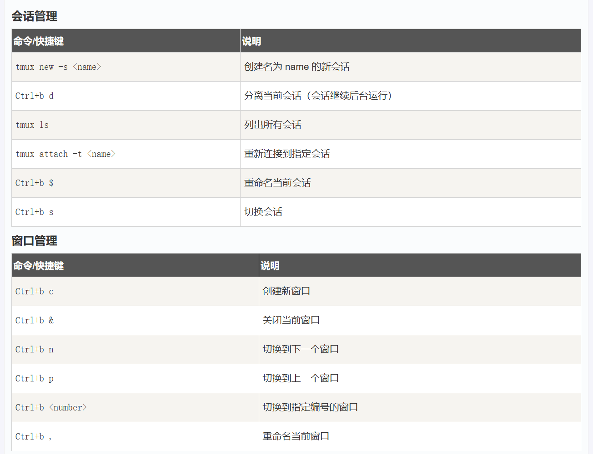
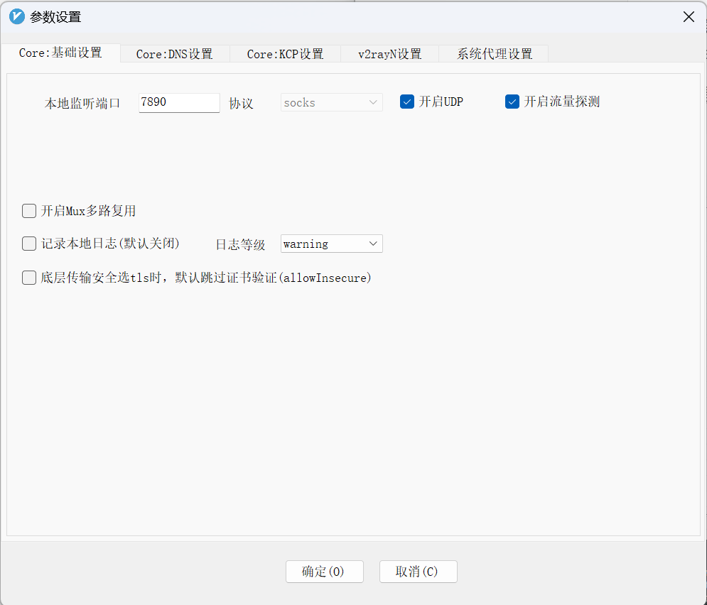
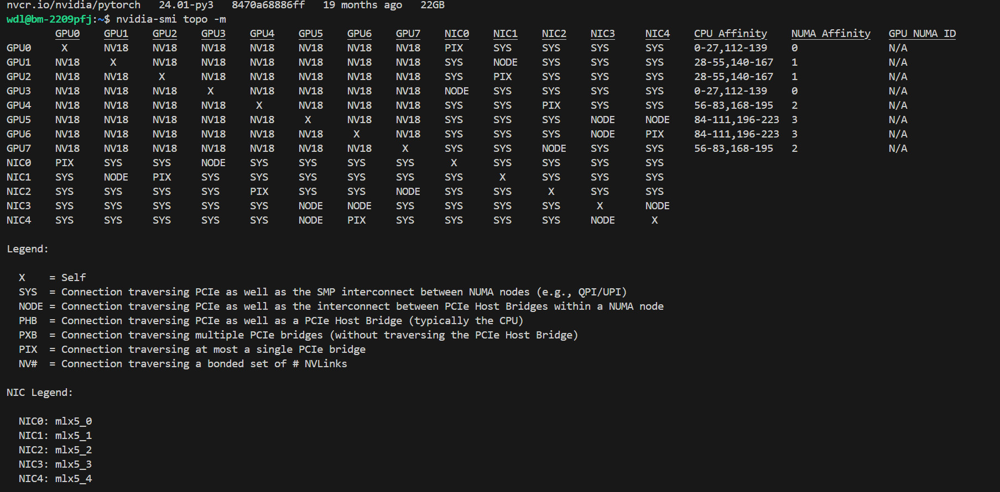
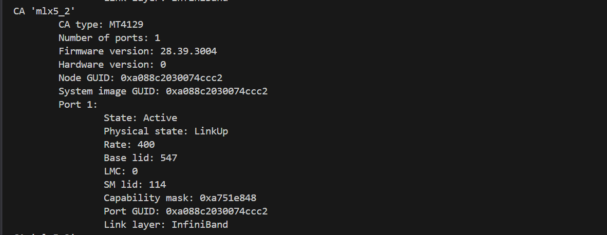
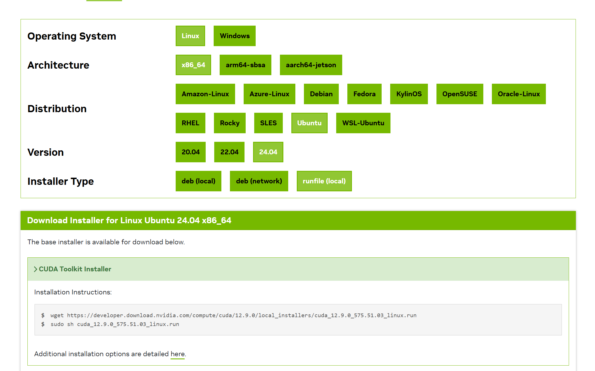
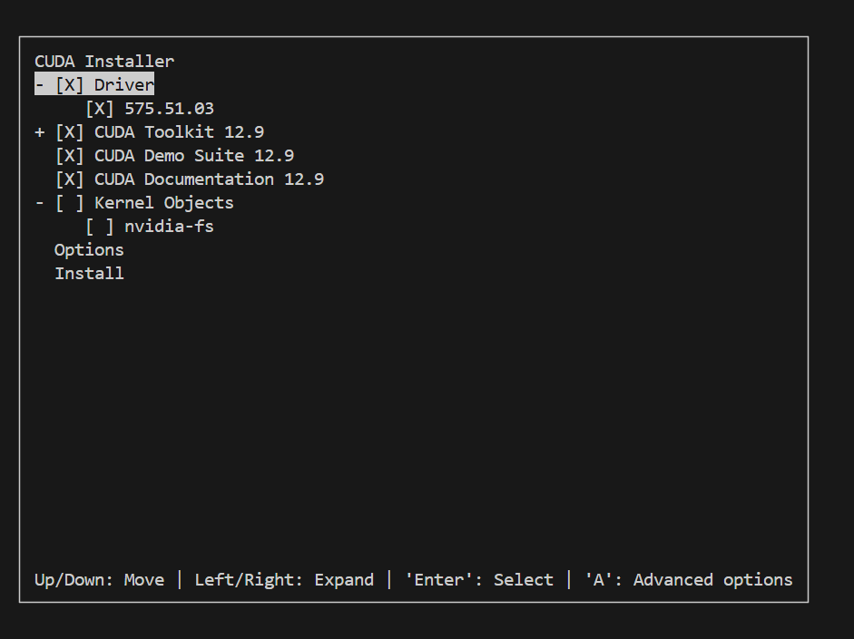

## Environment

### 设置环境变量

在 ~/.bashrc

```
export CUDACXX=/usr/local/cuda/bin/nvcc
```

命令行

```
source ~/.bashrc
```

### externally-managed-environment

error: externally-managed-environment

1. 直接捂嘴

```
sudo mv /usr/lib/python3.12/EXTERNALLY-MANAGED /usr/lib/python3.12/EXTERNALLY-MANAGED.bak
```

2. 创建虚拟环境

```
python -m venv ENV_DIR
source ENV_DIR/bin/activate
```

`ENV_DIR` 指定存放环境的目录

退出环境：

```
deactivate
```

### 无法解析主机名

```
wdl@bm-2209pbv:~$ sudo ls /root
sudo: unable to resolve host bm-2209pbv: Name or service not known
app
```

其实是无伤大雅的，就是有点烦人。解决方式：

```
sudo vim /etc/hosts
```

显示内容：

```
127.0.0.1   localhost
```

修改为：

```
127.0.0.1   localhost bm-2209pbv
```

### 挂载硬盘

```
sudo fdisk -l	# 查看设备名
sudo mkdir /mnt/newdisk
sudo mount /dev/sdb1 /mnt/newdisk
df -h 	# 检查挂载情况
```

设置开机自动挂载：编辑 /etc/fstab 文件，添加一行：

```
/dev/sdb1    /mnt/newdisk    ext4    defaults    0
```

可参考：[Linux中将多块新硬盘合并成一个，挂载到/mysqldata目录下_linux两块硬盘合并成一块-CSDN博客](https://blog.csdn.net/eagle89/article/details/129388848)

### 用户管理

添加用户

```
sudo adduser wdl
```

给予 sudo 权限

```
sudo usermod -aG sudo wdl
```

验证 sudo 权限

```
su - wdl
sudo ls /root
```

删除用户

```
sudo deluser wdl
sudo deluser --remove-home wdl	# 删除主目录与文件
```

### 查看系统架构

```
uname -m
```

### 查看发行版信息

```
cat /etc/os-release
```

### 查看CPU

```
lscpu
```

**关键信息**:

- Architecture: 架构，如 x86_64。
- CPU(s): 总逻辑核心数。
- Socket(s): CPU 插槽数（物理 CPU 数量）。
- Core(s) per socket: 每个物理 CPU 的核心数。
- Model name: CPU 型号，例如 Intel(R) Xeon(R) Gold 6248R。
- CPU max MHz: 最大睿频 (Turbo Boost) 频率。
- Flags: CPU 支持的指令集

### Tmux

参考：[Linux tmux 命令 | 菜鸟教程](https://www.runoob.com/linux/linux-comm-tmux.html)



在 tmux 窗口中上下滑动、复制粘贴：

1. 在 ~/.tmux.conf 中添加：` set -g mouse on`
2. 重新加载 tmux 配置：` tmux source-file ~/.tmux.conf`
3. 现在可以直接用鼠标选择文本，选择的文本都会被自动复制下来

### 查杀僵尸进程

```
ps -eo pid,ppid,stat,comm | grep -E 'Z|defunct'
kill -9 <PPID>
```


## Conda

### 下载

```
wget https://repo.anaconda.com/miniconda/Miniconda3-latest-Linux-x86_64.sh
bash Miniconda3-latest-Linux-x86_64.sh
```

### 命令大全


注意：conda create 的时候指定 python 版本，可以避免出现 error: externally-managed-environment

### 清华源

pip 临时使用清华源：

```
pip3 install numpy -i https://pypi.tuna.tsinghua.edu.cn/simple
```

pip 永久使用：

```
mkdir -p ~/.pip
echo -e "[global]\nindex-url = https://pypi.tuna.tsinghua.edu.cn/simple" > ~/.pip/pip.conf
```

Conda：

```
conda config --add channels https://mirrors.tuna.tsinghua.edu.cn/anaconda/pkgs/main
conda config --add channels https://mirrors.tuna.tsinghua.edu.cn/anaconda/pkgs/free
conda config --add channels https://mirrors.tuna.tsinghua.edu.cn/anaconda/pkgs/r
conda config --set show_channel_urls yes
```


## SSH

### ssh permission

Permissions 0664 for '/home/wdl/.ssh/id_wdl' are too open.

```
chmod 600 /home/wdl/.ssh/id_wdl
```

### ssh passphrase

linux

```
eval $(ssh-agent -s)
ssh-add ~/.ssh/id_rsa
ssh-add -l	# 验证是否成功
```

windows：打开PowerShell

```
Start-Service ssh-agent
ssh-add C:\Users\wdl\.ssh\id_rsa
```

### Host key has changed

ssh -v 报错：

```
@@@@@@@@@@@@@@@@@@@@@@@@@@@@@@@@@@@@@@@@@@@@@@@@@@@@@@@@@@@
@    WARNING: REMOTE HOST IDENTIFICATION HAS CHANGED!     @
@@@@@@@@@@@@@@@@@@@@@@@@@@@@@@@@@@@@@@@@@@@@@@@@@@@@@@@@@@@
IT IS POSSIBLE THAT SOMEONE IS DOING SOMETHING NASTY!
Someone could be eavesdropping on you right now (man-in-the-middle attack)!
It is also possible that a host key has just been changed.
The fingerprint for the ED25519 key sent by the remote host is ...
Please contact your system administrator.
Add correct host key in C:\\Users\\.../.ssh/known_hosts to get rid of this message.
Offending ECDSA key in C:\\Users\\.../.ssh/known_hosts:58
Host key for 192.168.1.79 has changed and you have requested strict checking.
Host key verification failed.
```

原因：远程主机的主机密钥（Host Key）发生了变化，而本地的 `known_hosts` 文件中记录的旧密钥与当前服务器的密钥不匹配，导致了 SSH 客户端拒绝连接

解决方案：更新本地的 `known_hosts` 文件，找到并删除与 `192.168.1.79` 相关的行，重新连接


## Docker

### Connection fail

```
Cannot connect to the Docker daemon at unix:///var/run/docker.sock. Is the docker daemon running?
```

解决办法：

```
systemctl status docker
```

如果并非 active：

```
sudo systemctl start docker
```

### Permission denied

```
docker: permission denied while trying to connect to the Docker daemon socket...
```

解决方式：

```
sudo usermod -aG docker wdl
newgrp docker // or reboot
```

验证：

```
groups
```

如果临时跑命令，也可以直接 sudo docker run

### 命令大全

[Docker 命令大全 | 菜鸟教程](https://www.runoob.com/docker/docker-command-manual.html)

进入docker：

```
docker exec -it megatron-lm /bin/bash
```

Q：为什么存在旧容器，但是 docker ps 不显示？

A：docker ps 只默认列出“正在运行”的容器，应该使用 docker ps -a

### Docker 无法识别 GPU

```
docker: Error response from daemon: could not select device driver "" with capabilities: [[gpu]]
```

原因：Docker 没有安装或启用 NVIDIA Container Toolkit，导致它无法识别并使用宿主机的 GPU 资源

安装 NVIDIA Container Toolkit：

```
# 添加官方仓库
curl -fsSL https://nvidia.github.io/libnvidia-container/gpgkey | sudo gpg --dearmor -o /usr/share/keyrings/nvidia-container-toolkit-keyring.gpg

curl -s -L https://nvidia.github.io/libnvidia-container/stable/deb/nvidia-container-toolkit.list | \
  sed 's#deb https://#deb [signed-by=/usr/share/keyrings/nvidia-container-toolkit-keyring.gpg] https://#g' | \
  sudo tee /etc/apt/sources.list.d/nvidia-container-toolkit.list

# 安装
sudo apt-get update
sudo apt-get install -y nvidia-container-toolkit
```

 配置 Docker 使用 NVIDIA runtime：

```
sudo nvidia-ctk runtime configure --runtime=docker
```

重启 Docker：

```
sudo systemctl restart docker
```


## Files

### scp

```
scp -r xxx:path yyy:path
```

### scp: Connection refused

```
scp -P 58107 -r ./data  wdl@10.18.18.107:/home/wdl/
ssh: connect to host 10.18.18.107 port 58107: Connection refused
scp: Connection closed
```

Connection refused 说明 10.18.18.107 的 58107 端口没有 sshd 在监听，或被防火墙拦截

```
sudo ss -tulnp | grep sshd

tcp   LISTEN 0      4096                    *:22               *:*    users:(("sshd",pid=4790,fd=3),("systemd",pid=1,fd=116))
```

说明 sshd 仍在默认 22 端口，改为 -P 22 即可

### rsync

```
rsync -avzP src dst
```


**-z**：在传输过程中对数据进行压缩

**-P**：进度条与断点续传

### 排查空间占用

统计文件夹下的所有文件大小

```
du -sh .
```

快速查看一级目录占用：

```
sudo du -xh --max-depth=1 / 2>/dev/null | sort -h
```

假设上一步看到 /var 最大，继续：

```
sudo du -xh --max-depth=1 /var 2>/dev/null | sort -h
```

### 校验是否损坏

```
md5sum test.txt
```

### 压缩与解压

```
tar -czvf archive.tar file1 file2 directory
tar -zxvf archive.tar
```

### 权限

查看权限

```
ls -l x.sh
ls -ld /x/y/
```

修改拥有者

```
sudo chown wdl:wdl x.sh
sudo chown -R wdl:wdl /x/y
```

修改所有人可读可访问可执行：`chmod 777`


## Markdown

### 强制换页

```
<div STYLE="page-break-after: always;"></div>
```

### 空格


### 图片并排显示

```
<center class="half">
    
    
</center>
```


## Git

### git diff

仅输出不同文件名

```
git diff --name-only .. ..
```

### git submodule

```
# clone
git submodule update --init --recursive

# 添加
git submodule add ...
```

### 临时保存工作进度

场景：需要临时保存当前的工作进度，切换到另一个分支，之后再回来继续工作，但是又不希望 commit

```
git stash push -u -m "..."
git stash pop	# 应用最近一次的储藏，并从储藏列表中删除它
git stash apply # 不会删除
```

如果你多次使用 git stash，它会把你的修改都存成一个列表：

```
git stash list
git stash pop stash@{1}
```

### 强行回退

git log 找到希望回退到的 commit 的哈希值

```
git reset --hard <commit-hash>

# --force 会强行覆盖远程分支
git push --force

# 更安全的 --force-with-lease
# 它会先检查远程分支是否和你上次拉取时一样，如果被别人更新过，则推送失败
git push --force-with-lease
```

### git revert

```
git revert <commit-hash>

# 只将撤销的更改应用到工作目录和暂存区，但不自动创建新的提交。
# 可以一次性撤销多个不连续的提交，然后把它们合并成一个单独的 "revert" 提交
git revert -n <commit-hash-1>
git revert -n <commit-hash-2>
git commit -m "Revert features X and Y due to issues"
```

### 修改分支名

```
git checkout old_branch
git branch -m new_branch
git push origin --delete old_branch
git push origin new_branch
git push --set-upstream origin new_branch
```

### 修改远端仓库

```
git remote set-url origin ...
```

### 无法连接到 github.com

首先尝试 curl -v https://github.com，输出“详细信息: GET with 0-byte payload”

查看是否能解析域名：nslookup github.com

解析失败，图形界面手动修改网络适配器 DNS：

1. 打开“控制面板” → “网络和 Internet” → “网络和共享中心”  → “查看网络状态和任务” → “更改适配器设置”；
2. 右键正在用的网络连接 → “属性”；
3. 双击 “ Internet 协议版本 4 (TCP/IPv4)”；
4. 选择“使用下面的 DNS 服务器地址”：
   - 首选 DNS：`8.8.8.8`
   - 备用 DNS：`1.1.1.1`
5. 点击“确定”保存

还是不行，开启 V2RayN 代理，查看参数设置：



以及“ v2rayN 设置” →“ Core 类型” 改为 Xray_core

最后设置 git proxy：

```
git config --global http.proxy  socks5h://127.0.0.1:7890
git config --global https.proxy socks5h://127.0.0.1:7890
```

### git lfs

```
sudo apt-get install git-lfs
```

### pip install git 项目

```
pip install git+https://github.com/NICTA/pyairports.git
```


## LLM

### 多机多卡联通性测试

参考：[分布式部署实践：多机多卡联通性测试 - 知乎](https://zhuanlan.zhihu.com/p/1914325502921016042)

使用来自 [Troubleshooting — vLLM](https://docs.vllm.ai/en/v0.8.0/getting_started/troubleshooting.html#troubleshooting-incorrect-hardware-driver) 中的脚本：

```
# Test PyTorch NCCL
import torch
import torch.distributed as dist
dist.init_process_group(backend="nccl")
local_rank = dist.get_rank() % torch.cuda.device_count()
torch.cuda.set_device(local_rank)
data = torch.FloatTensor([1,] * 128).to("cuda")
dist.all_reduce(data, op=dist.ReduceOp.SUM)
torch.cuda.synchronize()
value = data.mean().item()
world_size = dist.get_world_size()
assert value == world_size, f"Expected {world_size}, got {value}"

print("PyTorch NCCL is successful!")

# Test PyTorch GLOO
gloo_group = dist.new_group(ranks=list(range(world_size)), backend="gloo")
cpu_data = torch.FloatTensor([1,] * 128)
dist.all_reduce(cpu_data, op=dist.ReduceOp.SUM, group=gloo_group)
value = cpu_data.mean().item()
assert value == world_size, f"Expected {world_size}, got {value}"

print("PyTorch GLOO is successful!")

if world_size <= 1:
    exit()

# Test vLLM NCCL, with cuda graph
from vllm.distributed.device_communicators.pynccl import PyNcclCommunicator

pynccl = PyNcclCommunicator(group=gloo_group, device=local_rank)
# pynccl is enabled by default for 0.6.5+,
# but for 0.6.4 and below, we need to enable it manually.
# keep the code for backward compatibility when because people
# prefer to read the latest documentation.
pynccl.disabled = False

s = torch.cuda.Stream()
with torch.cuda.stream(s):
    data.fill_(1)
    out = pynccl.all_reduce(data, stream=s)
    value = out.mean().item()
    assert value == world_size, f"Expected {world_size}, got {value}"

print("vLLM NCCL is successful!")

g = torch.cuda.CUDAGraph()
with torch.cuda.graph(cuda_graph=g, stream=s):
    out = pynccl.all_reduce(data, stream=torch.cuda.current_stream())

data.fill_(1)
g.replay()
torch.cuda.current_stream().synchronize()
value = out.mean().item()
assert value == world_size, f"Expected {world_size}, got {value}"

print("vLLM NCCL with cuda graph is successful!")

dist.destroy_process_group(gloo_group)
dist.destroy_process_group()
```

单机多卡检查：

```
NCCL_DEBUG=TRACE torchrun --nproc-per-node=4 test.py
```

多机多卡检查：

```
# 注意 NODE_RANK 从0开始
NCCL_DEBUG=TRACE torchrun --nnodes 2 --nproc-per-node=8 --node-rank $NODE_RANK --master_addr $MASTER_ADDR test.py
```


### Megatron-LM 测试

#### 单机多卡：Dense 模型

```
# under /home/developer/wdl
git clone https://github.com/NVIDIA/Megatron-LM.git
GIT_LFS_SKIP_SMUDGE=1 git clone https://hf-mirror.com/openai-community/gpt2
```

Docker创建：

```
docker run -it --name megatron-lm   --gpus=all   --ipc=host   -v /home/wdl:/workspace   -w /workspace   nvcr.io/nvidia/pytorch:24.01-py3   /bin/bash
```

数据预处理：

```
mkdir data
cd data
wget https://hf-mirror.com/bigscience/misc-test-data/resolve/main/stas/oscar-1GB.jsonl.xz
xz -d oscar-1GB.jsonl.xz
cd ..

python megatron-lm/tools/preprocess_data.py \
  --input ./data/oscar-1GB.jsonl \
  --output-prefix meg-gpt2 \
  --vocab-file ./gpt2/vocab.json \
  --tokenizer-type GPT2BPETokenizer \
  --merge-file ./gpt2/merges.txt \
  --append-eod \
  --workers 8
  
mv meg-gpt2_text_document.bin data/
mv meg-gpt2_text_document.idx data/
```

截至目前的目录结构：

```
root@a6a69636d44e:/workspace# ls -la
total 20
drwxrwxr-x  5 1001 1001 4096 Apr 27 04:22 .
drwxr-xr-x  1 root root 4096 Apr 27 04:07 ..
drwxr-xr-x  2 root root 4096 Apr 27 04:22 data
drwxrwxr-x  4 1001 1001 4096 Apr 27 02:53 gpt2
drwxrwxr-x 14 1001 1001 4096 Apr 27 02:25 megatron-lm
```

正式训练：

```
cd ./megatron-lm/examples/gpt3
cp train_gpt3_175b_distributed.sh train_gpt3_test.sh
vim /workspace/megatron-lm/examples/gpt3/train_gpt3_test.sh
```

Dense 模型参数量约 6.6B，显存占用约 90GB，配置文件如下：

```
#!/bin/bash

export CUDA_DEVICE_MAX_CONNECTIONS=1

GPUS_PER_NODE=8
# Change for multinode config
MASTER_ADDR=localhost
MASTER_PORT=6000
NUM_NODES=1
NODE_RANK=0
WORLD_SIZE=$(($GPUS_PER_NODE*$NUM_NODES))

CHECKPOINT_PATH="/workspace/checkpoint"
TENSORBOARD_LOGS_PATH="/workspace/logs"
VOCAB_FILE="/workspace/gpt2/vocab.json"
MERGE_FILE="/workspace/gpt2/merges.txt"
DATA_PATH="/workspace/data/meg-gpt2_text_document"

DISTRIBUTED_ARGS=(
    --nproc_per_node $GPUS_PER_NODE
    --nnodes $NUM_NODES
    --master_addr $MASTER_ADDR
    --master_port $MASTER_PORT
)

GPT_MODEL_ARGS=(
    --num-layers 32
    --hidden-size 4096
    --num-attention-heads 32
    --seq-length 1024
    --max-position-embeddings 2048
    --attention-backend auto # Can use (flash/fused/unfused/local)
)

TRAINING_ARGS=(
    --micro-batch-size 1
    --global-batch-size 1536
    # --rampup-batch-size 16 16 5859375
    --train-iters 10
    --weight-decay 0.1
    --adam-beta1 0.9
    --adam-beta2 0.95
    --init-method-std 0.006
    --clip-grad 1.0
    --fp16
    --lr 6.0e-5
    --lr-decay-style cosine
    --min-lr 6.0e-6
    --lr-warmup-fraction .001
    --lr-decay-iters 430000
)

MODEL_PARALLEL_ARGS=(
	--tensor-model-parallel-size 1
	--pipeline-model-parallel-size 1
)

DATA_ARGS=(
    --data-path $DATA_PATH
    --vocab-file $VOCAB_FILE
    --merge-file $MERGE_FILE
    --split 949,50,1
)

EVAL_AND_LOGGING_ARGS=(
    --log-interval 10
    --save-interval 10000
    --eval-interval 1000
    --save $CHECKPOINT_PATH
    --load $CHECKPOINT_PATH
    --eval-iters 10
    --tensorboard-dir $TENSORBOARD_LOGS_PATH
)

torchrun ${DISTRIBUTED_ARGS[@]} pretrain_gpt.py \
    ${GPT_MODEL_ARGS[@]} \
    ${TRAINING_ARGS[@]} \
    ${MODEL_PARALLEL_ARGS[@]} \
    ${DATA_ARGS[@]} \
    ${EVAL_AND_LOGGING_ARGS[@]}

```

qwen2.5-7b 参数参考：

```
--num-layers 28
--hidden-size 3584
--ffn-hidden-size 18944
--num-attention-heads 28
--group-query-attention
--num-query-groups 4
--kv-channels 128
```

#### 单机多卡：MoE 模型

MoE 模型参数量 20BA2B，显存占用约 81GB，配置文件如下：

```
#!/bin/bash

export CUDA_DEVICE_MAX_CONNECTIONS=1

GPUS_PER_NODE=8
# Change for multinode config
MASTER_ADDR=localhost
MASTER_PORT=6000
NUM_NODES=1
NODE_RANK=0
WORLD_SIZE=$(($GPUS_PER_NODE*$NUM_NODES))

CHECKPOINT_PATH="/workspace/checkpoint"
TENSORBOARD_LOGS_PATH="/workspace/logs"
VOCAB_FILE="/workspace/gpt2/vocab.json"
MERGE_FILE="/workspace/gpt2/merges.txt"
DATA_PATH="/workspace/data/meg-gpt2_text_document"

DISTRIBUTED_ARGS=(
    --nproc_per_node $GPUS_PER_NODE
    --nnodes $NUM_NODES
    --master_addr $MASTER_ADDR
    --master_port $MASTER_PORT
)

GPT_MODEL_ARGS=(
    --no-masked-softmax-fusion
    --disable-bias-linear
    --untie-embeddings-and-output-weights
    --position-embedding-type rope
    --no-rope-fusion
    --normalization RMSNorm
    --swiglu
    --num-layers 32
    --hidden-size 2048
    --ffn-hidden-size 6144
    --num-attention-heads 32
    --group-query-attention
    --num-query-groups 4
    --kv-channels 128
    # --qk-layernorm
    --num-experts 128
    --moe-ffn-hidden-size 768
    --moe-router-topk 8
    --moe-router-dtype fp32
    --moe-aux-loss-coeff 1e-3
    --moe-token-dispatcher-type alltoall
    --moe-router-load-balancing-type aux_loss
    --use-mcore-models
    --rotary-percent 1.0
    --rotary-base 1000000
    --no-bias-swiglu-fusion
    --seq-length 1024
    --max-position-embeddings 2048
    --attention-backend auto # Can use (flash/fused/unfused/local)
)

TRAINING_ARGS=(
    --micro-batch-size 1
    --global-batch-size 1536
    # --rampup-batch-size 16 16 5859375
    --train-iters 10
    --weight-decay 0.1
    --adam-beta1 0.9
    --adam-beta2 0.95
    --init-method-std 0.006
    --clip-grad 1.0
    --bf16
    --lr 6.0e-5
    --lr-decay-style cosine
    --min-lr 6.0e-6
    --lr-warmup-fraction .001
    --lr-decay-iters 430000
)

MODEL_PARALLEL_ARGS=(
	--tensor-model-parallel-size 1
	--pipeline-model-parallel-size 1
    --expert-model-parallel-size 8
)

DATA_ARGS=(
    --data-path $DATA_PATH
    --vocab-file $VOCAB_FILE
    --merge-file $MERGE_FILE
    --split 949,50,1
)

EVAL_AND_LOGGING_ARGS=(
    --log-interval 10
    --save-interval 10000
    --eval-interval 1000
    --save $CHECKPOINT_PATH
    --load $CHECKPOINT_PATH
    --eval-iters 10
    --tensorboard-dir $TENSORBOARD_LOGS_PATH
)

torchrun ${DISTRIBUTED_ARGS[@]} pretrain_gpt.py \
    ${GPT_MODEL_ARGS[@]} \
    ${TRAINING_ARGS[@]} \
    ${MODEL_PARALLEL_ARGS[@]} \
    ${DATA_ARGS[@]} \
    ${EVAL_AND_LOGGING_ARGS[@]}

```

#### 多机训练

```
docker run -it --name megatron-lm   --gpus=all   --ipc=host --network=host --privileged=true -v /home/wdl:/workspace   -w /workspace   nvcr.io/nvidia/pytorch:24.01-py3   /bin/bash
```

解析：

1. --ipc=host 把宿主机的 IPC 命名空间（共享内存、信号量、消息队列等）整个搬进容器，/dev/shm 大小 = 宿主机 /dev/shm 大小，不再受 64 MB 默认或 --shm-size 限制，在PyTorch DataLoader 或 NCCL 多卡通信等依赖足够共享内存的场景，直接“免调参”不会炸
2. --network=host 让容器直接用宿主机网卡，IP、端口全部可见
3. --privileged=true，如果没有这条的话，docker 内用不了 IB。ibv_devices 可查看可用 IB，如果不可用，在接下来的脚本中，如果设置 NCCL_DEBUG=INFO，日志中会出现 NCCL INFO NET/IB: No device found. --privileged=true 相当于把 /dev 也挂载了进去，就能使用 IB
4. -v 可以有多项；-w /workspace 给容器设置工作目录，相当于 cd /workspace 后再启动主进程

这里也可以：

```
docker create --name megatron-lm --init ... <image:tag> sleep infinity
docker start megatron-lm
docker exec -it megatron-lm bash
```

好处是在这样的 bash 里 exit 之后，docker 仍然可以继续运行

配置文件（以node_rank=0为例）：

```
#!/bin/bash
set -ex

# Runs the "175B" parameter model

export CUDA_DEVICE_MAX_CONNECTIONS=1
# export NCCL_DEBUG=INFO
export TORCH_DISTRIBUTED_BACKEND=nccl
export NCCL_SOCKET_IFNAME=bond0
export GLOO_SOCKET_IFNAME=bond0
export SKIP_P2P_PING=false
export DISTRIBUTED_JOB=true
export NCCL_IB_HCA=mlx5_0,mlx5_1,mlx5_2,mlx5_4

GPUS_PER_NODE=8
MASTER_ADDR=${MASTER_ADDR:-10.18.18.106}
MASTER_PORT=${MASTER_PORT:-6000}
NUM_NODES=${NUM_NODES:-2}
NODE_RANK=${NODE_RANK:-0}
WORLD_SIZE=$(($GPUS_PER_NODE * $NUM_NODES))

CHECKPOINT_PATH="/workspace/checkpoint"
TENSORBOARD_LOGS_PATH="/workspace/logs"
VOCAB_FILE="/workspace/gpt2/vocab.json"
MERGE_FILE="/workspace/gpt2/merges.txt"
DATA_PATH="/workspace/data/meg-gpt2_text_document"

DISTRIBUTED_ARGS=(
    --nproc_per_node $GPUS_PER_NODE
    --nnodes $NUM_NODES
    --master_addr $MASTER_ADDR
    --master_port $MASTER_PORT
    --node_rank $NODE_RANK
)

GPT_MODEL_ARGS=(
    --no-masked-softmax-fusion
    --disable-bias-linear
    --untie-embeddings-and-output-weights
    --position-embedding-type rope
    --no-rope-fusion
    --normalization RMSNorm
    --swiglu
    --num-layers 32
    --hidden-size 2048
    --ffn-hidden-size 6144
    --num-attention-heads 32
    --group-query-attention
    --num-query-groups 4
    --kv-channels 128
    # --qk-layernorm
    --num-experts 128
    --moe-ffn-hidden-size 768
    --moe-router-topk 8
    --moe-router-dtype fp32
    --moe-aux-loss-coeff 1e-3
    --moe-token-dispatcher-type alltoall
    --moe-router-load-balancing-type aux_loss
    # --use-mcore-models
    --rotary-percent 1.0
    --rotary-base 1000000
    --no-bias-swiglu-fusion
    --seq-length 1024
    --max-position-embeddings 2048
    --attention-backend auto # Can use (flash/fused/unfused/local)
)

TRAINING_ARGS=(
    --micro-batch-size 1
    --global-batch-size 1536
    # --rampup-batch-size 16 16 5859375
    --train-iters 30
    --weight-decay 0.1
    --adam-beta1 0.9
    --adam-beta2 0.95
    --init-method-std 0.006
    --clip-grad 1.0
    --bf16
    --lr 6.0e-5
    --lr-decay-style cosine
    --min-lr 6.0e-6
    --lr-warmup-fraction .001
    --lr-decay-iters 430000
)

MODEL_PARALLEL_ARGS=(
	--tensor-model-parallel-size 1
	--pipeline-model-parallel-size 1
    --expert-model-parallel-size 8
)

DATA_ARGS=(
    --data-path $DATA_PATH
    --vocab-file $VOCAB_FILE
    --merge-file $MERGE_FILE
    --split 949,50,1
)

EVAL_AND_LOGGING_ARGS=(
    --log-interval 10
    --save-interval 10000
    --eval-interval 1000
    --save $CHECKPOINT_PATH
    --load $CHECKPOINT_PATH
    --eval-iters 1
    --tensorboard-dir $TENSORBOARD_LOGS_PATH
)

torchrun ${DISTRIBUTED_ARGS[@]} pretrain_gpt.py \
    ${GPT_MODEL_ARGS[@]} \
    ${TRAINING_ARGS[@]} \
    ${MODEL_PARALLEL_ARGS[@]} \
    ${DATA_ARGS[@]} \
    ${EVAL_AND_LOGGING_ARGS[@]}
```

解析：

1. 注意比单机脚本多一行 --node_rank $NODE_RANK
2. MASTER_ADDR 为主节点实际 IP，PORT 随意
3. export NCCL_SOCKET_IFNAME=bond0，这里根据实际网卡名修改，一般要配置为主网卡的以太网接口名，也就是用 ifconfig 找到 inet 和主 IP 一致的那个网卡名
4. export GLOO_SOCKET_IFNAME=bond0，否则报错：RuntimeError: Gloo connectFullMesh failed …
5. export NCCL_IB_HCA=mlx5_0,mlx5_1,mlx5_2,mlx5_4，指定使用的 IB，不使用 mlx5_3 原因见“集群网络”章节

6. Megatron-LM 启动时会在 --data-path 目录下自动生成一套 index + cache 文件，文件名中包含数据集哈希值。如果两节点的存储不共享，其他节点上会找不到 cache 文件。解决方法是主节点处理完文件之后，手动传到其他节点上即可


### 集群网络

#### 网卡拓扑

```
nvidia-smi topo -m
```

结果：



解析（从快到慢）：

**1. NV18: NVLink**

- NVLink 是 NVIDIA 开发的专用于 GPU 之间直接互联的高速总线，完全绕过了CPU和PCIe总线
- 图中8个 GPU 是通过NVLink进行全互联的，通常是通过 NVSwitch 实现的
- 最快的通信路径，没有之一。单个A800 GPU 的总 NVLink 带宽高达400 GB/s，远超任何 PCIe 链路。在分布式训练中，梯度同步（All-Reduce）等操作会优先使用 NVLink，效率极高

**2. PIX (Single PCIe Bridge)**

- PIX 代表两个设备之间的通信路径非常短，最多只需要经过一个 PCIe 桥
- 通常意味着两个设备物理上连接到了同一个CPU的同一个PCIe根复合体（Root Complex）上，是物理上的邻居
- 这是最快的PCIe连接，延迟最低，带宽最高
- 图中 GPU0 和 NIC0 之间是 PIX，GPU2 和 NIC1 之间是 PIX，GPU4 和 NIC2 之间是 PIX，GPU6 和 NIC4 之间是 PIX。将特定的 NIC 和特定的 GPU 配对，实现了最佳亲和性

**3. NODE (Within a NUMA Node)**

- NODE 代表通信需要跨越 PCIe，并且还需要经过 CPU 内部的互连总线，但整个过程都在同一个 NUMA 节点（同一个 CPU 物理插槽）内完成
- 性能比 PIX 慢，因为多了一次 CPU 内部的跳转

**4. SYS (Across NUMA Nodes)**

- SYS 代表通信不仅要经过 PCIe 总线，还必须跨越CPU之间的互联总线（例如 Intel 的 UPI 或 AMD 的 Infinity Fabric）
- 这是最长最慢的路径。数据需要从设备A -> PCIe -> CPU A -> UPI总线 -> CPU B -> PCIe -> 设备B
- 例如图中 GPU0 和 NIC1 之间是 SYS，这是因为 GPU0 的最优亲和性在 NUMA 节点0上（见 CPU Affinity 0-27,112-139），而 NIC1 的最优亲和性在 NUMA 节点1上

跨机通信就是：卡0->NIC->NIC->卡15

#### NVLink

查看带宽理论值：

```
nvidia-smi nvlink --status
```

输出：

```
GPU 7: NVIDIA H20 (UUID: ...)
         Link 0: 26.562 GB/s
         Link 1: 26.562 GB/s
         ...
         Link 17: 26.562 GB/s
```

这里说明一台 H20 GPU 拥有18条 NVLink 通道。每条通道的带宽大约是26.562 GB/s，总带宽就是18 × 26.562 = 478GB/s

#### PCIe

CPU 内存与 GPU 显存之间的数据传输速度，这种数据传输主要通过 PCIe 总线进行。查看带宽理论值：

```
nvidia-smi -q
```

找到以下部分：

```
...
PCIe Link Info
    PCIe Generation
        Max                 : 5
        Current             : 5  <-- 当前的PCIe代数
    PCIe Link Width
        Max                 : 16x
        Current             : 16x <-- 当前的通道数
...
```

- **PCIe 3.0 x16**: 理论带宽约 16 GB/s
- **PCIe 4.0 x16**: 理论带宽约 32 GB/s
- **PCIe 5.0 x16**: 理论带宽约 64 GB/s

前面提到的 PIX 连接的实际带宽，就接近 PCIe 的带宽

#### NIC

用 ifconfig 看所有网卡，如果要查看网卡 bond0 的带宽：

```
sudo ethtool bond0
```

输出：

```
Settings for bond0:
    ...
    Speed: 10000Mb/s  <-- 表示速率是 10 Gbps
    Duplex: Full
    ...
```

#### Infiniband

NIC0-4 就是 Infiniband，ibstat 命令可以看信息



Rate: 400 就代表带宽是400 Gbps，可以发现 mlx5_3 rate 只有200 Gbps，是存储 IB，需要跳过

如果没有 ibstat 命令，安装方法：

```
apt install infiniband-diags
```

ibv_devices 命令也可以看可用的 IB


### verl 多机多卡训练

ray 启动：

```
# 环境变量
export TORCH_DISTRIBUTED_BACKEND=nccl
export NCCL_SOCKET_IFNAME=bond0
export GLOO_SOCKET_IFNAME=bond0
export NCCL_IB_HCA=mlx5_0,mlx5_1,mlx5_2,mlx5_4
# 主节点
ray start --head --node-ip-address 10.18.18.106 --port=8888 --dashboard-host=0.0.0.0
# 分节点
ray start --address='10.18.18.106:8888'
# 确认
ray status
# 停止某个job
ray job stop xxx
# 关闭
ray stop
```

然后再跑训练脚本：

```
...
ray job submit --address="http://127.0.0.1:8265" \
    --runtime-env="${RUNTIME_ENV}" \
    --working-dir "${PROJECT_DIR}" \
    -- python3 -m our.power_main_ppo \
  	...
```


### flash_attn 安装

正常 pip install 很慢，直接下载 whl：

```
wget https://github.com/Dao-AILab/flash-attention/releases/download/v2.7.4.post1/flash_attn-2.7.4.post1+cu12torch2.6cxx11abiFALSE-cp310-cp310-linux_x86_64.whl

pip install flash_attn-2.7.4.post1+cu12torch2.6cxx11abiFALSE-cp310-cp310-linux_x86_64.whl
```

注意 cuda, torch, python 版本对应

常见报错：

```
flash_attn_2_cuda.cpython-310-x86_64-linux-gnu.so: undefined symbol...
```

解决方案：下载 abiFALSE 的版本，而不是 abiTRUE


### CUDA Toolkit 安装

访问 https://developer.nvidia.com/cuda-downloads ，注意版本一致



如果安装失败，查看 /var/log/nvidia-installer.log：

```
WARNING: An NVIDIA kernel module 'nvidia' appears to be already loaded in your kernel. This may be because it is in use (for example, by an X server, a CUDA program, or the NVIDIA Persistence Daemon), but this may also happen if your kernel was configured without support for module unloading. Some of the sanity checks that nvidia-installer performs to detect potential installation problems are not possible while an NVIDIA kernel module is running.
-> Would you like to continue installation and skip the sanity checks? If not, please abort the installation, then close any programs which may be using the NVIDIA GPU(s), and attempt installation again. (Answer: Abort installation)
ERROR: Installation has failed.
```

说明 nvidia 内核模块已经加载，如果这时候问 AI 解决办法，可能会让你关闭图形界面。但实际上系统中已经安装了 nvidia 驱动，在安装的时候选择不安装 Driver 即可：



在 .bashrc 中：

```
export PATH=$PATH:/usr/local/cuda-12.9/bin
export LD_LIBRARY_PATH=$LD_LIBRARY_PATH:/usr/local/cuda-12.9/lib64
export LD_LIBRARY_PATH=$LD_LIBRARY_PATH:/usr/local/cuda-12.9/extras/CUPTI/lib64
```

然后

```
source ~/.bashrc
nvcc --version
```


### llama.cpp 打印算子

```
ggml_barrier(params->threadpool);

if (ith == 0 && strncmp(dst->name, "kq-", 3) == 0) {
    const struct ggml_tensor *t = src1;
    FILE *fp = NULL;
    char file_name[100];

    sprintf(file_name, "data/attention_score_%s.log", dst->name);
    fp = fopen(file_name, "a+");

    fprintf(fp, "dst->name: %s\n", dst->name);
    fprintf(fp, "num_kv: %lld, num_tokens: %lld, num_head: %lld\n", t->ne[0], t->ne[1], t->ne[2]);

    for (int i2 = 0; i2 < t->ne[2]; ++i2) {
        fprintf(fp, "i2: %d\n", i2);
        for (int i1 = 0; i1 < t->ne[1]; ++i1) {
            fprintf(fp, "i1: %d\n", i1);
            for (int i0 = 0; i0 < t->ne[0]; ++i0) {
                fprintf(fp, "i0: %d: %f\n",
                    i0, *((float *)((char *)t->data + i2 * t->nb[2] + i1 * t->nb[1] + i0 * t->nb[0])));
            }
            fprintf(fp, "\n");
        }
        fprintf(fp, "\n\n");
    }

    fclose(fp);
}
```


### KVcache 估算

单个 token 占用的 KVCache = hidden_size / (num_attention_heads / num_key_value_heads) * 2 * num_layers * 2

其中最后一个2代表的是 sizeof(fp16) = 2


### 瓶颈计算

- **计算受限时间 (T_compute)** = 总计算量 /  峰值计算能力 (FLOPS)
- **内存受限时间 (T_memory)** = 总内存访问量 /  内存带宽 (Bytes/s)

**瓶颈判断规则**：如果 T_memory > T_compute，那么该操作就是 **内存受限** 的。

对 CPU 来说：

理论 GFLOPS = (CPU 核心数) * (CPU 频率 GHz) * (每个周期能执行的指令数)

测内存带宽：

```
# 下载源码
wget https://www.cs.virginia.edu/stream/FTP/Code/stream.c

# -fopenmp: 开启 OpenMP 支持，利用所有 CPU 核心去访问内存，这才能测出最大带宽
# -DSTREAM_ARRAY_SIZE: 设置一个足够大的数组，必须远大于你所有 CPU Cache 的总和，以确保测试的是内存而非缓存。例如设置为 8GB (2^33 bytes)
gcc -O3 -fopenmp -DSTREAM_ARRAY_SIZE=8000000000 stream.c -o stream_test

export OMP_NUM_THREADS=$(nproc)
./stream_test
```

输出结果：

```
-------------------------------------------------------------
Function    Best Rate MB/s  Avg time     Min time     Max time
Copy:           125331.4     0.102223     0.101890     0.102802
Scale:          125430.2     0.102196     0.101810     0.102555
Add:            139682.4     0.114755     0.114545     0.114947
Triad:          140348.1     0.114197     0.113999     0.114493
-------------------------------------------------------------
```

- Copy: a(i) = b(i)，测试一次读和一次写的带宽。
- Scale: a(i) = q * b(i)，一次读，一次写。
- Add: a(i) = b(i) + c(i)，两次读，一次写。
- Triad: a(i) = b(i) + q * c(i)，两次读，一次写。这是最常被引用的指标，最能代表真实应用中的内存访问模式


### wandb

```
wandb login
```

检查是否可用：

```
python -c "import wandb, time; wandb.init(project='test', name='timeout_check'); print('ok'); time.sleep(3); wandb.finish()"
```


### Benchmark

#### F1 分数

**精确率 (Precision)**: 在模型**生成的所有词元**中，有多少是与**参考答案**中的词元相匹配的？

- **通俗理解**：模型说的话有多大的比例是“对”的？高精确率意味着模型生成的内容很少有废话或错误信息
- **公式思想**: (匹配的词元数) / (生成文本的总词元数)

**召回率 (Recall)**: 在**参考答案的所有词元**中，有多少被**模型成功生成**了？

- **通俗理解**：参考答案里的要点，模型覆盖了多少？高召回率意味着模型生成的内容很全面，没有遗漏关键信息
- **公式思想**: (匹配的词元数) / (参考文本的总词元数)

F1分数是精确率和召回率的调和平均数：

- **F1分数 (F1-Score)**:
  - **公式**: 2 * (精确率 * 召回率) / (精确率 + 召回率)
  - **作用**：它提供了一个综合性的分数。如果模型只生成了几个正确的词（精确率高但召回率低），或者生成了一大堆词但很多都无关紧要（召回率高但精确率低），F1分数都会很低。只有当两者都高时，F1分数才会高

例子：

- **参考文本 (Reference Text)**: "the cat sat on the mat"
  - 包含的词元：{the, cat, sat, on, mat}
- **模型生成的文本 (Generated Text)**: "the cat sat on a mat"
  - 包含的词元：{the, cat, sat, on, a, mat}

- **精确率**: 模型生成了 6 个词，其中 5 个是匹配的；Precision = 5 / 6 = 0.83
- **召回率**: 参考文本有 5 个词，模型全部匹配了；Recall = 5 / 5 = 1.0

- **F1 score** = 2 * (0.83 * 1.0) / (0.83 + 1.0) = 1.66 / 1.83 ≈ 0.91


#### mean@xx

- mean@30: 指的是这30次尝试的平均表现。例如，acc/mean@30 就是这30次尝试的平均准确率
- maj@30: maj 是 "majority"（多数）的缩写。这通常与一种叫做“多数投票”的策略有关。例如，模型生成30个答案，选择其中出现次数最多的那个作为最终答案，然后评估这个最终答案的准确率
- best@30: 指的是在这30次尝试中最好的一次表现。例如，acc/best@30 就是这30次尝试中最高的一次准确率


## Debug

### VScode python

launch.json：

```
{
    "version": "0.2.0",
    "configurations": [
        {
            "name": "sync test",
            "type": "debugpy",
            "request": "launch",
            "python": "/disk2/wdl/miniconda3/envs/infinigen/bin/python",
            "program": "flex_llama3.py",
            "args": [
                "--model", "/disk2/wdl/llama-3.2-3b-instruct",
                "--path", "/disk2/wdl/FlexGen/llama_weights",
                "--offload-dir", "/disk2/wdl/FlexGen/offload_dir",
                "--prompt-len", "7",
                "--gen-len", "10",
                "--gpu-batch-size", "1",
                "--num-gpu-batches", "2",
                "--prefill-batch-size", "512",
                "--percent", "100", "0", "0", "0", "100", "0",
                "--attn-sparsity", "0.1",
                "--compress-weight",
            ],
            "console": "integratedTerminal",
            "cwd": "/disk2/wdl/FlexGen/flexgen",
        },
    ]
}
```

### VScode C++

```
{
    "version": "0.2.0",
    "configurations": [
        {
            "name": "qkv fuse",
            "type": "cppdbg",
            "request": "launch",
            "program": "/home/wdl/powerinfer-refactor/build_qkv/bin/llama-cli",
            "args": [
                "-t", "4",
                "-no-cnv",
                "--temp", "0.6",
                "--top-k", "20",
                "--top-p", "0.95",
                "--no-warmup",
                "-n", "256",
                "--samplers", "'temperature;top_k;top_p'",
                "-m", "/home/wdl/our-20b-q4_0.gguf",
                "-p", "Once upon a time ",
                // "-f", "/home/wdl/context_1000.txt",
            ],
            "stopAtEntry": true,
            "cwd": "/home/wdl/powerinfer-refactor/build_qkv/bin/",
            "environment": [],
            "externalConsole": false,
            "MIMode": "gdb",
            "setupCommands": [
                {
                    "description": "Enable pretty-printing for gdb",
                    "text": "-enable-pretty-printing",
                    "ignoreFailures": true
                },
                {
                    "description": "Set Disassembly Flavor to Intel",
                    "text": "-gdb-set disassembly-flavor intel",
                    "ignoreFailures": true
                }
            ]
        }
    ]
}
```

### Segmentation fault (core dump)

程序发生 Segmentation fault (core dump) 之后：

```
sudo coredumpctl
```

如果没有出现信息，则需要：

```
sudo apt-get install systemd-coredump
sudo systemctl restart systemd-sysctl.service
echo "|/usr/lib/systemd/systemd-coredump %P %u %g %s %t %c %h" | sudo tee /proc/sys/kernel/core_pattern
```

这时候重新运行出错程序，如果还是不行，可能是因为为了防止程序错误地产生巨大的核心转储文件占满硬盘，默认情况下将core dump的大小限制为0，需要：

```
ulimit -c 				# 查看core文件大小限制
ulimit -c unlimited
```

`sudo coredumpctl`有输出之后：

```
coredumpctl gdb
```

默认会查看最近的一个core dump。gdb内用`bt`可以查看调用堆栈，用`fr N`可以去往第N层堆栈


## VSCode

### 无法下载 .vscode-server

有时候经常出现 $HOME 爆满，自己的文件已经删得不能再删了，别人的文件也动不了。这时候 vscode 连接就会因为空间不足而失败

解决办法：先命令行 ssh 上去，然后：

```
sudo mount --bind /mnt/wdl/vscode-server /home/wdl/.vscode-server
```

这样 .vscode-server 就会下载到指定的路径下了

### 函数跳转

[【经验分享】vscode c++ 函数无法跳转问题解决教程_vscode函数跳转插件-CSDN博客](https://blog.csdn.net/m0_64561077/article/details/140516251)

[解决vscode下C/C++indelisense插件函数跳转卡顿不流畅的问题_vscode代码跳转不稳定-CSDN博客](https://blog.csdn.net/qq_39642740/article/details/139651743?utm_medium=distribute.pc_relevant.none-task-blog-2~default~baidujs_baidulandingword~default-12-139651743-blog-140516251.235^v43^pc_blog_bottom_relevance_base3&spm=1001.2101.3001.4242.7&utm_relevant_index=14)

### IntelliSense 卡顿问题

先删除 .cache/vscode-cpptools/ipch

还卡就没别的办法了，只能设置里 disable


## C/C++ Coding

### 常用数据结构

#### Map

```
std::map<int, std::string> m;

// 遍历
for (const auto& [k, v] : m) {
	std::cout << k << ": " << v << "\n"; 
}

// 查找
auto it = m.find(1);
if (it != m.end()) {
	return it->second;
}

// 自定义对 array<int, 26> 类型的哈希函数
auto arrayHash = [fn = hash<int>{}] (const array<int, 26>& arr) -> size_t {
    return accumulate(arr.begin(), arr.end(), 0u, [&](size_t acc, int num) {
    	return (acc << 1) ^ fn(num);
    });
};

unordered_map<array<int, 26>, vector<string>, decltype(arrayHash)> mp(0, arrayHash);
```

| 特性     | `unordered_map`              | `map`                        |
| -------- | ---------------------------- | ---------------------------- |
| 实现方式 | **哈希表（hash table）**     | **红黑树（red-black tree）** |
| 排序     | **无序**（不保证顺序）       | **有序**（按键升序排序）     |
| 查找效率 | 平均 **O(1)**，最坏 **O(n)** | 稳定 **O(log n)**            |
| 插入效率 | 平均 **O(1)**                | **O(log n)**                 |
| 删除效率 | 平均 **O(1)**                | **O(log n)**                 |

- 访问（带边界检查）：m.at(key)
- 插入：insert({k,v}), emplace(k, v)
- 删除：erase(it), erase(key)
- 区间插入：insert(it_first, it_last) 
- 区间删除：erase(it_first, it_last) 
- 是否存在：count(key)


#### Set

同样有 unordered_set 和 set

| 类别      | 接口                                                      | 说明                                        |
| --------- | --------------------------------------------------------- | ------------------------------------------- |
| 构造/析构 | `set<int> s{1,2,3};`                                      |                                             |
| 容量      | `empty()` `size()` `max_size()`                           |                                             |
| 清空      | `clear()`                                                 |                                             |
| 查找      | `count(key)`                                              | 返回 0/1（ multiset 可 >1）                 |
|           | `find(key)`                                               | 返回迭代器，失败返回 `end()`                |
| 插入      | `insert(val)` / `insert(pos, val)` / `insert(first,last)` | 返回 `pair<iterator,bool>`（或 `iterator`） |
| 删除      | `erase(val)` / `erase(pos)` / `erase(first,last)`         | 返回删除个数或下个迭代器                    |
| 比较      | `==` `!=`                                                 | 元素逐个比；unordered 版本顺序无关          |
| 交换      | `swap()` / 非成员 `swap(a,b)`                             | 常数时间                                    |


#### Vector

- 访问（带边界检查）：m.at(pos)
- 插入：push_back(x), emplace_back(args…), insert(it_pos, val)
- 区间插入：insert(it_pos, it_first, it_last),  insert(it_pos, n, val)
- 删除：pop_back()
- 区间删除：erase(it_first, it_last) 
- 改变大小：resize(n), resize(n, val)
- 预分配空间（不改变大小）：reserve(n)
- 排序：sort(v.begin(), v.end(), \[](int a, int b) { return a > b; }); // 降序
- 数组尾：back()


#### Stack/Queue

- 插入：push(x), emplace_back(args…)
- 移除：pop(x)
- 读顶部：top()
- 队列头/尾：front(), back()

priority_queue 类似，可以用 push(x), emplace(args…)，默认为大顶堆

小顶堆的实现：

```
// 1
priority_queue<int, vector<int>, greater<int>> small_heap;

// 2
struct Status {
	int val;
	bool operator < (const Status &rhs) const {
		return val > rhs.val;
	}
};

priority_queue <Status> q;
```

自定义堆：

```
static bool cmp(pair<int, int>& m, pair<int, int>& n) {
	return m.second > n.second;
}

priority_queue<pair<int, int>, vector<pair<int, int>>, decltype(&cmp)> q(cmp);
```

deque 双端队列，可以用 pop_back(), pop_front()


#### String

```
std::string s1(5, 'x');         // "xxxxx"
std::string s2("abc"); 
std::string s3(s2, 1, 2);       // 子串 "bc"

int len = s.size(); 			// 长度，不包括 '\0'

s1.insert(5, " dear");          // 在下标 5 处插入
s1.erase(5, 5);                 // 从下标 5 起删 5 字符

size_t pos = s2.find("bc");   		// 找不到返回 string::npos
std::string sub = s1.substr(6, 5); 	// 从下标 6 起 5 字符

sort(s2.begin(), s2.end());			// 排序
std::reverse(s1.begin(), s1.end());
```

string → char：

```
std::string s = "hello";
const char* p = s.c_str();   // 返回 '\0' 结尾的 const char *

char* p = s.data();          // C++17 起非常量重载
p[0] = 'H';

std::vector<char> v(s.begin(), s.end());

char buf[32];
strcpy(buf, s.c_str());      // 拷贝到本地数组
strncpy(buf, s.c_str(), sizeof(buf)-1);
```

char → string：

```
const char* psz = "hello";
std::string s(psz);          // 拷贝直至 '\0'

std::vector<char> v{'a','b','c'};
std::string s(v.begin(), v.end());

char tmp[256];
scanf("%255s", tmp);        // 假设 C 风格读取
std::string user(tmp);      // 再变成 C++ 字符串

std::string s = "hello";
for(char& c : s) c = toupper(c);   // HELLO
```

与 std::stringstream 联动：

```
std::string line = "123 45.6";
std::stringstream ss(line);
int i; double d;
ss >> i >> d;
```

常用库函数：

| 函数                                             | 一句话说明                               |
| ------------------------------------------------ | ---------------------------------------- |
| `strcpy(char *dest, const char *src)`            | 把 `src`（含 `\0`）全部拷到 `dest`       |
| `strncpy(char *dest, const char *src, size_t n)` | 最多拷 `n` 字节，不保证 `\0` 结尾        |
| `strcat(char *dest, const char *src)`            | 把 `src` 追加到 `dest` 末尾              |
| `strncat(char *dest, const char *src, size_t n)` | 最多追加 `n` 字节，**始终**在结尾加 `\0` |

| 函数                                                | 返回值               |
| --------------------------------------------------- | -------------------- |
| `strcmp(const char *s1, const char *s2)`            | `<0,0,>0`            |
| `strncmp(const char *s1, const char *s2, size_t n)` | 同上                 |
| `strcasecmp / stricmp` (POSIX/Windows)              | 大小写**不敏感**比较 |

| 函数                                          | 说明                                                   |
| --------------------------------------------- | ------------------------------------------------------ |
| `strlen(const char *s)`                       | 不计 `\0` 的字符数，复杂度 O(n)                        |
| `strchr(const char *s, int ch)`               | 找**第一次**出现某字符，返回指针；找不到返回 `nullptr` |
| `strrchr(const char *s, int ch)`              | 从**右往左**找字符                                     |
| `strpbrk(const char *s, const char *accept)`  | 找**第一次**出现 `accept` 中任意字符的位置             |
| `strstr(const char *hay, const char *needle)` | 找子串，返回指针；找不到返回 `nullptr`                 |


### ASCII表

```
'0' -> 48
'9' -> 57
'A' -> 65
'Z' -> 90
'a' -> 97
'z' -> 122
```


### C代码使用C++代码

例：现在需要调用在某个 .c 文件中，调用一个由 .hpp 与 .cpp 文件定义的函数

步骤：

1. 新建一个 .h 文件，将 .hpp 文件改造为 .h 文件

```
#ifdef __cplusplus
extern "C" {
#endif

void TraceEventStart(const char *name);
void TraceEventEnd();

#ifdef __cplusplus
} // extern "C"
#endif
```

2. 在 .cpp 文件中 include 这个 .h 文件，同样地，也要用 extern "C" 包裹起来

```
#ifdef __cplusplus
extern "C" {
#endif

void TraceEventStart(const char *name) {
    TRACE_EVENT_BEGIN(event_category, perfetto::StaticString{name});
}

void TraceEventEnd() {
    TRACE_EVENT_END(event_category);
}

#ifdef __cplusplus
} // extern "C"
#endif
```

​	3. 在 .c 文件里 include .h文件

### 文件读写

#### C++

流方法：fstream 对象在销毁时会自动调用 close()

```
#include <fstream>
#include <string>

// read
std::ofstream log(get_log_filename(layer_id, head_id), std::ios::binary | std::ios::app);
int value = 100;
log << value << " ";
log.write(reinterpret_cast<const char*>(&value), sizeof(value)); // binary
log.close();

// write
std::ifstream log(filename, std::ios::binary);
log >> value;
log.read(reinterpret_cast<char*>(&value), sizeof(value));

// 使用 std::fstream 必须手动指定读写模式
std::fstream iofile("data.bin", std::ios::in | std::ios::out | std::ios::binary);
```

常见的打开模式：

| 标识符           | 含义                 | 说明                                                         |
| ---------------- | -------------------- | ------------------------------------------------------------ |
| std::ios::in     | **读模式**           | 为读取而打开文件。ifstream 的默认模式。                      |
| std::ios::out    | **写模式**           | 为写入而打开文件。ofstream 的默认模式。                      |
| std::ios::binary | **二进制模式**       | 以二进制方式处理文件，而非文本模式。读写速度快且无损         |
| std::ios::app    | **追加模式**         | (append) 写入操作将在文件末尾进行。                          |
| std::ios::trunc  | **截断模式**         | (Truncate) 如果文件已存在，打开时会清空其所有内容。ofstream 默认行为。 |
| std::ios::ate    | **打开后定位到末尾** | (At End) 文件打开后，立即将位置指针移动到文件末尾。可以写入或移动到任何位置。 |

stringstream 操纵字符串：

```
#include <sstream>
#include <string>

std::string get_log_filename(size_t layer_id, size_t head_id) {
    std::stringstream ss;
    ss << "prefill_cache" << "/cache_L" << layer_id << "_H" << head_id << ".log";
    return ss.str();
}
```

#### C

fread 方法：

"w" 写, "r" 读, "a" 追加, "b" 二进制

```
#include <cstdio>

FILE *f = fopen(input->name, "w");
if (f) {
    const char* text = "hello";
    fwrite(text, sizeof(char), 5, f); // 写入数据
    fflush(f);                        // 强制将缓冲区内容写入文件
    fclose(f);                        // 必须手动关闭
}

FILE *f = fopen("data.bin", "rb");
if (f == NULL) {
    perror("Error opening file");
    return -1;
}

int value;
size_t items_read = fread(&value, sizeof(int), 1, f);

if (items_read == 1) {
	printf("Read value: %d\n", value);
}

fclose(f);
```

fget 方法：

```
FILE *f = fopen("log.txt", "r"); // "r" = read (文本读)
if (f) {
    char line[256]; // 定义一个行缓冲区

    while (fgets(line, sizeof(line), f) != NULL) {
        printf("%s", line);
    }

    fclose(f);
}
```

fprintf 方法：读取格式化文本

```
FILE *f = fopen("config.txt", "r");
if (f == NULL) {
    perror("Error opening file");
    return -1;
}

int layer_id, head_id;
fscanf(f, "%d %d", &layer_id, &head_id);
printf("Layer: %d, Head: %d\n", layer_id, head_id);

FILE *f = fopen("config.txt", "w");

fprintf(f, "Log Entry:\n");
fprintf(f, "Processed Layer %d, Head %d.\n", layer_id, head_id);

fclose(f);
```

同时进行读和写，应该使用以下三种带 + 的模式之一：

| 模式     | 含义         | 文件不存在时             | 文件已存在时                                       |
| -------- | ------------ | ------------------------ | -------------------------------------------------- |
| **"r+"** | **读写更新** | **打开失败** (返回 NULL) | 不清空内容，指针在文件**开头**                     |
| **"w+"** | **写读更新** | **创建新文件**           | **清空内容** (截断为0)，指针在文件**开头**         |
| **"a+"** | **追加读写** | **创建新文件**           | 不清空内容，初始**读指针**在开头，**写指针**在末尾 |

fopen 只接受 char* 文件名，方法有如下几种：

```
# std::string
std::string filename = "logits_dump_" + std::to_string(gen_len) + ".txt";
FILE *f = fopen(filename.c_str(), "w");

# only C
char filename[256];
snprintf(filename, sizeof(filename), "logits_dump_%lld.txt", gen_len);
```


## Python Coding

### 命令行 Python 程序

```
python -c "import torch; print(torch.cuda.device_count() > 0); print(torch.cuda.is_available())"
```

### 文件读写

with 语句块结束时，无论是否发生异常，Python 都会自动关闭文件

```
with open("log.txt", "w", encoding="utf-8") as f:
    f.write("\n")

with open("log.txt", "r", encoding="utf-8") as f:
    # 方式一：一次性读取所有内容
    content = f.read()
    print(content)

    # 方式二：逐行读取
    for line in f:
        print(line.strip()) # strip() 去除行尾换行符

# 写二进制文件
data = b'\xDE\xAD\xBE\xEF'
with open("data.bin", "wb") as f:
    f.write(data)

# 读二进制文件
with open("data.bin", "rb") as f:
    read_data = f.read()
    print(read_data)
```

### 读取变量

如果一个变量不存在，自动读取另一个变量

```
n_experts = self.hparams.get("num_experts", self.hparams.get("moe_num_experts"))
```


## Network

### 检查打通网络

为了确定另一个节可以连通到 10.18.18.106:5678

```
# 在 10.18.18.106 上执行
nc -lv 5678        # 或者：nc -l 5678
```

看到提示 `Listening on 0.0.0.0 5678` 就说明服务已就绪

```
# 在另一台节点执行
telnet 10.18.18.106 5678
# 如果没有 telnet，也可以用 nc
nc -vz 10.18.18.106 5678
```

显示成功即可


### 查看占用端口程序

```
sudo lsof -i :8000
```


